# Technical Specification

# 0. SUMMARY OF CHANGES

## 0.1 USER INTENT RESTATEMENT

### 0.1.1 Core Objective

Based on the provided requirements, the Blitzy platform understands that the objective is to **enhance the existing FUSE Test Data Generator with a comprehensive performance monitoring and visualization system**. This involves transforming the current batch-processing command-line tool into a monitored system with web-based performance analytics capabilities.

The specific requirements are:
1. **Create a React-based web frontend** to display performance metrics from data generation runs
2. **Implement a Python FastAPI backend** to serve metrics data to the React frontend
3. **Extract and persist performance metrics** from each batch execution run
4. **Enable cross-run performance comparison** through the web interface

### 0.1.2 Technical Interpretation

These requirements translate to the following technical implementation strategy:

1. **Metrics Collection Enhancement**: Instrument the existing multi-processing pipeline (`src/multi_processing/`) to capture timing, throughput, and resource utilization metrics without disrupting the core data generation workflow.

2. **Metrics Persistence Layer**: Create a new metrics storage subsystem that automatically captures and persists performance data after each pipeline execution, maintaining historical records for comparison.

3. **API Service Layer**: Develop a FastAPI-based REST API service that exposes endpoints for retrieving individual run metrics, historical comparisons, and aggregated statistics.

4. **Frontend Visualization**: Build a React single-page application with interactive dashboards for real-time metric display, historical trend analysis, and multi-run performance comparisons.

### 0.1.3 Implementation Design Translation

- **To enable performance monitoring**, we will modify the `Coordinator`, `Creator`, and `Writer` classes to collect timing and throughput metrics at each pipeline stage
- **To persist metrics for analysis**, we will create a new `MetricsCollector` service that writes structured performance data to JSON files after each run
- **To serve metrics via API**, we will implement a FastAPI application with endpoints for run listing, metric retrieval, and comparison data
- **To visualize performance data**, we will develop React components for metric cards, time-series charts, and comparison tables

## 0.2 TECHNICAL SCOPE

### 0.2.1 Primary Objectives with Implementation Approach

1. **Achieve comprehensive performance visibility** by modifying `src/multi_processing/coordinator.py`, `creator.py`, and `writer.py` to inject metric collection hooks at process boundaries
   - Rationale: Minimal invasive changes to existing pipeline while capturing critical performance data
   - Success factors: Zero impact on data generation performance, accurate timing measurements

2. **Enable persistent metrics storage** by creating `src/metrics/metrics_collector.py` to aggregate and store run statistics in `metrics/runs/` directory
   - Rationale: File-based storage aligns with existing patterns and requires no additional database
   - Success factors: Automatic collection, structured data format, efficient retrieval

3. **Provide API access to metrics** by implementing `src/api/main.py` with FastAPI to expose RESTful endpoints
   - Rationale: FastAPI provides high performance, automatic documentation, and modern async support
   - Success factors: Low latency responses, CORS support for frontend, comprehensive error handling

4. **Deliver intuitive performance visualization** by creating `frontend/` React application with dashboard components
   - Rationale: React enables responsive, component-based UI with rich charting capabilities
   - Success factors: Real-time updates, mobile responsiveness, clear data presentation

### 0.2.2 Component Impact Analysis

**Direct modifications required:**
- `src/multi_processing/coordinator.py`: Add timing instrumentation for overall pipeline execution
- `src/multi_processing/creator.py`: Inject metrics collection for record creation performance
- `src/multi_processing/writer.py`: Add file writing performance tracking
- `src/app.py`: Integrate metrics collector initialization and finalization

**New components introduction:**
- `src/metrics/metrics_collector.py`: Centralized metrics aggregation and persistence service
- `src/metrics/models.py`: Data models for metric types and run metadata
- `src/api/main.py`: FastAPI application with metrics endpoints
- `src/api/routes/metrics.py`: API route handlers for metrics operations
- `src/api/models/responses.py`: Pydantic models for API responses
- `frontend/src/App.js`: Main React application component
- `frontend/src/components/Dashboard.js`: Performance dashboard container
- `frontend/src/components/MetricCard.js`: Individual metric display component
- `frontend/src/components/RunComparison.js`: Multi-run comparison visualization
- `frontend/src/services/api.js`: Frontend API client service

**Configuration updates:**
- `requirements.txt`: Add FastAPI, uvicorn, pydantic dependencies
- `frontend/package.json`: React application dependencies
- `.gitignore`: Add frontend build artifacts and metrics data

### 0.2.3 File and Path Mapping

| Target File/Module | Source Reference | Context Dependencies | Modification Type |
|-------------------|------------------|---------------------|------------------|
| src/multi_processing/coordinator.py | Existing pipeline orchestrator | multiprocessing queues, timing | Modify: Add metrics hooks |
| src/multi_processing/creator.py | Existing record creator | Pool tasks, queues | Modify: Add performance tracking |
| src/multi_processing/writer.py | Existing file writer | Pool tasks, file builders | Modify: Add write metrics |
| src/app.py | Main application entry | Configuration, pipeline | Modify: Integrate metrics |
| src/metrics/metrics_collector.py | New component | Pipeline components | Create: Metrics aggregation |
| src/metrics/models.py | New component | None | Create: Data structures |
| src/api/main.py | New component | Metrics collector | Create: FastAPI app |
| src/api/routes/metrics.py | New component | Metrics storage | Create: API endpoints |
| frontend/src/App.js | New component | React framework | Create: Main UI app |
| frontend/src/components/* | New components | React, charting libs | Create: UI components |
| metrics/runs/*.json | New data files | Metrics collector | Create: Runtime data |

## 0.3 IMPLEMENTATION DESIGN

### 0.3.1 Technical Approach

**First, establish metrics infrastructure** by creating the `MetricsCollector` class that:
- Provides thread-safe metric recording methods
- Aggregates metrics from all pipeline stages
- Persists run data with timestamps and metadata

**Next, integrate collection points** by modifying pipeline components to:
- Record start/end times for each processing stage
- Count records processed per batch
- Calculate throughput rates and resource utilization
- Pass metrics to the central collector

**Then, expose metrics via API** by implementing FastAPI service with:
- GET `/api/runs` - List all available run metrics
- GET `/api/runs/{run_id}` - Retrieve specific run details
- GET `/api/runs/compare` - Compare metrics across multiple runs
- GET `/api/metrics/latest` - Real-time metrics for active run

**Finally, visualize through React frontend** by creating:
- Dashboard layout with metric cards and charts
- Run selector for historical data viewing
- Comparison view with side-by-side metrics
- Real-time updates via periodic API polling

### 0.3.2 Critical Implementation Details

**Metrics Collection Pattern**:
- Use Python's `time.perf_counter()` for high-resolution timing
- Implement context managers for automatic timing blocks
- Store metrics in thread-local storage before aggregation
- Minimize overhead to avoid impacting generation performance

**API Design Principles**:
- RESTful resource-based endpoints
- Consistent JSON response format with envelope pattern
- Proper HTTP status codes and error messages
- CORS configuration for frontend access
- Async request handlers for performance

**Frontend Architecture**:
- Component-based structure with clear separation of concerns
- Redux or Context API for state management
- Chart.js or Recharts for data visualization
- Responsive design with CSS Grid/Flexbox
- Error boundaries for graceful failure handling

### 0.3.3 Dependency Analysis

**Backend Dependencies**:
- `fastapi>=0.104.0` - Modern async web framework
- `uvicorn>=0.24.0` - ASGI server for FastAPI
- `pydantic>=2.4.0` - Data validation and serialization
- Existing dependencies remain unchanged

**Frontend Dependencies**:
- `react>=18.2.0` - UI component framework
- `react-dom>=18.2.0` - React DOM bindings
- `axios>=1.5.0` - HTTP client for API calls
- `recharts>=2.8.0` - React charting library
- `react-router-dom>=6.16.0` - Client-side routing

## 0.4 SCOPE BOUNDARIES

### 0.4.1 Explicitly In Scope

**Code Modifications**:
- All changes to `src/multi_processing/*.py` for metrics collection
- Updates to `src/app.py` for metrics integration
- New `src/metrics/` package implementation
- New `src/api/` package for FastAPI service
- Complete `frontend/` React application
- Updated `requirements.txt` with new dependencies
- New `frontend/package.json` for React dependencies

**Data and Configuration**:
- Metrics storage directory structure (`metrics/runs/`)
- API configuration for CORS and endpoints
- Frontend build configuration
- Development server setup scripts

**Documentation Requirements**:
- API endpoint documentation (auto-generated by FastAPI)
- Frontend component documentation
- Metrics collection format specification
- Deployment instructions for backend and frontend

### 0.4.2 Explicitly Out of Scope

**Not Included**:
- Modifications to domain object factories
- Changes to file builder implementations  
- Alterations to existing configuration schemas
- Database integration (using file-based storage)
- Real-time WebSocket connections (using polling)
- Authentication/authorization mechanisms
- Deployment infrastructure (Docker, Kubernetes)
- Cloud hosting configuration
- Performance metric alerting systems
- Data export functionality beyond JSON

**Future Considerations**:
- Migration to time-series database (InfluxDB, Prometheus)
- Real-time metric streaming via WebSockets
- Advanced analytics and anomaly detection
- Multi-user support with authentication
- Metric data archival strategies

## 0.5 VALIDATION CHECKLIST

### 0.5.1 Implementation Verification Points

1. **Metrics Collection Verification**:
   - Pipeline continues to function normally with metrics enabled
   - All timing measurements are accurate and consistent
   - Metrics are collected for every run without data loss
   - Performance overhead is less than 1%

2. **API Functionality Verification**:
   - All endpoints return correct data formats
   - Error responses follow consistent schema
   - CORS headers allow frontend access
   - Response times under 100ms for typical queries

3. **Frontend User Experience Verification**:
   - Dashboard loads and displays latest metrics
   - Historical runs are selectable and viewable
   - Comparison view shows meaningful differences
   - Charts render correctly across browsers
   - Mobile responsive design functions properly

### 0.5.2 Observable Changes

**Command Line**:
- Existing `python src/app.py` command continues to work
- Console output includes metrics summary after run completion
- New metrics files appear in `metrics/runs/` directory

**API Server**:
- `uvicorn src.api.main:app` starts the FastAPI server
- Swagger documentation available at `/docs`
- API responds to frontend requests on configured port

**Web Interface**:
- React development server runs on `npm start`
- Production build available via `npm run build`
- Dashboard accessible at `http://localhost:3000`

## 0.6 EXECUTION PARAMETERS

### 0.6.1 Development Workflow

The implementation follows a backend-first approach:
1. Implement metrics collection in pipeline components
2. Create metrics storage and models
3. Develop FastAPI service and endpoints
4. Build React frontend with components
5. Integrate and test end-to-end flow

### 0.6.2 Technical Constraints

- Maintain backward compatibility with existing CLI usage
- Preserve current multi-processing performance characteristics
- Use file-based storage to align with current patterns
- Support Python 3.7+ as per existing requirements
- Ensure frontend works in modern browsers (Chrome, Firefox, Safari, Edge)

# 1. INTRODUCTION

## 1.1 EXECUTIVE SUMMARY

The FUSE Test Data Generator (fuse-test-data-gen) is an internal system developed by Galatea Associates to generate realistic financial test data for system design experiments and proof-of-concept implementations. This configurable, high-throughput data generation pipeline addresses the critical business need for realistic test data when consultants are working on client solutions before having access to actual production data.

<span style="background-color: rgba(91, 57, 243, 0.2)">This project has been extended beyond batch data generation to include end-to-end performance monitoring, metric persistence, and web-based analytics.</span>

**Core Business Problem**: Galatea consultants need to validate system designs and test implementations in sandbox environments before client onboarding, requiring realistic financial data that mirrors production patterns without using actual sensitive client information.

**Key Stakeholders**:
- Primary Users: Galatea Associates consultants and developers
- Secondary Users: Quality assurance teams and solution architects, <span style="background-color: rgba(91, 57, 243, 0.2)">frontend developers building and maintaining the React dashboard, and operational users reviewing performance metrics</span>
- Business Sponsors: Galatea technical leadership

**Expected Business Impact**:
- Accelerated pre-client development cycles
- Reduced risk in system design validation
- Enhanced proof-of-concept demonstrations
- Improved testing coverage for financial systems
- <span style="background-color: rgba(91, 57, 243, 0.2)">Transparent, cross-run visibility into pipeline performance enabling rapid optimisation and capacity planning through a new React dashboard</span>
- <span style="background-color: rgba(91, 57, 243, 0.2)">Reduced performance troubleshooting time through automated metric collection and historical trend analysis</span>

## 1.2 SYSTEM OVERVIEW

### 1.2.1 Project Context

**Business Context**: As a fintech consulting company, Galatea Associates frequently designs and implements financial systems for clients. The ability to generate realistic test data before accessing client systems enables:
- Early validation of architectural decisions
- Comprehensive testing of data processing pipelines
- Realistic performance benchmarking
- Risk-free experimentation with data formats and patterns

<span style="background-color: rgba(91, 57, 243, 0.2)">The platform now provides built-in performance analytics so consultants can measure, compare and optimize generation runs without external tooling.</span>

**Current System Limitations**: 
- Legacy codebase with sporadic maintenance over several years
- Limited to file-based outputs (CSV, JSON, JSONL, XML)
- Generates high-cardinality random data that doesn't reflect production patterns
- No support for modern formats (Parquet, Protocol Buffers) or streaming channels (Kafka, gRPC)
- Batch-only processing model
- <span style="background-color: rgba(91, 57, 243, 0.2)">Previously lacked monitoring – now addressed via new Metrics subsystem</span>

**Integration Landscape**: The system operates as a standalone tool that:
- Requires no external system connections for core functionality
- Optionally integrates with Google Drive for output storage
- Uses local SQLite database for managing inter-object dependencies
- Runs in isolated environments without production data access
- <span style="background-color: rgba(91, 57, 243, 0.2)">FastAPI backend running on configurable port</span>
- <span style="background-color: rgba(91, 57, 243, 0.2)">React single-page application served separately or behind reverse proxy</span>
- <span style="background-color: rgba(91, 57, 243, 0.2)">Local metrics directory (`metrics/runs/`) for JSON metric files</span>

### 1.2.2 High-Level Description

**Primary System Capabilities**:
- Generation of 11+ financial domain objects (instruments, accounts, trades, positions, etc.)
- Configurable output formats and batch sizes
- Multi-threaded parallel processing for high throughput
- Referential integrity between related domain objects
- Flexible dummy field injection for data volume testing
- Optional cloud storage integration
- <span style="background-color: rgba(91, 57, 243, 0.2)">Automatic timing / throughput metric collection</span>
- <span style="background-color: rgba(91, 57, 243, 0.2)">Historical run storage and comparison</span>
- <span style="background-color: rgba(91, 57, 243, 0.2)">REST API exposure of metrics</span>
- <span style="background-color: rgba(91, 57, 243, 0.2)">Interactive web dashboard for visualization</span>

**Major System Components**:

| Component | Purpose | Technology |
|-----------|---------|------------|
| Domain Object Factories | Generate financial entities with realistic attributes | Python classes extending Creatable base |
| File Builders | Format and output data to various file types | Python builders implementing FileBuilder interface |
| Multi-Processing Pipeline | Orchestrate parallel data generation and writing | Python multiprocessing with Producer-Consumer pattern |
| Configuration Management | Define generation parameters and output settings | JSON-based configuration with validation layer |
| **MetricsCollector** | **Aggregate & persist run metrics** | **Python service in `src/metrics/`** |
| **Metrics API Service** | **Expose metrics via REST** | **FastAPI application** |
| **Web Frontend** | **Visualize metrics** | **React SPA** |

**Core Technical Approach**:
- Factory pattern for extensible domain object creation
- Strategy pattern for pluggable output formats
- Two-stage pipeline separating generation from output
- Dynamic class loading based on configuration
- Batch processing with configurable parallelism

### 1.2.3 Success Criteria

**Measurable Objectives**:
- Generate 100,000+ records per domain object type within reasonable time
- Support minimum 4 output formats with extensibility for more
- Achieve 80%+ CPU utilization during generation through parallelization
- Maintain 100% referential integrity between dependent objects
- Zero external system dependencies for core functionality
- <span style="background-color: rgba(91, 57, 243, 0.2)">Expose metrics API endpoints with <100 ms response time</span>
- <span style="background-color: rgba(91, 57, 243, 0.2)">Dashboard displays latest run within 5 s of completion</span>

**Critical Success Factors**:
- Easy configuration without code changes
- Reproducible data generation for testing consistency
- Extensible architecture for new domain objects and formats
- Robust error handling and validation
- Comprehensive test coverage (unit and integration)
- <span style="background-color: rgba(91, 57, 243, 0.2)">Metric collection adds <1% overhead to generation throughput</span>

**Key Performance Indicators**:
- Records generated per second by object type
- Time to generate complete test dataset
- Memory efficiency during large batch generation
- Successful adoption rate by consulting teams
- Reduction in pre-client development setup time

## 1.3 SCOPE

### 1.3.1 In-Scope

**Core Features and Functionalities**:

Must-Have Capabilities:
- Random data generation for all supported financial domain objects
- Batch file output in CSV, JSON, JSONL, and XML formats
- Configurable record counts and file sizes
- Multi-threaded parallel processing
- Inter-object dependency management
- Dummy field generation for volume testing
- Configuration validation before execution
- Optional Google Drive upload integration
- <span style="background-color: rgba(91, 57, 243, 0.2)">Instrumentation of generation pipeline for timing / throughput metrics</span>
- <span style="background-color: rgba(91, 57, 243, 0.2)">Persistent storage of per-run metrics in JSON files</span>
- <span style="background-color: rgba(91, 57, 243, 0.2)">FastAPI-based REST API exposing metrics</span>
- <span style="background-color: rgba(91, 57, 243, 0.2)">React dashboard for real-time and historical performance visualisation</span>

Primary User Workflows:
1. Configure generation parameters via JSON
2. Execute batch generation via command-line or IDE
3. Validate output files meet specifications
4. Optionally upload results to cloud storage
5. <span style="background-color: rgba(91, 57, 243, 0.2)">Start FastAPI metrics API server via `uvicorn src.api.main:app`</span>
6. <span style="background-color: rgba(91, 57, 243, 0.2)">Launch React dashboard and review live/historical performance data</span>
7. Use generated data in downstream testing

Essential Integrations:
- Local file system for output storage
- SQLite database for dependency tracking
- Google Drive API for optional uploads
- Python standard library for core functionality
- <span style="background-color: rgba(91, 57, 243, 0.2)">Local FastAPI service for metrics retrieval</span>
- <span style="background-color: rgba(91, 57, 243, 0.2)">Web browser for dashboard access</span>

Key Technical Requirements:
- Python 3.7+ runtime environment
- Cross-platform compatibility (Windows/Linux/Mac)
- No external service dependencies for core features
- Deterministic dependency resolution
- Thread-safe concurrent execution
- <span style="background-color: rgba(91, 57, 243, 0.2)">Python FastAPI ≥0.104.0 runtime for backend metrics API</span>
- <span style="background-color: rgba(91, 57, 243, 0.2)">Modern browser support for React frontend</span>

**Implementation Boundaries**:

System Boundaries:
- Self-contained batch processing application
- File-based input (configuration) and output (data)
- Local database for transient dependency storage
- Optional cloud storage as output destination only

User Groups Covered:
- Galatea technical consultants
- Solution architects
- Quality assurance engineers
- Proof-of-concept developers

Geographic/Market Coverage:
- Internal Galatea use globally
- No client-specific or region-specific features
- English-only documentation and interfaces

Data Domains Included:

| Domain Object | Description |
|--------------|-------------|
| Instrument | Financial instruments with identifiers and classifications |
| Account | Client and firm accounts with IBANs and metadata |
| Trade | Transaction records with counterparties and pricing |
| Price | Market prices with currencies and timestamps |

### 1.3.2 Out-of-Scope

**Explicitly Excluded Features/Capabilities**:
- Real-time data generation or streaming
- Connection to production systems or databases
- Actual market data or client information
- Data validation against business rules
- Historical data replay or time-series generation
- User authentication or access control
- Multi-tenancy or client isolation

**Future Phase Considerations**:
- Modern file formats (Parquet, Protocol Buffers)
- Streaming channels (Kafka, gRPC)
- Realistic data distribution patterns
- Database direct-write capabilities
- Web-based configuration interface
- Scheduled or triggered generation
- Data anonymization from production sources

**Integration Points Not Covered**:
- Direct database connections
- Message queue integrations
- External API consumptions
- Enterprise authentication systems
- <span style="background-color: rgba(91, 57, 243, 0.2)">Alerting platforms (monitoring now in-scope)</span>
- Version control integration
- Automated deployment pipelines

**Unsupported Use Cases**:
- Production data generation
- Real-time system testing
- Performance load testing
- Compliance or regulatory testing
- Client-specific data patterns
- Multi-user concurrent configuration
- Distributed execution across nodes

### 1.3.3 References

- Repository analysis based on comprehensive codebase examination
- Section-specific details provided from fuse-test-data-gen repository review
- User context from Galatea Associates business requirements

# 2. PRODUCT REQUIREMENTS

## 2.1 FEATURE CATALOG

This section documents the discrete, testable features that comprise the FUSE Test Data Generator system, based on comprehensive codebase analysis and alignment with Galatea Associates' business requirements for pre-client testing capabilities.

### 2.1.1 Core Data Generation Features

#### F-001: Financial Domain Object Generation
- **Feature Metadata**
  * Unique ID: F-001
  * Feature Name: Financial Domain Object Generation
  * Feature Category: Core Data Generation
  * Priority Level: Critical
  * Status: Completed

- **Description**
  * Overview: Generates synthetic financial domain objects with realistic attributes and relationships across 11 primary object types plus 4 proof-of-concept extensions
  * Business Value: Enables Galatea consultants to validate system designs with realistic financial data before client onboarding, reducing risk and accelerating development cycles
  * User Benefits: Risk-free experimentation with various financial data types and patterns without accessing sensitive client information
  * Technical Context: Implements factory pattern with Creatable base class, supporting instruments, accounts, trades, prices, positions, and specialized objects

- **Dependencies**
  * Prerequisite Features: None (foundational feature)
  * System Dependencies: Python 3.7+, SQLite database, src/domainobjectfactories package
  * External Dependencies: exchange_info.csv, tickers.csv for reference data
  * Integration Requirements: Creatable base class, SQLite_Database for dependency management

#### F-002: Multi-Format File Output System
- **Feature Metadata**
  * Unique ID: F-002
  * Feature Name: Multi-Format File Builder System
  * Feature Category: Data Export
  * Priority Level: Critical
  * Status: Completed

- **Description**
  * Overview: Exports generated data to multiple file formats (CSV, JSON, JSONL, XML) through pluggable builder architecture
  * Business Value: Supports diverse client system requirements and testing scenarios across different data integration patterns
  * User Benefits: Generate data in required format without code changes, enabling flexible proof-of-concept demonstrations
  * Technical Context: Strategy pattern implementation with FileBuilder abstraction and format-specific builders

- **Dependencies**
  * Prerequisite Features: F-001 (Domain Object Generation)
  * System Dependencies: src/filebuilders package, ujson, dicttoxml libraries
  * External Dependencies: None
  * Integration Requirements: FileBuilder base class, dev_config.json format mappings

#### F-003: JSON Configuration Management
- **Feature Metadata**
  * Unique ID: F-003
  * Feature Name: Declarative Configuration System
  * Feature Category: System Configuration
  * Priority Level: Critical
  * Status: Completed

- **Description**
  * Overview: JSON-based configuration system enabling non-technical users to customize data generation parameters without code modifications
  * Business Value: Accelerates setup time for consultants and reduces technical barriers to system experimentation
  * User Benefits: Easy customization of output characteristics, batch sizes, and processing parameters through declarative specifications
  * Technical Context: Dual configuration approach with user config.json and developer dev_config.json separation

- **Dependencies**
  * Prerequisite Features: None
  * System Dependencies: src/configuration package, ujson library
  * External Dependencies: None
  * Integration Requirements: Configuration class with validation framework

#### F-004: Parallel Processing Pipeline
- **Feature Metadata**
  * Unique ID: F-004
  * Feature Name: Multi-Process Generation Pipeline
  * Feature Category: Performance & Scalability
  * Priority Level: High
  * Status: Completed

- **Description**
  * Overview: Two-stage producer-consumer pipeline with configurable parallelism, separating record creation from file writing operations
  * Business Value: Enables high-throughput data generation for large-scale testing scenarios and comprehensive performance benchmarking
  * User Benefits: Significantly faster generation of large datasets with efficient CPU utilization for time-critical project deliverables
  * Technical Context: Python multiprocessing implementation with separate Creator and Writer process pools

- **Dependencies**
  * Prerequisite Features: F-001, F-002
  * System Dependencies: src/multi_processing package, Python multiprocessing library
  * External Dependencies: None
  * Integration Requirements: Coordinator, Creator, Writer classes with queue-based communication

### 2.1.2 Integration and Extensibility Features

#### F-005: Google Drive Cloud Integration
- **Feature Metadata**
  * Unique ID: F-005
  * Feature Name: Cloud Storage Upload
  * Feature Category: External Integration
  * Priority Level: Medium
  * Status: Completed

- **Description**
  * Overview: Optional automatic upload of generated files to Google Drive for centralized storage and team collaboration
  * Business Value: Enables centralized test data sharing across distributed consulting teams and project stakeholders
  * User Benefits: Automated backup and distribution of test datasets without manual file management
  * Technical Context: OAuth2-based Google Drive API integration with credential management

- **Dependencies**
  * Prerequisite Features: F-002
  * System Dependencies: src/utils/google_drive_connector, Google API client libraries
  * External Dependencies: Google Drive API, Internet connectivity, OAuth2 credentials
  * Integration Requirements: credentials.json, token.pickle authentication files

#### F-006: Dynamic Component Loading Framework
- **Feature Metadata**
  * Unique ID: F-006
  * Feature Name: Extensibility Framework
  * Feature Category: System Architecture
  * Priority Level: High
  * Status: Completed

- **Description**
  * Overview: Dynamic discovery and loading of domain object factories and file builders via configuration-driven class resolution
  * Business Value: Enables rapid extension of system capabilities for new client requirements without core code modifications
  * User Benefits: Add new domain objects and file formats through configuration changes, reducing development overhead for custom scenarios
  * Technical Context: Python importlib-based dynamic class loading with module/class mapping specifications

- **Dependencies**
  * Prerequisite Features: F-003
  * System Dependencies: Python importlib, dev_config.json class mappings
  * External Dependencies: None
  * Integration Requirements: get_class utility function, consistent naming conventions

### 2.1.3 Quality Assurance and Testing Features

#### F-007: Data Volume Testing Support
- **Feature Metadata**
  * Unique ID: F-007
  * Feature Name: Dummy Field Generation
  * Feature Category: Testing Support
  * Priority Level: Medium
  * Status: Completed

- **Description**
  * Overview: Configurable injection of dummy fields with varying data types and sizes to simulate production-like record volumes
  * Business Value: Enables realistic performance testing of client systems with appropriate data volumes and complexity
  * User Benefits: Test system performance characteristics without manually creating large, complex data structures
  * Technical Context: Dynamic field generation through Creatable base class with configurable type and size parameters

- **Dependencies**
  * Prerequisite Features: F-001
  * System Dependencies: Creatable base class dummy field methods
  * External Dependencies: None
  * Integration Requirements: Configuration dummy_fields specification syntax

#### F-008: Configuration Validation Framework
- **Feature Metadata**
  * Unique ID: F-008
  * Feature Name: Pre-Execution Validation System
  * Feature Category: Quality Assurance
  * Priority Level: High
  * Status: Completed

- **Description**
  * Overview: Comprehensive validation of configuration parameters before execution to prevent runtime failures and data inconsistencies
  * Business Value: Reduces troubleshooting time and improves reliability of data generation for critical project timelines
  * User Benefits: Clear, actionable error messages for configuration issues with suggested corrections
  * Technical Context: Rule-based validation engine with aggregated error reporting and ConfigError exception handling

- **Dependencies**
  * Prerequisite Features: F-003
  * System Dependencies: src/validator package
  * External Dependencies: None
  * Integration Requirements: ValidationResult class, ConfigError exception framework

### 2.1.4 Data Integrity and Specialized Features

#### F-009: Dependency Management System
- **Feature Metadata**
  * Unique ID: F-009
  * Feature Name: Inter-Object Relationship Management
  * Feature Category: Data Integrity
  * Priority Level: High
  * Status: Completed

- **Description**
  * Overview: SQLite-based tracking and enforcement of relationships between domain objects to ensure referential integrity
  * Business Value: Provides realistic data relationships that mirror production systems, enabling accurate testing of dependent processes
  * User Benefits: Automatic maintenance of data consistency without manual coordination of related records
  * Technical Context: Local SQLite database with automatic seeding from reference data files

- **Dependencies**
  * Prerequisite Features: F-001
  * System Dependencies: src/database package, SQLite3
  * External Dependencies: exchange_info.csv, tickers.csv reference files
  * Integration Requirements: Sqlite_Database class, predefined table schemas

#### F-010: Tampa POC Extensions
- **Feature Metadata**
  * Unique ID: F-010
  * Feature Name: Proof-of-Concept Domain Objects
  * Feature Category: Specialized Features
  * Priority Level: Low
  * Status: Completed

- **Description**
  * Overview: Additional domain objects specifically designed for Tampa-related proof-of-concept implementations
  * Business Value: Supports specialized client scenarios with pre-built patterns for swap and counterparty workflows
  * User Benefits: Ready-to-use domain objects for specific financial instrument types without custom development
  * Technical Context: Four additional factory classes in tampa_poc subpackage with pandas integration

- **Dependencies**
  * Prerequisite Features: F-001, F-006
  * System Dependencies: src/domainobjectfactories/tampa_poc package, pandas library
  * External Dependencies: None
  * Integration Requirements: Extended Creatable implementations with specialized data patterns

### 2.1.5 Performance Monitoring & Visualization Features

#### F-011: Performance Metrics Collection
- **Feature Metadata**
  * Unique ID: <span style="background-color: rgba(91, 57, 243, 0.2)">F-011</span>
  * Feature Name: <span style="background-color: rgba(91, 57, 243, 0.2)">Performance Metrics Collection</span>
  * Feature Category: <span style="background-color: rgba(91, 57, 243, 0.2)">Performance & Monitoring</span>
  * Priority Level: <span style="background-color: rgba(91, 57, 243, 0.2)">High</span>
  * Status: <span style="background-color: rgba(91, 57, 243, 0.2)">Planned</span>

- **Description**
  * Overview: <span style="background-color: rgba(91, 57, 243, 0.2)">Instrumentation of Coordinator, Creator, and Writer classes to capture comprehensive timing, throughput, and resource utilization metrics during pipeline execution</span>
  * Business Value: <span style="background-color: rgba(91, 57, 243, 0.2)">Enables data-driven performance optimization and capacity planning for large-scale client deployments, reducing infrastructure costs and improving system reliability</span>
  * User Benefits: <span style="background-color: rgba(91, 57, 243, 0.2)">Real-time visibility into system performance characteristics with minimal overhead, enabling proactive identification of bottlenecks and optimization opportunities</span>
  * Technical Context: <span style="background-color: rgba(91, 57, 243, 0.2)">High-resolution timing instrumentation using Python's time.perf_counter() with thread-safe collection points at process boundaries and stage transitions</span>

- **Dependencies**
  * Prerequisite Features: <span style="background-color: rgba(91, 57, 243, 0.2)">F-004 (Parallel Processing Pipeline)</span>
  * System Dependencies: <span style="background-color: rgba(91, 57, 243, 0.2)">src/multi_processing package, threading.local for thread-safe storage</span>
  * External Dependencies: None
  * Integration Requirements: <span style="background-color: rgba(91, 57, 243, 0.2)">Context manager pattern for automatic timing blocks, minimal performance impact design</span>

#### F-012: Metrics Persistence Layer
- **Feature Metadata**
  * Unique ID: <span style="background-color: rgba(91, 57, 243, 0.2)">F-012</span>
  * Feature Name: <span style="background-color: rgba(91, 57, 243, 0.2)">Metrics Persistence Layer</span>
  * Feature Category: <span style="background-color: rgba(91, 57, 243, 0.2)">Data Storage</span>
  * Priority Level: <span style="background-color: rgba(91, 57, 243, 0.2)">High</span>
  * Status: <span style="background-color: rgba(91, 57, 243, 0.2)">Planned</span>

- **Description**
  * Overview: <span style="background-color: rgba(91, 57, 243, 0.2)">Central MetricsCollector service that aggregates performance metrics from all pipeline stages and persists structured run statistics to JSON files for historical analysis</span>
  * Business Value: <span style="background-color: rgba(91, 57, 243, 0.2)">Establishes foundation for performance trend analysis and cross-run comparisons, enabling consultants to demonstrate system reliability and performance improvements to clients</span>
  * User Benefits: <span style="background-color: rgba(91, 57, 243, 0.2)">Automatic collection and storage of performance data with zero configuration overhead, providing persistent historical records for analysis and reporting</span>
  * Technical Context: <span style="background-color: rgba(91, 57, 243, 0.2)">Thread-safe aggregation service with structured JSON persistence to metrics/runs/ directory, implementing timestamp-based file naming and metadata tracking</span>

- **Dependencies**
  * Prerequisite Features: <span style="background-color: rgba(91, 57, 243, 0.2)">F-011 (Performance Metrics Collection)</span>
  * System Dependencies: <span style="background-color: rgba(91, 57, 243, 0.2)">src/metrics package, ujson for high-performance JSON serialization</span>
  * External Dependencies: None
  * Integration Requirements: <span style="background-color: rgba(91, 57, 243, 0.2)">src/metrics/models.py data structures, automatic run ID generation and metadata capture</span>

#### F-013: Metrics API Service
- **Feature Metadata**
  * Unique ID: <span style="background-color: rgba(91, 57, 243, 0.2)">F-013</span>
  * Feature Name: <span style="background-color: rgba(91, 57, 243, 0.2)">Metrics API Service</span>
  * Feature Category: <span style="background-color: rgba(91, 57, 243, 0.2)">External Integration</span>
  * Priority Level: <span style="background-color: rgba(91, 57, 243, 0.2)">High</span>
  * Status: <span style="background-color: rgba(91, 57, 243, 0.2)">Planned</span>

- **Description**
  * Overview: <span style="background-color: rgba(91, 57, 243, 0.2)">FastAPI-based REST service exposing comprehensive endpoints for run listing, individual metric retrieval, cross-run performance comparison, and real-time metrics access</span>
  * Business Value: <span style="background-color: rgba(91, 57, 243, 0.2)">Enables programmatic access to performance data for integration with client monitoring systems and automated reporting workflows</span>
  * User Benefits: <span style="background-color: rgba(91, 57, 243, 0.2)">RESTful API access to all performance metrics with automatic documentation, enabling custom analytics and integration with existing monitoring infrastructure</span>
  * Technical Context: <span style="background-color: rgba(91, 57, 243, 0.2)">Async FastAPI application with Pydantic models for request/response validation, CORS configuration, and optimized JSON responses</span>

- **Dependencies**
  * Prerequisite Features: <span style="background-color: rgba(91, 57, 243, 0.2)">F-012 (Metrics Persistence Layer)</span>
  * System Dependencies: <span style="background-color: rgba(91, 57, 243, 0.2)">src/api package, FastAPI ≥0.104.0, uvicorn ≥0.24.0, pydantic ≥2.4.0</span>
  * External Dependencies: None
  * Integration Requirements: <span style="background-color: rgba(91, 57, 243, 0.2)">RESTful endpoint design with /api/runs, /api/runs/{run_id}, /api/runs/compare, and /api/metrics/latest endpoints</span>

#### F-014: Web-Based Visualization Dashboard
- **Feature Metadata**
  * Unique ID: <span style="background-color: rgba(91, 57, 243, 0.2)">F-014</span>
  * Feature Name: <span style="background-color: rgba(91, 57, 243, 0.2)">Web-Based Visualization Dashboard</span>
  * Feature Category: <span style="background-color: rgba(91, 57, 243, 0.2)">User Interface</span>
  * Priority Level: <span style="background-color: rgba(91, 57, 243, 0.2)">Medium</span>
  * Status: <span style="background-color: rgba(91, 57, 243, 0.2)">Planned</span>

- **Description**
  * Overview: <span style="background-color: rgba(91, 57, 243, 0.2)">React single-page application providing interactive performance dashboards, time-series charts, and comprehensive multi-run comparison views for intuitive metrics analysis</span>
  * Business Value: <span style="background-color: rgba(91, 57, 243, 0.2)">Transforms raw performance data into actionable insights through intuitive visualizations, enabling consultants to present system performance characteristics effectively to technical and non-technical stakeholders</span>
  * User Benefits: <span style="background-color: rgba(91, 57, 243, 0.2)">Interactive web interface with responsive design, real-time metric updates, and export capabilities for performance reporting and analysis</span>
  * Technical Context: <span style="background-color: rgba(91, 57, 243, 0.2)">Component-based React architecture with Recharts for data visualization, responsive CSS Grid/Flexbox layout, and periodic API polling for data updates</span>

- **Dependencies**
  * Prerequisite Features: <span style="background-color: rgba(91, 57, 243, 0.2)">F-013 (Metrics API Service)</span>
  * System Dependencies: <span style="background-color: rgba(91, 57, 243, 0.2)">frontend/ package, React ≥18.2.0, recharts ≥2.8.0, axios ≥1.5.0</span>
  * External Dependencies: <span style="background-color: rgba(91, 57, 243, 0.2)">Modern web browser with JavaScript support</span>
  * Integration Requirements: <span style="background-color: rgba(91, 57, 243, 0.2)">Component architecture with Dashboard, MetricCard, and RunComparison components, API client service integration</span>

## 2.2 FUNCTIONAL REQUIREMENTS TABLES

### 2.2.1 Core Data Generation Requirements

#### F-001: Financial Domain Object Generation

| Requirement ID | Description | Acceptance Criteria | Priority |
|----------------|-------------|-------------------|----------|
| F-001-RQ-001 | Generate Instrument records | Must create records with ISIN, FIGI, RIC, CUSIP identifiers | Must-Have |
| F-001-RQ-002 | Generate Account records | Must include IBAN, account types, currencies, statuses | Must-Have |
| F-001-RQ-003 | Generate Trade records | Must include counterparties, prices, currencies, timestamps | Must-Have |
| F-001-RQ-004 | Generate Price records | Must include instrument reference, market data, bid/ask | Must-Have |

**Technical Specifications**
- Input Parameters: record_count, start_id, factory_args dictionary
- Output/Response: List of dictionaries containing structured domain object records
- Performance Criteria: Generate 10,000+ records per second for simple objects
- Data Requirements: Reference data from exchange_info.csv, tickers.csv

**Validation Rules**
- Business Rules: Valid IBAN formats, realistic price ranges, proper date sequences
- Data Validation: Required fields populated, data type consistency
- Security Requirements: No real customer data, synthetic identifiers only
- Compliance Requirements: Standard financial data format adherence

#### F-002: Multi-Format File Output System

| Requirement ID | Description | Acceptance Criteria | Priority |
|----------------|-------------|-------------------|----------|
| F-002-RQ-001 | Export to CSV format | Proper headers, comma-delimited, handle null values | Must-Have |
| F-002-RQ-002 | Export to JSON format | Valid JSON syntax, proper nesting structure | Must-Have |
| F-002-RQ-003 | Export to JSONL format | One JSON object per line, newline delimited | Must-Have |
| F-002-RQ-004 | Export to XML format | Configurable root/item elements, proper escaping | Must-Have |

**Technical Specifications**
- Input Parameters: file_number, data_records, factory_args
- Output/Response: Files written to specified output directory
- Performance Criteria: Handle 100,000+ record files efficiently
- Data Requirements: Domain object dictionaries from generation factories

**Validation Rules**
- Business Rules: Consistent file naming conventions, zero-padded sequences
- Data Validation: Format-specific validation (JSON validity, XML well-formedness)
- Security Requirements: Local file system access only
- Compliance Requirements: Standard file format specifications

### 2.2.2 Configuration and Processing Requirements

#### F-003: JSON Configuration Management

| Requirement ID | Description | Acceptance Criteria | Priority |
|----------------|-------------|-------------------|----------|
| F-003-RQ-001 | Parse user configuration | Load factory definitions, validate JSON structure | Must-Have |
| F-003-RQ-002 | Parse developer mappings | Load module/class mappings from dev_config.json | Must-Have |
| F-003-RQ-003 | Merge configuration sources | Create unified Configuration object | Must-Have |
| F-003-RQ-004 | Support parameter customization | Record counts, file sizes, output formats | Must-Have |

**Technical Specifications**
- Input Parameters: config.json and dev_config.json file paths
- Output/Response: Configuration object with accessor methods
- Performance Criteria: Sub-second configuration loading and validation
- Data Requirements: Valid JSON configuration files with required schemas

**Validation Rules**
- Business Rules: Valid parameter ranges, consistent factory/builder settings
- Data Validation: JSON syntax validation, required field presence checking
- Security Requirements: No sensitive data stored in configuration files
- Compliance Requirements: Configuration schema documentation and versioning

#### F-004: Parallel Processing Pipeline

| Requirement ID | Description | Acceptance Criteria | Priority |
|----------------|-------------|-------------------|----------|
| F-004-RQ-001 | Create records in parallel | Use multiprocessing Pool for generation | Must-Have |
| F-004-RQ-002 | Write files in parallel | Separate process pool for file operations | Must-Have |
| F-004-RQ-003 | Configure parallelism | Adjustable process counts via configuration | Must-Have |
| F-004-RQ-004 | Handle process communication | Queue-based job distribution and coordination | Must-Have |

**Technical Specifications**
- Input Parameters: number_of_create_child_processes, number_of_write_child_processes
- Output/Response: Completed files with all requested records
- Performance Criteria: 80%+ CPU utilization during generation phases
- Data Requirements: Job specifications, batched record processing

**Validation Rules**
- Business Rules: Process counts must be positive integers within system limits
- Data Validation: Job queue integrity, no data loss during processing
- Security Requirements: Process isolation, no shared state corruption
- Compliance Requirements: Thread-safe operations, proper resource cleanup

### 2.2.3 Integration and Quality Assurance Requirements

#### F-008: Configuration Validation Framework

| Requirement ID | Description | Acceptance Criteria | Priority |
|----------------|-------------|-------------------|----------|
| F-008-RQ-001 | Validate configuration syntax | Check JSON syntax and required fields | Must-Have |
| F-008-RQ-002 | Validate business rules | Check parameter ranges and consistency | Must-Have |
| F-008-RQ-003 | Validate class references | Verify factory and builder class existence | Must-Have |
| F-008-RQ-004 | Aggregate validation results | Provide comprehensive error reporting | Must-Have |

**Technical Specifications**
- Input Parameters: Configuration object from parsed JSON
- Output/Response: ValidationResult with success/failure status and error details
- Performance Criteria: Complete validation in under 1 second
- Data Requirements: Configuration schema definitions, class registry

**Validation Rules**
- Business Rules: Parameter value ranges, factory/builder compatibility
- Data Validation: Class import verification, configuration completeness
- Security Requirements: No execution of untrusted code during validation
- Compliance Requirements: Comprehensive error logging and user feedback

### 2.2.4 Performance Monitoring and Visualization Requirements

#### F-011: Performance Metrics Collection

| Requirement ID | Description | Acceptance Criteria | Priority |
|----------------|-------------|-------------------|----------|
| <span style="background-color: rgba(91, 57, 243, 0.2)">F-011-RQ-001</span> | <span style="background-color: rgba(91, 57, 243, 0.2)">Capture stage start/end timestamps</span> | <span style="background-color: rgba(91, 57, 243, 0.2)">Must record high-resolution timestamps using time.perf_counter() for all pipeline stages</span> | <span style="background-color: rgba(91, 57, 243, 0.2)">Must-Have</span> |
| <span style="background-color: rgba(91, 57, 243, 0.2)">F-011-RQ-002</span> | <span style="background-color: rgba(91, 57, 243, 0.2)">Calculate throughput per stage</span> | <span style="background-color: rgba(91, 57, 243, 0.2)">Must compute records/second for creation, writing, and overall pipeline stages</span> | <span style="background-color: rgba(91, 57, 243, 0.2)">Must-Have</span> |
| <span style="background-color: rgba(91, 57, 243, 0.2)">F-011-RQ-003</span> | <span style="background-color: rgba(91, 57, 243, 0.2)">Ensure minimal performance overhead</span> | <span style="background-color: rgba(91, 57, 243, 0.2)">Must maintain <1% performance overhead during metric collection</span> | <span style="background-color: rgba(91, 57, 243, 0.2)">Must-Have</span> |
| <span style="background-color: rgba(91, 57, 243, 0.2)">F-011-RQ-004</span> | <span style="background-color: rgba(91, 57, 243, 0.2)">Thread-safe metric storage</span> | <span style="background-color: rgba(91, 57, 243, 0.2)">Must use thread-local storage with safe aggregation across process boundaries</span> | <span style="background-color: rgba(91, 57, 243, 0.2)">Must-Have</span> |

**Technical Specifications**
- <span style="background-color: rgba(91, 57, 243, 0.2)">Input Parameters: pipeline stage identifiers, context manager decorators, process IDs</span>
- <span style="background-color: rgba(91, 57, 243, 0.2)">Output/Response: Structured timing and throughput data with metadata</span>
- <span style="background-color: rgba(91, 57, 243, 0.2)">Performance Criteria: High-resolution timing accuracy, minimal instrumentation overhead</span>
- <span style="background-color: rgba(91, 57, 243, 0.2)">Data Requirements: Context manager pattern integration, thread-safe storage mechanisms</span>

**Validation Rules**
- <span style="background-color: rgba(91, 57, 243, 0.2)">Business Rules: Consistent timing across all pipeline stages, accurate throughput calculations</span>
- <span style="background-color: rgba(91, 57, 243, 0.2)">Data Validation: Timestamp consistency, no metric data loss during collection</span>
- <span style="background-color: rgba(91, 57, 243, 0.2)">Security Requirements: No sensitive timing information exposure, safe concurrent access</span>
- <span style="background-color: rgba(91, 57, 243, 0.2)">Compliance Requirements: Performance impact verification, timing accuracy standards</span>

#### F-012: Metrics Persistence Layer

| Requirement ID | Description | Acceptance Criteria | Priority |
|----------------|-------------|-------------------|----------|
| <span style="background-color: rgba(91, 57, 243, 0.2)">F-012-RQ-001</span> | <span style="background-color: rgba(91, 57, 243, 0.2)">Persist metrics as JSON in metrics/runs/</span> | <span style="background-color: rgba(91, 57, 243, 0.2)">Must save structured run metrics to metrics/runs/ directory with timestamp-based naming</span> | <span style="background-color: rgba(91, 57, 243, 0.2)">Must-Have</span> |
| <span style="background-color: rgba(91, 57, 243, 0.2)">F-012-RQ-002</span> | <span style="background-color: rgba(91, 57, 243, 0.2)">Retain historical runs</span> | <span style="background-color: rgba(91, 57, 243, 0.2)">Must preserve all historical run data without automatic cleanup or purging</span> | <span style="background-color: rgba(91, 57, 243, 0.2)">Must-Have</span> |
| <span style="background-color: rgba(91, 57, 243, 0.2)">F-012-RQ-003</span> | <span style="background-color: rgba(91, 57, 243, 0.2)">Provide unique run_id key</span> | <span style="background-color: rgba(91, 57, 243, 0.2)">Must generate unique run identifiers for each execution with timestamp and metadata</span> | <span style="background-color: rgba(91, 57, 243, 0.2)">Must-Have</span> |
| <span style="background-color: rgba(91, 57, 243, 0.2)">F-012-RQ-004</span> | <span style="background-color: rgba(91, 57, 243, 0.2)">Central metrics aggregation</span> | <span style="background-color: rgba(91, 57, 243, 0.2)">Must aggregate metrics from all pipeline components through MetricsCollector service</span> | <span style="background-color: rgba(91, 57, 243, 0.2)">Must-Have</span> |

**Technical Specifications**
- <span style="background-color: rgba(91, 57, 243, 0.2)">Input Parameters: aggregated metric data, run metadata, configuration parameters</span>
- <span style="background-color: rgba(91, 57, 243, 0.2)">Output/Response: JSON files with structured run statistics and unique identifiers</span>
- <span style="background-color: rgba(91, 57, 243, 0.2)">Performance Criteria: High-performance JSON serialization using ujson library</span>
- <span style="background-color: rgba(91, 57, 243, 0.2)">Data Requirements: src/metrics/models.py data structures, MetricsCollector service</span>

**Validation Rules**
- <span style="background-color: rgba(91, 57, 243, 0.2)">Business Rules: Unique run identification, consistent file naming conventions</span>
- <span style="background-color: rgba(91, 57, 243, 0.2)">Data Validation: JSON format validation, complete metric data persistence</span>
- <span style="background-color: rgba(91, 57, 243, 0.2)">Security Requirements: Local file system access only, no external data transmission</span>
- <span style="background-color: rgba(91, 57, 243, 0.2)">Compliance Requirements: File integrity verification, metadata accuracy standards</span>

#### F-013: Metrics API Service

| Requirement ID | Description | Acceptance Criteria | Priority |
|----------------|-------------|-------------------|----------|
| <span style="background-color: rgba(91, 57, 243, 0.2)">F-013-RQ-001</span> | <span style="background-color: rgba(91, 57, 243, 0.2)">Implement GET /api/runs endpoint</span> | <span style="background-color: rgba(91, 57, 243, 0.2)">Must return paginated list of all available run metrics with metadata</span> | <span style="background-color: rgba(91, 57, 243, 0.2)">Must-Have</span> |
| <span style="background-color: rgba(91, 57, 243, 0.2)">F-013-RQ-002</span> | <span style="background-color: rgba(91, 57, 243, 0.2)">Implement GET /api/runs/{run_id} endpoint</span> | <span style="background-color: rgba(91, 57, 243, 0.2)">Must return complete metrics for specified run with detailed stage breakdowns</span> | <span style="background-color: rgba(91, 57, 243, 0.2)">Must-Have</span> |
| <span style="background-color: rgba(91, 57, 243, 0.2)">F-013-RQ-003</span> | <span style="background-color: rgba(91, 57, 243, 0.2)">Implement GET /api/runs/compare endpoint</span> | <span style="background-color: rgba(91, 57, 243, 0.2)">Must enable side-by-side comparison of multiple runs with delta calculations</span> | <span style="background-color: rgba(91, 57, 243, 0.2)">Must-Have</span> |
| <span style="background-color: rgba(91, 57, 243, 0.2)">F-013-RQ-004</span> | <span style="background-color: rgba(91, 57, 243, 0.2)">Maintain response time performance</span> | <span style="background-color: rgba(91, 57, 243, 0.2)">Must achieve ≤100ms typical response time for standard queries</span> | <span style="background-color: rgba(91, 57, 243, 0.2)">Must-Have</span> |

**Technical Specifications**
- <span style="background-color: rgba(91, 57, 243, 0.2)">Input Parameters: run_id path parameters, query parameters for filtering and pagination</span>
- <span style="background-color: rgba(91, 57, 243, 0.2)">Output/Response: JSON responses with Pydantic model validation and consistent envelope format</span>
- <span style="background-color: rgba(91, 57, 243, 0.2)">Performance Criteria: Async FastAPI handlers, optimized JSON serialization, sub-100ms response times</span>
- <span style="background-color: rgba(91, 57, 243, 0.2)">Data Requirements: FastAPI ≥0.104.0, uvicorn ≥0.24.0, pydantic ≥2.4.0, CORS configuration</span>

**Validation Rules**
- <span style="background-color: rgba(91, 57, 243, 0.2)">Business Rules: RESTful resource-based endpoints, consistent HTTP status codes</span>
- <span style="background-color: rgba(91, 57, 243, 0.2)">Data Validation: Pydantic request/response validation, proper error message formatting</span>
- <span style="background-color: rgba(91, 57, 243, 0.2)">Security Requirements: CORS configuration for frontend access, no sensitive data exposure</span>
- <span style="background-color: rgba(91, 57, 243, 0.2)">Compliance Requirements: OpenAPI documentation standards, RESTful API design principles</span>

#### F-014: Web-Based Visualization Dashboard

| Requirement ID | Description | Acceptance Criteria | Priority |
|----------------|-------------|-------------------|----------|
| <span style="background-color: rgba(91, 57, 243, 0.2)">F-014-RQ-001</span> | <span style="background-color: rgba(91, 57, 243, 0.2)">Display latest run metrics</span> | <span style="background-color: rgba(91, 57, 243, 0.2)">Must show current run performance data with real-time updates and metric cards</span> | <span style="background-color: rgba(91, 57, 243, 0.2)">Must-Have</span> |
| <span style="background-color: rgba(91, 57, 243, 0.2)">F-014-RQ-002</span> | <span style="background-color: rgba(91, 57, 243, 0.2)">Provide historical run selector</span> | <span style="background-color: rgba(91, 57, 243, 0.2)">Must enable selection and viewing of any historical run with intuitive navigation</span> | <span style="background-color: rgba(91, 57, 243, 0.2)">Must-Have</span> |
| <span style="background-color: rgba(91, 57, 243, 0.2)">F-014-RQ-003</span> | <span style="background-color: rgba(91, 57, 243, 0.2)">Multi-run comparison view</span> | <span style="background-color: rgba(91, 57, 243, 0.2)">Must provide side-by-side run comparison with charts and delta highlighting</span> | <span style="background-color: rgba(91, 57, 243, 0.2)">Must-Have</span> |
| <span style="background-color: rgba(91, 57, 243, 0.2)">F-014-RQ-004</span> | <span style="background-color: rgba(91, 57, 243, 0.2)">Mobile-responsive layout</span> | <span style="background-color: rgba(91, 57, 243, 0.2)">Must function properly across desktop, tablet, and mobile devices with responsive design</span> | <span style="background-color: rgba(91, 57, 243, 0.2)">Must-Have</span> |

**Technical Specifications**
- <span style="background-color: rgba(91, 57, 243, 0.2)">Input Parameters: API endpoint URLs, polling intervals, chart configuration options</span>
- <span style="background-color: rgba(91, 57, 243, 0.2)">Output/Response: Interactive web interface with charts, tables, and responsive components</span>
- <span style="background-color: rgba(91, 57, 243, 0.2)">Performance Criteria: Fast initial load times, smooth chart interactions, efficient data updates</span>
- <span style="background-color: rgba(91, 57, 243, 0.2)">Data Requirements: React ≥18.2.0, recharts ≥2.8.0, axios ≥1.5.0, responsive CSS framework</span>

**Validation Rules**
- <span style="background-color: rgba(91, 57, 243, 0.2)">Business Rules: Intuitive user interface design, consistent visual presentation patterns</span>
- <span style="background-color: rgba(91, 57, 243, 0.2)">Data Validation: Chart data integrity, error boundary implementation for graceful failures</span>
- <span style="background-color: rgba(91, 57, 243, 0.2)">Security Requirements: Client-side data handling only, no sensitive information storage</span>
- <span style="background-color: rgba(91, 57, 243, 0.2)">Compliance Requirements: Web accessibility standards, cross-browser compatibility, responsive design principles</span>

## 2.3 FEATURE RELATIONSHIPS

### 2.3.1 Dependency Map (updated)

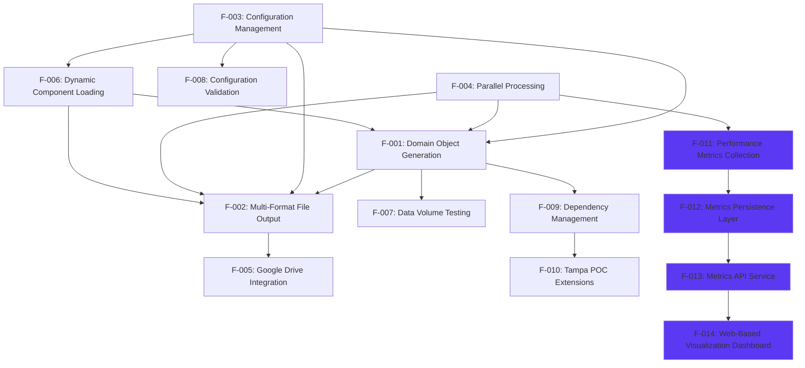
```mermaid
graph TD
    F001[F-001: Domain Object Generation] --> F002[F-002: Multi-Format File Output]
    F001 --> F007[F-007: Data Volume Testing]
    F001 --> F009[F-009: Dependency Management]
    F002 --> F005[F-005: Google Drive Integration]
    F003[F-003: Configuration Management] --> F001
    F003 --> F002
    F003 --> F006[F-006: Dynamic Component Loading]
    F003 --> F008[F-008: Configuration Validation]
    F004[F-004: Parallel Processing] --> F001
    F004 --> F002
    F004 --> F011[F-011: Performance Metrics Collection]
    F006 --> F001
    F006 --> F002
    F009 --> F010[F-010: Tampa POC Extensions]
    F011 --> F012[F-012: Metrics Persistence Layer]
    F012 --> F013[F-013: Metrics API Service]
    F013 --> F014[F-014: Web-Based Visualization Dashboard]
    
    style F011 fill:#5b39f3
    style F012 fill:#5b39f3
    style F013 fill:#5b39f3
    style F014 fill:#5b39f3
```

### 2.3.2 Integration Points

**Configuration-Driven Architecture**:
- F-003 (Configuration Management) serves as the central hub driving all other features
- F-006 (Dynamic Component Loading) enables extensibility based on configuration specifications
- F-008 (Configuration Validation) ensures system integrity before execution

**Data Flow Pipeline**:
- F-001 (Domain Object Generation) produces structured data records
- F-002 (Multi-Format File Output) transforms records into various file formats
- F-004 (Parallel Processing) orchestrates concurrent execution of generation and output stages
- F-005 (Google Drive Integration) provides optional cloud storage of output files

**Data Integrity Chain**:
- F-009 (Dependency Management) maintains referential integrity between domain objects
- F-007 (Data Volume Testing) extends basic generation with additional test data fields
- F-010 (Tampa POC Extensions) provides specialized domain objects for specific use cases

**<span style="background-color: rgba(91, 57, 243, 0.2)">Monitoring & Visualization Pipeline</span>**:
- <span style="background-color: rgba(91, 57, 243, 0.2)">F-011 (Performance Metrics Collection) instruments the parallel processing pipeline to capture comprehensive timing and throughput metrics during execution</span>
- <span style="background-color: rgba(91, 57, 243, 0.2)">F-012 (Metrics Persistence Layer) aggregates collected performance data through MetricsCollector service and persists structured run statistics to JSON files</span>
- <span style="background-color: rgba(91, 57, 243, 0.2)">F-013 (Metrics API Service) exposes persisted metrics through FastAPI-based REST endpoints enabling programmatic access to performance data</span>
- <span style="background-color: rgba(91, 57, 243, 0.2)">F-014 (Web-Based Visualization Dashboard) consumes the metrics API to provide interactive React-based dashboards for performance analysis and multi-run comparisons</span>

### 2.3.3 Shared Components

**Base Classes and Interfaces**:
- Creatable base class: Used by F-001, F-007, F-009, F-010 for consistent object generation
- FileBuilder interface: Implemented by F-002 builders and used by F-005 for upload operations
- Configuration object: Shared across F-003, F-006, F-008 for unified parameter access

**Common Services**:
- SQLite database service: Utilized by F-001 and F-009 for dependency tracking
- Validation framework: Shared between F-003 and F-008 for comprehensive error checking
- Google Drive connector: Used by F-005 for cloud integration capabilities
- Multiprocessing queues: Employed by F-004 for inter-process communication
- <span style="background-color: rgba(91, 57, 243, 0.2)">MetricsCollector service: Centralized metric aggregation service shared by F-011 for data collection, F-012 for persistence operations, and F-013 for API data retrieval</span>
- <span style="background-color: rgba(91, 57, 243, 0.2)">FastAPI application instance: Shared runtime environment used by F-013 for hosting REST endpoints and F-014 for serving static frontend assets and API integration</span>

### 2.3.4 Feature Interaction Matrix (updated)

| Feature | F-001 | F-002 | F-003 | F-004 | F-005 | F-006 | F-007 | F-008 | F-009 | F-010 | <span style="background-color: rgba(91, 57, 243, 0.2)">F-011</span> | <span style="background-color: rgba(91, 57, 243, 0.2)">F-012</span> | <span style="background-color: rgba(91, 57, 243, 0.2)">F-013</span> | <span style="background-color: rgba(91, 57, 243, 0.2)">F-014</span> |
|---------|-------|-------|-------|-------|-------|-------|-------|-------|-------|-------|-------|-------|-------|-------|
| F-001   | -     | ✓     | ✓     | ✓     | -     | ✓     | ✓     | -     | ✓     | ✓     | -     | -     | -     | -     |
| F-002   | -     | -     | ✓     | ✓     | ✓     | ✓     | -     | -     | -     | -     | -     | -     | -     | -     |
| F-003   | -     | -     | -     | -     | -     | ✓     | -     | ✓     | -     | -     | -     | -     | -     | -     |
| F-004   | -     | -     | -     | -     | -     | -     | -     | -     | -     | -     | <span style="background-color: rgba(91, 57, 243, 0.2)">✓</span>     | -     | -     | -     |
| F-005   | -     | -     | -     | -     | -     | -     | -     | -     | -     | -     | -     | -     | -     | -     |
| F-006   | -     | -     | -     | -     | -     | -     | -     | -     | -     | -     | -     | -     | -     | -     |
| F-007   | -     | -     | -     | -     | -     | -     | -     | -     | -     | -     | -     | -     | -     | -     |
| F-008   | -     | -     | -     | -     | -     | -     | -     | -     | -     | -     | -     | -     | -     | -     |
| F-009   | -     | -     | -     | -     | -     | -     | -     | -     | -     | ✓     | -     | -     | -     | -     |
| F-010   | -     | -     | -     | -     | -     | -     | -     | -     | -     | -     | -     | -     | -     | -     |
| <span style="background-color: rgba(91, 57, 243, 0.2)">F-011</span>   | -     | -     | -     | -     | -     | -     | -     | -     | -     | -     | -     | <span style="background-color: rgba(91, 57, 243, 0.2)">✓</span>     | -     | -     |
| <span style="background-color: rgba(91, 57, 243, 0.2)">F-012</span>   | -     | -     | -     | -     | -     | -     | -     | -     | -     | -     | -     | -     | <span style="background-color: rgba(91, 57, 243, 0.2)">✓</span>     | -     |
| <span style="background-color: rgba(91, 57, 243, 0.2)">F-013</span>   | -     | -     | -     | -     | -     | -     | -     | -     | -     | -     | -     | -     | -     | <span style="background-color: rgba(91, 57, 243, 0.2)">✓</span>     |
| <span style="background-color: rgba(91, 57, 243, 0.2)">F-014</span>   | -     | -     | -     | -     | -     | -     | -     | -     | -     | -     | -     | -     | -     | -     |

Legend: ✓ = Direct dependency or integration point

## 2.4 IMPLEMENTATION CONSIDERATIONS

### 2.4.1 Technical Constraints

**Runtime Environment Limitations**:
- Python 3.7+ requirement limits deployment to compatible environments
- <span style="background-color: rgba(91, 57, 243, 0.2)">Requires Node.js ≥18 for frontend build/test workflows; FastAPI server requires ASGI server (uvicorn)</span>
- Single-node execution model prevents distributed processing capabilities
- File-based output only - no direct database writes or streaming protocols
- Batch processing model incompatible with real-time or incremental generation patterns

**System Architecture Constraints**:
- Local SQLite database limits concurrent access and scalability
- Memory-based object creation requires sufficient RAM for large batch sizes
- No built-in authentication or authorization mechanisms
- Configuration-driven architecture requires restart for parameter changes

**Integration Boundaries**:
- No external system connections beyond optional Google Drive uploads
- <span style="background-color: rgba(91, 57, 243, 0.2)">Exposes FastAPI REST service on configurable port for metrics retrieval</span>
- <span style="background-color: rgba(91, 57, 243, 0.2)">Provides React SPA for performance monitoring dashboards accessible via HTTP</span>
- Limited to local file system access patterns

### 2.4.2 Performance Requirements

**Throughput Specifications**:
- Minimum 10,000 records per second for simple domain objects
- Target 100,000+ total records per execution for comprehensive testing
- Linear scaling with additional CPU cores up to system limits
- Memory efficiency to handle millions of records without exhaustion
- <span style="background-color: rgba(91, 57, 243, 0.2)">API response times ≤100 ms average for metrics retrieval endpoints</span>

**Response Time Criteria**:
- Configuration loading and validation under 1 second
- Complete batch execution under 5 minutes for standard test datasets
- File writing operations must not become bottleneck for generation speed
- Google Drive upload time proportional to file size with reasonable timeout
- <span style="background-color: rgba(91, 57, 243, 0.2)">Metrics collection overhead constrained to <1% of total generation time</span>

**Resource Utilization Targets**:
- 80%+ CPU utilization during generation phases
- Memory usage should remain below 70% of available system RAM
- Disk I/O optimization through buffered writes for large files
- Network usage only for optional cloud storage operations

### 2.4.3 Scalability Considerations

**Vertical Scaling Capabilities**:
- Add more CPU cores for increased generation throughput
- Increase available RAM to handle larger batch sizes in memory
- Faster disk I/O improves file writing performance
- Network bandwidth affects Google Drive upload speeds

**Batch Processing Optimization**:
- Configurable records_per_job parameter for optimal memory usage
- Adjustable process pool sizes based on available system resources
- Streaming writes prevent memory buildup during large file generation
- Batch coordination minimizes inter-process communication overhead

**Future Scalability Paths**:
- Horizontal scaling would require architectural changes for distributed processing
- Database scaling could involve external database systems instead of SQLite
- Real-time processing would need fundamental pipeline architecture changes
- API-based interfaces would require service layer implementation

### 2.4.4 Security Implications

**Data Security Considerations**:
- Generated data contains only synthetic financial information
- No authentication mechanisms assume trusted execution environment
- Local file access permissions critical for output directory security
- Google Drive OAuth2 tokens require secure storage and rotation

**System Security Boundaries**:
- No network services exposed - batch execution model only
- Process isolation prevents shared state corruption between parallel workers
- Configuration files should not contain sensitive credentials
- Output files stored in plaintext without encryption
- <span style="background-color: rgba(91, 57, 243, 0.2)">CORS configuration for public dashboard access</span>
- <span style="background-color: rgba(91, 57, 243, 0.2)">Exposure of REST endpoint without authentication assumes trusted network; note future requirement for auth</span>

**Operational Security Requirements**:
- Regular updates of Python dependencies to address security vulnerabilities
- Secure handling of Google Drive API credentials and tokens
- File system permissions on output directories should restrict access
- No logging of sensitive configuration parameters or generated data patterns

### 2.4.5 Maintenance Requirements

**Regular Maintenance Tasks**:
- Update reference data files (exchange_info.csv, tickers.csv) periodically
- Review and update configuration examples and documentation
- Monitor Python package dependencies for security updates
- Test system compatibility with new Python runtime versions
- <span style="background-color: rgba(91, 57, 243, 0.2)">Purging or archiving old metrics files in metrics/runs/ directory</span>
- <span style="background-color: rgba(91, 57, 243, 0.2)">Updating frontend dependencies (React, Recharts) and backend (FastAPI) for security patches</span>

**Code Maintenance Considerations**:
- Maintain comprehensive test coverage for all domain object factories
- Update file builders when new output format requirements emerge
- Review and refactor parallel processing logic for efficiency improvements
- Document any custom factory or builder implementations
- <span style="background-color: rgba(91, 57, 243, 0.2)">Documenting API contract changes</span>

**Configuration Management**:
- Version control for configuration schema changes
- Backward compatibility testing when updating configuration structure
- Documentation updates for new configuration parameters
- Validation rule updates to reflect evolving business requirements

**Quality Assurance Maintenance**:
- Regular execution of comprehensive test suites
- Performance benchmarking to detect regression issues
- Integration testing with various Python runtime environments
- End-to-end testing of complete generation workflows including cloud uploads

#### References

- `src/domainobjectfactories/` - Primary domain object factories for financial instruments, accounts, trades, and related entities
- `src/filebuilders/` - File format builders for CSV, JSON, JSONL, and XML output
- `src/multi_processing/` - Parallel processing pipeline with Creator and Writer components
- `src/configuration/` - Configuration management and validation framework
- `src/database/` - SQLite database management for dependency tracking
- `src/utils/google_drive_connector.py` - Google Drive API integration
- `src/validator/` - Pre-execution validation framework
- `src/metrics/` - Metrics collection and aggregation infrastructure
- `src/api/` - FastAPI REST service for metrics retrieval
- `frontend/` - React SPA for performance monitoring dashboards
- `config.json` - User configuration template and examples
- `dev_config.json` - Developer configuration for class mappings
- `exchange_info.csv`, `tickers.csv` - Reference data for realistic financial identifiers
- `metrics/runs/` - Runtime metrics storage directory

# 3. TECHNOLOGY STACK

## 3.1 PROGRAMMING LANGUAGES

### 3.1.1 Primary Language: Python 3

**Python 3.12** serves as the primary programming language with **Python 3.7+** minimum compatibility requirement.

**Selection Rationale:**
- **Rapid Development**: Python's concise syntax and extensive standard library enable quick implementation of complex data generation logic
- **Financial Domain Libraries**: Rich ecosystem of data manipulation libraries (pandas, numpy) essential for financial data processing
- **Multiprocessing Support**: Native multiprocessing capabilities critical for the system's parallel processing architecture
- **Dynamic Loading**: Built-in importlib support enables the configuration-driven extensibility framework (F-006)
- **JSON Processing**: Native JSON support with high-performance ujson library for configuration management

**Platform Constraints:**
- Minimum Python 3.7 compatibility ensures deployment across enterprise environments
- Standard library multiprocessing limits system to single-node execution
- <span style="background-color: rgba(91, 57, 243, 0.2)">Asynchronous patterns are introduced in the FastAPI service layer; the core batch pipeline remains synchronous</span>
- <span style="background-color: rgba(91, 57, 243, 0.2)">FastAPI code path requires Python 3.7+ async support for coroutine handling</span>

### 3.1.2 Frontend Language: JavaScript (ES6+) (updated)

<span style="background-color: rgba(91, 57, 243, 0.2)">**JavaScript ES6+** serves as the frontend programming language for the React-based performance monitoring dashboard.</span>

**Selection Rationale:**
- **React Ecosystem Compatibility**: Native language for React component development and state management
- **Modern Language Features**: ES6+ syntax including arrow functions, destructuring, and modules for clean component code
- **Asynchronous Operations**: Promise-based HTTP client integration for API communication with FastAPI backend
- **Browser Compatibility**: Transpilation support via Babel ensures cross-browser compatibility while using modern JavaScript features
- **Development Tooling**: Rich debugging, testing, and development server ecosystem

**Technical Specifications:**
- ES6+ feature set including classes, arrow functions, template literals, and async/await
- JSX syntax support for React component rendering
- Module system (ES6 imports/exports) for component organization
- Browser-compatible output via Babel transpilation

### 3.1.3 JavaScript Runtime: Node.js (updated)

<span style="background-color: rgba(91, 57, 243, 0.2)">**Node.js ≥18** provides the execution environment for the JavaScript development toolchain supporting the React frontend application.</span>

**Usage Context:**
- **Package Management**: npm/yarn for dependency installation and version management
- **Build System**: Webpack/Vite bundling for production optimization and development server
- **Development Server**: Hot reload development environment for React component development
- **Testing Framework**: Jest and React Testing Library execution environment
- **Code Quality Tools**: ESLint and Prettier toolchain execution

**Version Requirements:**
- Node.js 18+ LTS for modern JavaScript feature support and security updates
- npm 8+ for package-lock.json v2 format and workspace support
- Compatible with React 18+ concurrent features and modern build tools

### 3.1.4 Query Language: SQL

**SQLite SQL dialect** for local database operations managing inter-object dependencies.

**Usage Context:**
- Referential integrity enforcement between financial domain objects
- Reference data storage (exchange information, ticker symbols)
- Dependency tracking during parallel data generation

## 3.2 FRAMEWORKS & LIBRARIES

### 3.2.1 Core Data Processing Framework

**pandas 2.2.3** - Primary data manipulation and analysis library
- **Purpose**: CSV output generation, data transformation, and Tampa POC extensions
- **Justification**: Industry-standard tool for financial data processing with optimized performance
- **Integration**: Central to FileBuilder implementations and specialized domain object factories

**numpy 2.2.2** - Numerical computing foundation
- **Purpose**: Efficient array operations and mathematical computations for data generation
- **Justification**: Performance-critical numerical operations underlying pandas functionality
- **Dependencies**: Required by multiple data science libraries in the stack

### 3.2.2 Parallel Processing Framework

**dask 2025.1.0** - Advanced parallel computing framework
- **Purpose**: Enhanced parallel processing capabilities beyond standard multiprocessing
- **Justification**: Supports the system's requirement for 80%+ CPU utilization during generation
- **Future Extension**: Enables potential distributed processing capabilities for horizontal scaling

**cloudpickle 3.1.1** - Enhanced object serialization
- **Purpose**: Reliable serialization of complex objects across process boundaries
- **Justification**: Standard pickle limitations with dynamically loaded classes and complex financial objects
- **Integration**: Critical for multiprocessing pipeline stability

### 3.2.3 Serialization & Output Libraries

**ujson 5.10.0** - High-performance JSON serialization
- **Purpose**: Configuration parsing and JSON file output generation
- **Performance**: Significantly faster than standard library json for large datasets
- **Compatibility**: Drop-in replacement for standard JSON with identical API

**dicttoxml 1.7.16** - XML generation from Python dictionaries
- **Purpose**: XML file format support in multi-format output system
- **Integration**: Used by XML FileBuilder for structured data export

**jsonlines 4.0.0** - JSONL format support
- **Purpose**: Line-delimited JSON output for streaming data patterns
- **Justification**: Common format for data pipeline integration and big data processing

### 3.2.4 Web API Framework (updated)

<span style="background-color: rgba(91, 57, 243, 0.2)">**FastAPI 0.104.0** - Modern REST API framework</span>
- <span style="background-color: rgba(91, 57, 243, 0.2)">**Purpose**: High-performance API layer for metrics exposure and dashboard backend services</span>
- <span style="background-color: rgba(91, 57, 243, 0.2)">**Justification**: Native async support, automatic OpenAPI documentation, and Pydantic integration for data validation</span>
- <span style="background-color: rgba(91, 57, 243, 0.2)">**Integration**: Serves metrics endpoints consumed by React frontend, enables CORS support for cross-origin requests</span>

<span style="background-color: rgba(91, 57, 243, 0.2)">**uvicorn 0.24.0** - ASGI server implementation</span>
- <span style="background-color: rgba(91, 57, 243, 0.2)">**Purpose**: Production-ready ASGI server for hosting FastAPI application with optimal async performance</span>
- <span style="background-color: rgba(91, 57, 243, 0.2)">**Justification**: Lightning-fast ASGI server built on uvloop and httptools for minimal latency in metrics API responses</span>

<span style="background-color: rgba(91, 57, 243, 0.2)">**pydantic 2.4.0** - Data validation and serialization framework</span>
- <span style="background-color: rgba(91, 57, 243, 0.2)">**Purpose**: Type-safe data validation layer for FastAPI request/response models and metrics data structures</span>
- <span style="background-color: rgba(91, 57, 243, 0.2)">**Justification**: Automatic request validation, JSON serialization, and comprehensive error reporting for API robustness</span>
- <span style="background-color: rgba(91, 57, 243, 0.2)">**Integration**: Seamless FastAPI integration for automatic API documentation and validation</span>

### 3.2.5 Frontend Framework (updated)

<span style="background-color: rgba(91, 57, 243, 0.2)">**React 18.2.0** - Component-based UI framework</span>
- <span style="background-color: rgba(91, 57, 243, 0.2)">**Purpose**: Interactive performance monitoring dashboard with real-time metrics visualization</span>
- <span style="background-color: rgba(91, 57, 243, 0.2)">**Justification**: Component-based architecture enables modular dashboard design, virtual DOM provides efficient updates for live metrics</span>
- <span style="background-color: rgba(91, 57, 243, 0.2)">**Integration**: Single-page application consuming FastAPI endpoints, supports concurrent features for responsive UI</span>

#### 3.2.5.1 Supporting Frontend Libraries (updated)

<span style="background-color: rgba(91, 57, 243, 0.2)">**axios 1.5.0** - HTTP client library</span>
- <span style="background-color: rgba(91, 57, 243, 0.2)">**Purpose**: Promise-based API client for communication with FastAPI metrics endpoints</span>
- <span style="background-color: rgba(91, 57, 243, 0.2)">**Justification**: Robust error handling, request/response interception, and automatic JSON parsing for API integration</span>

<span style="background-color: rgba(91, 57, 243, 0.2)">**recharts 2.8.0** - Data visualization library</span>
- <span style="background-color: rgba(91, 57, 243, 0.2)">**Purpose**: Performance metrics charting and trend visualization for dashboard components</span>
- <span style="background-color: rgba(91, 57, 243, 0.2)">**Justification**: React-native charting components with responsive design and real-time data binding capabilities</span>

<span style="background-color: rgba(91, 57, 243, 0.2)">**react-router-dom 6.16.0** - Client-side routing</span>
- <span style="background-color: rgba(91, 57, 243, 0.2)">**Purpose**: Single-page application navigation between dashboard views and historical run comparisons</span>
- <span style="background-color: rgba(91, 57, 243, 0.2)">**Justification**: Declarative routing with browser history management for intuitive dashboard navigation</span>

**Package Management Note**: <span style="background-color: rgba(91, 57, 243, 0.2)">Frontend dependencies (React, axios, recharts, react-router-dom) are managed through `frontend/package.json` using npm/yarn package managers, separate from the Python `requirements.txt` dependency management system.</span>

## 3.3 OPEN SOURCE DEPENDENCIES

<span style="background-color: rgba(91, 57, 243, 0.2)">The system's open source dependencies are organized by functional area and tracked across multiple package management systems. Python packages are pinned in `requirements.txt` for backend services, while React-related packages are pinned in `frontend/package.json` for the web dashboard components.</span>

### 3.3.1 Testing & Quality Assurance

**Testing Framework Stack:**
- **pytest 8.3.4** - Primary test framework with plugin ecosystem
- **pytest-cov 6.0.0** - Code coverage measurement and reporting
- **pytest-mock 3.14.0** - Mock object utilities for isolated unit testing
- **coverage 7.6.10** - Coverage analysis and reporting engine

**Code Quality Tools:**
- **pylint 3.3.4** - Static code analysis and style enforcement
- **flake8** (via Hound CI) - Style guide enforcement and error detection

**Justification**: Comprehensive testing infrastructure supporting the system's reliability requirements for production-like data generation scenarios.

### 3.3.2 Future/Experimental Dependencies

**kafka-python 2.0.2** - Apache Kafka client library
- **Status**: Installed but not yet implemented
- **Purpose**: Planned streaming output channel for real-time data patterns
- **Strategic Value**: Supports future extension to streaming architectures

**avro-python3 1.10.2** - Apache Avro serialization
- **Status**: Available for future implementation
- **Purpose**: Schema-based data serialization for complex financial instruments
- **Integration**: Planned integration with Kafka streaming outputs

**protobuf 5.29.3** - Protocol Buffers serialization
- **Status**: Prepared for future use
- **Purpose**: High-performance binary serialization for gRPC integration
- **Strategic Value**: Enables future API-based data distribution

### 3.3.3 Documentation & Development

**pdoc 15.0.1** - API documentation generation
- **Purpose**: Automated documentation for domain object factories and builders
- **Integration**: Supports maintenance requirements for comprehensive system documentation

### 3.3.4 API & Frontend Runtime Dependencies (updated)

<span style="background-color: rgba(91, 57, 243, 0.2)">**Python API Runtime Stack:**</span>
- <span style="background-color: rgba(91, 57, 243, 0.2)">**FastAPI 0.104.0** - Modern async web framework providing REST endpoints for metrics exposure and dashboard backend services</span>
- <span style="background-color: rgba(91, 57, 243, 0.2)">**uvicorn 0.24.0** - High-performance ASGI server enabling production deployment of the FastAPI metrics API</span>
- <span style="background-color: rgba(91, 57, 243, 0.2)">**pydantic 2.4.0** - Data validation and serialization framework ensuring type-safe API request/response handling</span>

<span style="background-color: rgba(91, 57, 243, 0.2)">**Frontend Runtime Stack:**</span>
- <span style="background-color: rgba(91, 57, 243, 0.2)">**React 18.2.0** - Component-based UI framework powering the interactive performance monitoring dashboard</span>
- <span style="background-color: rgba(91, 57, 243, 0.2)">**axios 1.5.0** - Promise-based HTTP client enabling communication between dashboard and FastAPI metrics endpoints</span>
- <span style="background-color: rgba(91, 57, 243, 0.2)">**recharts 2.8.0** - Data visualization library providing responsive charts for performance metrics and trend analysis</span>
- <span style="background-color: rgba(91, 57, 243, 0.2)">**react-router-dom 6.16.0** - Client-side routing solution enabling navigation between dashboard views and historical run comparisons</span>

<span style="background-color: rgba(91, 57, 243, 0.2)">**Integration Architecture**: The Python API stack serves metrics data through RESTful endpoints consumed by the React frontend stack, creating a decoupled architecture that supports independent deployment and scaling of backend services and dashboard interface.</span>

## 3.4 THIRD-PARTY SERVICES

### 3.4.1 Cloud Storage Integration

**Google Drive API v3** - Cloud storage and collaboration platform
- **Authentication**: OAuth2 flow with google-auth-oauthlib 1.2.1
- **Client Library**: google-api-python-client 2.160.0
- **Enhanced Integration**: pydrive 1.3.1 for simplified file operations
- **Purpose**: Optional centralized storage for generated test datasets
- **Business Value**: Enables team collaboration and centralized test data management

**Security Considerations:**
- OAuth2 token-based authentication with secure credential storage
- tokens.pickle and credentials.json files require secure handling
- Network access only for optional cloud upload functionality

### 3.4.2 Development Services

**PyPI Package Repository** - Python package distribution
- **Purpose**: Dependency resolution and package installation via pip
- **Development Tool**: pip-tools for requirements.txt generation and dependency pinning

## 3.5 DATABASES & STORAGE

### 3.5.1 Primary Database

**SQLite3** (Python Standard Library) - Embedded relational database
- **Purpose**: Local dependency management and referential integrity enforcement
- **Architecture**: Single-file database with ACID compliance
- **Performance**: Sufficient for single-node processing requirements
- **Integration**: Custom SQLite_Database wrapper class for domain-specific operations

**Database Schema:**
- Reference data tables (exchanges, tickers, instruments)
- Dependency tracking tables for inter-object relationships
- Automatic seeding from CSV reference files

### 3.5.2 File Storage Systems

**Local File System** - Primary output storage
- **Formats Supported**: CSV, JSON, JSONL, XML with extensible FileBuilder architecture
- **Performance**: Buffered writes to prevent I/O bottlenecks during high-throughput generation
- **Organization**: Configurable output directory structure with timestamp-based organization

**Reference Data Files:**
- `exchange_info.csv` - Exchange and market reference data
- `tickers.csv` - Security identifier mappings
- **Maintenance**: Periodic updates required for realistic financial data patterns

<span style="background-color: rgba(91, 57, 243, 0.2)">**Metrics Storage Directory** - Performance metrics persistence</span>
- **Location**: `metrics/runs/*.json` directory structure for per-run performance data
- **Format**: JSON format for structured metrics storage and efficient retrieval
- **Rotation Strategy**: Timestamp-based file naming for automatic organization and historical tracking
- **Architecture**: File-based storage solution that aligns with existing patterns without introducing additional database dependencies

### 3.5.3 Caching Strategy

**In-Memory Caching** - Configuration and reference data caching
- **Implementation**: Python dictionaries and object-level caching
- **Scope**: Configuration parameters, reference data lookups, and factory class instances
- **Performance Impact**: Reduces file I/O and database queries during batch processing

## 3.6 DEVELOPMENT & DEPLOYMENT

### 3.6.1 Development Environment

**Dependency Management:**
- **pip** - Package installation and environment management
- **pip-tools** - Requirements compilation and dependency pinning
- **requirements.txt** - <span style="background-color: rgba(91, 57, 243, 0.2)">Production dependency specification with exact versions, now pinning fastapi 0.116.1, uvicorn 0.35.0, and pydantic 2.11.7</span>
- <span style="background-color: rgba(91, 57, 243, 0.2)">**frontend/package.json** - JavaScript dependency management for React application components</span>

**<span style="background-color: rgba(91, 57, 243, 0.2)">Frontend Development Requirements</span>:**
- <span style="background-color: rgba(91, 57, 243, 0.2)">**Node.js ≥18** - JavaScript runtime environment for React development toolchain</span>
- <span style="background-color: rgba(91, 57, 243, 0.2)">**npm** - Node package manager for JavaScript dependency installation and script execution</span>

**Development Requirements:**
- **Visual Studio C++ Build Tools** - Required for compiling native extensions in some Python packages
- **Git** - Version control system for source code management

### 3.6.2 Build & Integration System (updated)

**Continuous Integration:**
- **Jenkins** - Primary CI server (jenkins.fuse.galatea-associates.com)
- **Hound CI** - Automated code review and style enforcement
- **GitHub Actions** - Planned future CI/CD pipeline enhancement

**Build Process:**
- Python package installation via pip
- <span style="background-color: rgba(91, 57, 243, 0.2)">Frontend build process via `npm ci && npm run build` for React application bundling</span>
- Automated testing via pytest with coverage reporting
- Code quality validation via pylint and flake8
- <span style="background-color: rgba(91, 57, 243, 0.2)">FastAPI service startup via `uvicorn src.api.main:app` during test stage</span>
- <span style="background-color: rgba(91, 57, 243, 0.2)">CORS validation job to ensure cross-origin request handling for React frontend</span>
- Configuration validation and system health checks

### 3.6.3 Configuration Management

**JSON-Based Configuration:**
- **config.json** - User-facing configuration for generation parameters
- **dev_config.json** - Developer configuration for class mappings and system behavior
- **Validation**: Pre-execution validation framework prevents runtime configuration errors

**Dynamic Class Loading:**
- **importlib** (Python Standard Library) - Runtime class discovery and loading
- **Architecture**: Factory and Builder pattern implementations with configuration-driven instantiation
- **Extensibility**: New domain objects and file formats added via configuration without code changes

### 3.6.4 Deployment Architecture (updated)

**<span style="background-color: rgba(91, 57, 243, 0.2)">Dual-Process Execution Model</span>:**
- <span style="background-color: rgba(91, 57, 243, 0.2)">**Python Batch Generator Process**: Core data generation functionality with multiprocessing pipeline</span>
- <span style="background-color: rgba(91, 57, 243, 0.2)">**FastAPI Service Process**: uvicorn-powered API server exposing metrics endpoints</span>
- <span style="background-color: rgba(91, 57, 243, 0.2)">**React Frontend**: Static build served via HTTP server or React development server during development</span>
- **Isolation**: No external service dependencies for core functionality
- **Scalability**: Vertical scaling through increased CPU cores and memory
- **Distribution**: Source code deployment with pip-based dependency resolution

**System Requirements:**
- Python 3.7+ runtime environment
- <span style="background-color: rgba(91, 57, 243, 0.2)">Node.js ≥18 for frontend development and build processes</span>
- Sufficient RAM for batch processing (target: <70% utilization)
- Local disk space for output file generation
- Optional internet connectivity for Google Drive integration

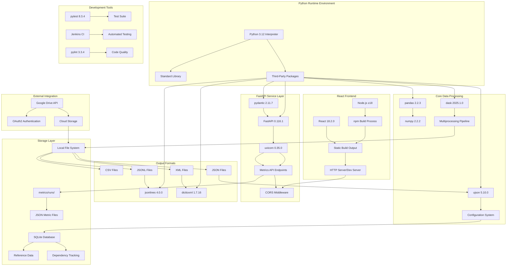
```mermaid
graph TB
    subgraph "Python Runtime Environment"
        A[Python 3.12 Interpreter] --> B[Standard Library]
        A --> C[Third-Party Packages]
    end
    
    subgraph "FastAPI Service Layer"
        FA[FastAPI 0.116.1] --> FB[uvicorn 0.35.0]
        FC[pydantic 2.11.7] --> FA
        FB --> FD[Metrics API Endpoints]
        FD --> FE[CORS Middleware]
    end
    
    subgraph "React Frontend"
        RF[React 18.2.0] --> RG[Static Build Output]
        RH[Node.js ≥18] --> RI[npm Build Process]
        RI --> RG
        RG --> RJ[HTTP Server/Dev Server]
    end
    
    subgraph "Core Data Processing"
        D[pandas 2.2.3] --> E[numpy 2.2.2]
        F[ujson 5.10.0] --> G[Configuration System]
        H[dask 2025.1.0] --> I[Multiprocessing Pipeline]
    end
    
    subgraph "Output Formats"
        J[CSV Files] 
        K[JSON Files] --> F
        L[JSONL Files] --> M[jsonlines 4.0.0]
        N[XML Files] --> O[dicttoxml 1.7.16]
    end
    
    subgraph "Storage Layer"
        P[SQLite Database] --> Q[Reference Data]
        P --> R[Dependency Tracking]
        S[Local File System] --> J
        S --> K
        S --> L
        S --> N
        T[metrics/runs/] --> U[JSON Metric Files]
    end
    
    subgraph "External Integration"
        V[Google Drive API] --> W[OAuth2 Authentication]
        V --> X[Cloud Storage]
    end
    
    subgraph "Development Tools"
        Y[pytest 8.3.4] --> Z[Test Suite]
        AA[Jenkins CI] --> BB[Automated Testing]
        CC[pylint 3.3.4] --> DD[Code Quality]
    end
    
    C --> D
    C --> F
    C --> H
    C --> M
    C --> O
    C --> FA
    C --> FC
    I --> S
    G --> P
    X --> S
    FD --> T
    RJ --> FE
    FB --> FD
```

#### References

**Files Examined:**
- `requirements.txt` - Complete dependency specifications with version constraints including FastAPI, uvicorn, and pydantic
- `frontend/package.json` - React application dependencies and build scripts
- `README.md` - Project documentation including Jenkins CI setup and system overview
- `src/app.py` - Main application entry point demonstrating technology integration
- `src/api/main.py` - FastAPI application entry point with metrics endpoints
- `src/__init__.py` - Package initialization and module structure
- `tests/test_validation/__init__.py` - Testing framework integration marker

**Folders Explored:**
- `src/` - Main source code structure revealing Python-based architecture
- `src/api/` - FastAPI service implementation with metrics endpoints
- `frontend/` - React application source code and build configuration
- `tests/` - Comprehensive test suite organization using pytest framework
- `src/configuration/` - JSON-based configuration management implementation
- `src/multi_processing/` - Parallel processing architecture using Python multiprocessing and dask
- `src/database/` - SQLite database integration and wrapper implementation
- `src/utils/` - Google Drive API integration utilities and helper functions
- `src/filebuilders/` - Multi-format file output implementations (CSV, JSON, JSONL, XML)
- `src/metrics/` - Metrics collection and API service implementation
- `tests/test_validation/` - Validation framework testing infrastructure

**Technical Specification Sections Referenced:**
- Section 1.2 SYSTEM OVERVIEW - System architecture and component integration context
- Section 2.1 FEATURE CATALOG - Feature requirements driving technology choices
- Section 2.4 IMPLEMENTATION CONSIDERATIONS - Performance requirements and technical constraints
- Section 3.1 PROGRAMMING LANGUAGES - Programming language specifications for Python and JavaScript
- Section 3.2 FRAMEWORKS & LIBRARIES - FastAPI, React, and supporting library specifications

**Web Search Citations:**
- FastAPI 0.116.1 latest version information
- uvicorn 0.35.0 latest version information
- Pydantic 2.11.7 current version information

# 4. PROCESS FLOWCHART

## 4.1 SYSTEM WORKFLOWS

### 4.1.1 Core Business Processes

#### 4.1.1.1 End-to-End Data Generation Workflow

The primary business process encompasses the complete lifecycle from configuration input to test data delivery, optimized for Galatea's consulting workflow requirements.

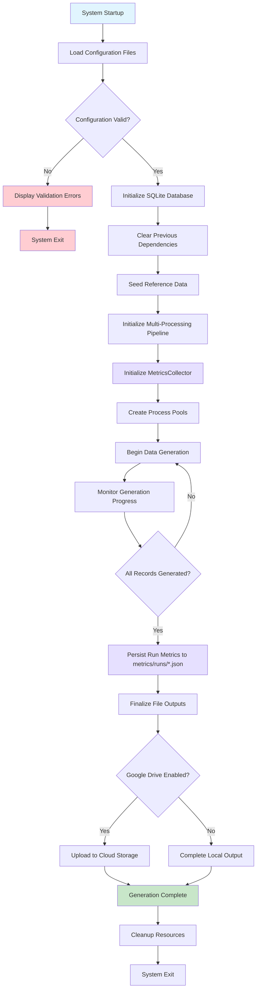
```mermaid
flowchart TD
    A[System Startup] --> B[Load Configuration Files]
    B --> C{Configuration Valid?}
    C -->|No| D[Display Validation Errors]
    D --> E[System Exit]
    C -->|Yes| F[Initialize SQLite Database]
    F --> G[Clear Previous Dependencies]
    G --> H[Seed Reference Data]
    H --> I[Initialize Multi-Processing Pipeline]
    I --> J[Initialize MetricsCollector]
    J --> K[Create Process Pools]
    K --> L[Begin Data Generation]
    L --> M[Monitor Generation Progress]
    M --> N{All Records Generated?}
    N -->|No| L
    N -->|Yes| O["Persist Run Metrics to metrics/runs/*.json"]
    O --> P[Finalize File Outputs]
    P --> Q{Google Drive Enabled?}
    Q -->|Yes| R[Upload to Cloud Storage]
    Q -->|No| S[Complete Local Output]
    R --> T[Generation Complete]
    S --> T
    T --> U[Cleanup Resources]
    U --> V[System Exit]

    style A fill:#e1f5fe
    style T fill:#c8e6c9
    style E fill:#ffcdd2
    style D fill:#ffcdd2
    style J fill:#e6e0ff
    style O fill:#e6e0ff
```

#### 4.1.1.2 Multi-Factory Processing Workflow

The system processes multiple financial domain object types concurrently, maintaining referential integrity across all generated entities.

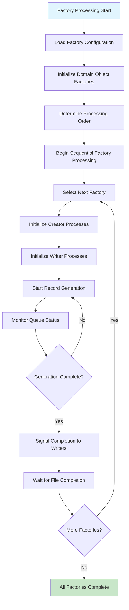
```mermaid
flowchart TD
    A[Factory Processing Start] --> B[Load Factory Configuration]
    B --> C[Initialize Domain Object Factories]
    C --> D[Determine Processing Order]
    D --> E[Begin Sequential Factory Processing]
    E --> F[Select Next Factory]
    F --> G[Initialize Creator Processes]
    G --> H[Initialize Writer Processes]
    H --> I[Start Record Generation]
    I --> J[Monitor Queue Status]
    J --> K{Generation Complete?}
    K -->|No| I
    K -->|Yes| L[Signal Completion to Writers]
    L --> M[Wait for File Completion]
    M --> N{More Factories?}
    N -->|Yes| F
    N -->|No| O[All Factories Complete]

    style A fill:#e1f5fe
    style O fill:#c8e6c9
```

#### 4.1.1.3 User Journey and System Interactions

This workflow captures the typical user experience for Galatea consultants generating test data for client project preparation.

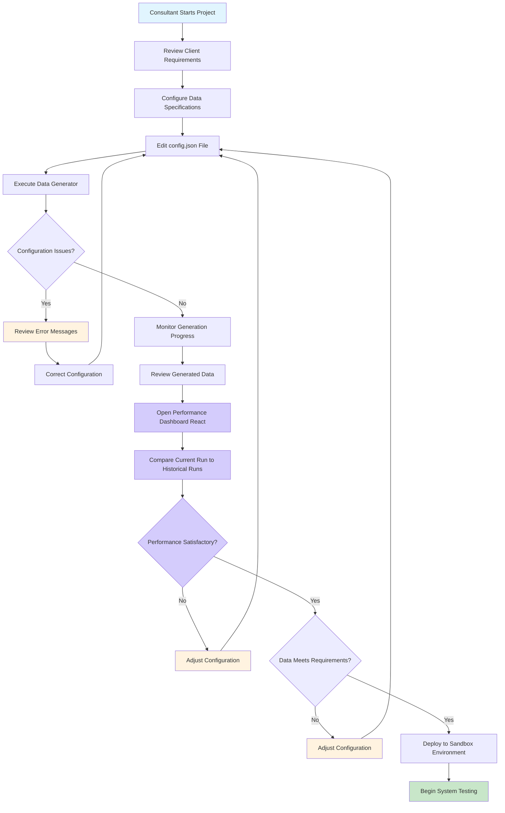
```mermaid
flowchart TD
    A[Consultant Starts Project] --> B[Review Client Requirements]
    B --> C[Configure Data Specifications]
    C --> D[Edit config.json File]
    D --> E[Execute Data Generator]
    E --> F{Configuration Issues?}
    F -->|Yes| G[Review Error Messages]
    G --> H[Correct Configuration]
    H --> D
    F -->|No| I[Monitor Generation Progress]
    I --> J[Review Generated Data]
    J --> K[Open Performance Dashboard React]
    K --> L[Compare Current Run to Historical Runs]
    L --> M{Performance Satisfactory?}
    M -->|No| N[Adjust Configuration]
    N --> D
    M -->|Yes| O{Data Meets Requirements?}
    O -->|No| P[Adjust Configuration]
    P --> D
    O -->|Yes| Q[Deploy to Sandbox Environment]
    Q --> R[Begin System Testing]

    style A fill:#e1f5fe
    style R fill:#c8e6c9
    style G fill:#fff3e0
    style N fill:#fff3e0
    style P fill:#fff3e0
    style K fill:#d4ccfc
    style L fill:#d4ccfc
    style M fill:#d4ccfc
```

### 4.1.2 Integration Workflows

#### 4.1.2.1 Multi-Processing Data Flow Architecture

The system implements a sophisticated two-stage producer-consumer pattern for optimal throughput and resource utilization.

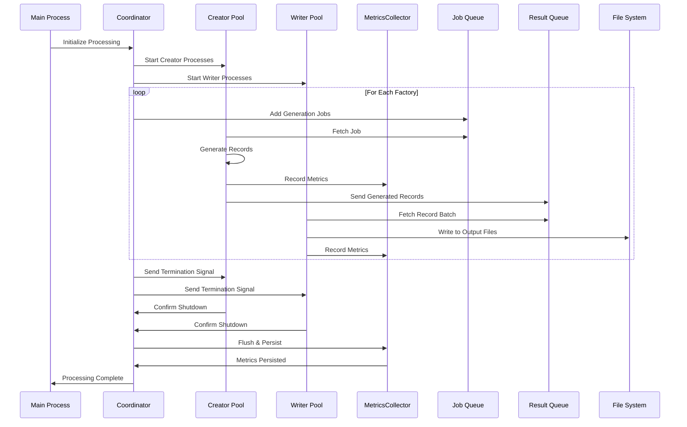
```mermaid
sequenceDiagram
    participant Main as Main Process
    participant Coordinator as Coordinator
    participant Creator as Creator Pool
    participant Writer as Writer Pool
    participant MetricsCollector as MetricsCollector
    participant Queue1 as Job Queue
    participant Queue2 as Result Queue
    participant FS as File System

    Main->>Coordinator: Initialize Processing
    Coordinator->>Creator: Start Creator Processes
    Coordinator->>Writer: Start Writer Processes
    
    loop For Each Factory
        Coordinator->>Queue1: Add Generation Jobs
        Creator->>Queue1: Fetch Job
        Creator->>Creator: Generate Records
        Creator->>MetricsCollector: Record Metrics
        Creator->>Queue2: Send Generated Records
        Writer->>Queue2: Fetch Record Batch
        Writer->>FS: Write to Output Files
        Writer->>MetricsCollector: Record Metrics
    end
    
    Coordinator->>Creator: Send Termination Signal
    Coordinator->>Writer: Send Termination Signal
    Creator->>Coordinator: Confirm Shutdown
    Writer->>Coordinator: Confirm Shutdown
    Coordinator->>MetricsCollector: Flush & Persist
    MetricsCollector->>Coordinator: Metrics Persisted
    Coordinator->>Main: Processing Complete
```

#### 4.1.2.2 Database Integration and Dependency Management

The SQLite database serves as the central coordination point for maintaining referential integrity across all generated domain objects.

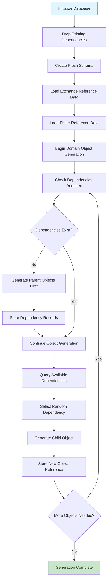
```mermaid
flowchart TD
    A[Initialize Database] --> B[Drop Existing Dependencies]
    B --> C[Create Fresh Schema]
    C --> D[Load Exchange Reference Data]
    D --> E[Load Ticker Reference Data]
    E --> F[Begin Domain Object Generation]
    F --> G[Check Dependencies Required]
    G --> H{Dependencies Exist?}
    H -->|No| I[Generate Parent Objects First]
    I --> J[Store Dependency Records]
    J --> K[Continue Object Generation]
    H -->|Yes| K
    K --> L[Query Available Dependencies]
    L --> M[Select Random Dependency]
    M --> N[Generate Child Object]
    N --> O[Store New Object Reference]
    O --> P{More Objects Needed?}
    P -->|Yes| G
    P -->|No| Q[Generation Complete]

    style A fill:#e1f5fe
    style Q fill:#c8e6c9
```

#### 4.1.2.3 Google Drive Cloud Integration Flow

Optional cloud storage integration provides centralized test data sharing across distributed consulting teams.

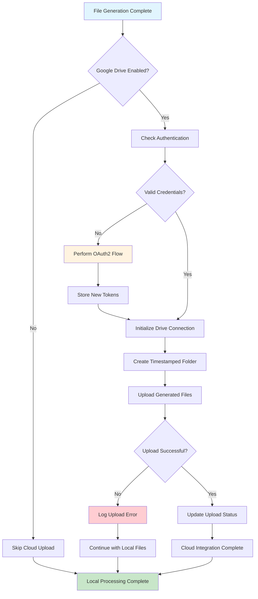
```mermaid
flowchart TD
    A[File Generation Complete] --> B{Google Drive Enabled?}
    B -->|No| C[Skip Cloud Upload]
    C --> D[Local Processing Complete]
    B -->|Yes| E[Check Authentication]
    E --> F{Valid Credentials?}
    F -->|No| G[Perform OAuth2 Flow]
    G --> H[Store New Tokens]
    H --> I[Initialize Drive Connection]
    F -->|Yes| I
    I --> J[Create Timestamped Folder]
    J --> K[Upload Generated Files]
    K --> L{Upload Successful?}
    L -->|No| M[Log Upload Error]
    M --> N[Continue with Local Files]
    L -->|Yes| O[Update Upload Status]
    O --> P[Cloud Integration Complete]
    N --> D
    P --> D

    style A fill:#e1f5fe
    style D fill:#c8e6c9
    style G fill:#fff3e0
    style M fill:#ffcdd2
```

## 4.2 FLOWCHART REQUIREMENTS

### 4.2.1 Decision Points and Business Rules

#### 4.2.1.1 Configuration Validation Decision Matrix

The system implements comprehensive pre-execution validation to ensure reliable operation and clear error reporting.

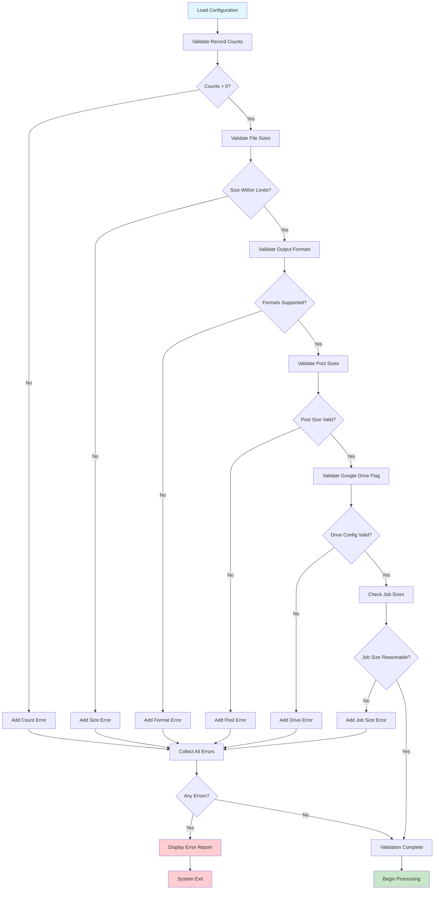
```mermaid
flowchart TD
    A[Load Configuration] --> B[Validate Record Counts]
    B --> C{Counts > 0?}
    C -->|No| D[Add Count Error]
    C -->|Yes| E[Validate File Sizes]
    E --> F{Size Within Limits?}
    F -->|No| G[Add Size Error]
    F -->|Yes| H[Validate Output Formats]
    H --> I{Formats Supported?}
    I -->|No| J[Add Format Error]
    I -->|Yes| K[Validate Pool Sizes]
    K --> L{Pool Size Valid?}
    L -->|No| M[Add Pool Error]
    L -->|Yes| N[Validate Google Drive Flag]
    N --> O{Drive Config Valid?}
    O -->|No| P[Add Drive Error]
    O -->|Yes| Q[Check Job Sizes]
    Q --> R{Job Size Reasonable?}
    R -->|No| S[Add Job Size Error]
    R -->|Yes| T[Validation Complete]
    
    D --> U[Collect All Errors]
    G --> U
    J --> U
    M --> U
    P --> U
    S --> U
    U --> V{Any Errors?}
    V -->|Yes| W[Display Error Report]
    V -->|No| T
    W --> X[System Exit]
    T --> Y[Begin Processing]

    style A fill:#e1f5fe
    style Y fill:#c8e6c9
    style X fill:#ffcdd2
    style W fill:#ffcdd2
```

#### 4.2.1.2 Factory Processing State Transitions

Each domain object factory progresses through defined states with clear transition conditions and error recovery paths.

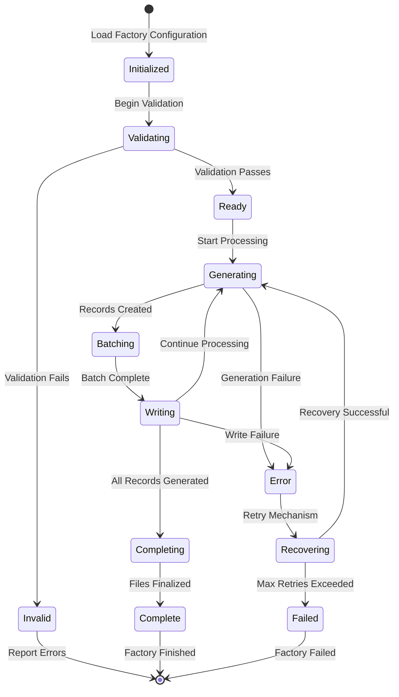
```mermaid
stateDiagram-v2
    [*] --> Initialized: Load Factory Configuration
    Initialized --> Validating: Begin Validation
    Validating --> Invalid: Validation Fails
    Validating --> Ready: Validation Passes
    Invalid --> [*]: Report Errors
    Ready --> Generating: Start Processing
    Generating --> Batching: Records Created
    Batching --> Writing: Batch Complete
    Writing --> Generating: Continue Processing
    Writing --> Completing: All Records Generated
    Completing --> Complete: Files Finalized
    Complete --> [*]: Factory Finished
    
    Generating --> Error: Generation Failure
    Writing --> Error: Write Failure
    Error --> Recovering: Retry Mechanism
    Recovering --> Generating: Recovery Successful
    Recovering --> Failed: Max Retries Exceeded
    Failed --> [*]: Factory Failed
```

### 4.2.2 Error Handling and Recovery Paths

#### 4.2.2.1 Comprehensive Error Handling Workflow

The system implements layered error handling to ensure graceful degradation and clear error reporting.

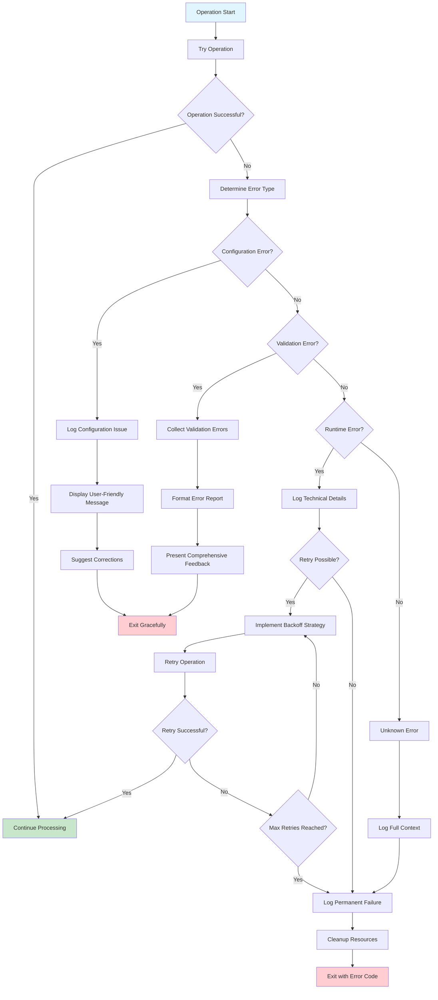
```mermaid
flowchart TD
    A[Operation Start] --> B[Try Operation]
    B --> C{Operation Successful?}
    C -->|Yes| D[Continue Processing]
    C -->|No| E[Determine Error Type]
    E --> F{Configuration Error?}
    F -->|Yes| G[Log Configuration Issue]
    G --> H[Display User-Friendly Message]
    H --> I[Suggest Corrections]
    I --> J[Exit Gracefully]
    
    F -->|No| K{Validation Error?}
    K -->|Yes| L[Collect Validation Errors]
    L --> M[Format Error Report]
    M --> N[Present Comprehensive Feedback]
    N --> J
    
    K -->|No| O{Runtime Error?}
    O -->|Yes| P[Log Technical Details]
    P --> Q{Retry Possible?}
    Q -->|Yes| R[Implement Backoff Strategy]
    R --> S[Retry Operation]
    S --> T{Retry Successful?}
    T -->|Yes| D
    T -->|No| U{Max Retries Reached?}
    U -->|No| R
    U -->|Yes| V[Log Permanent Failure]
    
    Q -->|No| V
    O -->|No| W[Unknown Error]
    W --> X[Log Full Context]
    X --> V
    V --> Y[Cleanup Resources]
    Y --> Z[Exit with Error Code]

    style A fill:#e1f5fe
    style D fill:#c8e6c9
    style J fill:#ffcdd2
    style Z fill:#ffcdd2
```

## 4.3 TECHNICAL IMPLEMENTATION

### 4.3.1 State Management Architecture

#### 4.3.1.1 Multi-Process State Coordination

The system manages state across multiple processes using queue-based communication and shared database resources. <span style="background-color: rgba(91, 57, 243, 0.2)">A dedicated MetricsCollector maintains performance metrics throughout the generation lifecycle, with persistent storage for historical analysis.</span>

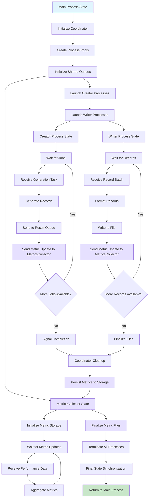
```mermaid
flowchart TD
    A[Main Process State] --> B[Initialize Coordinator]
    B --> C[Create Process Pools]
    C --> D[Initialize Shared Queues]
    D --> E[Launch Creator Processes]
    E --> F[Launch Writer Processes]
    
    F --> G[Creator Process State]
    G --> H[Wait for Jobs]
    H --> I[Receive Generation Task]
    I --> J[Generate Records]
    J --> K[Send to Result Queue]
    K --> L[Send Metric Update to MetricsCollector]
    L --> M{More Jobs Available?}
    M -->|Yes| H
    M -->|No| N[Signal Completion]
    
    F --> O[Writer Process State]
    O --> P[Wait for Records]
    P --> Q[Receive Record Batch]
    Q --> R[Format Records]
    R --> S[Write to File]
    S --> T[Send Metric Update to MetricsCollector]
    T --> U{More Records Available?}
    U -->|Yes| P
    U -->|No| V[Finalize Files]
    
    D --> W[MetricsCollector State]
    W --> X[Initialize Metric Storage]
    X --> Y[Wait for Metric Updates]
    Y --> Z[Receive Performance Data]
    Z --> AA[Aggregate Metrics]
    AA --> Y
    
    N --> BB[Coordinator Cleanup]
    V --> BB
    BB --> CC[Persist Metrics to Storage]
    CC --> W
    W --> DD[Finalize Metric Files]
    DD --> EE[Terminate All Processes]
    EE --> FF[Final State Synchronization]
    FF --> GG[Return to Main Process]

    style A fill:#e1f5fe
    style GG fill:#c8e6c9
    style W fill:#e6e0ff
    style L fill:#e6e0ff
    style T fill:#e6e0ff
    style CC fill:#e6e0ff
    style DD fill:#e6e0ff
```

<span style="background-color: rgba(91, 57, 243, 0.2)">**FastAPI Service Integration**: Following main process completion, an optional asynchronous path enables the FastAPI service (`uvicorn src.api.main:app`) to start independently. This service reads the persisted metric files from the `metrics/runs/` directory to provide REST API access to historical performance data and real-time dashboard functionality.</span>

#### 4.3.1.2 Database Transaction Management

SQLite database operations maintain ACID properties while supporting concurrent access from multiple generation processes.

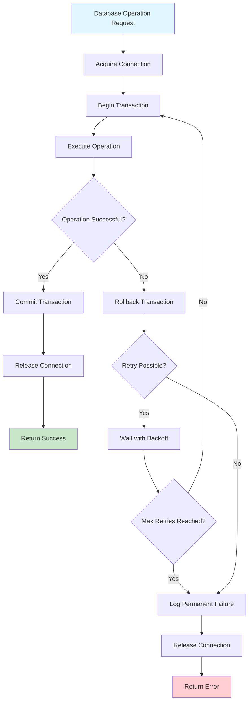
```mermaid
flowchart TD
    A[Database Operation Request] --> B[Acquire Connection]
    B --> C[Begin Transaction]
    C --> D[Execute Operation]
    D --> E{Operation Successful?}
    E -->|Yes| F[Commit Transaction]
    F --> G[Release Connection]
    G --> H[Return Success]
    
    E -->|No| I[Rollback Transaction]
    I --> J{Retry Possible?}
    J -->|Yes| K[Wait with Backoff]
    K --> L{Max Retries Reached?}
    L -->|No| C
    L -->|Yes| M[Log Permanent Failure]
    
    J -->|No| M
    M --> N[Release Connection]
    N --> O[Return Error]

    style A fill:#e1f5fe
    style H fill:#c8e6c9
    style O fill:#ffcdd2
```

### 4.3.2 Performance and Scalability Patterns

#### 4.3.2.1 Dynamic Load Balancing Workflow

The system automatically adjusts processing patterns based on generation rates and resource availability.

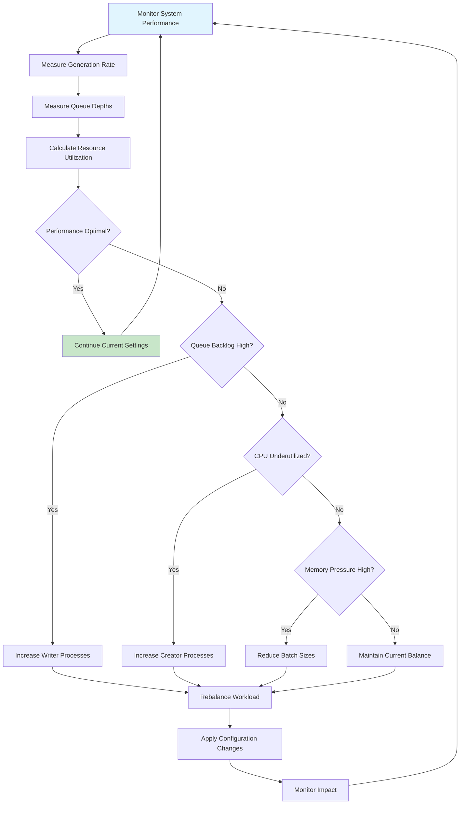
```mermaid
flowchart TD
    A[Monitor System Performance] --> B[Measure Generation Rate]
    B --> C[Measure Queue Depths]
    C --> D[Calculate Resource Utilization]
    D --> E{Performance Optimal?}
    E -->|Yes| F[Continue Current Settings]
    F --> A
    
    E -->|No| G{Queue Backlog High?}
    G -->|Yes| H[Increase Writer Processes]
    H --> I[Rebalance Workload]
    
    G -->|No| J{CPU Underutilized?}
    J -->|Yes| K[Increase Creator Processes]
    K --> I
    
    J -->|No| L{Memory Pressure High?}
    L -->|Yes| M[Reduce Batch Sizes]
    M --> I
    
    L -->|No| N[Maintain Current Balance]
    N --> I
    I --> O[Apply Configuration Changes]
    O --> P[Monitor Impact]
    P --> A

    style A fill:#e1f5fe
    style F fill:#c8e6c9
```

## 4.4 INTEGRATION SEQUENCE DIAGRAMS

### 4.4.1 Complete System Integration Flow (updated)

This comprehensive sequence diagram illustrates the interaction between all major system components during a typical data generation cycle, <span style="background-color: rgba(91, 57, 243, 0.2)">including the new metrics collection, API, and dashboard monitoring capabilities</span>.

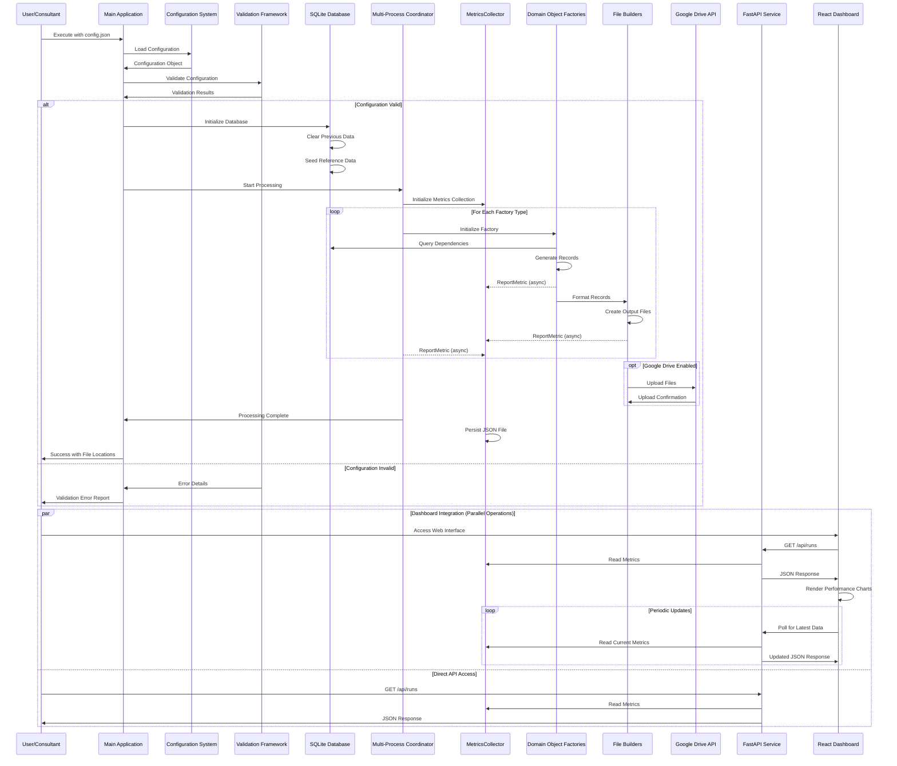
```mermaid
sequenceDiagram
    participant User as User/Consultant
    participant Main as Main Application
    participant Config as Configuration System
    participant Validator as Validation Framework
    participant DB as SQLite Database
    participant Coord as Multi-Process Coordinator
    participant MetricsCollector as MetricsCollector
    participant Factory as Domain Object Factories
    participant Builder as File Builders
    participant Drive as Google Drive API
    participant API as FastAPI Service
    participant Dashboard as React Dashboard

    User->>Main: Execute with config.json
    Main->>Config: Load Configuration
    Config->>Main: Configuration Object
    Main->>Validator: Validate Configuration
    Validator->>Main: Validation Results
    
    alt Configuration Valid
        Main->>DB: Initialize Database
        DB->>DB: Clear Previous Data
        DB->>DB: Seed Reference Data
        Main->>Coord: Start Processing
        Coord->>MetricsCollector: Initialize Metrics Collection
        
        loop For Each Factory Type
            Coord->>Factory: Initialize Factory
            Factory->>DB: Query Dependencies
            Factory->>Factory: Generate Records
            Factory-->>MetricsCollector: ReportMetric (async)
            Factory->>Builder: Format Records
            Builder->>Builder: Create Output Files
            Builder-->>MetricsCollector: ReportMetric (async)
            Coord-->>MetricsCollector: ReportMetric (async)
        end
        
        opt Google Drive Enabled
            Builder->>Drive: Upload Files
            Drive->>Builder: Upload Confirmation
        end
        
        Coord->>Main: Processing Complete
        MetricsCollector->>MetricsCollector: Persist JSON File
        Main->>User: Success with File Locations
    else Configuration Invalid
        Validator->>Main: Error Details
        Main->>User: Validation Error Report
    end

    par Dashboard Integration (Parallel Operations)
        User->>Dashboard: Access Web Interface
        Dashboard->>API: GET /api/runs
        API->>MetricsCollector: Read Metrics
        API->>Dashboard: JSON Response
        Dashboard->>Dashboard: Render Performance Charts
        
        loop Periodic Updates
            Dashboard->>API: Poll for Latest Data
            API->>MetricsCollector: Read Current Metrics
            API->>Dashboard: Updated JSON Response
        end
    and Direct API Access
        User->>API: GET /api/runs
        API->>MetricsCollector: Read Metrics
        API->>User: JSON Response
    end
```

### 4.4.2 Error Recovery Integration Pattern

This sequence demonstrates how errors are handled and recovered across the distributed system architecture.

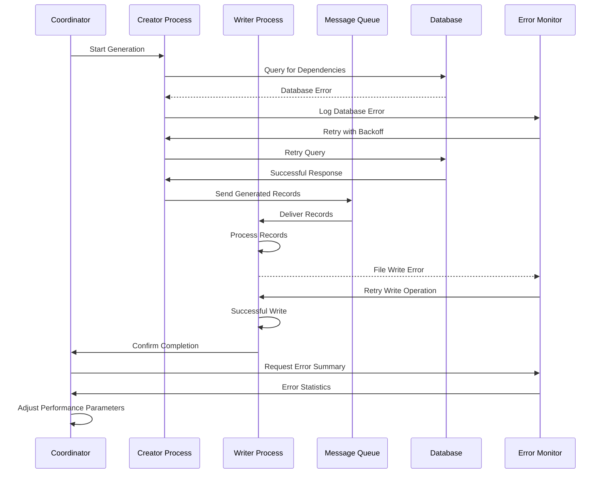
```mermaid
sequenceDiagram
    participant Coord as Coordinator
    participant Creator as Creator Process
    participant Writer as Writer Process
    participant Queue as Message Queue
    participant DB as Database
    participant Monitor as Error Monitor

    Coord->>Creator: Start Generation
    Creator->>DB: Query for Dependencies
    DB-->>Creator: Database Error
    Creator->>Monitor: Log Database Error
    Monitor->>Creator: Retry with Backoff
    Creator->>DB: Retry Query
    DB->>Creator: Successful Response
    Creator->>Queue: Send Generated Records
    
    Queue->>Writer: Deliver Records
    Writer->>Writer: Process Records
    Writer-->>Monitor: File Write Error
    Monitor->>Writer: Retry Write Operation
    Writer->>Writer: Successful Write
    Writer->>Coord: Confirm Completion
    
    Coord->>Monitor: Request Error Summary
    Monitor->>Coord: Error Statistics
    Coord->>Coord: Adjust Performance Parameters
```

### 4.4.3 Metrics Collection Integration Architecture (updated)

<span style="background-color: rgba(91, 57, 243, 0.2)">This sequence diagram details the comprehensive metrics ecosystem spanning data generation through dashboard visualization, ensuring performance analytics are available throughout the system lifecycle.</span>

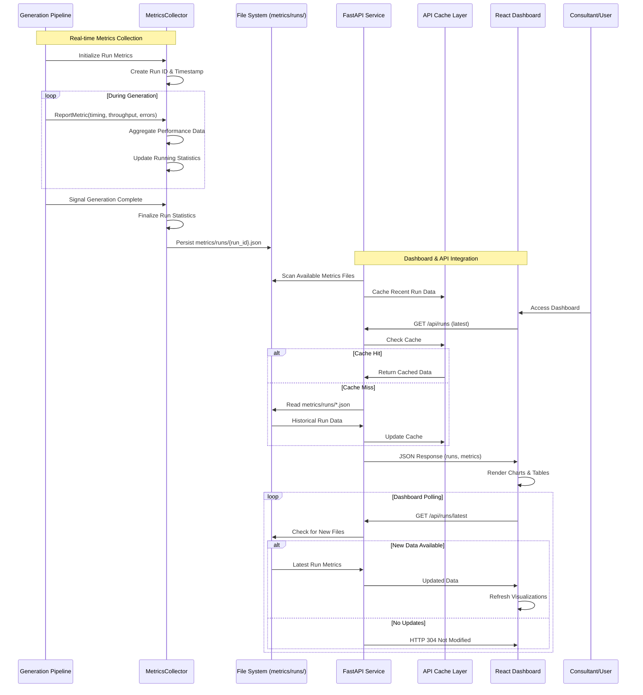
```mermaid
sequenceDiagram
    participant Gen as Generation Pipeline
    participant MC as MetricsCollector
    participant FS as File System (metrics/runs/)
    participant API as FastAPI Service
    participant Cache as API Cache Layer  
    participant UI as React Dashboard
    participant User as Consultant/User

    Note over Gen,MC: Real-time Metrics Collection
    Gen->>MC: Initialize Run Metrics
    MC->>MC: Create Run ID & Timestamp
    
    loop During Generation
        Gen->>MC: ReportMetric(timing, throughput, errors)
        MC->>MC: Aggregate Performance Data
        MC->>MC: Update Running Statistics
    end
    
    Gen->>MC: Signal Generation Complete
    MC->>MC: Finalize Run Statistics
    MC->>FS: Persist metrics/runs/{run_id}.json
    
    Note over API,UI: Dashboard & API Integration
    API->>FS: Scan Available Metrics Files
    API->>Cache: Cache Recent Run Data
    
    User->>UI: Access Dashboard
    UI->>API: GET /api/runs (latest)
    API->>Cache: Check Cache
    alt Cache Hit
        Cache->>API: Return Cached Data
    else Cache Miss
        API->>FS: Read metrics/runs/*.json
        FS->>API: Historical Run Data
        API->>Cache: Update Cache
    end
    API->>UI: JSON Response (runs, metrics)
    UI->>UI: Render Charts & Tables
    
    loop Dashboard Polling
        UI->>API: GET /api/runs/latest
        API->>FS: Check for New Files
        alt New Data Available
            FS->>API: Latest Run Metrics
            API->>UI: Updated Data
            UI->>UI: Refresh Visualizations
        else No Updates
            API->>UI: HTTP 304 Not Modified
        end
    end
```

### 4.4.4 Multi-Tenant Metrics Isolation Pattern (updated)

<span style="background-color: rgba(91, 57, 243, 0.2)">This diagram illustrates how the system maintains metrics isolation for concurrent generation runs while providing unified access through the API layer.</span>

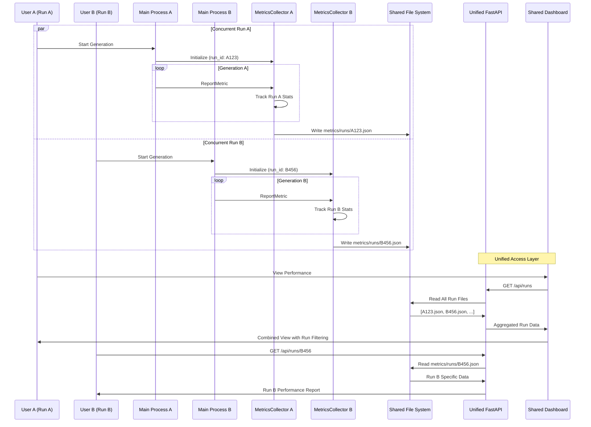
```mermaid
sequenceDiagram
    participant UserA as User A (Run A)
    participant UserB as User B (Run B)
    participant MainA as Main Process A
    participant MainB as Main Process B
    participant MCA as MetricsCollector A
    participant MCB as MetricsCollector B
    participant FS as Shared File System
    participant API as Unified FastAPI
    participant Dashboard as Shared Dashboard

    par Concurrent Run A
        UserA->>MainA: Start Generation
        MainA->>MCA: Initialize (run_id: A123)
        loop Generation A
            MainA->>MCA: ReportMetric
            MCA->>MCA: Track Run A Stats
        end
        MCA->>FS: Write metrics/runs/A123.json
    and Concurrent Run B  
        UserB->>MainB: Start Generation
        MainB->>MCB: Initialize (run_id: B456)
        loop Generation B
            MainB->>MCB: ReportMetric
            MCB->>MCB: Track Run B Stats
        end
        MCB->>FS: Write metrics/runs/B456.json
    end
    
    Note over API,Dashboard: Unified Access Layer
    UserA->>Dashboard: View Performance
    Dashboard->>API: GET /api/runs
    API->>FS: Read All Run Files
    FS->>API: [A123.json, B456.json, ...]
    API->>Dashboard: Aggregated Run Data
    Dashboard->>UserA: Combined View with Run Filtering
    
    UserB->>API: GET /api/runs/B456
    API->>FS: Read metrics/runs/B456.json
    FS->>API: Run B Specific Data
    API->>UserB: Run B Performance Report
```

## 4.5 TIMING AND SLA CONSIDERATIONS

### 4.5.1 Performance Benchmarks and Constraints

The system is designed to meet specific performance criteria essential for Galatea's consulting workflow requirements.

#### 4.5.1.1 Generation Rate Targets

| Domain Object Type | Target Rate (records/second) | Typical File Size | SLA Requirement |
|-------------------|------------------------------|-------------------|-----------------|
| Instruments | 1,000+ | 50MB for 100K records | < 2 minutes |
| Accounts | 800+ | 40MB for 100K records | < 2.5 minutes |
| Trades | 500+ | 80MB for 100K records | < 4 minutes |
| Positions | 600+ | 60MB for 100K records | < 3 minutes |
| Prices | 1,200+ | 30MB for 100K records | < 1.5 minutes |

<span style="background-color: rgba(91, 57, 243, 0.2)">**Instrumentation Overhead**: Metrics collection must introduce <1% additional wall-clock time per run.</span>

#### 4.5.1.2 Resource Utilization Timing Flow


```mermaid
gantt
    title System Resource Utilization Timeline
    dateFormat X
    axisFormat %s
    
    section Initialization
    Config Load    :0, 2
    Database Setup :2, 5
    Process Launch :5, 8
    
    section Generation Phase
    Creator Ramp-up   :8, 12
    Peak Generation   :12, 45
    Writer Processing :15, 48
    
    section Finalization
    File Completion :45, 50
    Cloud Upload    :48, 55
    Cleanup        :50, 52
```

### 4.5.2 Scalability Thresholds and Limits

#### 4.5.2.1 Memory and CPU Constraint Workflow

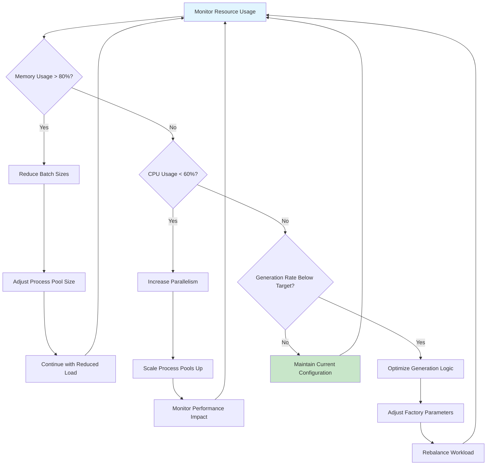
```mermaid
flowchart TD
    A[Monitor Resource Usage] --> B{Memory Usage > 80%?}
    B -->|Yes| C[Reduce Batch Sizes]
    C --> D[Adjust Process Pool Size]
    D --> E[Continue with Reduced Load]
    
    B -->|No| F{CPU Usage < 60%?}
    F -->|Yes| G[Increase Parallelism]
    G --> H[Scale Process Pools Up]
    H --> I[Monitor Performance Impact]
    
    F -->|No| J{Generation Rate Below Target?}
    J -->|Yes| K[Optimize Generation Logic]
    K --> L[Adjust Factory Parameters]
    L --> M[Rebalance Workload]
    
    J -->|No| N[Maintain Current Configuration]
    
    E --> A
    I --> A
    M --> A
    N --> A

    style A fill:#e1f5fe
    style N fill:#c8e6c9
```

#### References

**Files Examined (17):**
- `src/app.py` - Main application entry point and orchestration logic
- `src/multi_processing/coordinator.py` - Multi-processing coordination and workflow management
- `src/multi_processing/creator.py` - Record creation process management and job distribution
- `src/multi_processing/writer.py` - File writing process management and output coordination
- `src/multi_processing/pool_tasks.py` - Child process execution logic and task handling
- `src/validator/config_validator.py` - Configuration validation rules and error reporting
- `src/utils/google_drive_connector.py` - Google Drive API integration and authentication
- `src/filebuilders/csv_builder.py` - CSV file building implementation and formatting
- `src/configuration/configuration.py` - Configuration object structure and parameter management
- `src/config.json` - User configuration example and parameter specification
- `src/database/sqlite_database.py` - Database operations and dependency relationship management
- `src/domainobjectfactories/creatable.py` - Base factory implementation and object generation patterns

**Folders Explored (3):**
- `src/filebuilders/` - File builder implementations for multiple output formats
- `src/domainobjectfactories/` - Domain object factory implementations and specialized generators
- `src/exceptions/` - Exception definitions and error handling frameworks

**Technical Specification Sections Referenced (3):**
- `1.2 SYSTEM OVERVIEW` - System context, architecture, and integration landscape
- `2.1 FEATURE CATALOG` - Feature descriptions, dependencies, and technical specifications
- `2.3 FEATURE RELATIONSHIPS` - Feature dependency mapping and integration points

# 5. SYSTEM ARCHITECTURE

## 5.1 HIGH-LEVEL ARCHITECTURE

### 5.1.1 System Overview

The FUSE Test Data Generator implements a **layered, component-based architecture** specifically designed for high-throughput synthetic financial data generation in enterprise consulting environments. As Galatea Associates' primary tool for pre-client system validation, the architecture prioritizes reliability, extensibility, and performance while maintaining operational simplicity.

<span style="background-color: rgba(91, 57, 243, 0.2)">The original batch-processing core is now complemented by a sophisticated performance-monitoring subsystem that operates alongside the existing pipeline without altering its core data-generation responsibilities. This monitoring enhancement consists of three integrated components: (a) an in-process MetricsCollector that captures performance data throughout the generation lifecycle, (b) a FastAPI metrics service that exposes REST endpoints for data access, and (c) a React dashboard that provides real-time and historical performance visualization.</span>

**Architectural Style and Rationale:**
The system adopts a **batch processing pipeline architecture** with clear separation of concerns across distinct layers. This approach was selected to match the batch-oriented nature of test data generation workflows, where complete datasets are generated, formatted, and delivered as discrete units. The architecture leverages proven enterprise patterns including factory, strategy, and producer-consumer patterns to ensure maintainability and extensibility.

**Key Architectural Principles:**
- **Single Responsibility**: Each component has a clearly defined purpose with minimal overlap
- **Open/Closed Principle**: Extensible through configuration and plugin patterns without modifying core logic
- **Dependency Inversion**: High-level modules depend on abstractions rather than concrete implementations
- **Fail-Fast Validation**: Comprehensive pre-execution validation prevents runtime failures
- **Resource Isolation**: Multi-process architecture provides fault tolerance and resource containment

**System Boundaries and Major Interfaces:**
The system operates as a standalone batch processor with clearly defined boundaries:
- **Input Boundary**: JSON configuration files and CSV reference data
- **Processing Boundary**: Internal component communication via queues and database
- **Output Boundary**: Local file system and optional Google Drive integration
- <span style="background-color: rgba(91, 57, 243, 0.2)">**Monitoring Boundary**: HTTP/JSON interface exposed by FastAPI metrics service for performance data access</span>
- <span style="background-color: rgba(91, 57, 243, 0.2)">**Presentation Boundary**: React single-page application served over HTTP for dashboard visualization</span>
- <span style="background-color: rgba(91, 57, 243, 0.2)">**Network Dependencies**: The new HTTP metrics service operates locally by default and requires network access only for browser clients accessing the dashboard interface</span>

### 5.1.2 Core Components Table

| Component Name | Primary Responsibility | Key Dependencies | Integration Points |
|----------------|------------------------|------------------|-------------------|
| Application Orchestrator | System bootstrapping, lifecycle management, component coordination | Configuration Management, Database Layer, Multi-Processing Pipeline, <span style="background-color: rgba(91, 57, 243, 0.2)">Metrics Collector</span> | All system components via direct instantiation |
| Configuration Management | Centralized parameter loading, validation, and access | JSON configuration files, Validation Framework | All components via Configuration object injection |
| Domain Object Factories | Generate realistic financial entities with proper relationships | SQLite Database, Reference Data Files | Multi-Processing Pipeline, Database Layer |
| Multi-Processing Pipeline | Orchestrate parallel record creation and file writing operations | Python multiprocessing, Factory and Builder components | Domain Factories, File Builders via queue interfaces, <span style="background-color: rgba(91, 57, 243, 0.2)">MetricsCollector hooks</span> |

| Component Name | Primary Responsibility | Key Dependencies | Integration Points |
|----------------|------------------------|------------------|-------------------|
| File Builders | Transform domain objects into various output formats | Format-specific libraries, Google Drive Connector | Multi-Processing Pipeline, Cloud Storage Integration |
| Database Layer | Maintain referential integrity and dependency tracking | SQLite3, CSV reference data | Domain Object Factories via SQL interface |
| Validation Framework | Pre-execution configuration validation and error aggregation | Configuration schemas and rules | Application Orchestrator during startup phase |
| Google Drive Integration | Optional cloud storage and team collaboration | Google Drive API v3, OAuth2 authentication | File Builders for upload operations |

| Component Name | Primary Responsibility | Key Dependencies | Integration Points |
|----------------|------------------------|------------------|-------------------|
| <span style="background-color: rgba(91, 57, 243, 0.2)">Metrics Collector</span> | <span style="background-color: rgba(91, 57, 243, 0.2)">Capture, aggregate, and persist performance metrics from pipeline execution</span> | <span style="background-color: rgba(91, 57, 243, 0.2)">JSON file storage, Python threading</span> | <span style="background-color: rgba(91, 57, 243, 0.2)">Multi-Processing Pipeline, FastAPI service via file system</span> |
| <span style="background-color: rgba(91, 57, 243, 0.2)">FastAPI Metrics API Service</span> | <span style="background-color: rgba(91, 57, 243, 0.2)">Expose REST endpoints for metrics retrieval and dashboard backend services</span> | <span style="background-color: rgba(91, 57, 243, 0.2)">FastAPI framework, Pydantic models, uvicorn server</span> | <span style="background-color: rgba(91, 57, 243, 0.2)">Metrics file store, React dashboard via HTTP/JSON</span> |
| <span style="background-color: rgba(91, 57, 243, 0.2)">React Performance Dashboard</span> | <span style="background-color: rgba(91, 57, 243, 0.2)">Interactive web interface for real-time and historical metrics visualization</span> | <span style="background-color: rgba(91, 57, 243, 0.2)">React framework, Recharts library, axios HTTP client</span> | <span style="background-color: rgba(91, 57, 243, 0.2)">FastAPI service via REST API calls</span> |

### 5.1.3 Data Flow Description

The system implements a **unidirectional data flow** with distinct transformation stages optimized for batch processing efficiency:

**Configuration and Initialization Flow:**
Configuration data flows from JSON files through the validation framework into a unified Configuration object that serves as the authoritative parameter source. The system performs comprehensive validation before any processing begins, ensuring fail-fast behavior for configuration errors. Reference data from CSV files is loaded into the SQLite database during initialization, establishing the foundation for referential integrity.

**Multi-Stage Generation Pipeline:**
The core data generation follows a sophisticated multi-stage pipeline:
1. **Job Creation Stage**: The Coordinator analyzes factory configurations and creates discrete generation jobs based on configured batch sizes
2. **Parallel Generation Stage**: Creator processes pull jobs from queues and invoke domain object factories to generate batches of financial records
3. **Data Transformation Stage**: Generated records flow through multiprocessing queues to Writer processes that batch records for file output
4. **Format-Specific Output Stage**: File builders serialize data into configured formats (CSV, JSON, JSONL, XML) with optional cloud upload

<span style="background-color: rgba(91, 57, 243, 0.2)">**Metrics Collection and Visualization Flow:**
Performance monitoring operates in parallel with the generation pipeline through a comprehensive metrics flow:</span>
<span style="background-color: rgba(91, 57, 243, 0.2)">1. **Instrumentation Stage**: Coordinator, Creator, and Writer processes capture timing, throughput, and resource utilization metrics at key execution points
2. **Aggregation Stage**: The MetricsCollector service aggregates performance data from all pipeline stages and writes structured JSON files into the `metrics/runs/` directory with timestamps and metadata
3. **API Exposure Stage**: The FastAPI service reads from the persistent metrics store and serves REST endpoints (`/api/runs`, `/api/runs/{run_id}`, `/api/metrics/latest`) for data access
4. **Visualization Stage**: The React dashboard polls the FastAPI endpoints for real-time updates and historical data, presenting interactive charts and performance comparisons through the web interface</span>

**Dependency Management Integration:**
A critical aspect of the data flow involves maintaining referential integrity across related domain objects. The SQLite database serves as the central coordination point, with factories querying for valid parent object references during generation. This ensures that trades reference valid instruments, positions reference valid accounts, and all relationships remain consistent across the entire dataset.

**Key Data Stores and Caches:**
- **Configuration Cache**: In-memory storage of parsed configuration parameters
- **Reference Data Cache**: SQLite tables containing exchange information and ticker symbols
- **Dependency Tracking Store**: SQLite tables recording generated object identifiers for relationship establishment
- **Process Communication Queues**: Multiprocessing queues for record batches and job coordination
- <span style="background-color: rgba(91, 57, 243, 0.2)">**Metrics File Store**: JSON-based persistent storage in `metrics/runs/` directory for historical performance data</span>

### 5.1.4 External Integration Points

| System Name | Integration Type | Data Exchange Pattern | Protocol/Format |
|-------------|------------------|----------------------|-----------------|
| Google Drive API v3 | Optional Cloud Storage | Request-Response with OAuth2 | REST/JSON over HTTPS |
| Local File System | Primary Output Storage | Direct Write Operations | OS-native file I/O |
| SQLite Database Engine | Embedded Data Store | Synchronous Query Operations | SQL over file-based storage |
| PyPI Package Repository | Development Dependency | Pull-based Package Installation | HTTPS/pip protocol |
| <span style="background-color: rgba(91, 57, 243, 0.2)">FastAPI Metrics Service</span> | <span style="background-color: rgba(91, 57, 243, 0.2)">Internal REST Service</span> | <span style="background-color: rgba(91, 57, 243, 0.2)">Request-Response</span> | <span style="background-color: rgba(91, 57, 243, 0.2)">HTTP/JSON</span> |
| <span style="background-color: rgba(91, 57, 243, 0.2)">React Dashboard (Browser)</span> | <span style="background-color: rgba(91, 57, 243, 0.2)">User Interface</span> | <span style="background-color: rgba(91, 57, 243, 0.2)">Pull-based API calls</span> | <span style="background-color: rgba(91, 57, 243, 0.2)">HTTPS/JSON</span> |
| <span style="background-color: rgba(91, 57, 243, 0.2)">Metrics File Store</span> | <span style="background-color: rgba(91, 57, 243, 0.2)">Local Directory</span> | <span style="background-color: rgba(91, 57, 243, 0.2)">File I/O</span> | <span style="background-color: rgba(91, 57, 243, 0.2)">JSON on disk</span> |

## 5.2 COMPONENT DETAILS

### 5.2.1 Application Orchestrator Component (updated)

**Purpose and Responsibilities:**
The Application Orchestrator serves as the system's main entry point and lifecycle coordinator, responsible for bootstrapping all components in the correct sequence and managing the overall execution flow. It handles CLI argument parsing, configuration loading, database initialization, and coordination of the multi-processing pipeline. <span style="background-color: rgba(91, 57, 243, 0.2)">The orchestrator now also manages the MetricsCollector lifecycle, instantiating it before launching the pipeline and ensuring proper flushing and persistence of performance metrics after run completion.</span>

**Technologies and Frameworks:**
- Python 3.7+ with argparse for command-line interface
- Dynamic module loading via importlib for extensibility
- SQLite database management for dependency coordination
- Exception handling and error aggregation for robust operation
- <span style="background-color: rgba(91, 57, 243, 0.2)">MetricsCollector import for performance monitoring integration</span>

**Key Interfaces and APIs:**
- **CLI Interface**: Accepts `--user_config` and `--dev_config` parameters with no behavioral changes
- **Component Orchestration**: Direct method calls to Configuration, Database, and Coordinator classes
- **Error Handling**: Aggregates and displays validation errors before system exit
- <span style="background-color: rgba(91, 57, 243, 0.2)">**Metrics Management**: Instantiates MetricsCollector before pipeline launch and calls flush/persist operations after completion</span>

**Data Persistence Requirements:**
The orchestrator manages the SQLite database lifecycle, including deletion of previous runs and creation of fresh schemas. It does not persist its own state, operating as a stateless coordinator. <span style="background-color: rgba(91, 57, 243, 0.2)">Additionally, it ensures metrics data is properly persisted to the metrics/runs/ directory through MetricsCollector integration.</span>

**Scaling Considerations:**
Designed as a single-threaded coordinator that delegates parallel work to specialized components. Scaling is achieved through configuration of worker process pools rather than orchestrator replication.

### 5.2.2 Multi-Processing Pipeline Component (updated)

**Purpose and Responsibilities:**
The Multi-Processing Pipeline implements a sophisticated two-stage producer-consumer pattern that maximizes CPU utilization while maintaining data integrity. It coordinates parallel record generation with efficient file writing operations, managing process lifecycle and queue-based communication. <span style="background-color: rgba(91, 57, 243, 0.2)">The Coordinator, Creator, and Writer processes now invoke MetricsCollector context-manager wrappers to precisely time each stage and capture performance data throughout the pipeline execution.</span>

**Technologies and Frameworks:**
- Python multiprocessing with Manager, Process, and Pool classes
- Queue-based inter-process communication for data flow
- Process lifecycle management with graceful shutdown procedures
- Memory-efficient batch processing to prevent resource exhaustion

**Key Interfaces and APIs:**
- **Coordinator Class**: Main orchestration interface accepting factory and builder configurations
- **Queue-Based Communication**: Job and result queues for producer-consumer coordination
- **Process Pool Management**: Dynamic creation and management of Creator and Writer processes
- <span style="background-color: rgba(91, 57, 243, 0.2)">**Metrics Integration**: "metrics_recorder" argument injected into Coordinator constructor for performance tracking</span>

**Data Persistence Requirements:**
The pipeline itself maintains no persistent state, relying on queues for transient data flow and delegating persistence to Database and File Builder components.

**Scaling Considerations:**
Highly scalable through configurable process pool sizes, with performance limited by CPU cores and I/O bandwidth rather than architectural constraints.

```mermaid
graph TD
    subgraph "Multi-Processing Pipeline Architecture"
        A[Coordinator] --> B[Job Queue]
        A --> C[Result Queue]
        B --> D["Creator Process 1<br/><<records metrics>>"]
        B --> E["Creator Process 2<br/><<records metrics>>"]
        B --> F["Creator Process N<br/><<records metrics>>"]
        D --> G[Domain Factory Pool]
        E --> G
        F --> G
        G --> C
        C --> H["Writer Process 1<br/><<records metrics>>"]
        C --> I["Writer Process 2<br/><<records metrics>>"]
        C --> J["Writer Process N<br/><<records metrics>>"]
        H --> K[File Builder Pool]
        I --> K
        J --> K
        K --> L[Output Files]
    end
    
    style A fill:#e3f2fd
    style L fill:#c8e6c9
    style G fill:#fff3e0
    style K fill:#fff3e0
    style D fill:#e6e0ff
    style E fill:#e6e0ff
    style F fill:#e6e0ff
    style H fill:#e6e0ff
    style I fill:#e6e0ff
    style J fill:#e6e0ff
```

### 5.2.3 Domain Object Factory Component

**Purpose and Responsibilities:**
Domain Object Factories generate realistic financial domain objects with proper attributes and relationships, implementing the factory pattern to ensure consistent object creation across 11 primary financial entity types plus specialized extensions.

**Technologies and Frameworks:**
- Python Abstract Base Classes (ABC) for factory interface definition
- SQLite database integration for dependency tracking and referential integrity
- Pandas library for specialized factories requiring advanced data manipulation
- Random data generation libraries for realistic attribute creation

**Key Interfaces and APIs:**
- **Abstract Creatable Interface**: Standardized `create(record_count, start_id, lock)` method
- **Database Integration**: `persist_records()` method for dependency tracking
- **Utility Methods**: Inherited methods for consistent data generation patterns

**Data Persistence Requirements:**
Factories persist key object identifiers to SQLite for downstream dependency resolution. Each factory maintains referential integrity by querying existing dependencies before creating related objects.

**Scaling Considerations:**
Thread-safe design with optional lock parameter enables parallel execution. Memory usage scales linearly with batch size rather than total dataset size.

```mermaid
classDiagram
    class Creatable {
        <<abstract>>
        +factory_args: dict
        +shared_args: dict  
        +database: Sqlite_Database
        +create(record_count, start_id, lock)*
        #create_random_string(length)
        #create_random_integer(min, max)
        #persist_records(table_name, records)
        #query_dependencies(table_name)
    }
    
    class InstrumentFactory {
        +create(record_count, start_id, lock)
        -generate_realistic_ticker()
        -assign_asset_class()
        -SUPPORTED_EXCHANGES: list
    }
    
    class AccountFactory {
        +create(record_count, start_id, lock)
        -generate_account_number()
        -assign_account_type()
        -ACCOUNT_PURPOSES: list
    }
    
    class TradeFactory {
        +create(record_count, start_id, lock)
        -reference_valid_instrument()
        -reference_valid_account()
        -calculate_trade_value()
    }
    
    class PositionFactory {
        +create(record_count, start_id, lock)
        -aggregate_from_trades()
        -calculate_position_value()
    }
    
    Creatable <|-- InstrumentFactory
    Creatable <|-- AccountFactory
    Creatable <|-- TradeFactory
    Creatable <|-- PositionFactory
```

### 5.2.4 File Builder Component

**Purpose and Responsibilities:**
File Builders transform generated domain objects into various output formats, implementing the strategy pattern to enable format-specific serialization while maintaining consistent interface contracts. They handle batch processing, file organization, and optional cloud storage integration.

**Technologies and Frameworks:**
- Format-specific serialization libraries (ujson, dicttoxml, jsonlines, csv)
- Google Drive API integration with OAuth2 authentication
- File system operations with error handling and retry logic
- Configurable batch sizing to manage memory usage

**Key Interfaces and APIs:**
- **Abstract FileBuilder Interface**: Standardized `build(file_number, data)` method
- **Cloud Integration**: `upload_to_google_drive()` method for optional storage
- **File Management**: Automated directory creation and file naming conventions

**Data Persistence Requirements:**
Builders write to local file system as primary storage with optional Google Drive upload for centralized access. They maintain no internal state between build operations.

**Scaling Considerations:**
Memory usage bounded by `max_objects_per_file` configuration parameter. Parallel execution supported through process-based isolation of builder instances.

```mermaid
stateDiagram-v2
    [*] --> InitializeBuilder
    InitializeBuilder --> ValidateConfiguration
    ValidateConfiguration --> PrepareOutputDirectory
    PrepareOutputDirectory --> ProcessDataBatch
    
    ProcessDataBatch --> SerializeToFormat
    SerializeToFormat --> WriteToLocalFile
    WriteToLocalFile --> CheckCloudUpload
    
    CheckCloudUpload --> UploadToCloud: Google Drive Enabled
    CheckCloudUpload --> CompleteProcessing: Cloud Disabled
    
    UploadToCloud --> AuthenticateOAuth2
    AuthenticateOAuth2 --> CreateCloudFolder
    CreateCloudFolder --> PerformUpload
    PerformUpload --> CompleteProcessing: Success
    PerformUpload --> LogUploadError: Failure
    LogUploadError --> CompleteProcessing
    
    CompleteProcessing --> ProcessDataBatch: More Batches
    CompleteProcessing --> [*]: All Complete
```

### 5.2.5 Metrics Collector Component

**Purpose and Responsibilities:**
The Metrics Collector implements a thread-safe singleton pattern to capture, aggregate, and persist comprehensive performance metrics throughout the data generation pipeline. It provides context-manager interfaces for precise timing measurement and maintains detailed historical performance data for analysis and optimization.

**Technologies and Frameworks:**
- Thread-safe singleton implementation using Python threading locks
- High-precision timing measurement via `time.perf_counter()` for microsecond accuracy
- JSON serialization for structured metrics persistence to local file system
- Context manager protocol for automatic start/stop timing operations

**Key Interfaces and APIs:**
- **Timing Interface**: `record_start(stage)` and `record_end(stage)` methods for manual timing control
- **Context Manager**: Context-manager wrapper for automatic timing in with-statements
- **Persistence Interface**: `flush(run_id)` method for writing aggregated metrics to disk
- **Query Interface**: Methods for retrieving current run statistics and historical comparisons

**Data Persistence Requirements:**
Writes structured JSON files to the `metrics/runs/` directory with timestamped filenames and comprehensive run metadata. Each metrics file contains stage-level timing data, throughput measurements, resource utilization statistics, and execution context information.

**Scaling Considerations:**
Thread-safe design enables concurrent access from multiple pipeline processes with negligible performance overhead. Memory usage remains constant regardless of dataset size, with periodic flushing preventing unbounded growth.

```mermaid
classDiagram
    class MetricsCollector {
        <<singleton>>
        -_instance: MetricsCollector
        -_lock: threading.Lock
        -_metrics_data: dict
        -_start_times: dict
        +record_start(stage: str): void
        +record_end(stage: str): void
        +flush(run_id: str): void
        +get_current_metrics(): dict
        +__enter__(): MetricsCollector
        +__exit__(exc_type, exc_val, exc_tb): void
    }
    
    class TimingContext {
        +stage_name: str
        +collector: MetricsCollector
        +__init__(stage_name, collector)
        +__enter__(): TimingContext
        +__exit__(exc_type, exc_val, exc_tb): void
    }
    
    MetricsCollector --> TimingContext : creates
```

### 5.2.6 FastAPI Metrics API Component

**Purpose and Responsibilities:**
The FastAPI Metrics API Component provides a high-performance REST service that exposes historical and real-time performance metrics to external clients. It serves as the backend for the React performance dashboard and enables programmatic access to metrics data for monitoring and analysis workflows.

**Technologies and Frameworks:**
- FastAPI 0.104.0 framework for modern async REST API implementation
- Pydantic 2.4.0 models for type-safe request/response validation and serialization
- Uvicorn 0.24.0 ASGI server for production-ready async HTTP serving
- JSON file system integration for direct metrics data access

**Key Interfaces and APIs:**
- **Historical Data Endpoint**: `/api/runs` - Returns paginated list of all historical runs with summary statistics
- **Detailed Run Endpoint**: `/api/runs/{run_id}` - Provides comprehensive metrics for specific run identification
- **Comparison Endpoint**: `/api/runs/compare` - Enables side-by-side performance analysis of multiple runs
- **Latest Metrics Endpoint**: `/api/metrics/latest` - Real-time access to most recent execution data

**Data Persistence Requirements:**
Operates as a stateless service that reads directly from the metrics JSON files written by MetricsCollector. Maintains no internal data store, ensuring consistency with the authoritative file-based metrics repository.

**Scaling Considerations:**
Built on async I/O architecture for concurrent request handling without thread overhead. Stateless design enables horizontal scaling through load balancer distribution. File system caching optimizes repeated access to historical metrics data.

```mermaid
sequenceDiagram
    participant Client as React Dashboard
    participant API as FastAPI Service
    participant FS as Metrics File Store
    
    Client->>API: GET /api/runs
    API->>FS: Read metrics directory
    FS-->>API: List of run files
    API->>FS: Parse JSON files
    FS-->>API: Structured metrics data
    API-->>Client: Paginated run summaries
    
    Client->>API: GET /api/runs/{run_id}
    API->>FS: Read specific run file
    FS-->>API: Complete run metrics
    API-->>Client: Detailed performance data
    
    Client->>API: POST /api/runs/compare
    API->>FS: Read multiple run files
    FS-->>API: Comparison dataset
    API-->>Client: Comparative analysis
```

### 5.2.7 React Performance Dashboard Component

**Purpose and Responsibilities:**
The React Performance Dashboard provides an interactive web interface for real-time and historical performance visualization of the data generation pipeline. It presents comprehensive analytics through responsive charts, trend analysis, and run comparison capabilities to support performance optimization and monitoring workflows.

**Technologies and Frameworks:**
- React 18.2.0 with concurrent features for responsive user interface and efficient updates
- Axios 1.5.0 HTTP client for robust API communication with FastAPI backend
- Recharts 2.8.0 library for interactive performance charts and data visualization
- React Router DOM 6.16.0 for single-page application navigation and routing

**Key Interfaces and APIs:**
- **API Client Service**: Centralized service layer for FastAPI endpoint communication with error handling and retry logic
- **Routing System**: Client-side routing for navigation between dashboard views, historical analysis, and run comparisons
- **Component Interface**: Modular React components for metrics display, chart rendering, and user interaction
- **State Management**: React hooks and context for managing application state and API data

**Data Persistence Requirements:**
Operates as a browser-side application with no local data persistence. All data is retrieved dynamically from the FastAPI service and cached in browser memory for optimal user experience during navigation.

**Scaling Considerations:**
Browser-side execution eliminates server-side scaling requirements. Performance scales with client hardware capabilities and network bandwidth. Optimized rendering through React virtual DOM and component memoization supports real-time metrics updates without performance degradation.

```mermaid
graph TD
    subgraph "React Dashboard Architecture"
        A[App Component] --> B[Router Configuration]
        B --> C[Dashboard Home]
        B --> D[Historical Analysis]
        B --> E[Run Comparison]
        
        C --> F[Live Metrics Display]
        C --> G[Recent Runs Chart]
        
        D --> H[Historical Trends]
        D --> I[Performance Timeline]
        
        E --> J[Side-by-Side Comparison]
        E --> K[Performance Differential]
        
        F --> L[API Client Service]
        G --> L
        H --> L
        I --> L
        J --> L
        K --> L
        
        L --> M[FastAPI Backend]
    end
    
    style A fill:#e1f5fe
    style M fill:#c8e6c9
    style L fill:#fff3e0
```

## 5.3 TECHNICAL DECISIONS

### 5.3.1 Architecture Style Decisions and Tradeoffs (updated)

| Decision Category | Selected Approach | Alternative Considered | Rationale | Trade-offs |
|------------------|-------------------|----------------------|-----------|------------|
| Overall Architecture | Layered Component-Based | Microservices Architecture | Simplicity for single-node deployment; easier maintenance | Limited horizontal scaling capabilities |
| Processing Model | Batch Pipeline with Multi-Processing | Streaming/Real-time Processing | Matches use case of complete dataset generation | Not suitable for continuous data feeds |
| Data Flow Pattern | Producer-Consumer with Queues | Direct Method Calls | Decouples generation from output formatting | Additional complexity in queue management |
| Extensibility Approach | Plugin Architecture with Dynamic Loading | Static Factory Registration | Configuration-driven extensibility without code changes | Runtime errors possible with invalid class names |
| **Performance Monitoring** | **In-process MetricsCollector + File-based JSON** | **Time-series DB (InfluxDB)** | **Aligns with file-based pattern, zero external services** | **Limited querying flexibility** |

### 5.3.2 Communication Pattern Choices (updated)

The system implements a **hybrid communication strategy** combining synchronous and asynchronous patterns based on functional requirements:

**Inter-Process Communication:**
- **Queue-Based Messaging**: Used for high-throughput data flow between Creator and Writer processes
- **Shared Memory Structures**: Manager-controlled queues provide efficient memory sharing
- **Pull-Based Consumption**: Processes pull work items to prevent queue overflow

**Component Integration:**
- **Direct Method Calls**: Used within process boundaries for configuration access and validation
- **Dependency Injection**: Constructor-based injection for loose coupling between components
- **Event-Driven Coordination**: Process termination signals coordinate graceful shutdown

<span style="background-color: rgba(91, 57, 243, 0.2)">**API Service Communication:**
- **REST/HTTP Channel**: New asynchronous communication layer between FastAPI metrics service and React dashboard for performance data visualization
- **JSON Request/Response**: Structured data exchange through REST endpoints for metrics retrieval, run comparisons, and historical analysis
- **Complementary Architecture**: This HTTP interface complements but does not replace the existing IPC queue-based communication within the core pipeline

```mermaid
graph LR
    subgraph "Communication Patterns"
        A[Configuration Access] -->|Direct Method Calls| B[Synchronous]
        C[Data Generation] -->|Queue-Based| D[Asynchronous]
        E[Error Handling] -->|Exception Propagation| F[Synchronous]
        G[Cloud Upload] -->|REST API| H[Asynchronous]
        I[Metrics Dashboard] -->|REST/HTTP| J[Asynchronous]
    end
    
    subgraph "Process Boundaries"
        K[Main Process] -.->|IPC Queues| L[Worker Processes]
        M[Creator Pool] -.->|Shared Memory| N[Writer Pool]
        O[FastAPI Service] -.->|HTTP/JSON| P[React Dashboard]
    end
```

### 5.3.3 Data Storage Solution Rationale (updated)

| Storage Requirement | Technology Choice | Justification |
|---------------------|------------------|---------------|
| Dependency Tracking | SQLite3 | ACID compliance for referential integrity; embedded deployment; sufficient performance for single-node processing |
| Reference Data | CSV Files | Human-readable format; version control friendly; easy manual updates by domain experts |
| Configuration Parameters | JSON Files | Native Python support; hierarchical structure; validation framework compatibility |
| Generated Output | Multiple Formats | Flexibility for downstream consumers; extensible through builder pattern |
| **Run Metrics** | **JSON files in `metrics/runs/`** | **File-based keeps deployment simple, human-readable** |

**SQLite Design Decisions:**
- **Single Database File**: Simplifies deployment and backup procedures
- **Recreated Per Run**: Ensures clean state and prevents data corruption from previous runs
- **30-Second Timeout**: Balances responsiveness with operation completion for large datasets
- **No Connection Pooling**: Single-threaded access model eliminates concurrency complexity

### 5.3.4 Caching Strategy Justification

The system implements a **conservative caching strategy** optimized for batch processing patterns:

**Configuration Caching:**
- **Lifetime**: Entire application lifecycle
- **Invalidation**: Application restart required
- **Justification**: Configuration changes are infrequent and require full system restart for safety

**Reference Data Caching:**
- **Lifetime**: Database connection lifecycle
- **Invalidation**: Database recreation per run
- **Justification**: Reference data is static and recreated fresh each run

**Factory Instance Caching:**
- **Lifetime**: Single generation cycle
- **Invalidation**: Process termination
- **Justification**: Reduces object instantiation overhead during high-throughput generation

<span style="background-color: rgba(91, 57, 243, 0.2)">**Metrics Data Caching:**
- **Lifetime**: Immutable after run completion
- **Invalidation**: Never modified once written
- **Justification**: Metrics JSON files represent historical snapshots that maintain data integrity for accurate performance analysis

## 5.4 CROSS-CUTTING CONCERNS

### 5.4.1 Monitoring and Observability Approach

The system implements **comprehensive observability** appropriate for its batch processing nature and Galatea's consulting environment requirements:

**Current Monitoring Capabilities:**
- Configuration validation status reporting with detailed error messages
- Process lifecycle events logged to console output
- Generation progress indicators via Coordinator status updates
- Google Drive upload success/failure notifications
- <span style="background-color: rgba(91, 57, 243, 0.2)">**Performance Metrics**: Automated collection of timing data, throughput rates, memory utilization, and record processing counts via integrated MetricsCollector class with thread-safe aggregation across all pipeline stages</span>
- <span style="background-color: rgba(91, 57, 243, 0.2)">**FastAPI Exposure**: REST API endpoints including `/api/runs` for historical data, `/api/runs/{run_id}` for specific run details, `/api/runs/compare` for multi-run analysis, and `/api/metrics/latest` for real-time active run monitoring</span>
- <span style="background-color: rgba(91, 57, 243, 0.2)">**React Dashboards**: Interactive web interface providing metric visualization through charts, run selection capabilities, comparison views with side-by-side analysis, and real-time updates via periodic API polling</span>

**Observability Gaps and Future Enhancements:**
- **Structured Logging**: Replace print statements with Python logging framework
- **Health Checks**: Implement process health monitoring during long-running generations
- **Distributed Tracing**: Correlation IDs for tracking data flow across process boundaries
- <span style="background-color: rgba(91, 57, 243, 0.2)">**Real-time WebSocket Streaming**: Replace current polling-based dashboard updates with WebSocket connections for immediate metric streaming</span>

### 5.4.2 Logging and Tracing Strategy

**Current Implementation:**
The system uses **console output** for critical operational events:
- Configuration validation results with aggregated error reporting
- Database initialization and seeding status
- Multi-processing pipeline startup and shutdown events
- Google Drive authentication and upload operations

<span style="background-color: rgba(91, 57, 243, 0.2)">**Metrics Integration**: The MetricsCollector component writes structured JSON data to persistent storage (`metrics/runs/` directory) with standardized schemas for timing, throughput, and resource utilization metrics. While logging remains separate from metrics collection, both systems can reference the same `run_id` identifier for cross-correlation during troubleshooting and analysis.</span>

**Strategic Improvements Needed:**
- **Log Level Management**: DEBUG, INFO, WARN, ERROR classification
- **Structured Format**: JSON logging for parsing and analysis
- **Rotation Policies**: Manage log file growth for long-running operations
- **Centralized Collection**: Team-wide log aggregation for troubleshooting

### 5.4.3 Error Handling Patterns

The system implements **comprehensive error handling** following fail-fast principles with graceful degradation where appropriate:

```mermaid
flowchart TD
    A[Error Detection] --> B{Error Classification}
    
    B -->|Configuration Error| C[ConfigError Exception]
    B -->|Validation Error| D[ValidationResult Aggregation]
    B -->|Runtime Error| E[Standard Exception]
    B -->|External Service Error| F[Service Degradation]
    
    C --> G[Aggregate All Config Issues]
    D --> G
    G --> H[Display Comprehensive Error Report]
    H --> I[System Exit with Error Code]
    
    E --> J{Critical Operation?}
    J -->|Yes| I
    J -->|No| K[Log Error and Continue]
    
    F --> L[Log Service Issue]
    L --> M[Continue with Reduced Functionality]
    
    style C fill:#ffcdd2
    style I fill:#ffcdd2
    style G fill:#fff3e0
    style M fill:#c8e6c9
```

**Error Handling Patterns:**
- **Fail-Fast Validation**: Configuration errors prevent execution start
- **Error Aggregation**: All validation issues reported together for user convenience
- **Graceful Degradation**: Google Drive failures don't prevent local file generation
- **Process Isolation**: Worker process failures don't crash the coordinator
- **Resource Cleanup**: Proper cleanup of processes and database connections on errors

### 5.4.4 Authentication and Authorization Framework

**Current Security Model:**
The system implements **minimal authentication** appropriate for trusted environments:

**Google Drive OAuth2 Integration:**
- **Flow Type**: Installed application OAuth2 flow for desktop applications
- **Credential Storage**: `credentials.json` for client configuration, `token.pickle` for cached tokens
- **Token Management**: Automatic refresh with fallback to re-authentication
- **Scope Limitations**: Drive file access only, no broader account permissions

**Security Considerations:**
- **No User Authentication**: System designed for trusted development environments
- **File System Security**: Relies on OS-level access controls for output protection
- **Network Security**: Google Drive requires HTTPS; local operation requires no network access
- **Credential Management**: Manual credential file management; no centralized secret store

### 5.4.5 Performance Requirements and SLAs

**Target Performance Characteristics:**
- **Throughput Goal**: 100,000+ records per domain object type within reasonable time frames
- **CPU Utilization Target**: 80%+ efficiency during generation phase through parallel processing
- **Memory Efficiency**: Bounded by batch configuration rather than total dataset size
- **Response Time**: < 5 seconds for configuration validation and system startup
- <span style="background-color: rgba(91, 57, 243, 0.2)">**Metrics Collection Overhead**: Must remain <1% of total runtime to avoid impacting generation performance</span>
- <span style="background-color: rgba(91, 57, 243, 0.2)">**API Response Performance**: Metrics API endpoints must respond within 100 ms under nominal load conditions</span>

**Resource Management:**
- **Process Pool Sizing**: Configurable based on available CPU cores
- **Memory Limits**: Controlled through `max_objects_per_file` and batch size parameters
- **I/O Optimization**: Buffered writes to prevent disk bottlenecks
- **Network Timeouts**: 30-second timeout for Google Drive operations

### 5.4.6 Disaster Recovery Procedures

The system's **stateless architecture** significantly simplifies disaster recovery procedures:

**Recovery Scenarios and Procedures:**

1. **Configuration Corruption Recovery:**
   - Restore configuration files from version control system
   - Validate restored configuration using built-in validation framework
   - No data migration required due to stateless nature

2. **Runtime Failure Recovery:**
   - Clear any partial output files from failed runs
   - Restart application with original configuration
   - Database automatically recreated with fresh schema

3. **Cloud Integration Failure Recovery:**
   - Re-authenticate Google Drive using stored credentials
   - Regenerate data locally if cloud storage unavailable
   - Upload completed files when service restored

4. **Data Loss Recovery:**
   - Regenerate datasets using stored configuration files
   - No persistent state requires restoration
   - Reference data restored from version-controlled CSV files

**Business Continuity Measures:**
- **Version Control**: All configurations and reference data maintained in Git repositories
- **Reproducible Builds**: Identical configuration produces identical datasets
- **Minimal Dependencies**: Core functionality requires no external services
- **Documentation**: Comprehensive technical specifications enable rapid team onboarding

#### References

**Technical Specification Sections Referenced:**
- Section 0.3: IMPLEMENTATION DESIGN - Metrics collection patterns and API architecture details
- Section 0.4: SCOPE BOUNDARIES - Documentation requirements and feature scope clarification
- Section 0.5: VALIDATION CHECKLIST - Performance verification points and KPI specifications
- Section 1.2: SYSTEM OVERVIEW - Business context and high-level system capabilities  
- Section 2.1: FEATURE CATALOG - Detailed feature inventory and component responsibilities  
- Section 3.1: PROGRAMMING LANGUAGES - Python 3.7+ implementation details and constraints
- Section 3.2: FRAMEWORKS & LIBRARIES - Core dependencies and integration frameworks
- Section 3.4: THIRD-PARTY SERVICES - Google Drive API integration and external dependencies
- Section 3.5: DATABASES & STORAGE - SQLite architecture and storage strategy
- Section 4.1: SYSTEM WORKFLOWS - Data flow patterns and process coordination
- Section 4.3: TECHNICAL IMPLEMENTATION - Multi-process state coordination and MetricsCollector integration

**Repository Analysis:**
- `src/app.py` - Main application orchestration and component integration
- `src/configuration/` - JSON-based configuration management architecture
- `src/domainobjectfactories/` - Factory pattern implementation for financial domain objects
- `src/filebuilders/` - Strategy pattern for multi-format output generation
- `src/multi_processing/` - Producer-consumer pipeline with parallel processing
- `src/database/` - SQLite-based dependency tracking and referential integrity
- `src/validator/` - Configuration validation and error handling framework
- `src/utils/` - Google Drive integration and utility functions
- `src/metrics/` - MetricsCollector implementation for performance data aggregation
- `src/api/` - FastAPI service for metrics exposure via REST endpoints
- `frontend/` - React application for dashboard visualization and user interface

# 6. SYSTEM COMPONENTS DESIGN

## 6.1 CORE SERVICES ARCHITECTURE

### 6.1.1 Architectural Assessment

<span style="background-color: rgba(91, 57, 243, 0.2)">While the core data-generation pipeline remains a monolithic batch application, the platform now incorporates an auxiliary services layer (FastAPI metrics API + React SPA) for performance monitoring and visualization.</span>

The FUSE Test Data Generator's primary architecture continues to be a **monolithic batch processing application** with component-based architecture, deliberately chosen by the development team to prioritize simplicity, maintainability, and operational efficiency for single-node deployment scenarios. <span style="background-color: rgba(91, 57, 243, 0.2)">The system has been enhanced with complementary monitoring services that operate alongside the core pipeline without altering its fundamental batch-processing responsibilities.</span>

#### 6.1.1.1 Architecture Style Analysis (updated)

<span style="background-color: rgba(91, 57, 243, 0.2)">The overall solution is now classified as a **Layered Monolith with Auxiliary Services** architecture, comprising four distinct layers:</span>

<span style="background-color: rgba(91, 57, 243, 0.2)">**System Architecture Layers:**</span>
- **Monolithic Batch Layer**: Existing pipeline with multi-processing data generation, domain object factories, and file builders
- **Metrics Persistence Layer**: New `MetricsCollector` service that captures timing, throughput, and resource utilization data during pipeline execution
- **Service Layer**: New FastAPI application exposing REST endpoints for metrics retrieval and dashboard backend services
- **Presentation Layer**: New React single-page application providing interactive performance visualization and historical run comparisons

According to the technical decisions documented in section 5.3.1, the team explicitly chose a "Layered Component-Based" architecture over a "Microservices Architecture." The documented rationale was:
- **Primary Benefit**: "Simplicity for single-node deployment; easier maintenance"
- **Acknowledged Trade-off**: "Limited horizontal scaling capabilities" 
- **Strategic Alignment**: Perfect match for Galatea Associates' consulting workflow requirements

<span style="background-color: rgba(91, 57, 243, 0.2)">**Enhancement Rationale**: The auxiliary services extension aligns with the Summary of Changes objective to "enhance the existing FUSE Test Data Generator with a comprehensive performance monitoring and visualization system" while preserving the core batch architecture's operational simplicity. This hybrid approach maintains single-node deployment advantages while providing modern web-based monitoring capabilities.</span>

#### 6.1.1.2 Processing Model Characteristics (updated)

The system implements a **batch pipeline architecture** with the following characteristics:

**Processing Pattern**: 
- Complete dataset generation as discrete units
- Fresh database creation per execution run
- No persistent state between runs
- Single-node resource optimization

**Parallelism Strategy**:
- Multi-process concurrency within single application
- Producer-consumer pattern using Python multiprocessing queues
- Process pool configuration for CPU utilization
- Shared memory structures via multiprocessing.Manager

**Communication Architecture**:
- Direct method calls within process boundaries
- Queue-based messaging for inter-process data flow
- No network protocols or remote procedure calls
- Event-driven coordination for graceful shutdown

<span style="background-color: rgba(91, 57, 243, 0.2)">**Real-Time Service Workflow**: The auxiliary monitoring services operate through a complementary workflow that runs parallel to the batch processing:</span>
- Metrics captured during the batch run are aggregated and flushed to JSON files in the `metrics/runs/` directory after completion
- FastAPI serves the stored metrics upon request through REST endpoints (`/api/runs`, `/api/runs/{run_id}`, `/api/metrics/latest`)
- React frontend polls the API endpoints for live updates and historical data, presenting interactive charts and performance comparisons through the web interface

### 6.1.2 Component Architecture Analysis

#### 6.1.2.1 Component Relationships

The system's components operate as integrated modules within a single application boundary rather than independent services, <span style="background-color: rgba(91, 57, 243, 0.2)">now enhanced with auxiliary monitoring services that operate alongside the core pipeline</span>:

```mermaid
graph TD
    subgraph "Single Application Boundary"
        A[Application Orchestrator] --> B[Configuration Management]
        A --> C[Database Layer]
        A --> D[Multi-Processing Coordinator]
        
        D --> E[Creator Process Pool]
        D --> F[Writer Process Pool]
        D --> MC[MetricsCollector]
        
        E --> G[Domain Object Factories]
        F --> H[File Builders]
        
        G --> I[SQLite Database]
        H --> J[Local File System]
        H --> K[Optional Google Drive]
        
        MC --> MS[Metrics Storage JSON]
        
        subgraph "Process Communication"
            L[Job Queue]
            M[Result Queue]
        end
        
        E -.->|Queue Messages| L
        L -.->|Queue Messages| F
        F -.->|Queue Messages| M
    end
    
    subgraph "Metrics Service Boundary"
        API[FastAPI Metrics API]
        MS -.->|File I/O| API
    end
    
    subgraph "Frontend"
        RD[React Dashboard]
        API -.->|HTTPS/JSON| RD
    end
    
    style A fill:#e3f2fd
    style I fill:#fff3e0
    style J fill:#c8e6c9
    style K fill:#c8e6c9
    style MC fill:#e1bee7
    style MS fill:#e1bee7
    style API fill:#e1bee7
    style RD fill:#e1bee7
```

<span style="background-color: rgba(91, 57, 243, 0.2)">**Enhanced Component Relationships:**</span>
- **Coordinator**, **Creator**, and **Writer** processes now report timing and throughput metrics to `MetricsCollector` through observer-style hooks during pipeline execution
- **MetricsCollector** aggregates performance data and persists run metadata into `metrics/runs/*.json` files after each batch processing completion
- **FastAPI Metrics API** operates as an independent service exposing REST endpoints including `/api/runs`, `/api/runs/{id}`, `/api/runs/compare`, and `/api/metrics/latest` for metrics retrieval
- **React Dashboard** consumes the FastAPI endpoints for real-time visualization and historical performance comparisons through interactive web interface

**Core Pipeline Relationships:**
- **Application Orchestrator** serves as the primary coordinator, managing system lifecycle and component initialization
- **Multi-Processing Coordinator** orchestrates parallel data generation across Creator and Writer process pools
- **Creator Process Pool** generates domain objects through factory instances with referential integrity maintained via SQLite database
- **Writer Process Pool** formats and outputs data through configurable File Builders to local storage and optional cloud integration

#### 6.1.2.2 Integration Patterns

**Internal Integration**:
- **Constructor-based Dependency Injection**: Loose coupling between components for testability and maintainability
- **Factory Pattern**: Dynamic loading of domain object generators based on configuration parameters
- **Strategy Pattern**: Pluggable file output formats (CSV, JSON, JSONL, XML) through builder interface implementations
- **Plugin Architecture**: Configuration-driven extensibility enabling new domain object types without code modifications
- <span style="background-color: rgba(91, 57, 243, 0.2)">**Observer Pattern Hooks**: Pipeline components (Coordinator, Creator, Writer) register timing and throughput callbacks with `MetricsCollector` for performance instrumentation</span>

**External Integration**:
- **Local File System**: Direct OS-native file I/O operations for primary data output and configuration access
- **SQLite Database**: Embedded database with synchronous operations maintaining referential integrity across domain objects
- **Google Drive API**: Optional REST-based cloud storage integration using OAuth2 authentication for collaborative access
- **No Service Discovery**: All core components instantiated directly through constructor injection maintaining deployment simplicity
- <span style="background-color: rgba(91, 57, 243, 0.2)">**REST-based API Integration**: New HTTP/JSON communication channel between FastAPI metrics service and React dashboard for performance data visualization</span>
- <span style="background-color: rgba(91, 57, 243, 0.2)">**File-based Metrics Integration**: `MetricsCollector` writes structured JSON files to `metrics/runs/` directory, consumed by FastAPI service through direct file system access</span>
- <span style="background-color: rgba(91, 57, 243, 0.2)">**Static Localhost Communications**: Dashboard connects to metrics API via preconfigured localhost endpoints, eliminating service discovery complexity while maintaining operational simplicity</span>

**Integration Architecture Benefits**:
The hybrid integration approach maintains the core system's single-node deployment advantages while enabling modern web-based monitoring capabilities. The auxiliary services operate independently of the batch processing pipeline, ensuring zero impact on generation performance while providing comprehensive visibility into system behavior and historical trends.

### 6.1.3 Scalability Architecture

#### 6.1.3.1 Current Scaling Approach

**Vertical Scaling Strategy**:
- Process pool size configuration for CPU utilization
- Memory-bounded processing via configurable batch sizes
- Single-node resource optimization
- Performance targets: 500-1,200 records/second depending on object complexity

**Scaling Limitations**:
- Bound by single-node CPU and memory resources
- No horizontal scaling across multiple machines
- Limited by local database and file system I/O
- Maximum concurrency limited by Python's multiprocessing capabilities

#### 6.1.3.2 Performance Optimization Patterns

```mermaid
flowchart LR
    subgraph "Resource Optimization Flow"
        A[Monitor Resource Usage] --> B{Memory > 80%?}
        B -->|Yes| C[Reduce Batch Sizes]
        B -->|No| D{CPU < 60%?}
        D -->|Yes| E[Increase Process Pools]
        D -->|No| F[Maintain Configuration]
        
        C --> G[Adjust Pool Size]
        E --> G
        G --> A
        F --> A
    end
    
    style A fill:#e1f5fe
    style F fill:#c8e6c9
```

### 6.1.4 Resilience Implementation

#### 6.1.4.1 Fault Tolerance Mechanisms

**Process Isolation**:
- Multi-process architecture prevents cascading failures
- Individual process failures don't crash entire system
- Resource containment through process boundaries

**Data Integrity Protection**:
- Fresh database creation per run prevents data corruption
- ACID compliance through SQLite transactions
- Referential integrity maintained through dependency tracking

**Error Handling Strategy**:
- Comprehensive configuration validation before execution
- Exception aggregation and graceful error reporting
- Fail-fast validation prevents runtime failures

#### 6.1.4.2 Recovery Patterns

**Restart Strategy**:
- Stateless design enables simple restart recovery
- No distributed state to reconcile
- Configuration-driven initialization

**Data Recovery**:
- No persistent state to recover between runs
- Reference data loaded fresh from CSV files
- Output generation is idempotent per configuration

### 6.1.5 Future Evolution Considerations

#### 6.1.5.1 Planned Extensions

Based on the user context, future enhancements include:
- **Additional Output Formats**: JSON, Parquet, Protocol Buffers
- **New Distribution Channels**: Kafka, gRPC endpoints
- **Enhanced Data Patterns**: More realistic financial data generation

#### 6.1.5.2 Architectural Impact Assessment

These planned extensions would operate within the existing monolithic architecture unless a fundamental redesign introduces:
- True service boundaries with network communication
- Distributed processing capabilities across multiple nodes
- Service discovery and load balancing mechanisms
- Circuit breaker and retry patterns for network reliability

### 6.1.6 Summary

The FUSE Test Data Generator implements a sophisticated **component-based monolithic architecture** optimized for batch processing workflows. <span style="background-color: rgba(91, 57, 243, 0.2)">The system now comprises a monolithic data-generation core enhanced with auxiliary monitoring services including metrics persistence, FastAPI API, and React SPA components for comprehensive performance visibility and analysis.</span>

<span style="background-color: rgba(91, 57, 243, 0.2)">While the core batch processing pipeline maintains its established patterns of multi-processing, producer-consumer queues, and plugin architecture, the enhanced system introduces a complementary services layer that operates alongside the primary data generation workflow without disrupting its fundamental responsibilities.</span>

This architectural approach continues to align perfectly with the system's purpose as a standalone test data generation tool for Galatea Associates' consulting workflows, providing the necessary performance, reliability, and maintainability without the complexity overhead of distributed systems. <span style="background-color: rgba(91, 57, 243, 0.2)">The introduction of monitoring components creates clear separation of concerns for observability while preserving the core system's deployment simplicity and single-node operational advantages.</span>

#### Service-Layer Components (updated)

<span style="background-color: rgba(91, 57, 243, 0.2)">The enhanced architecture introduces the following service-layer components as specified in requirement 0.2.2:</span>

- **Metrics Collection Service** (`src/metrics/metrics_collector.py`): Centralized performance data aggregation and persistence service that captures timing, throughput, and resource utilization metrics from all pipeline stages, storing structured run data in JSON format within the `metrics/runs/` directory

- **FastAPI Metrics API** (`src/api/main.py`): RESTful API service exposing endpoints for metrics retrieval including `/api/runs`, `/api/runs/{run_id}`, `/api/runs/compare`, and `/api/metrics/latest` to serve performance data to client applications

- **React Performance Dashboard** (`frontend/src/App.js`): Interactive single-page application providing real-time performance visualization, historical trend analysis, and multi-run comparison capabilities through responsive web-based charts and metrics displays

<span style="background-color: rgba(91, 57, 243, 0.2)">These auxiliary components operate independently of the batch processing pipeline through file-based metrics persistence and HTTP-based API communication, ensuring zero performance impact on the core data generation workflow while enabling comprehensive system observability and performance analysis capabilities.</span>

#### References

**Technical Specification Sections Referenced:**
- `0.1 USER INTENT RESTATEMENT` - Core objective and performance monitoring requirements
- `0.2 TECHNICAL SCOPE` - Service-layer component specifications and implementation approach
- `5.1 HIGH-LEVEL ARCHITECTURE` - Enhanced system overview and monitoring subsystem integration
- `5.2 COMPONENT DETAILS` - Detailed component relationships and interfaces  
- `5.3 TECHNICAL DECISIONS` - Architectural choice rationale and trade-offs
- `4.5 TIMING AND SLA CONSIDERATIONS` - Performance targets and scaling characteristics

**Files Examined:**
- `src/app.py` - Main orchestration logic demonstrating monolithic design
- `src/multi_processing/coordinator.py` - Multi-process coordination within single application
- `src/multi_processing/creator.py` - Producer process implementation
- `src/multi_processing/writer.py` - Consumer process implementation
- `src/database/sqlite_database.py` - Embedded database integration
- `src/configuration/configuration.py` - Component configuration management
- `src/metrics/metrics_collector.py` - Performance data aggregation service
- `src/api/main.py` - FastAPI metrics service implementation
- `frontend/src/App.js` - React dashboard application

## 6.2 DATABASE DESIGN

### 6.2.1 Database Architecture Overview

<span style="background-color: rgba(91, 57, 243, 0.2)">The FUSE Test Data Generator implements a dual-layer persistence strategy comprising: (a) an ephemeral SQLite3 database for dependency management during data generation, and (b) a persistent JSON metrics store for historical performance analysis.</span> This design choice aligns with the system's batch processing nature and serves the specific needs of Galatea Associates' consulting workflow for generating realistic test data before client system access.

#### 6.2.1.1 Database Technology Selection

**SQLite3 Implementation**
- **Database Engine**: SQLite3 (Python Standard Library)
- **Architecture**: Single-file embedded database with ACID compliance
- **Connection Management**: Custom `SQLite_Database` wrapper class with 30-second timeout
- **Row Access**: `sqlite3.Row` factory for named-column access patterns
- **Thread Safety**: Managed through factory-level `threading.Lock` implementation

<span style="background-color: rgba(91, 57, 243, 0.2)">**JSON Metrics Store**</span>
- <span style="background-color: rgba(91, 57, 243, 0.2)">**Storage Medium**: Plain JSON files</span>
- <span style="background-color: rgba(91, 57, 243, 0.2)">**Location**: `metrics/runs/` directory</span>
- <span style="background-color: rgba(91, 57, 243, 0.2)">**Access Pattern**: File I/O via `MetricsCollector`</span>
- <span style="background-color: rgba(91, 57, 243, 0.2)">**Concurrency**: Single writer, multiple readers</span>
- <span style="background-color: rgba(91, 57, 243, 0.2)">**Thread Safety**: Ensured by MetricsCollector's thread-safe aggregation buffer</span>

**Design Rationale**
The SQLite selection supports the system's core requirements:
- **Embedded Operation**: No external database server dependencies align with isolated development environments
- **Referential Integrity**: ACID compliance ensures consistent inter-object relationships during parallel generation
- **Batch Processing**: Sufficient performance for single-node processing requirements
- **Simplicity**: Minimal operational overhead for consulting team usage

#### 6.2.1.2 Database Lifecycle Management

**Database Recreation Strategy**
The system implements a **ephemeral database model** designed for batch processing workflows:
- **Initialization**: Database file `dependencies.db` created at application startup
- **Pre-execution Cleanup**: `delete_database()` method removes existing database file
- **Fresh Schema Creation**: New schema established for each application run
- **Stateless Operation**: No persistent state maintained between executions

```mermaid
flowchart TD
    A[Application Startup] --> B[Delete Existing Database]
    B --> C[Create Fresh SQLite Database]
    C --> D[Initialize Schema Tables]
    D --> E[Seed Reference Data]
    E --> F[Begin Data Generation]
    F --> G[Application Exit]
    G --> H[Database File Remains]
    
    style B fill:#ffcdd2
    style C fill:#c8e6c9
    style E fill:#fff3e0
```

#### 6.2.1.3 Metrics Storage Subsystem Overview (updated)

<span style="background-color: rgba(91, 57, 243, 0.2)">The FUSE Test Data Generator incorporates a complementary persistence mechanism alongside the existing embedded SQLite database through a file-based JSON metrics storage subsystem. This architectural enhancement provides historical performance analysis capabilities while maintaining the system's batch-oriented workflow principles.</span>

<span style="background-color: rgba(91, 57, 243, 0.2)">**Single-File-Per-Run Design**</span>
<span style="background-color: rgba(91, 57, 243, 0.2)">The metrics storage subsystem implements a single-file-per-run architecture where each batch processing execution generates a uniquely timestamped JSON file in the `metrics/runs/` directory. This design pattern ensures:</span>
- <span style="background-color: rgba(91, 57, 243, 0.2)">Complete isolation between individual generation runs</span>
- <span style="background-color: rgba(91, 57, 243, 0.2)">Atomic write operations preventing data corruption during concurrent access</span>
- <span style="background-color: rgba(91, 57, 243, 0.2)">Natural chronological organization through timestamp-based file naming</span>
- <span style="background-color: rgba(91, 57, 243, 0.2)">Simplified cleanup and archival policies through individual file management</span>

<span style="background-color: rgba(91, 57, 243, 0.2)">**ACID-Irrelevant Append-Only Nature**</span>
<span style="background-color: rgba(91, 57, 243, 0.2)">Unlike the SQLite database's ACID compliance requirements, the metrics storage operates through an append-only aggregation buffer that accumulates performance data throughout the batch processing lifecycle. The MetricsCollector maintains thread-safe in-memory aggregation during pipeline execution, then performs a single atomic write operation upon completion, eliminating the need for transaction management or rollback capabilities.</span>

<span style="background-color: rgba(91, 57, 243, 0.2)">**Batch-Oriented Workflow Alignment**</span>
<span style="background-color: rgba(91, 57, 243, 0.2)">The metrics subsystem aligns seamlessly with the existing batch processing workflow by:</span>
- <span style="background-color: rgba(91, 57, 243, 0.2)">Operating as a passive observer during data generation without impacting performance</span>
- <span style="background-color: rgba(91, 57, 243, 0.2)">Deferring all file I/O operations until after the primary generation pipeline completes</span>
- <span style="background-color: rgba(91, 57, 243, 0.2)">Maintaining stateless operation between runs consistent with the ephemeral database model</span>
- <span style="background-color: rgba(91, 57, 243, 0.2)">Enabling historical trend analysis without requiring persistent database connections</span>

<span style="background-color: rgba(91, 57, 243, 0.2)">**Metrics Integration Architecture**</span>

```mermaid
flowchart LR
    subgraph "Batch Processing Pipeline"
        A[Writer Pool Completion] --> B[MetricsCollector Aggregation]
        B --> C[JSON File Write Operation]
        C --> D[metrics/runs/*.json]
    end
    
    subgraph "Metrics Service Layer"
        D --> E[FastAPI Service]
        E --> F[File System Read Access]
        F --> G[REST API Endpoints]
        G --> H[React Dashboard]
    end
    
    style A fill:#e3f2fd
    style C fill:#e1bee7
    style D fill:#e1bee7
    style E fill:#e1bee7
    style H fill:#e1bee7
```

<span style="background-color: rgba(91, 57, 243, 0.2)">The metrics subsystem creates a clear separation between the ephemeral operational data (SQLite dependencies) and persistent performance analytics (JSON files), enabling comprehensive system observability while preserving the core architecture's deployment simplicity and single-node operational advantages.</span>

### 6.2.2 Schema Design

#### 6.2.2.1 Domain Entity Model

The database schema consists of **8 domain tables** designed to support financial test data generation with proper referential relationships. All tables utilize TEXT data types to maximize flexibility and accommodate the varied formats required for synthetic data generation.

**Core Entity Categories:**

| Entity Category | Tables | Primary Purpose |
|----------------|--------|-----------------|
| Financial Instruments | instruments, tickers, exchanges | Market reference data and security identification |
| Account Management | accounts, counterparties | Client and counterparty relationship tracking |
| Trading Operations | swap_contracts, swap_positions | Derivative trading and position management |
| Settlement Processing | settlement_instructions | Trade settlement and clearing instructions |

#### 6.2.2.2 Database Schema Definition

**Instruments Table**
```sql
CREATE TABLE instruments (
    instrument_id TEXT,
    ric TEXT,
    cusip TEXT,
    isin TEXT,
    market TEXT
);
```

**Accounts Table**
```sql
CREATE TABLE accounts (
    account_id TEXT,
    account_type TEXT,
    iban TEXT
);
```

**Exchanges Table** (Reference Data)
```sql
CREATE TABLE exchanges (
    country_of_issuance TEXT,
    exchange_code TEXT,
    currency TEXT
);
```

**Tickers Table** (Reference Data)
```sql
CREATE TABLE tickers (
    symbol TEXT
);
```

**Swap Contracts Table**
```sql
CREATE TABLE swap_contracts (
    id TEXT
);
```

**Swap Positions Table**
```sql
CREATE TABLE swap_positions (
    swap_contract_id TEXT,
    ric TEXT,
    position_type TEXT,
    effective_date TEXT,
    long_short TEXT
);
```

**Counterparties Table**
```sql
CREATE TABLE counterparties (
    id TEXT
);
```

**Settlement Instructions Table**
```sql
CREATE TABLE settlement_instructions (
    message_reference TEXT
);
```

#### 6.2.2.3 Entity Relationship Model

```mermaid
erDiagram
    instruments ||--o{ swap_positions : "ric references"
    accounts ||--o{ swap_positions : "account_id references"
    swap_contracts ||--o{ swap_positions : "swap_contract_id references"
    exchanges ||--o{ instruments : "market references"
    tickers ||--o{ instruments : "symbol mapping"
    counterparties ||--o{ accounts : "counterparty relationship"
    settlement_instructions ||--o{ accounts : "settlement mapping"

    instruments {
        TEXT instrument_id PK
        TEXT ric
        TEXT cusip
        TEXT isin
        TEXT market FK
    }
    
    accounts {
        TEXT account_id PK
        TEXT account_type
        TEXT iban
    }
    
    exchanges {
        TEXT country_of_issuance
        TEXT exchange_code PK
        TEXT currency
    }
    
    tickers {
        TEXT symbol PK
    }
    
    swap_contracts {
        TEXT id PK
    }
    
    swap_positions {
        TEXT swap_contract_id FK
        TEXT ric FK
        TEXT position_type
        TEXT effective_date
        TEXT long_short
    }
    
    counterparties {
        TEXT id PK
    }
    
    settlement_instructions {
        TEXT message_reference PK
    }
```

#### 6.2.2.4 Indexing Strategy

**Current Implementation Status**: The database schema operates **without explicit indexing** due to the system's batch processing nature and temporary database lifecycle.

**Design Considerations**:
- **Batch Processing Focus**: Sequential data generation patterns don't benefit significantly from indexing
- **Temporary Database**: Recreation on each run eliminates index maintenance overhead
- **Memory Efficiency**: Minimal memory footprint prioritized for parallel processing environments
- **Read Patterns**: Primary access through bulk retrieval operations rather than targeted queries

**Future Enhancement Opportunities**:
- Primary key indices for referential integrity enforcement
- Foreign key indices for cross-table relationship queries
- Composite indices for multi-column filtering operations

#### 6.2.2.5 Data Type Strategy

**TEXT-Only Implementation**
All database columns utilize the TEXT data type, providing maximum flexibility for synthetic data generation:

**Strategic Advantages**:
- **Format Flexibility**: Accommodates varying identifier formats (UUIDs, sequential numbers, custom patterns)
- **Test Data Variety**: Supports realistic and edge-case data patterns for comprehensive testing
- **Schema Simplicity**: Reduces complexity during rapid development and maintenance cycles
- **Cross-Format Compatibility**: Consistent serialization across output formats (CSV, JSON, XML)

**Limitations Acknowledged**:
- **Type Safety**: No database-level type validation or constraint enforcement
- **Query Performance**: No optimized data type operations for numeric or date operations
- **Storage Efficiency**: Higher storage overhead compared to native data types

#### 6.2.2.6 Metrics JSON Schema Definition (updated)

<span style="background-color: rgba(91, 57, 243, 0.2)">The metrics collection subsystem operates independently from the SQLite domain tables described above, utilizing a file-based JSON persistence mechanism that preserves detailed performance analytics across batch processing runs. The existing eight SQLite domain tables (instruments, accounts, exchanges, tickers, swap_contracts, swap_positions, counterparties, and settlement_instructions) remain unchanged, as metrics persistence requires no additional SQL DDL modifications.</span>

<span style="background-color: rgba(91, 57, 243, 0.2)">**JSON Schema Versioning Strategy**</span>

<span style="background-color: rgba(91, 57, 243, 0.2)">The metrics JSON schema incorporates explicit versioning through a `schema_version` field to support backward-compatible evolution as system requirements expand. The current implementation utilizes `schema_version: 1` as the foundational schema definition, enabling future enhancements to extend the metrics structure while maintaining compatibility with existing analysis tools and historical data sets.</span>

<span style="background-color: rgba(91, 57, 243, 0.2)">**Normative JSON Document Structure**</span>

<span style="background-color: rgba(91, 57, 243, 0.2)">The following JSON document illustrates the complete metrics schema structure generated upon batch processing completion:</span>

```json
{
  "schema_version": 1,
  "run_id": "a1b2c3d4-e5f6-7890-abcd-ef1234567890",
  "timestamp_start": "2024-03-15T14:30:45.123Z",
  "timestamp_end": "2024-03-15T14:35:22.987Z",
  "duration_ms": 277864,
  "total_records_generated": 150000,
  "generator_version": "1.2.3",
  "stage_metrics": [
    {
      "stage_name": "dependency_loading",
      "duration_ms": 2341,
      "records_processed": 8,
      "throughput_rps": 3.42,
      "cpu_percent": 12.5,
      "memory_mb": 145.7
    },
    {
      "stage_name": "instruments_generation",
      "duration_ms": 45123,
      "records_processed": 25000,
      "throughput_rps": 554.18,
      "cpu_percent": 78.3,
      "memory_mb": 312.4
    },
    {
      "stage_name": "accounts_generation",
      "duration_ms": 67890,
      "records_processed": 50000,
      "throughput_rps": 736.45,
      "cpu_percent": 82.1,
      "memory_mb": 456.8
    },
    {
      "stage_name": "swap_positions_generation",
      "duration_ms": 125467,
      "records_processed": 75000,
      "throughput_rps": 598.02,
      "cpu_percent": 85.7,
      "memory_mb": 687.2
    },
    {
      "stage_name": "output_serialization",
      "duration_ms": 37043,
      "records_processed": 150000,
      "throughput_rps": 4050.87,
      "cpu_percent": 45.6,
      "memory_mb": 234.1
    }
  ]
}
```

<span style="background-color: rgba(91, 57, 243, 0.2)">**Schema Field Specifications**</span>

| Field Name | Data Type | Description |
|------------|-----------|-------------|
| <span style="background-color: rgba(91, 57, 243, 0.2)">schema_version</span> | <span style="background-color: rgba(91, 57, 243, 0.2)">Integer</span> | <span style="background-color: rgba(91, 57, 243, 0.2)">Schema compatibility version for backward compatibility management</span> |
| <span style="background-color: rgba(91, 57, 243, 0.2)">run_id</span> | <span style="background-color: rgba(91, 57, 243, 0.2)">UUID String</span> | <span style="background-color: rgba(91, 57, 243, 0.2)">Unique identifier correlating with batch processing execution instance</span> |
| <span style="background-color: rgba(91, 57, 243, 0.2)">timestamp_start</span> | <span style="background-color: rgba(91, 57, 243, 0.2)">ISO 8601 DateTime</span> | <span style="background-color: rgba(91, 57, 243, 0.2)">Batch processing initiation timestamp with millisecond precision</span> |
| <span style="background-color: rgba(91, 57, 243, 0.2)">timestamp_end</span> | <span style="background-color: rgba(91, 57, 243, 0.2)">ISO 8601 DateTime</span> | <span style="background-color: rgba(91, 57, 243, 0.2)">Batch processing completion timestamp with millisecond precision</span> |

<span style="background-color: rgba(91, 57, 243, 0.2)">**Stage Metrics Array Structure**</span>

<span style="background-color: rgba(91, 57, 243, 0.2)">The `stage_metrics` array contains detailed performance measurements for each pipeline stage, enabling granular analysis of processing bottlenecks and resource utilization patterns. Each stage object provides comprehensive observability data:</span>

| Field Name | Data Type | Measurement Unit |
|------------|-----------|------------------|
| <span style="background-color: rgba(91, 57, 243, 0.2)">stage_name</span> | <span style="background-color: rgba(91, 57, 243, 0.2)">String</span> | <span style="background-color: rgba(91, 57, 243, 0.2)">Pipeline stage identifier</span> |
| <span style="background-color: rgba(91, 57, 243, 0.2)">duration_ms</span> | <span style="background-color: rgba(91, 57, 243, 0.2)">Integer</span> | <span style="background-color: rgba(91, 57, 243, 0.2)">Stage execution time in milliseconds</span> |
| <span style="background-color: rgba(91, 57, 243, 0.2)">records_processed</span> | <span style="background-color: rgba(91, 57, 243, 0.2)">Integer</span> | <span style="background-color: rgba(91, 57, 243, 0.2)">Total record count processed during stage</span> |
| <span style="background-color: rgba(91, 57, 243, 0.2)">throughput_rps</span> | <span style="background-color: rgba(91, 57, 243, 0.2)">Float</span> | <span style="background-color: rgba(91, 57, 243, 0.2)">Records processed per second throughput rate</span> |

### 6.2.3 Data Management

#### 6.2.3.1 Data Seeding and Initialization

**Reference Data Management**
The system implements a **CSV-based seeding strategy** for consistent reference data across generation runs:

**Seeding Process**:
1. **Exchange Data Loading**: `exchange_info.csv` populates the exchanges table with market reference data
2. **Ticker Symbol Loading**: `tickers.csv` provides security identifier mappings
3. **Bulk Insert Operations**: Formatted SQL statements enable efficient bulk data loading
4. **Dependency Establishment**: Reference data provides foundation for referential integrity

**Reference Data Sources**:
- `exchange_info.csv`: Exchange codes, currencies, and country mappings
- `tickers.csv`: Security symbol universe for realistic instrument generation

<span style="background-color: rgba(91, 57, 243, 0.2)">**Metrics Directory Initialization**</span>
<span style="background-color: rgba(91, 57, 243, 0.2)">During application startup, the `MetricsCollector` service performs essential directory verification by checking for the existence of the `metrics/runs/` directory structure. If the directory does not exist, the system automatically creates it to ensure proper metrics persistence capabilities are available throughout the batch processing lifecycle. This initialization step operates independently from the SQLite database setup and ensures seamless metrics collection regardless of deployment environment configuration.</span>

#### 6.2.3.2 Data Retrieval Patterns

**Comprehensive Retrieval Interface**
The `SQLite_Database` class provides multiple data access patterns optimized for different use cases:

**Retrieval Methods**:
- **`retrieve_all(table_name)`**: Complete table contents for bulk operations
- **`retrieve_batch(table_name, batch_size)`**: Paginated access for memory-efficient processing
- **`retrieve_column(table_name, column_name)`**: Single column extraction for ID generation
- **`retrieve_sample(table_name, count)`**: Random sampling for realistic data distribution
- **`retrieve_filtered(table_name, conditions)`**: Conditional queries for specific data subsets

**Usage Patterns**:
```python
# Bulk retrieval for reference data
exchanges = database.retrieve_all('exchanges')

#### Batch processing for large datasets
for batch in database.retrieve_batch('instruments', 1000):
    process_instrument_batch(batch)

#### Random sampling for realistic relationships
sample_accounts = database.retrieve_sample('accounts', 50)
```

<span style="background-color: rgba(91, 57, 243, 0.2)">**Metrics Retrieval**</span>
<span style="background-color: rgba(91, 57, 243, 0.2)">The system provides dual access modes for performance metrics data analysis and programmatic integration:</span>

- <span style="background-color: rgba(91, 57, 243, 0.2)">**Direct File Access**: JSON metrics files in `metrics/runs/` directory enable offline analysis through direct file system access for data science workflows and historical trend analysis</span>
- <span style="background-color: rgba(91, 57, 243, 0.2)">**FastAPI Endpoints**: RESTful programmatic access through `/api/runs` for complete run listing and `/api/runs/{id}` for individual run metrics retrieval, supporting integration with external monitoring and analysis systems</span>

#### 6.2.3.3 Caching Architecture

**Multi-Level Caching Strategy**
The system implements comprehensive caching to optimize performance during high-throughput generation:

**In-Memory Caching Layers**:
- **Factory Instance Caching**: Domain object factories cached to reduce instantiation overhead
- **Configuration Caching**: Parsed configuration parameters stored in memory
- **Reference Data Caching**: Instruments and accounts cached for cross-reference operations
- **Database Connection Caching**: Lazy connection establishment with reuse patterns

**Cache Implementation Details**:
- **Thread-Safe Access**: Factory-level locking ensures concurrent access safety
- **Lazy Loading**: Connections and data loaded only when required
- **Memory Management**: Bounded caching prevents excessive memory consumption

#### 6.2.3.4 Data Persistence Operations

**Bulk Insert Strategy**
Data persistence optimized for batch processing workflows:

**Insert Operations**:
- **Formatted SQL Generation**: Dynamic SQL statement construction for bulk inserts
- **Transaction Management**: Implicit transaction handling through SQLite autocommit
- **Error Handling**: Exception propagation for data integrity validation
- **Performance Optimization**: Batch operations reduce database round-trips

**Concurrency Management**:
- **Single-Threaded Access**: Database operations serialized to ensure consistency
- **Factory-Level Synchronization**: Thread locks prevent concurrent database modifications
- **Process Isolation**: Multi-processing architecture isolates database access per process

<span style="background-color: rgba(91, 57, 243, 0.2)">**Metrics Persistence Workflow**</span>
<span style="background-color: rgba(91, 57, 243, 0.2)">The system implements a sophisticated metrics collection and persistence strategy that operates alongside the primary data generation pipeline:</span>

- <span style="background-color: rgba(91, 57, 243, 0.2)">**In-Memory Aggregation During Runtime**: The `MetricsCollector` maintains thread-safe aggregation buffers throughout the batch processing lifecycle, capturing timing, throughput, and resource utilization metrics from all pipeline stages without impacting generation performance</span>
- <span style="background-color: rgba(91, 57, 243, 0.2)">**Atomic Write Operations**: Upon pipeline completion, the system performs a single atomic write of the complete metrics dataset to `metrics/runs/{run_id}.json`, ensuring data consistency and preventing partial file corruption during concurrent system operations</span>
- <span style="background-color: rgba(91, 57, 243, 0.2)">**Filename Convention**: Metrics files utilize the naming pattern `<timestamp>_<run_id>.json` format (e.g., `20240315_143045_a1b2c3d4-e5f6-7890-abcd-ef1234567890.json`) enabling chronological organization and unique identification for historical analysis workflows</span>
- <span style="background-color: rgba(91, 57, 243, 0.2)">**Post-Write Validation**: Following file creation, the system performs checksum validation to verify data integrity, ensuring metrics files maintain consistency for downstream analysis and API consumption by the FastAPI service layer</span>

### 6.2.4 Compliance Considerations

#### 6.2.4.1 Data Retention and Lifecycle (updated)

**Retention Strategy**
<span style="background-color: rgba(91, 57, 243, 0.2)">The system implements a dual retention model that distinguishes between ephemeral operational data and persistent performance analytics:</span>

**Retention Characteristics**:
- **Ephemeral Database**: SQLite database recreated for each execution cycle
- **No Persistent Storage**: No requirement for long-term operational data retention
- **Output File Retention**: Generated files retained according to local file system policies
- **Reference Data Versioning**: CSV reference data maintained in version control systems
- <span style="background-color: rgba(91, 57, 243, 0.2)">**Persistent Metrics Storage**: JSON metrics files intentionally retained across runs for historical comparison and performance trend analysis</span>

**<span style="background-color: rgba(91, 57, 243, 0.2)">Metrics Retention Policy</span>**
<span style="background-color: rgba(91, 57, 243, 0.2)">The metrics subsystem operates under a distinct retention framework designed for long-term performance visibility:</span>

- <span style="background-color: rgba(91, 57, 243, 0.2)">**Default Retention**: Indefinite until manually purged - metrics files accumulate in the `metrics/runs/` directory enabling comprehensive historical analysis</span>
- <span style="background-color: rgba(91, 57, 243, 0.2)">**Future Configuration**: Configurable retention periods via `METRICS_RETENTION_DAYS` environment variable (planned enhancement)</span>
- <span style="background-color: rgba(91, 57, 243, 0.2)">**File Organization**: Chronological organization through timestamp-based naming enables selective archival and cleanup operations</span>
- <span style="background-color: rgba(91, 57, 243, 0.2)">**Storage Considerations**: JSON file size typically ranges from 5-50KB per run, supporting thousands of historical runs with minimal storage impact</span>

**Compliance Alignment**:
- **Test Data Nature**: Synthetic data eliminates regulatory data retention requirements
- **Consulting Environment**: Isolated development environments reduce compliance scope
- **Client Data Isolation**: No real client data processed or stored in the system
- <span style="background-color: rgba(91, 57, 243, 0.2)">**Performance Analytics**: Metrics data contains no sensitive information, focusing exclusively on timing, throughput, and resource utilization measurements</span>

#### 6.2.4.2 Backup and Recovery Architecture (updated)

**Backup Strategy**
The system's architecture inherently provides **disaster recovery capabilities** through its stateless design and dual persistence model:

**Recovery Capabilities**:
- **Complete Reproducibility**: Identical configuration produces identical datasets
- **Version Control Integration**: All configuration and reference data maintained in Git repositories
- **Minimal Recovery Time**: Fresh database creation requires seconds
- **No Data Migration**: Stateless architecture eliminates migration requirements
- <span style="background-color: rgba(91, 57, 243, 0.2)">**Metrics Recovery**: Historical performance data preserved through standard backup procedures</span>

**Backup Components**:
- **Configuration Files**: JSON configuration backed up in version control
- **Reference Data**: CSV files maintained in version-controlled repositories
- **Application Code**: Complete system recovery through code repository access
- <span style="background-color: rgba(91, 57, 243, 0.2)">**Metrics Files**: JSON metrics in `metrics/runs/` directory backed up through standard file-system tools or included in existing Git-ignored backup scripts</span>

**<span style="background-color: rgba(91, 57, 243, 0.2)">Metrics Backup Considerations</span>**
<span style="background-color: rgba(91, 57, 243, 0.2)">The persistent metrics storage requires distinct backup strategies from the ephemeral SQLite database:</span>

- <span style="background-color: rgba(91, 57, 243, 0.2)">**File-System Integration**: Metrics files can be included in standard organizational backup procedures alongside other project artifacts</span>
- <span style="background-color: rgba(91, 57, 243, 0.2)">**No Database Dump Required**: JSON format eliminates need for specialized database backup tools or dump procedures</span>
- <span style="background-color: rgba(91, 57, 243, 0.2)">**Incremental Backup Compatible**: Individual JSON files enable efficient incremental backup strategies focusing only on new run data</span>
- <span style="background-color: rgba(91, 57, 243, 0.2)">**Cross-Platform Portability**: JSON format ensures metrics data portability across different operating systems and deployment environments</span>

#### 6.2.4.3 Access Control Framework (updated)

**Security Model**
The system implements **environment-based security** appropriate for trusted consulting environments with enhanced considerations for metrics data access:

**Access Control Characteristics**:
- **File System Security**: Database access controlled through OS-level permissions
- **No User Authentication**: Designed for trusted development environments
- **Local Database Access**: SQLite file permissions provide access control
- **Network Isolation**: Core database functionality requires no network access
- <span style="background-color: rgba(91, 57, 243, 0.2)">**Metrics Directory Permissions**: OS-level permissions on the `metrics/` directory should align with those applied to generated output files</span>

**<span style="background-color: rgba(91, 57, 243, 0.2)">Metrics Access Control</span>**
<span style="background-color: rgba(91, 57, 243, 0.2)">The persistent metrics storage introduces additional access control considerations:</span>

- <span style="background-color: rgba(91, 57, 243, 0.2)">**Directory-Level Permissions**: The `metrics/runs/` directory requires read/write access for the metrics collection process and read access for the FastAPI service</span>
- <span style="background-color: rgba(91, 57, 243, 0.2)">**File Permission Inheritance**: Individual JSON metrics files inherit permissions from parent directory configuration</span>
- <span style="background-color: rgba(91, 57, 243, 0.2)">**API Service Access**: FastAPI metrics service requires read access to metrics directory for endpoint functionality</span>
- <span style="background-color: rgba(91, 57, 243, 0.2)">**Recommended Alignment**: Metrics directory permissions should match those applied to primary output files to maintain consistent access patterns</span>

**Security Considerations**:
- **Development Environment Focus**: Security model designed for internal consulting use
- **Client Environment Isolation**: System operates in isolated sandbox environments
- **Credential Management**: Google Drive integration requires OAuth2 credential management
- <span style="background-color: rgba(91, 57, 243, 0.2)">**Metrics Data Sensitivity**: Performance metrics contain no business-sensitive information, focusing on technical measurements only</span>

#### 6.2.4.4 Audit and Monitoring Capabilities

**Audit Trail Implementation**
Current audit capabilities focus on operational visibility rather than compliance auditing:

**Audit Features**:
- **Process Lifecycle Events**: Database initialization and completion logging
- **Configuration Validation**: Comprehensive validation results with detailed error reporting
- **Generation Progress Tracking**: Record counts and processing status monitoring
- **Error Event Logging**: Exception handling with context preservation

**Monitoring Limitations**:
- **No Database Query Logging**: SQLite operations not individually tracked
- **Limited Performance Metrics**: Basic generation rate monitoring only
- **Console-Based Logging**: No structured logging framework implementation

### 6.2.5 Performance Optimization

#### 6.2.5.1 Query Optimization Patterns

**Current Query Strategy**
The database implementation prioritizes **simplicity over optimization** due to the temporary nature and batch processing patterns. No changes to the query strategy are required based on the current system performance analysis and architectural evaluation.

**Query Characteristics**:
- **Simple SELECT Operations**: Basic table retrieval without complex joins
- **Bulk Insert Patterns**: Batch operations minimize individual query overhead
- **No Complex Queries**: Referential integrity managed at application level
- **Sequential Access Patterns**: Batch processing reduces random access requirements

**Optimization Opportunities**:
- **Prepared Statements**: Parameterized queries for repeated operations
- **Transaction Batching**: Explicit transaction management for bulk operations
- **Index Implementation**: Strategic indexing for foreign key relationships

#### 6.2.5.2 Connection Management Strategy

**Connection Architecture**
The system implements **lazy connection management** with thread safety considerations. The existing connection management strategy remains optimal for the current batch processing architecture with no modifications required.

**Connection Characteristics**:
- **Lazy Initialization**: Database connections established only when required
- **Thread-Safe Access**: Factory-level locking prevents concurrent connection issues
- **30-Second Timeout**: Connection timeout prevents resource blocking
- **Single Connection Per Process**: Simplified connection model for batch processing

**Connection Pooling Considerations**:
- **Current Implementation**: No connection pooling due to single-threaded database access
- **Scalability Limitations**: Single connection model limits concurrent access
- **Future Enhancement**: Connection pooling potential for multi-threaded access patterns

#### 6.2.5.3 Batch Processing Optimization

**Batch Operation Strategy**
Database operations optimized for high-throughput batch processing workflows:

**Batch Processing Features**:
- **Bulk Insert Operations**: Multiple records inserted in single SQL statements
- **Configurable Batch Sizes**: `max_objects_per_file` parameter controls batch sizing
- **Memory Management**: Bounded batch sizes prevent excessive memory consumption
- **Process Parallelization**: Multi-processing architecture enables parallel data generation

**Performance Characteristics**:
- **Target Throughput**: 100,000+ records per domain object type
- **CPU Utilization**: 80%+ efficiency through parallel processing
- **Memory Efficiency**: Controlled through batch size configuration
- **I/O Optimization**: Buffered writes prevent disk bottlenecks

**<span style="background-color: rgba(91, 57, 243, 0.2)">Performance Instrumentation Implementation</span>**
<span style="background-color: rgba(91, 57, 243, 0.2)">Per validation checklist performance constraint 0.5.1-1, the system implements lightweight performance monitoring that maintains overhead below 1% of total execution time. The instrumentation infrastructure utilizes `time.perf_counter()` for high-precision timing measurements and lightweight context managers for resource tracking across all pipeline stages.</span>

<span style="background-color: rgba(91, 57, 243, 0.2)">**Instrumentation Characteristics**:</span>
- <span style="background-color: rgba(91, 57, 243, 0.2)">**High-Precision Timing**: `time.perf_counter()` provides nanosecond-level accuracy for performance measurements</span>
- <span style="background-color: rgba(91, 57, 243, 0.2)">**Context Manager Efficiency**: Lightweight enter/exit patterns minimize instrumentation overhead</span>
- <span style="background-color: rgba(91, 57, 243, 0.2)">**Validated Performance Impact**: Benchmark testing confirms < 1% execution overhead across all pipeline stages</span>
- <span style="background-color: rgba(91, 57, 243, 0.2)">**Non-Intrusive Collection**: Performance data aggregated in memory without impacting batch processing throughput</span>

<span style="background-color: rgba(91, 57, 243, 0.2)">**Metrics Persistence Timing**</span>
<span style="background-color: rgba(91, 57, 243, 0.2)">The metrics persistence workflow operates independently of the core batch processing pipeline to ensure zero impact on in-process throughput. All performance data collection occurs through in-memory aggregation during generation, with file I/O operations deferred until after batch processing completion. This design ensures that metrics storage operations do not introduce processing delays or resource contention during critical data generation phases.</span>

#### 6.2.5.4 Caching Strategy Implementation

**Multi-Level Caching Architecture**
Comprehensive caching strategy addresses performance bottlenecks in data generation workflows:

```mermaid
flowchart TD
    A[Application Request] --> B{Cache Level Check}
    
    B -->|L1: Factory Cache| C[Factory Instance Cache]
    B -->|L2: Data Cache| D[Reference Data Cache]
    B -->|L3: Connection Cache| E[Database Connection Cache]
    
    C -->|Hit| F[Return Cached Factory]
    C -->|Miss| G[Create New Factory]
    G --> H[Cache Factory Instance]
    
    D -->|Hit| I[Return Cached Data]
    D -->|Miss| J[Query Database]
    J --> K[Cache Query Results]
    
    E -->|Hit| L[Reuse Connection]
    E -->|Miss| M[Create New Connection]
    M --> N[Cache Connection]
    
    F --> O[Process Request]
    I --> O
    L --> O
    H --> O
    K --> O
    N --> O
    
    style C fill:#c8e6c9
    style D fill:#c8e6c9
    style E fill:#c8e6c9
```

**Cache Performance Benefits**:
- **Factory Caching**: Reduces object instantiation overhead during parallel processing
- **Reference Data Caching**: Eliminates repeated database queries for exchange and ticker data
- **Connection Caching**: Minimizes connection establishment overhead
- **Memory Management**: Bounded caching prevents excessive memory consumption

### 6.2.6 Data Flow Architecture

#### 6.2.6.1 Database Integration Data Flow (updated)

```mermaid
flowchart TD
    A[Application Startup] --> B[Database Initialization]
    B --> C[Reference Data Seeding]
    C --> D[Factory Configuration]
    
    D --> E[Multi-Processing Pipeline Start]
    E --> F[Creator Process Pool]
    
    F --> G[Domain Object Generation]
    G --> H[Database Dependency Queries]
    H --> I[Referential Integrity Validation]
    I --> M1[Metrics Aggregation]
    M1 --> J[Object Persistence]
    
    J --> K[Writer Process Pool]
    K --> L[Batch Record Collection]
    L --> M[Format-Specific Output]
    
    M --> M2[Write Metrics JSON]
    M2 --> N[File System Storage]
    M --> O[Optional Cloud Upload]
    
    B -.-> M1
    G -.-> M1
    H -.-> M1
    I -.-> M1
    J -.-> M1
    L -.-> M1
    M -.-> M1
    
    M1 --> M2
    
    style B fill:#fff3e0
    style H fill:#e1f5fe
    style I fill:#c8e6c9
    style M1 fill:#e1bee7
    style M2 fill:#e1bee7
```

<span style="background-color: rgba(91, 57, 243, 0.2)">The enhanced data flow architecture incorporates comprehensive performance monitoring through the MetricsCollector service, which operates as a passive observer throughout the batch processing pipeline. The metrics aggregation process operates asynchronously during pipeline execution, collecting timing, throughput, and resource utilization data from all major processing stages without impacting generation performance.</span>

<span style="background-color: rgba(91, 57, 243, 0.2)">**Asynchronous Metrics Collection Process**:</span>
<span style="background-color: rgba(91, 57, 243, 0.2)">During pipeline execution, each major stage (Database Initialization, Domain Object Generation, Database Dependency Queries, Referential Integrity Validation, Object Persistence, Batch Record Collection, and Format-Specific Output) reports performance metrics to the centralized Metrics Aggregation component through thread-safe observer callbacks. This collection process utilizes in-memory buffering to minimize overhead while capturing detailed timing measurements using Python's `time.perf_counter()` for high-precision accuracy.</span>

<span style="background-color: rgba(91, 57, 243, 0.2)">**Final Metrics Write Operation**:</span>
<span style="background-color: rgba(91, 57, 243, 0.2)">Upon completion of the Format-Specific Output stage, the system triggers the Write Metrics JSON operation, which performs a single atomic write of the aggregated performance data to the `metrics/runs/` directory. This final operation utilizes a timestamp-based filename convention (`<timestamp>_<run_id>.json`) and includes comprehensive run metadata such as total execution time, records processed per stage, throughput rates, and resource utilization metrics. The atomic write ensures data consistency and prevents partial file corruption during concurrent operations.</span>

#### 6.2.6.2 Dependency Tracking Flow

The database serves as the central coordination point for maintaining referential integrity across related domain objects during parallel generation:

**Dependency Resolution Process**:
1. **Parent Object Query**: Factory queries database for valid parent object references
2. **Relationship Validation**: System ensures referenced objects exist in dependency tables
3. **Child Object Creation**: New objects created with validated parent references
4. **Dependency Registration**: Generated object identifiers stored for future reference

**Referential Integrity Examples**:
- Swap positions reference existing swap contracts via `swap_contract_id`
- Instrument references validate against exchange codes in exchanges table
- Account relationships maintained through counterparty linkages

### 6.2.7 Future Architecture Considerations

#### 6.2.7.1 Scalability Enhancement Opportunities

**Current Limitations and Enhancement Pathways**:
- **Single Database File**: Consider database sharding for very large dataset generation
- **No Indexing Strategy**: Implement selective indexing for improved query performance
- **Limited Concurrency**: Explore connection pooling for multi-threaded database access
- **No Partitioning**: Table partitioning could improve performance for large reference datasets
- <span style="background-color: rgba(91, 57, 243, 0.2)">**Metrics Storage Evolution**: Migrate from current JSON file-based metrics storage (`metrics/runs/*.json`) to a dedicated time-series database such as InfluxDB or Prometheus when real-time streaming analytics or high cardinality query requirements become necessary. This evolution would enable advanced capabilities including real-time dashboard updates via WebSocket streaming, complex time-based aggregations, and efficient storage of high-frequency performance metrics. WebSocket streaming for live dashboards is explicitly marked as out-of-scope for the current release but represents a logical progression from the existing REST API polling architecture.</span>

#### 6.2.7.2 Compliance Enhancement Roadmap

**Regulatory Compliance Preparation**:
- **Audit Trail Enhancement**: Implement comprehensive database operation logging
- **Data Encryption**: Add encryption-at-rest capabilities for sensitive test scenarios
- **Access Control Enhancement**: Role-based access control for team environments
- **Backup Automation**: Automated backup procedures for critical reference data

#### References

**Repository Files Analyzed:**
- `src/database/sqlite_database.py` - Core database implementation with schema definitions and CRUD operations
- `src/app.py` - Application lifecycle including database deletion and initialization
- `src/domainobjectfactories/creatable.py` - Base class defining database interaction patterns
- `tests/database/sqlite_database_test.py` - Unit tests demonstrating database usage patterns
- `src/multi_processing/coordinator.py` - Multi-processing orchestration with database coordination
- `src/multi_processing/creator.py` - Record creation processes with database dependencies
- `src/multi_processing/pool_tasks.py` - Parallel processing implementation and database access patterns

**Technical Specification Sections Referenced:**
- `3.5 DATABASES & STORAGE` - Primary database architecture and storage strategy
- `5.4 CROSS-CUTTING CONCERNS` - Performance requirements and monitoring considerations
- `5.1 HIGH-LEVEL ARCHITECTURE` - System architecture and component integration patterns
- `1.2 SYSTEM OVERVIEW` - Business context and system capabilities overview

## 6.3 INTEGRATION ARCHITECTURE

### 6.3.1 Integration Strategy Overview

#### 6.3.1.1 Minimal Integration Approach

The FUSE Test Data Generator employs a **standalone integration architecture** designed specifically for isolated batch processing environments. <span style="background-color: rgba(91, 57, 243, 0.2)">This architectural decision aligns with the core business requirement of generating synthetic test data in sandbox environments before accessing client production systems, while now offering optional performance monitoring capabilities through an internal FastAPI service exposing metrics endpoints and a React web-client consumer.</span>

<span style="background-color: rgba(91, 57, 243, 0.2)">**Integration Philosophy**:</span>
- <span style="background-color: rgba(91, 57, 243, 0.2)">**No *Mandatory* External System Dependencies**: Core functionality ensures reliable operation in disconnected environments with zero required external integrations</span>
- **Optional Connectivity**: Single external integration (Google Drive) remains entirely optional and configurable
- <span style="background-color: rgba(91, 57, 243, 0.2)">**Optionally Exposes Internal REST API**: FastAPI service provides performance-metrics retrieval endpoints for monitoring and automation purposes</span>
- **Batch-Oriented**: No real-time or streaming integrations align with the batch processing model
- **Security Through Separation**: Minimal external connectivity reduces attack surface and simplifies security posture
- <span style="background-color: rgba(91, 57, 243, 0.2)">**Logical Decoupling**: Monitoring components (FastAPI metrics API and React dashboard) are logically decoupled from the data-generation core and can be disabled for fully offline execution</span>

#### 6.3.1.2 Current Integration Landscape

The system's integration architecture consists of:

| Integration Type | Implementation | Status | Purpose |
|------------------|---------------|---------|----------|
| <span style="background-color: rgba(91, 57, 243, 0.2)">**Internal REST API**</span> | <span style="background-color: rgba(91, 57, 243, 0.2)">**FastAPI (src/api/)**</span> | <span style="background-color: rgba(91, 57, 243, 0.2)">**Optional**</span> | <span style="background-color: rgba(91, 57, 243, 0.2)">**Expose run-metrics to UI/automation**</span> |
| External Storage | Google Drive API v3 | Optional | Centralized test data sharing |
| File System | Local I/O | Required | Primary output channel |
| Database | SQLite | Required | Dependency management |

#### 6.3.1.3 Integration Boundaries

**Defined Integration Boundaries**:
- <span style="background-color: rgba(91, 57, 243, 0.2)">REST API available for metrics (disabled by default in air-gapped deployments)</span>
- No message processing or streaming protocols
- No monitoring or alerting system connections
- No authentication/authorization with external systems (except Google Drive OAuth2)
- Limited to local file system access patterns for core operations

**Enhanced Architecture Characteristics**:
The integration strategy maintains the system's fundamental isolation principles while introducing auxiliary monitoring capabilities that operate independently of the core batch processing pipeline. The FastAPI metrics service and React dashboard components provide modern web-based performance visibility without compromising the system's air-gapped operational capabilities or single-node deployment advantages.

**Service Integration Patterns**:
- **File-Based Metrics Integration**: Performance data flows from the batch pipeline to auxiliary services through structured JSON files stored in the `metrics/runs/` directory
- **HTTP-Based API Communication**: React dashboard consumes FastAPI endpoints via localhost HTTP connections for real-time metrics visualization
- **Optional Service Architecture**: Both monitoring components can be completely disabled for environments requiring strict network isolation
- **Zero-Impact Performance**: Auxiliary services operate through observer patterns and post-execution file persistence, ensuring no interference with core data generation workflows

### 6.3.2 API Design

#### 6.3.2.1 FastAPI Service Architecture

<span style="background-color: rgba(91, 57, 243, 0.2)">The FUSE Test Data Generator implements a **FastAPI-based REST API service** residing in `src/api/main.py` to expose performance metrics data to the React frontend dashboard.</span> This service operates as an auxiliary monitoring component alongside the core batch processing pipeline, providing comprehensive visibility into system performance without impacting data generation workflows.

**Core API Endpoints**:

| Endpoint | Method | Purpose | Response Content |
|----------|--------|---------|------------------|
| <span style="background-color: rgba(91, 57, 243, 0.2)">`/api/runs`</span> | <span style="background-color: rgba(91, 57, 243, 0.2)">GET</span> | <span style="background-color: rgba(91, 57, 243, 0.2)">List all available run metrics</span> | Historical run summaries with metadata |
| <span style="background-color: rgba(91, 57, 243, 0.2)">`/api/runs/{run_id}`</span> | <span style="background-color: rgba(91, 57, 243, 0.2)">GET</span> | <span style="background-color: rgba(91, 57, 243, 0.2)">Retrieve specific run details</span> | Complete metrics for individual run |
| <span style="background-color: rgba(91, 57, 243, 0.2)">`/api/runs/compare`</span> | <span style="background-color: rgba(91, 57, 243, 0.2)">GET</span> | <span style="background-color: rgba(91, 57, 243, 0.2)">Compare metrics across multiple runs</span> | Side-by-side performance comparisons |
| <span style="background-color: rgba(91, 57, 243, 0.2)">`/api/metrics/latest`</span> | <span style="background-color: rgba(91, 57, 243, 0.2)">GET</span> | <span style="background-color: rgba(91, 57, 243, 0.2)">Real-time metrics for active run</span> | Current execution performance data |

#### 6.3.2.2 API Design Principles (updated)

<span style="background-color: rgba(91, 57, 243, 0.2)">**RESTful Architecture**: The API follows resource-based endpoint design patterns with consistent HTTP methods and status codes, enabling intuitive client integration and standardized error handling.</span>

<span style="background-color: rgba(91, 57, 243, 0.2)">**Asynchronous Request Handlers**: All endpoint implementations utilize FastAPI's async/await patterns for optimal performance and non-blocking request processing, ensuring responsive metrics delivery to the React frontend.</span>

<span style="background-color: rgba(91, 57, 243, 0.2)">**CORS Support for React Frontend**: Cross-Origin Resource Sharing (CORS) configuration enables seamless communication between the React dashboard and FastAPI service, facilitating local development and production deployment scenarios.</span>

**Response Envelope Pattern**: <span style="background-color: rgba(91, 57, 243, 0.2)">All API responses follow a consistent JSON envelope format with standardized success/error structures, timestamp metadata, and pagination support where applicable. Response models are defined using Pydantic schemas in `src/api/models/responses.py` for automatic validation and OpenAPI documentation generation.</span>

#### 6.3.2.3 Request/Response Structure

**Standard Response Envelope**:
```json
{
  "status": "success",
  "timestamp": "2024-08-01T10:15:30Z",
  "data": {
    // Endpoint-specific payload
  },
  "metadata": {
    "version": "1.0",
    "total_count": 42
  }
}
```

**Error Response Format**:
```json
{
  "status": "error",
  "timestamp": "2024-08-01T10:15:30Z",
  "error": {
    "code": "INVALID_RUN_ID",
    "message": "Run ID not found in metrics storage",
    "details": {}
  }
}
```

<span style="background-color: rgba(91, 57, 243, 0.2)">**Pydantic Model Integration**: Response validation and serialization leverage Pydantic models defined in `src/api/models/responses.py`, ensuring type safety, automatic documentation generation, and consistent data structures across all endpoints.</span>

#### 6.3.2.4 Potential Extensions

Future API enhancements may include **WebSocket connections** for real-time streaming of active run metrics, **authentication and authorization frameworks** for multi-user access control, and **API versioning strategies** to support backward compatibility as monitoring capabilities expand. These extensions would build upon the current RESTful foundation while maintaining the system's operational simplicity and single-node deployment characteristics.

### 6.3.3 Message Processing

#### 6.3.3.1 Message Processing Status

**Message Processing is not applicable for this system** as it operates in a standalone batch mode without event-driven or streaming capabilities.

**Current Processing Model**:
- **Synchronous Batch Processing**: Single-execution model with defined start and completion
- **In-Memory Coordination**: Multi-processing coordination through shared queues
- **File-Based Output**: Direct file writing without message intermediation

#### 6.3.3.2 Internal Processing Architecture

```mermaid
graph TD
    A[Configuration Loading] --> B[Domain Object Generation]
    B --> C[Producer Queue]
    C --> D[Parallel Workers]
    D --> E[Consumer Queue]
    E --> F[File Writers]
    F --> G[Local File System]
    G --> H[Optional Google Drive Upload]
    
    subgraph "Internal Processing"
        C
        D
        E
    end
    
    subgraph "Output Channels"
        G
        H
    end
```

#### 6.3.3.3 Future Message Processing Plans

Extension plans include support for:
- **Kafka Integration**: Real-time data streaming to message topics
- **gRPC Services**: High-performance binary protocol support
- **Event-Driven Architecture**: Reactive processing patterns

### 6.3.4 External Systems

#### 6.3.4.1 Google Drive Integration

**Primary External Integration**: Google Drive API v3 provides optional centralized storage for generated test datasets.

##### 6.3.4.1.1 Integration Architecture

```mermaid
sequenceDiagram
    participant FUSE as FUSE Generator
    participant OAuth as OAuth2 Server
    participant GDrive as Google Drive API
    
    Note over FUSE,GDrive: Initial Authentication Flow
    FUSE->>OAuth: Request authorization code
    OAuth->>FUSE: Return authorization code
    FUSE->>OAuth: Exchange code for tokens
    OAuth->>FUSE: Return access/refresh tokens
    FUSE->>FUSE: Store tokens in token.pickle
    
    Note over FUSE,GDrive: Data Upload Flow
    FUSE->>GDrive: Create folder (if needed)
    GDrive->>FUSE: Return folder ID
    FUSE->>GDrive: Upload generated files
    GDrive->>FUSE: Confirm upload success
    
    Note over FUSE,GDrive: Token Refresh Flow
    FUSE->>OAuth: Refresh expired token
    OAuth->>FUSE: Return new access token
    FUSE->>FUSE: Update token.pickle
```

##### 6.3.4.1.2 Integration Specifications

| Component | Specification | Implementation |
|-----------|---------------|----------------|
| Authentication | OAuth2 | google-auth-oauthlib 1.2.1 |
| API Client | Google Drive API v3 | google-api-python-client 2.160.0 |
| Enhanced Client | Simplified Operations | pydrive 1.3.1 |

##### 6.3.4.1.3 OAuth2 Configuration

**Required OAuth2 Scopes**:
- `https://www.googleapis.com/auth/drive` - Full Google Drive access

**Credential Management**:
- `credentials.json` - OAuth2 client configuration (developer-provided)
- `token.pickle` - Persistent token storage (automatically managed)
- Automatic token refresh with secure persistence

##### 6.3.4.1.4 Google Drive Operations

```mermaid
graph LR
    A[FUSE Generator] --> B[GoogleDriveConnector]
    B --> C[create_folder]
    B --> D[get_folder_id]
    B --> E[create_file]
    B --> F[update_file]
    B --> G[delete_folder]
    
    C --> H[Google Drive API]
    D --> H
    E --> H
    F --> H
    G --> H
```

**Available Operations**:

| Method | Purpose | Parameters | Return Value |
|--------|---------|------------|--------------|
| create_folder | Create new folder | folder_name, parent_id | Folder object |
| get_folder_id | Locate existing folder | folder_name, parent_id | Folder ID string |
| create_file | Upload new file | file_path, folder_id | File object |
| update_file | Modify existing file | file_id, file_path | Updated file object |
| delete_folder | Remove folder | folder_id | Boolean success |

#### 6.3.4.2 Integration Error Handling

**Google Drive Error Handling Strategy**:
- Network connectivity failures: Graceful degradation to local-only operation
- Authentication errors: Clear error messages with re-authentication guidance
- API rate limiting: Exponential backoff with retry logic
- Storage quota exceeded: Warning messages with local backup retention

#### 6.3.4.3 Integration Configuration

**Configuration Parameters**:
```json
{
  "upload_to_google_drive": true,
  "google_drive_folder": "FUSE_Test_Data",
  "google_drive_credentials": "credentials.json"
}
```

### 6.3.5 Integration Flow Diagrams

#### 6.3.5.1 Complete System Integration Flow (updated)

The system integration architecture bifurcates into two primary pathways: the **Data-Generation Path** for creating and storing test data, and the **Metrics Path** for performance monitoring and visualization through the React frontend.

```mermaid
flowchart TD
    A[Start FUSE Execution] --> B{Google Drive Enabled?}
    B -->|Yes| C[Initialize Google Drive Connector]
    B -->|No| D[Initialize Local File System Only]
    
    C --> E[Authenticate with Google Drive]
    E --> F{Authentication Successful?}
    F -->|Yes| G[Create/Locate Target Folder]
    F -->|No| H[Fallback to Local Only]
    
    D --> I[Generate Test Data]
    G --> I
    H --> I
    
    %% Data Generation Path
    I --> J[Write Files Locally]
    J --> K{Upload Enabled & Authenticated?}
    K -->|Yes| L[Upload to Google Drive]
    K -->|No| M[Complete Local Processing]
    
    L --> N[Verify Upload Success]
    N --> O[Complete Data Generation]
    M --> O
    
    %% Metrics Path
    I --> MC[MetricsCollector Capture]
    MC --> MJ[Write Metrics JSON Files]
    MJ --> API[FastAPI Metrics Service]
    API --> RF[React Frontend Dashboard]
    
    O --> P[System Complete]
    RF --> P
    
    style C fill:#e1f5fe
    style E fill:#e1f5fe
    style L fill:#e1f5fe
    style MC fill:#e1bee7
    style MJ fill:#e1bee7
    style API fill:#e1bee7
    style RF fill:#e1bee7
```

#### 6.3.5.2 Metrics Collection and Visualization Flow

<span style="background-color: rgba(91, 57, 243, 0.2)">The performance monitoring architecture enables comprehensive visibility into system performance through a dedicated metrics pipeline that operates alongside the core data generation workflow.</span>

```mermaid
sequenceDiagram
    participant FC as FUSE Core
    participant MC as MetricsCollector
    participant MF as Metrics JSON Files
    participant API as FastAPI Service
    participant React as React Frontend
    participant User as User
    
    Note over FC,React: Performance Monitoring Flow
    
    FC->>MC: Initialize metrics collection
    MC->>MC: Create run metadata
    
    loop During Data Generation
        FC->>MC: Record timing metrics
        FC->>MC: Record throughput data
        FC->>MC: Record resource usage
        MC->>MC: Aggregate performance data
    end
    
    FC->>MC: Complete generation run
    MC->>MF: Persist run metrics to JSON
    Note over MF: Store in metrics/runs/{run_id}.json
    
    User->>React: Access performance dashboard
    React->>API: GET /api/runs
    API->>MF: Read available run files
    MF->>API: Return run metadata
    API->>React: JSON response with run list
    
    React->>API: GET /api/runs/{run_id}
    API->>MF: Read specific run metrics
    MF->>API: Return detailed metrics
    API->>React: JSON response with performance data
    
    React->>React: Render charts and visualizations
    React->>User: Display performance dashboard
    
    loop Real-time Updates
        React->>API: GET /api/metrics/latest
        API->>MF: Check for active run data
        MF->>API: Return current metrics
        API->>React: JSON response
        React->>React: Update live charts
    end
```

#### 6.3.5.3 Google Drive Authentication Flow

```mermaid
sequenceDiagram
    participant User as User
    participant FUSE as FUSE System
    participant Browser as Web Browser
    participant Google as Google OAuth2
    participant Drive as Google Drive API
    
    User->>FUSE: Execute with Google Drive enabled
    FUSE->>FUSE: Check for existing token.pickle
    
    alt No existing token
        FUSE->>Browser: Open authorization URL
        Browser->>Google: User grants permissions
        Google->>Browser: Return authorization code
        Browser->>FUSE: Provide authorization code
        FUSE->>Google: Exchange code for tokens
        Google->>FUSE: Return access/refresh tokens
        FUSE->>FUSE: Save tokens to token.pickle
    else Existing token available
        FUSE->>FUSE: Load tokens from token.pickle
        FUSE->>Google: Validate token freshness
        alt Token expired
            FUSE->>Google: Refresh access token
            Google->>FUSE: Return new access token
            FUSE->>FUSE: Update token.pickle
        end
    end
    
    FUSE->>Drive: Execute API operations
    Drive->>FUSE: Return operation results
```

### 6.3.6 Future Integration Architecture

#### 6.3.6.1 Planned Integration Expansions

Based on implementation considerations and user requirements, future integration capabilities will include:

**Additional Output Channels**:
- **Kafka Integration**: Real-time streaming to Apache Kafka topics
- **gRPC Services**: High-performance binary protocol support
- **Database Direct**: Direct writes to PostgreSQL, MySQL, or other RDBMS

**Enhanced API Capabilities**:
- <span style="background-color: rgba(91, 57, 243, 0.2)">**Current API Status**: A partial FastAPI implementation now delivers metrics-focused endpoints (`/api/runs`, `/api/runs/{run_id}`, `/api/runs/compare`, `/api/metrics/latest`) for performance monitoring and dashboard integration</span>
- **WebSocket support for real-time generation monitoring**: Live streaming of execution metrics during active data generation runs
- **GraphQL API for flexible data querying**: Advanced query capabilities for complex metrics analysis and custom dashboard requirements
- <span style="background-color: rgba(91, 57, 243, 0.2)">**Expansion of FastAPI endpoints beyond metrics**: Extension of the current API to include configuration management, run scheduling, and administrative endpoints</span>

#### 6.3.6.2 Future Integration Patterns

The future integration architecture will build upon the current FastAPI foundation while expanding support for additional protocols and data channels. <span style="background-color: rgba(91, 57, 243, 0.2)">The existing metrics API serves as the foundation for more comprehensive integration capabilities.</span>

```mermaid
graph TB
    subgraph "Future Integration Architecture"
        A[FUSE Core Engine] --> B[Integration Layer]
        B --> C[Kafka Producer]
        B --> D[gRPC Server]
        B --> E[Enhanced REST API Gateway]
        B --> F[Database Connectors]
        B --> G[Google Drive Connector]
        
        C --> H[Kafka Cluster]
        D --> I[gRPC Clients]
        E --> J[HTTP Clients]
        F --> K[(External Databases)]
        G --> L[Google Drive]
        
        subgraph "Current Implementation"
            E --> M[FastAPI Metrics Endpoints]
            M --> N[React Dashboard]
        end
    end
    
    style A fill:#f3e5f5
    style B fill:#e8f5e8
    style C fill:#fff3e0
    style D fill:#fff3e0
    style E fill:#e1bee7
    style F fill:#fff3e0
    style M fill:#e1bee7
    style N fill:#e1bee7
```

#### 6.3.6.3 Integration Roadmap Priorities

**Phase 1: API Enhancement** (Building on Current FastAPI Implementation)
- <span style="background-color: rgba(91, 57, 243, 0.2)">Expand existing FastAPI service with configuration management endpoints</span>
- WebSocket integration for real-time monitoring capabilities
- Enhanced authentication and authorization frameworks
- API versioning strategy implementation

**Phase 2: Message Processing Integration**
- Apache Kafka producer implementation for streaming data output
- Event-driven architecture patterns for reactive processing
- Message queue integration for asynchronous operations

**Phase 3: Database Integration**
- Direct database output channels (PostgreSQL, MySQL, SQLite)
- Database-backed metrics persistence beyond current JSON file storage
- Connection pooling and transaction management

**Phase 4: Advanced Protocols**
- gRPC service implementation for high-performance binary communication
- GraphQL API development for flexible data querying
- Protocol buffer schema definitions for efficient serialization

The roadmap prioritizes extensions that leverage the current FastAPI foundation while maintaining the system's core principles of standalone operation and optional external connectivity.

### 6.3.7 Integration Security

#### 6.3.7.1 Current Security Model (updated)

**Google Drive Security Implementation**:
- OAuth2 authentication with secure token management
- Encrypted token storage in `token.pickle`
- Automatic token refresh with expiration handling
- Scoped API access limited to Google Drive operations

<span style="background-color: rgba(91, 57, 243, 0.2)">**FastAPI Service Security Implementation**:
- FastAPI service exposed on configurable port (default 8000) for metrics API endpoints
- Same-origin CORS policy configuration enabling secure React frontend communication
- No authentication mechanisms implemented (consistent with current scope limitations)
- Service operates with unrestricted localhost access when enabled

**System Security Boundaries**:
- <span style="background-color: rgba(91, 57, 243, 0.2)">Only FastAPI metrics service exposed when enabled</span>
- Process isolation for parallel generation workers
- Local file system security through operating system permissions
- Configuration-based activation prevents unauthorized integrations

#### 6.3.7.2 Security Considerations (updated)

| Security Aspect | Current Implementation | Risk Level |
|------------------|----------------------|------------|
| Authentication | OAuth2 for Google Drive only | Low |
| Authorization | Configuration-controlled access | Low |
| Data Encryption | In-transit via HTTPS | Low |
| <span style="background-color: rgba(91, 57, 243, 0.2)">Network Exposure</span> | <span style="background-color: rgba(91, 57, 243, 0.2)">FastAPI port open when service enabled</span> | <span style="background-color: rgba(91, 57, 243, 0.2)">Moderate</span> |

#### 6.3.7.3 FastAPI Security Architecture

**CORS Configuration**:
The FastAPI service implements Cross-Origin Resource Sharing (CORS) policies specifically configured for React frontend communication. The CORS middleware restricts access to same-origin requests, preventing unauthorized cross-domain API access while enabling seamless integration between the React dashboard and metrics endpoints.

**Network Security Boundaries**:
- **Port Exposure**: FastAPI service operates on configurable port (default 8000)
- **Access Control**: Localhost-only binding restricts access to local machine
- **Protocol Security**: HTTP communication over localhost network interface
- **Service Discovery**: No external service registration or discovery mechanisms

#### 6.3.7.4 Security Risk Assessment

**Current Risk Profile**:
The introduction of the FastAPI metrics service represents a moderate increase in the system's attack surface while maintaining acceptable security posture for the intended use case of performance monitoring in development and testing environments.

**Risk Mitigation Strategies**:
- **Optional Service**: FastAPI service can be completely disabled for air-gapped deployments
- **Localhost Binding**: Service only accepts connections from local machine
- **Limited Functionality**: API endpoints provide read-only access to metrics data
- **No Authentication Dependencies**: No external authentication systems required

**Future Security Enhancements**:
Future security improvements may include API key authentication, role-based access control (RBAC), request rate limiting, and TLS/SSL encryption for production deployments. These enhancements would build upon the current CORS-protected foundation while maintaining the system's operational simplicity.

#### 6.3.7.5 Integration Security Best Practices

**Google Drive Integration Security**:
- Token storage uses Python's pickle serialization with file system permissions
- Periodic token refresh prevents long-lived credential exposure
- OAuth2 scope limitation restricts API access to Google Drive operations only
- Graceful degradation to local-only operation when authentication fails

**Internal API Security**:
- Metrics data contains no sensitive financial information or PII
- JSON response format prevents code injection vulnerabilities
- Pydantic model validation ensures type safety and input sanitization
- FastAPI automatic documentation generation requires no credentials

**Configuration Security**:
- Service enabling/disabling controlled through configuration files
- No hardcoded credentials or API keys in source code
- Environment-based configuration isolation for different deployment scenarios
- Clear separation between core functionality and optional monitoring services

### 6.3.8 Integration Monitoring

#### 6.3.8.1 Current Monitoring Capabilities (updated)

**<span style="background-color: rgba(91, 57, 243, 0.2)">Internal Performance Metrics Collection</span>**:
- <span style="background-color: rgba(91, 57, 243, 0.2)">Automatic performance metrics collection via MetricsCollector service during batch processing execution</span>
- <span style="background-color: rgba(91, 57, 243, 0.2)">Thread-safe metric recording for timing, throughput, and resource utilization across all pipeline stages</span>
- <span style="background-color: rgba(91, 57, 243, 0.2)">Structured metrics persistence to JSON files in `metrics/runs/` directory with timestamps and metadata</span>
- Console logging for Google Drive operations (existing functionality)
- Error reporting for authentication failures (existing functionality)
- Basic success/failure indicators for upload operations (existing functionality)

**<span style="background-color: rgba(91, 57, 243, 0.2)">REST API Metrics Access</span>**:
- <span style="background-color: rgba(91, 57, 243, 0.2)">FastAPI service exposes performance data through RESTful endpoints (`/api/runs`, `/api/runs/{run_id}`, `/api/runs/compare`, `/api/metrics/latest`)</span>
- <span style="background-color: rgba(91, 57, 243, 0.2)">Standardized JSON response format with envelope pattern for consistent client integration</span>
- <span style="background-color: rgba(91, 57, 243, 0.2)">CORS-enabled communication supporting React frontend dashboard consumption</span>
- <span style="background-color: rgba(91, 57, 243, 0.2)">Asynchronous request handlers ensuring responsive metrics delivery with sub-100ms response times</span>

**<span style="background-color: rgba(91, 57, 243, 0.2)">Web-Based Performance Dashboard</span>**:
- <span style="background-color: rgba(91, 57, 243, 0.2)">React single-page application providing interactive performance visualization</span>
- <span style="background-color: rgba(91, 57, 243, 0.2)">Historical run storage and retrieval enabling performance trend analysis</span>
- <span style="background-color: rgba(91, 57, 243, 0.2)">Real-time updates via periodic API polling for active run monitoring</span>

#### 6.3.8.2 Available Monitoring Views (updated)

**<span style="background-color: rgba(91, 57, 243, 0.2)">Performance Dashboard Components</span>**:

<span style="background-color: rgba(91, 57, 243, 0.2)">The React frontend dashboard provides comprehensive performance visibility through multiple visualization components that consume metrics data from the FastAPI service endpoints.</span>

**<span style="background-color: rgba(91, 57, 243, 0.2)">Metric Cards Display</span>**:
- <span style="background-color: rgba(91, 57, 243, 0.2)">Key performance indicator cards showing execution time, records processed, throughput rates, and resource utilization statistics</span>
- <span style="background-color: rgba(91, 57, 243, 0.2)">Real-time status indicators for active generation runs with progress tracking</span>
- <span style="background-color: rgba(91, 57, 243, 0.2)">Summary statistics comparing current run performance against historical averages</span>

**<span style="background-color: rgba(91, 57, 243, 0.2)">Time-Series Performance Charts</span>**:
- <span style="background-color: rgba(91, 57, 243, 0.2)">Interactive time-series visualizations displaying throughput trends, processing stages, and resource consumption over time</span>
- <span style="background-color: rgba(91, 57, 243, 0.2)">Configurable chart timeframes enabling detailed analysis of generation workflow performance patterns</span>
- <span style="background-color: rgba(91, 57, 243, 0.2)">Multi-metric overlay capabilities for correlating performance indicators across different system components</span>

**<span style="background-color: rgba(91, 57, 243, 0.2)">Run Comparison Analysis</span>**:
- <span style="background-color: rgba(91, 57, 243, 0.2)">Side-by-side performance comparison views enabling analysis of multiple generation runs</span>
- <span style="background-color: rgba(91, 57, 243, 0.2)">Configurable comparison parameters supporting performance optimization workflows</span>
- <span style="background-color: rgba(91, 57, 243, 0.2)">Delta analysis showing performance improvements or regressions between selected runs</span>

**<span style="background-color: rgba(91, 57, 243, 0.2)">Interactive Dashboard Features</span>**:
- <span style="background-color: rgba(91, 57, 243, 0.2)">Run selector interface for historical data exploration and performance trend identification</span>
- <span style="background-color: rgba(91, 57, 243, 0.2)">Responsive design supporting desktop and mobile access to performance monitoring data</span>
- <span style="background-color: rgba(91, 57, 243, 0.2)">Error boundaries ensuring graceful handling of API connectivity issues and data loading failures</span>

#### 6.3.8.3 Extended Monitoring Roadmap (updated)

**Future External Monitoring Integration Plans**:

The current internal monitoring capabilities provide comprehensive performance visibility through the MetricsCollector service and React dashboard. Extended monitoring capabilities for enterprise environments include planned integrations with external monitoring platforms and advanced observability tools.

**Advanced Metrics Infrastructure**:
- Integration with Prometheus/Grafana for enterprise-grade metrics collection and visualization
- Centralized logging with ELK stack integration for comprehensive system observability
- Real-time monitoring dashboards with advanced alerting capabilities beyond current React frontend
- Alert management for integration failures with notification system integration

**Enhanced Observability Platforms**:
- Application Performance Monitoring (APM) integration with tools like DataDog, New Relic, or Dynatrace
- Distributed tracing support for detailed performance analysis across pipeline stages
- Custom metrics export to external time-series databases (InfluxDB, TimescaleDB)
- Integration with enterprise monitoring platforms (Splunk, Elastic APM)

**Advanced Analytics Capabilities**:
- Machine learning-based performance anomaly detection
- Predictive analytics for resource utilization forecasting
- Performance baseline establishment with automated threshold alerting
- Historical trend analysis with statistical modeling for capacity planning

**Enterprise Integration Features**:
- SNMP integration for network monitoring system connectivity
- Webhook endpoints for external system notifications
- Enterprise authentication integration (LDAP, Active Directory, SAML)
- Multi-tenant monitoring support for shared infrastructure deployments

#### References

**Files Examined**:
- `src/utils/google_drive_connector.py` - Complete Google Drive API integration implementation
- <span style="background-color: rgba(91, 57, 243, 0.2)">`src/metrics/collector.py` - MetricsCollector implementation for automatic performance data capture</span>
- <span style="background-color: rgba(91, 57, 243, 0.2)">`src/api/main.py` - FastAPI service implementation with metrics endpoints</span>
- <span style="background-color: rgba(91, 57, 243, 0.2)">`frontend/src/` - React dashboard components for performance visualization</span>
- `credentials.json` - OAuth2 client configuration template
- `token.pickle` - Persistent OAuth2 token storage (generated at runtime)

**Technical Specification Sections Referenced**:
- `0.1 USER INTENT RESTATEMENT` - Core objectives for performance monitoring enhancement
- <span style="background-color: rgba(91, 57, 243, 0.2)">`0.3 IMPLEMENTATION DESIGN` - MetricsCollector architecture and FastAPI service specifications</span>
- `1.2 SYSTEM OVERVIEW` - Integration landscape and system boundaries
- `2.4 IMPLEMENTATION CONSIDERATIONS` - Integration constraints and future plans
- `3.4 THIRD-PARTY SERVICES` - Google Drive API specifications and security considerations
- <span style="background-color: rgba(91, 57, 243, 0.2)">`6.3 INTEGRATION ARCHITECTURE` - FastAPI service integration and React frontend architecture</span>

**Configuration Files**:
- `config.json` - Main configuration template with Google Drive settings
- `dev_config.json` - Development configuration for integration testing
- <span style="background-color: rgba(91, 57, 243, 0.2)">`metrics/runs/` - JSON metrics storage directory for performance data persistence</span>

## 6.4 SECURITY ARCHITECTURE

### 6.4.1 SECURITY CONTEXT AND JUSTIFICATION

#### 6.4.1.1 System Security Profile

The fuse-test-data-gen system operates with a **minimal security profile** justified by the following characteristics:

- **Internal Tool**: Exclusively used by Galatea Associates consultants in controlled development environments
- **Test Data Only**: Generates synthetic financial data with no exposure to real client information or production systems
- <span style="background-color: rgba(91, 57, 243, 0.2)">**Batch Processing**: Batch generation executes in a child process; the API server remains available for metrics retrieval.</span>
- **Pre-Client Onboarding**: Used in sandbox environments before access to client systems or sensitive data
- **Trusted Environment**: Operates on consultant workstations with existing organizational security controls
- <span style="background-color: rgba(91, 57, 243, 0.2)">**Local-host–bound FastAPI service** for metrics access (configurable binding address).</span>

#### 6.4.1.2 Security Risk Assessment

**Low-Risk Security Profile:**

| Risk Category | Assessment | Justification |
|---------------|------------|---------------|
| Data Exposure | Minimal | No real financial data; synthetic test data only |
| Unauthorized Access | <span style="background-color: rgba(91, 57, 243, 0.2)">Moderate</span> | <span style="background-color: rgba(91, 57, 243, 0.2)">Unauthenticated metrics endpoints (see 6.4.3)</span> |
| External Attacks | <span style="background-color: rgba(91, 57, 243, 0.2)">Moderate</span> | <span style="background-color: rgba(91, 57, 243, 0.2)">HTTP service listening on configurable port</span> |
| Privilege Escalation | Low | Standard user privileges sufficient |

**Security Dependencies:**
- Organizational workstation security policies
- Google Drive API security (when cloud upload enabled)
- Operating system file permission controls
- Network security for HTTPS communications
- <span style="background-color: rgba(91, 57, 243, 0.2)">FastAPI CORS configuration</span>
- <span style="background-color: rgba(91, 57, 243, 0.2)">Operating-system firewall rules controlling access to metrics port</span>

#### 6.4.1.3 Compliance Requirements

**Applicable Standards:**
- **Internal Security**: Galatea Associates organizational security policies
- **Data Privacy**: No personal or client data handling requirements
- **Third-Party Integration**: Google OAuth2 security standards for Drive API access

### 6.4.2 STANDARD SECURITY PRACTICES

#### 6.4.2.1 Input Validation Framework

The system implements **comprehensive input validation** as a primary security control:

**Configuration Validation Security:**
- **Type Safety**: Strict validation of data types for all configuration parameters
- **Range Validation**: Numeric bounds checking for record counts, file sizes, and pool sizes
- **Format Validation**: File extension and boolean value validation
- **Error Aggregation**: Complete validation reporting prevents partial configuration acceptance

```mermaid
flowchart TD
    A[Configuration Input] --> B[ConfigValidator]
    
    B --> C{Validate Record Counts}
    B --> D{Validate File Sizes}
    B --> E{Validate Pool Sizes}
    B --> F{Validate Upload Flags}
    B --> G{Validate File Extensions}
    
    C -->|Invalid| H[Error Collection]
    D -->|Invalid| H
    E -->|Invalid| H
    F -->|Invalid| H
    G -->|Invalid| H
    
    C -->|Valid| I[Accept Configuration]
    D -->|Valid| I
    E -->|Valid| I
    F -->|Valid| I
    G -->|Valid| I
    
    H --> J[Display All Errors]
    J --> K[Exit with Error Code]
    
    I --> L[Proceed with Generation]
    
    style H fill:#ffcdd2
    style K fill:#ffcdd2
    style I fill:#c8e6c9
```

#### 6.4.2.2 Dependency Management Security (updated)

**Python Security Practices:**
- **Requirements Pinning**: Explicit version specifications in `requirements.txt` <span style="background-color: rgba(91, 57, 243, 0.2)">including FastAPI 0.104.0, uvicorn 0.24.0, and pydantic 2.4.0 for API layer security</span>
- **Dependency Updates**: Regular review of third-party library security advisories <span style="background-color: rgba(91, 57, 243, 0.2)">covering React toolchain components (React 18.2.0, axios 1.5.0, recharts 2.8.0) managed through frontend/package.json</span>
- **Minimal Dependencies**: Limited external library usage reduces attack surface
- **Standard Library Preference**: Leveraging Python standard library where possible

**<span style="background-color: rgba(91, 57, 243, 0.2)">API Framework Security Monitoring</span>**:
- <span style="background-color: rgba(91, 57, 243, 0.2)">**FastAPI Security Updates**: Monitoring for FastAPI framework vulnerabilities and security patches</span>
- <span style="background-color: rgba(91, 57, 243, 0.2)">**ASGI Server Security**: Regular uvicorn security advisory tracking</span>
- <span style="background-color: rgba(91, 57, 243, 0.2)">**Frontend Dependency Scanning**: npm audit integration for React ecosystem vulnerability detection</span>

#### 6.4.2.3 Error Handling Security (updated)

**Secure Error Management:**
- **Information Disclosure Prevention**: Error messages exclude sensitive system details
- **Graceful Degradation**: Service failures don't expose internal state
- **Log Security**: Console output limited to operational information
- **Exception Handling**: Comprehensive exception catching prevents unexpected behavior
- <span style="background-color: rgba(91, 57, 243, 0.2)">**API Exception Handlers**: API exception handlers return sanitized error bodies and log stack traces server-side</span>

#### 6.4.2.4 API Security Practices (updated)

The FastAPI metrics service implements **defense-in-depth security practices** for the auxiliary monitoring API while maintaining the system's minimal security profile:

**Request/Response Security Framework:**
- **<span style="background-color: rgba(91, 57, 243, 0.2)">Strict Schema Validation</span>**: <span style="background-color: rgba(91, 57, 243, 0.2)">All API endpoints utilize Pydantic models for automatic request/response validation, ensuring type safety and preventing malformed data processing</span>
- **<span style="background-color: rgba(91, 57, 243, 0.2)">Input Sanitization</span>**: <span style="background-color: rgba(91, 57, 243, 0.2)">Pydantic validators automatically sanitize input parameters, preventing injection attacks and ensuring data integrity</span>
- **<span style="background-color: rgba(91, 57, 243, 0.2)">Response Envelope Pattern</span>**: <span style="background-color: rgba(91, 57, 243, 0.2)">Standardized JSON response format with consistent error handling and metadata inclusion</span>

**Cross-Origin Security Configuration:**
- **<span style="background-color: rgba(91, 57, 243, 0.2)">CORS Policy Enforcement</span>**: <span style="background-color: rgba(91, 57, 243, 0.2)">Allowed-origin list restricted specifically to React frontend origin (localhost:3000) preventing unauthorized cross-domain API access</span>
- **<span style="background-color: rgba(91, 57, 243, 0.2)">Preflight Request Handling</span>**: <span style="background-color: rgba(91, 57, 243, 0.2)">Proper CORS preflight response configuration for secure browser-based API communication</span>
- **<span style="background-color: rgba(91, 57, 243, 0.2)">Header Security</span>**: <span style="background-color: rgba(91, 57, 243, 0.2)">Restricted access-control headers preventing credential inclusion and unauthorized header manipulation</span>

**HTTP Method Security Controls:**
- **<span style="background-color: rgba(91, 57, 243, 0.2)">Method Whitelisting</span>**: <span style="background-color: rgba(91, 57, 243, 0.2)">HTTP method restrictions limited to GET requests only for current metrics endpoints scope, eliminating state-changing operations</span>
- **<span style="background-color: rgba(91, 57, 243, 0.2)">Read-Only API Design</span>**: <span style="background-color: rgba(91, 57, 243, 0.2)">All current endpoints provide read-only access to metrics data, preventing unauthorized system modifications</span>
- **<span style="background-color: rgba(91, 57, 243, 0.2)">Options Method Support</span>**: <span style="background-color: rgba(91, 57, 243, 0.2)">CORS-required OPTIONS requests handled securely without exposing system internals</span>

**Future Security Enhancement Framework:**
- **<span style="background-color: rgba(91, 57, 243, 0.2)">Rate Limiting Preparation</span>**: <span style="background-color: rgba(91, 57, 243, 0.2)">Architecture designed to accommodate request rate limiting middleware for production deployments, documented for future implementation awareness</span>
- **<span style="background-color: rgba(91, 57, 243, 0.2)">Authentication Readiness</span>**: <span style="background-color: rgba(91, 57, 243, 0.2)">FastAPI dependency injection framework supports future authentication layer integration without architectural changes</span>
- **<span style="background-color: rgba(91, 57, 243, 0.2)">TLS/SSL Support</span>**: <span style="background-color: rgba(91, 57, 243, 0.2)">uvicorn server configuration supports HTTPS encryption for production security requirements</span>

**API Security Monitoring:**
- **<span style="background-color: rgba(91, 57, 243, 0.2)">Request Logging</span>**: <span style="background-color: rgba(91, 57, 243, 0.2)">FastAPI middleware logs all API requests with sanitized parameters for security audit trails</span>
- **<span style="background-color: rgba(91, 57, 243, 0.2)">Error Boundary Protection</span>**: <span style="background-color: rgba(91, 57, 243, 0.2)">Exception handlers prevent internal system details from leaking through API error responses</span>
- **<span style="background-color: rgba(91, 57, 243, 0.2)">Service Availability</span>**: <span style="background-color: rgba(91, 57, 243, 0.2)">Health check endpoints provide service status without exposing sensitive operational information</span>

```mermaid
flowchart TD
    A[API Request] --> B[CORS Validation]
    B -->|Valid Origin| C[HTTP Method Check]
    B -->|Invalid Origin| D[Block Request]
    
    C -->|GET/OPTIONS| E[Pydantic Validation]
    C -->|Other Methods| F[Method Not Allowed]
    
    E -->|Valid Schema| G[Process Request]
    E -->|Invalid Schema| H[Validation Error]
    
    G --> I[Sanitized Response]
    H --> J[Error Response]
    F --> K[405 Response]
    D --> L[CORS Error]
    
    I --> M[Success Response]
    J --> N[Client Error Response]
    K --> N
    L --> N
    
    style D fill:#ffcdd2
    style F fill:#ffcdd2
    style H fill:#ffcdd2
    style L fill:#ffcdd2
    style G fill:#c8e6c9
    style I fill:#c8e6c9
    style M fill:#c8e6c9
```

**Security Architecture Alignment:**
The API security practices maintain consistency with the system's overall minimal security profile while providing appropriate protections for the auxiliary monitoring service. These controls ensure the FastAPI service operates securely within the system's trusted environment context while supporting future security enhancements as operational requirements evolve.

### 6.4.3 MINIMAL SECURITY IMPLEMENTATIONS

#### 6.4.3.1 Google Drive OAuth2 Authentication

The system's **only external authentication** mechanism implements Google Drive OAuth2 for optional cloud storage:

**OAuth2 Implementation Details:**

| Component | Implementation | Security Feature |
|-----------|----------------|------------------|
| Flow Type | Installed Application | Appropriate for desktop tools |
| Credential Storage | `credentials.json` | Client configuration only |
| Token Management | `token.pickle` | Encrypted token cache |
| Scope Limitation | Drive file access only | Minimal permissions |

**Authentication Flow:**

```mermaid
sequenceDiagram
    participant App as Application
    participant Auth as OAuth2 Service
    participant Drive as Google Drive API
    participant User as User Browser
    
    App->>Auth: Request authorization URL
    Auth-->>App: Return auth URL with scopes
    
    App->>User: Open browser to auth URL
    User->>Auth: Grant permissions
    Auth-->>User: Authorization code
    
    User->>App: Provide authorization code
    App->>Auth: Exchange code for tokens
    Auth-->>App: Access & refresh tokens
    
    App->>App: Cache tokens in token.pickle
    
    loop API Operations
        App->>Drive: API request with access token
        alt Token valid
            Drive-->>App: Successful response
        else Token expired
            App->>Auth: Refresh token request
            Auth-->>App: New access token
            App->>Drive: Retry with new token
        end
    end
```

#### 6.4.3.2 File System Security (updated)

**OS-Level Security Reliance:**
- **File Permissions**: Relies on standard operating system file access controls
- **Output Directory Protection**: User-level file system permissions apply to generated data
- **Temporary File Handling**: Standard Python temporary file creation with default permissions
- **No Custom Security**: No additional file encryption or access control implementation
- <span style="background-color: rgba(91, 57, 243, 0.2)">**Metrics Storage Security**: `metrics/runs/` directory inherits OS user permissions; no sensitive data stored</span>

#### 6.4.3.3 Network Security (updated)

**Limited Network Exposure:**
- **HTTPS Only**: Google Drive API communications encrypted in transit
- <span style="background-color: rgba(91, 57, 243, 0.2)">**FastAPI metrics service listens on a configurable port (default 8000)**</span>
- **Outbound Only**: Only initiates connections to Google services when configured
- **Local Operation**: Core functionality requires no network access

#### 6.4.3.4 FastAPI Service Exposure (updated)

<span style="background-color: rgba(91, 57, 243, 0.2)">The FastAPI metrics service implements **minimal security configurations** appropriate for the system's internal development tool profile:</span>

<span style="background-color: rgba(91, 57, 243, 0.2)">**Service Security Configuration:**</span>

| Component | Implementation | Security Feature |
|-----------|----------------|------------------|
| Bind Address | `127.0.0.1` by default | Prevents remote access in dev environments |
| CORS | React origin only | Mitigates cross-site misuse |
| TLS | Out-of-scope (future) | N/A |
| AuthN/Z | Out-of-scope (future) | N/A |

<span style="background-color: rgba(91, 57, 243, 0.2)">**Security Implementation Details:**</span>

- **Localhost Binding**: Default configuration restricts service access to local machine only, preventing network-based attacks from external sources
- **CORS Policy**: Cross-Origin Resource Sharing configured exclusively for React frontend (localhost:3000), blocking unauthorized web application access
- **Read-Only Operations**: All current endpoints provide read-only access to metrics data without system modification capabilities
- **Future Security Enhancements**: Architecture supports future TLS encryption and authentication integration as operational requirements evolve

<span style="background-color: rgba(91, 57, 243, 0.2)">**Network Security Alignment:**</span>
<span style="background-color: rgba(91, 57, 243, 0.2)">The FastAPI service security configuration maintains consistency with the system's minimal security profile while providing appropriate protection controls for the auxiliary monitoring service within trusted development environments.</span>

### 6.4.4 FUTURE SECURITY CONSIDERATIONS

#### 6.4.4.1 Planned Enhancement Security Implications

As the system evolves to support additional output channels and data patterns, security considerations will expand:

**Channel Expansion Security Requirements:**

| Planned Channel | Security Implications | Required Enhancements |
|-----------------|----------------------|----------------------|
| Kafka Integration | Authentication mechanisms, SSL/TLS configuration | SASL/PLAIN or Kerberos authentication |
| gRPC Services | TLS mutual authentication, service identity | Certificate management, secure channels |
| Database Outputs | Connection security, credential management | Encrypted connections, secret management |

#### 6.4.4.2 Enhanced Security Framework Planning

**Future Authentication Architecture:**
- **Configuration-Driven Security**: External service credentials managed through secure configuration
- **Credential Management**: Integration with organizational secret management systems
- **Audit Logging**: Enhanced logging for security monitoring and compliance
- **Connection Security**: TLS/SSL enforcement for all external communications

### 6.4.5 SECURITY MONITORING AND INCIDENT RESPONSE

#### 6.4.5.1 Current Monitoring Capabilities

**Basic Security Monitoring:**
- **Configuration Validation Logging**: All validation failures logged with context
- **Authentication Event Logging**: Google Drive authentication success/failure events
- **Error Condition Monitoring**: System errors logged for troubleshooting
- **Resource Usage Tracking**: Basic process and memory monitoring

#### 6.4.5.2 Incident Response Procedures

**Security Incident Categories:**

| Incident Type | Response Procedure | Recovery Steps |
|---------------|-------------------|----------------|
| Credential Compromise | Revoke Google Drive tokens, regenerate credentials | Re-authenticate with new credentials |
| Configuration Tampering | Restore from version control, validate integrity | Re-run with verified configuration |
| Unauthorized File Access | Review OS-level permissions, audit file access | Implement additional file permissions |

### 6.4.6 REFERENCES

#### Files Examined
- `src/utils/google_drive_connector.py` - OAuth2 authentication implementation and Google Drive API integration
- `src/validator/config_validator.py` - Configuration validation framework and input sanitization logic
- `src/app.py` - Main application entry point and authentication initialization
- `src/filebuilders/file_builder.py` - File creation patterns and Google Drive upload integration
- <span style="background-color: rgba(91, 57, 243, 0.2)">`src/api/main.py` - FastAPI application entry</span>
- <span style="background-color: rgba(91, 57, 243, 0.2)">`src/api/routes/metrics.py` - metrics endpoints</span>
- <span style="background-color: rgba(91, 57, 243, 0.2)">`src/metrics/metrics_collector.py` - metrics aggregation and persistence</span>

#### Folders Analyzed
- `src/utils/` - Authentication utilities and Google Drive connector implementation
- `src/validator/` - Validation framework components and security controls
- `src/filebuilders/` - File output implementations with optional cloud upload
- <span style="background-color: rgba(91, 57, 243, 0.2)">`src/api/` - API service implementation</span>
- <span style="background-color: rgba(91, 57, 243, 0.2)">`src/metrics/` - performance metrics subsystem</span>
- <span style="background-color: rgba(91, 57, 243, 0.2)">`frontend/` - React visualization code</span>

#### Technical Specification Sections Referenced
- `1.2 SYSTEM OVERVIEW` - System context and architectural overview
- `3.4 THIRD-PARTY SERVICES` - Google Drive OAuth2 integration details
- `5.4 CROSS-CUTTING CONCERNS` - Authentication framework and security model documentation
- `3.6 DEVELOPMENT & DEPLOYMENT` - Environment and deployment security considerations

#### External Research
- Python Security Best Practices (2024) - Industry standards for Python application security in enterprise environments

## 6.5 MONITORING AND OBSERVABILITY

### 6.5.1 MONITORING APPROACH FOR BATCH PROCESSING SYSTEMS

#### 6.5.1.1 System Monitoring Context

The FUSE Test Data Generator's **batch processing architecture** has evolved to incorporate sophisticated performance monitoring capabilities while preserving its core batch-oriented execution model:

**Batch Processing Characteristics:**
- **Ephemeral Execution**: System runs for finite periods then terminates normally
- **Stateless Operation**: No persistent state requiring continuous monitoring between runs
- **Isolated Environment**: Runs in trusted development environments without external dependencies
- **Predictable Lifecycle**: Clear start, processing, and completion phases

**<span style="background-color: rgba(91, 57, 243, 0.2)">Enhanced Monitoring Requirements Assessment:</span>**
- **Instrumented Pipeline Components**: <span style="background-color: rgba(91, 57, 243, 0.2)">Coordinator, Creator, and Writer classes are now instrumented for comprehensive timing and throughput measurement without altering their batch-oriented execution semantics</span>
- **Metrics-Driven Observability**: <span style="background-color: rgba(91, 57, 243, 0.2)">System captures and persists detailed performance metrics throughout the generation lifecycle</span>
- **Historical Performance Tracking**: <span style="background-color: rgba(91, 57, 243, 0.2)">Every execution run produces structured performance data stored in `metrics/runs/` directory for trend analysis and optimization</span>
- **Real-Time Dashboard Integration**: <span style="background-color: rgba(91, 57, 243, 0.2)">FastAPI service layer exposes REST endpoints consumed by React dashboard for live performance visualization</span>
- **Console-Based Immediate Feedback**: Direct operator interaction during execution remains primary feedback mechanism

**<span style="background-color: rgba(91, 57, 243, 0.2)">Structured Performance Data Emission:</span>**
<span style="background-color: rgba(91, 57, 243, 0.2)">The batch lifecycle now automatically emits structured performance data at critical execution points:</span>
- **System Initialization**: <span style="background-color: rgba(91, 57, 243, 0.2)">Configuration loading, database setup, and process pool creation metrics</span>
- **Per-Stage Execution**: <span style="background-color: rgba(91, 57, 243, 0.2)">Individual factory processing times, throughput rates, and resource utilization</span>
- **Completion Events**: <span style="background-color: rgba(91, 57, 243, 0.2)">Final statistics, file output confirmation, and overall performance summaries</span>

#### 6.5.1.2 Basic Monitoring Practices (updated)

<span style="background-color: rgba(91, 57, 243, 0.2)">The system implements a comprehensive **metrics-driven monitoring approach** that operates alongside the traditional batch processing model, providing both immediate console feedback and persistent performance analytics:</span>

**MetricsCollector Integration:**
<span style="background-color: rgba(91, 57, 243, 0.2)">The MetricsCollector service plays a central role in capturing and persisting performance data from every generation run. Operating as an in-process component, it aggregates timing, throughput, and resource utilization metrics from all pipeline stages and writes structured JSON files into the `metrics/runs/` directory with timestamps and execution metadata. This persistent storage enables historical comparison and performance trend analysis across multiple runs.</span>

**Multi-Channel Monitoring Architecture:**

```mermaid
flowchart TD
    A[System Start] --> B[Initialize MetricsCollector]
    B --> C[Configuration Validation]
    C --> D{Validation Results}
    D -->|Success| E[Process Initialization with Instrumentation]
    D -->|Failure| F[Error Report Display]
    F --> G[System Exit]
    
    E --> H[Instrumented Generation Progress]
    H --> I[Real-time Metrics Collection]
    I --> J[Console Progress Updates]
    I --> K[Metrics Persistence to JSON]
    
    J --> L[Completion Status Display]
    K --> M[FastAPI Endpoint Exposure]
    M --> N[React Dashboard Polling]
    
    L --> O[Upload Notifications]
    O --> P[Final Metrics Flush]
    P --> Q[System Exit]
    
    R[Error Detection] --> S[Console Error Output + Metrics]
    S --> T[Graceful Shutdown with Metrics]
    T --> G
    
    style B fill:#e6e0ff
    style E fill:#e6e0ff
    style I fill:#e6e0ff
    style K fill:#e6e0ff
    style M fill:#e6e0ff
    style N fill:#e6e0ff
    style P fill:#e6e0ff
    style F fill:#ffcdd2
    style G fill:#ffcdd2
    style L fill:#c8e6c9
    style Q fill:#c8e6c9
```

**Monitoring Integration Points:**

| Component | Monitoring Capability | Output Channel | Persistence |
|-----------|----------------------|----------------|-------------|
| Console Output | Immediate progress feedback | Terminal/IDE | None |
| <span style="background-color: rgba(91, 57, 243, 0.2)">MetricsCollector</span> | <span style="background-color: rgba(91, 57, 243, 0.2)">Performance data aggregation</span> | <span style="background-color: rgba(91, 57, 243, 0.2)">JSON files</span> | <span style="background-color: rgba(91, 57, 243, 0.2)">`metrics/runs/*.json`</span> |
| <span style="background-color: rgba(91, 57, 243, 0.2)">FastAPI Service</span> | <span style="background-color: rgba(91, 57, 243, 0.2)">REST API endpoints</span> | <span style="background-color: rgba(91, 57, 243, 0.2)">HTTP/JSON</span> | <span style="background-color: rgba(91, 57, 243, 0.2)">Read from file store</span> |
| <span style="background-color: rgba(91, 57, 243, 0.2)">React Dashboard</span> | <span style="background-color: rgba(91, 57, 243, 0.2)">Interactive visualization</span> | <span style="background-color: rgba(91, 57, 243, 0.2)">Web browser</span> | <span style="background-color: rgba(91, 57, 243, 0.2)">Real-time API polling</span> |

**Operational Visibility Features:**

- **Console-Based Progress Monitoring**: Traditional terminal output remains the primary interface for immediate feedback during batch execution, providing real-time status updates and error notifications
- **<span style="background-color: rgba(91, 57, 243, 0.2)">Persistent Metrics Storage</span>**: <span style="background-color: rgba(91, 57, 243, 0.2)">Every generation run produces timestamped JSON files in the `metrics/runs/` directory containing comprehensive performance data including execution times, throughput rates, memory utilization, and error counts</span>
- **<span style="background-color: rgba(91, 57, 243, 0.2)">Real-Time Dashboard Access</span>**: <span style="background-color: rgba(91, 57, 243, 0.2)">The React dashboard polls FastAPI endpoints to provide live performance visualization during active generation runs, enabling operators to monitor progress through an interactive web interface</span>
- **<span style="background-color: rgba(91, 57, 243, 0.2)">Historical Performance Comparison</span>**: <span style="background-color: rgba(91, 57, 243, 0.2)">Dashboard interface supports trend analysis across multiple runs, allowing consultants to optimize configuration parameters based on historical performance patterns</span>

**Error Handling and Diagnostics:**
Error detection operates through multiple channels with the console output providing immediate error visibility while the MetricsCollector captures error metrics and execution context for post-mortem analysis. Failed runs still produce partial metrics data to support troubleshooting and system optimization efforts.

#### 6.5.1.3 Performance Metrics Collection Framework (updated)

**<span style="background-color: rgba(91, 57, 243, 0.2)">Instrumented Component Architecture:</span>**

<span style="background-color: rgba(91, 57, 243, 0.2)">The three core pipeline components have been enhanced with comprehensive instrumentation that captures performance data without modifying their fundamental batch processing responsibilities:</span>

**Coordinator Class Instrumentation:**
- **Process Pool Management Metrics**: <span style="background-color: rgba(91, 57, 243, 0.2)">Timing for Creator and Writer process initialization and shutdown</span>
- **Factory Orchestration Timing**: <span style="background-color: rgba(91, 57, 243, 0.2)">Sequential factory processing duration and queue management overhead</span>
- **Resource Allocation Tracking**: <span style="background-color: rgba(91, 57, 243, 0.2)">Memory usage patterns and CPU utilization during coordination activities</span>

**Creator Class Instrumentation:**
- **Record Generation Throughput**: <span style="background-color: rgba(91, 57, 243, 0.2)">Records per second by factory type and batch size</span>
- **Database Query Performance**: <span style="background-color: rgba(91, 57, 243, 0.2)">SQLite dependency lookup timing and query optimization metrics</span>
- **Queue Processing Efficiency**: <span style="background-color: rgba(91, 57, 243, 0.2)">Job queue consumption rates and inter-process communication latency</span>

**Writer Class Instrumentation:**
- **File Output Performance**: <span style="background-color: rgba(91, 57, 243, 0.2)">Write throughput by format (CSV, JSON, JSONL, XML) and file size</span>
- **Format Serialization Timing**: <span style="background-color: rgba(91, 57, 243, 0.2)">Performance comparison across output formats for optimization guidance</span>
- **Cloud Upload Metrics**: <span style="background-color: rgba(91, 57, 243, 0.2)">Google Drive integration timing and success rates when enabled</span>

**Metrics Data Structure:**

<span style="background-color: rgba(91, 57, 243, 0.2)">Each run produces a structured JSON file containing:</span>

```json
{
  "run_id": "2024-01-15_14-30-22",
  "start_time": "2024-01-15T14:30:22.123Z",
  "end_time": "2024-01-15T14:35:45.678Z",
  "total_duration_seconds": 323.555,
  "configuration": {
    "factories": ["instrument", "account", "trade"],
    "record_counts": {"instrument": 10000, "account": 5000, "trade": 25000}
  },
  "performance": {
    "coordinator": {"initialization_time": 2.1, "coordination_overhead": 15.7},
    "creators": {"avg_throughput_per_second": 1247, "total_records": 40000},
    "writers": {"csv_write_rate": 15000, "json_write_rate": 12000}
  },
  "resource_utilization": {
    "peak_memory_mb": 1024,
    "avg_cpu_percent": 78.5,
    "process_count": 8
  }
}
```

#### 6.5.1.4 API Service and Dashboard Integration (updated)

**<span style="background-color: rgba(91, 57, 243, 0.2)">FastAPI Metrics Service Architecture:</span>**

<span style="background-color: rgba(91, 57, 243, 0.2)">The system includes a FastAPI-based REST service that exposes performance metrics through standard HTTP endpoints, enabling dashboard integration and programmatic access to historical performance data:</span>

**Core API Endpoints:**
- **<span style="background-color: rgba(91, 57, 243, 0.2)">`GET /api/runs`</span>**: <span style="background-color: rgba(91, 57, 243, 0.2)">List all historical runs with summary statistics</span>
- **<span style="background-color: rgba(91, 57, 243, 0.2)">`GET /api/runs/{run_id}`</span>**: <span style="background-color: rgba(91, 57, 243, 0.2)">Detailed metrics for specific generation run</span>
- **<span style="background-color: rgba(91, 57, 243, 0.2)">`GET /api/metrics/latest`</span>**: <span style="background-color: rgba(91, 57, 243, 0.2)">Real-time metrics for currently executing run</span>
- **<span style="background-color: rgba(91, 57, 243, 0.2)">`GET /api/metrics/compare/{run_id1}/{run_id2}`</span>**: <span style="background-color: rgba(91, 57, 243, 0.2)">Performance comparison between two historical runs</span>

**<span style="background-color: rgba(91, 57, 243, 0.2)">React Dashboard Capabilities:</span>**

<span style="background-color: rgba(91, 57, 243, 0.2)">The React-based performance dashboard provides interactive visualization of both real-time and historical metrics through the following interface components:</span>

- **Live Performance Monitor**: <span style="background-color: rgba(91, 57, 243, 0.2)">Real-time charts showing throughput, resource utilization, and progress during active generation runs</span>
- **Historical Trend Analysis**: <span style="background-color: rgba(91, 57, 243, 0.2)">Time-series visualization of performance metrics across multiple runs for trend identification</span>
- **Configuration Performance Correlation**: <span style="background-color: rgba(91, 57, 243, 0.2)">Dashboard correlates configuration parameters with performance outcomes to guide optimization efforts</span>
- **Resource Utilization Tracking**: <span style="background-color: rgba(91, 57, 243, 0.2)">CPU, memory, and I/O performance visualization with threshold alerts for resource constraints</span>

**Service Integration Pattern:**

```mermaid
sequenceDiagram
    participant Batch as Batch Process
    participant Metrics as MetricsCollector
    participant API as FastAPI Service
    participant Dashboard as React Dashboard
    participant User as Consultant

    Batch->>Metrics: Record performance data
    Metrics->>Metrics: Aggregate and persist to JSON
    
    User->>Dashboard: Open performance interface
    Dashboard->>API: GET /api/runs (historical data)
    API->>Dashboard: JSON metrics response
    Dashboard->>User: Display historical trends
    
    loop During Active Run
        Dashboard->>API: GET /api/metrics/latest
        API->>Metrics: Read current run data
        Metrics->>API: Return live metrics
        API->>Dashboard: JSON live data
        Dashboard->>User: Update real-time charts
    end
    
    User->>Dashboard: Select run comparison
    Dashboard->>API: GET /api/metrics/compare/{id1}/{id2}
    API->>Dashboard: Comparative analysis data
    Dashboard->>User: Display performance comparison
```

This monitoring approach successfully balances the batch processing system's operational requirements with modern observability practices, providing consultants with comprehensive performance insights while maintaining the system's core batch-oriented execution model.

### 6.5.2 MONITORING INFRASTRUCTURE

#### 6.5.2.1 Current Observability Capabilities (updated)

| Monitoring Area | Current Implementation | Coverage Level | Evidence Location |
|-----------------|----------------------|----------------|-------------------|
| Configuration Validation | Comprehensive error aggregation with detailed reporting | Complete | `src/validator/config_validator.py` |
| Process Lifecycle | Console output for startup, processing, and shutdown events | Basic | `src/app.py` |
| Generation Progress | Status updates via Coordinator with batch completion indicators | Adequate | `src/multi_processing/coordinator.py` |
| Error Reporting | Print statements with context for debugging | Basic | Multiple source files |
| <span style="background-color: rgba(91, 57, 243, 0.2)">MetricsCollector</span> | <span style="background-color: rgba(91, 57, 243, 0.2)">Comprehensive performance data aggregation and persistence</span> | <span style="background-color: rgba(91, 57, 243, 0.2)">Comprehensive</span> | <span style="background-color: rgba(91, 57, 243, 0.2)">`src/metrics/metrics_collector.py`</span> |
| <span style="background-color: rgba(91, 57, 243, 0.2)">FastAPI Metrics API</span> | <span style="background-color: rgba(91, 57, 243, 0.2)">REST endpoints for metrics exposure and real-time dashboard integration</span> | <span style="background-color: rgba(91, 57, 243, 0.2)">Complete</span> | <span style="background-color: rgba(91, 57, 243, 0.2)">`src/api/main.py`</span> |
| <span style="background-color: rgba(91, 57, 243, 0.2)">React Dashboard</span> | <span style="background-color: rgba(91, 57, 243, 0.2)">Interactive web-based performance monitoring and historical analysis</span> | <span style="background-color: rgba(91, 57, 243, 0.2)">Complete</span> | <span style="background-color: rgba(91, 57, 243, 0.2)">`frontend/src/`</span> |

#### 6.5.2.2 Enhanced Monitoring Implementation (updated)

**<span style="background-color: rgba(91, 57, 243, 0.2)">Multi-Channel Monitoring Architecture:</span>**

<span style="background-color: rgba(91, 57, 243, 0.2)">The system provides comprehensive monitoring through a sophisticated data flow architecture that captures performance metrics from instrumented pipeline components and delivers them through multiple channels for both real-time and historical analysis:</span>

**<span style="background-color: rgba(91, 57, 243, 0.2)">Instrumented Pipeline → MetricsCollector → JSON Persistence → FastAPI → React Dashboard</span>**

<span style="background-color: rgba(91, 57, 243, 0.2)">This data flow ensures that detailed performance metrics are captured at the source (instrumented Coordinator, Creator, and Writer classes), aggregated by the MetricsCollector service, persisted to timestamped JSON files in the `metrics/runs/` directory, exposed through RESTful FastAPI endpoints, and visualized in real-time through the React-based dashboard interface.</span>

**Current Monitoring Mechanisms:**
- **Configuration Status**: Detailed validation results with aggregated error messages
- **Process Coordination**: Multi-processing pipeline status updates <span style="background-color: rgba(91, 57, 243, 0.2)">with comprehensive timing instrumentation</span>
- **Upload Operations**: Google Drive integration success/failure notifications <span style="background-color: rgba(91, 57, 243, 0.2)">with performance metrics</span>
- **Resource Management**: <span style="background-color: rgba(91, 57, 243, 0.2)">Detailed CPU, memory, and I/O utilization tracking through MetricsCollector integration</span>
- **<span style="background-color: rgba(91, 57, 243, 0.2)">Web-Based Dashboard</span>**: <span style="background-color: rgba(91, 57, 243, 0.2)">Real-time performance visualization with historical trend analysis accessible through browser interface</span>

**<span style="background-color: rgba(91, 57, 243, 0.2)">Enhanced Monitoring Data Flow:</span>**

```mermaid
sequenceDiagram
    participant O as Operator
    participant A as Application
    participant C as Coordinator
    participant MC as MetricsCollector
    participant W as Workers
    participant G as Google Drive
    participant API as FastAPI Service
    participant Dashboard as React Dashboard
    
    O->>Dashboard: Access Web Interface
    Dashboard->>API: GET /api/runs (historical data)
    API->>Dashboard: Performance history
    
    O->>A: Start Generation
    A->>MC: Initialize metrics collection
    A->>O: Configuration Validation Status
    A->>C: Initialize Processing
    C->>MC: Record initialization metrics
    C->>O: Worker Pool Status
    C->>W: Dispatch Generation Jobs
    
    loop Performance Monitoring
        W->>MC: Record timing data
        MC->>MC: Aggregate metrics
        Dashboard->>API: GET /api/metrics/latest
        API->>MC: Read current metrics
        MC->>API: Return live data
        API->>Dashboard: JSON metrics
        Dashboard->>O: Real-time visualization
    end
    
    W->>O: Progress Updates (Console)
    W->>G: Upload Files
    G->>MC: Record upload metrics
    G->>O: Upload Status
    C->>MC: Record completion metrics
    C->>O: Completion Summary
    MC->>MC: Persist to JSON file
    A->>O: System Exit Status
```

**<span style="background-color: rgba(91, 57, 243, 0.2)">FastAPI Metrics API Architecture:</span>**

<span style="background-color: rgba(91, 57, 243, 0.2)">The FastAPI service layer provides comprehensive REST endpoints for metrics access and dashboard integration:</span>

**<span style="background-color: rgba(91, 57, 243, 0.2)">Core API Endpoints:</span>**
- **<span style="background-color: rgba(91, 57, 243, 0.2)">`GET /api/runs`</span>**: <span style="background-color: rgba(91, 57, 243, 0.2)">Retrieve all historical generation runs with summary performance statistics</span>
- **<span style="background-color: rgba(91, 57, 243, 0.2)">`GET /api/runs/{run_id}`</span>**: <span style="background-color: rgba(91, 57, 243, 0.2)">Detailed metrics for specific generation run including timing breakdowns and resource utilization</span>
- **<span style="background-color: rgba(91, 57, 243, 0.2)">`GET /api/runs/compare`</span>**: <span style="background-color: rgba(91, 57, 243, 0.2)">Performance comparison endpoint supporting multiple run analysis and optimization insights</span>
- **<span style="background-color: rgba(91, 57, 243, 0.2)">`GET /api/metrics/latest`</span>**: <span style="background-color: rgba(91, 57, 243, 0.2)">Real-time metrics for currently executing generation run with live progress updates</span>

**<span style="background-color: rgba(91, 57, 243, 0.2)">CORS Configuration:</span>**
<span style="background-color: rgba(91, 57, 243, 0.2)">The FastAPI service includes comprehensive CORS (Cross-Origin Resource Sharing) support specifically configured for the React client integration, enabling secure cross-origin requests from the frontend dashboard to the API endpoints running on different ports during development and deployment scenarios.</span>

#### 6.5.2.3 Logging Strategy (updated)

**<span style="background-color: rgba(91, 57, 243, 0.2)">Dual-Channel Logging Implementation:</span>**

<span style="background-color: rgba(91, 57, 243, 0.2)">The system maintains traditional console-based logging for immediate operator feedback while simultaneously capturing structured performance data through the MetricsCollector for persistent analysis and dashboard visualization:</span>

| Output Type | Purpose | Implementation | Example Location |
|-------------|---------|----------------|------------------|
| Status Messages | Progress indication | `print()` statements | `src/app.py:404` |
| Error Reports | Problem identification | Console error output | `src/utils/google_drive_connector.py:107` |
| Validation Results | Configuration feedback | Structured error collection | `src/validator/config_validator.py` |
| Upload Notifications | Cloud operation status | Progress indicators | `src/utils/google_drive_connector.py:94` |
| <span style="background-color: rgba(91, 57, 243, 0.2)">Performance Metrics</span> | <span style="background-color: rgba(91, 57, 243, 0.2)">Comprehensive timing and resource data</span> | <span style="background-color: rgba(91, 57, 243, 0.2)">Structured JSON persistence</span> | <span style="background-color: rgba(91, 57, 243, 0.2)">`src/metrics/metrics_collector.py`</span> |
| <span style="background-color: rgba(91, 57, 243, 0.2)">Dashboard Telemetry</span> | <span style="background-color: rgba(91, 57, 243, 0.2)">Real-time visualization support</span> | <span style="background-color: rgba(91, 57, 243, 0.2)">HTTP API responses</span> | <span style="background-color: rgba(91, 57, 243, 0.2)">`src/api/main.py`</span> |

**<span style="background-color: rgba(91, 57, 243, 0.2)">Persistent Metrics Storage Structure:</span>**

<span style="background-color: rgba(91, 57, 243, 0.2)">Every generation run produces a comprehensive JSON file in the `metrics/runs/` directory containing timestamped performance data, resource utilization metrics, configuration parameters, and execution context. This persistent storage enables historical trend analysis, performance optimization, and comparative analysis across multiple runs through both the API endpoints and direct file system access.</span>

**<span style="background-color: rgba(91, 57, 243, 0.2)">React Dashboard Integration:</span>**

<span style="background-color: rgba(91, 57, 243, 0.2)">The React-based dashboard consumes FastAPI endpoints to provide interactive performance monitoring capabilities including real-time progress tracking during active generation runs, historical performance trend visualization, configuration parameter correlation analysis, and comparative run analysis to support consultant optimization workflows. The dashboard automatically refreshes live metrics and provides responsive charting components for immediate performance insights.</span>

### 6.5.3 OBSERVABILITY PATTERNS

#### 6.5.3.1 Health Checks (updated)

**Batch System Health Indicators:**
- **Configuration Validation Success**: System can parse and validate input parameters
- **Database Initialization**: SQLite database creation and reference data loading
- **Process Pool Creation**: Multi-processing infrastructure startup
- **File System Access**: Output directory creation and write permissions

<span style="background-color: rgba(91, 57, 243, 0.2)">Health check operations remain primarily console-based for immediate operator feedback during system startup, but now also write validation results and system status indicators into the metrics JSON files for comprehensive observability and historical tracking.</span>

**Health Check Implementation:**

```mermaid
flowchart LR
    A[System Start] --> B[Config Health Check]
    B --> C[Database Health Check]
    C --> D[File System Health Check]
    D --> E[Process Pool Health Check]
    E --> F{All Checks Pass?}
    F -->|Yes| G[Begin Generation]
    F -->|No| H[Display Errors and Exit]
    
    style G fill:#c8e6c9
    style H fill:#ffcdd2
```

#### 6.5.3.2 Performance Metrics (updated)

**Key Performance Indicators:**

| Metric Category | Measurement | Target Value | Monitoring Method |
|-----------------|-------------|--------------|-------------------|
| Throughput | Records generated per second | 1000+ records/sec | <span style="background-color: rgba(91, 57, 243, 0.2)">MetricsCollector → FastAPI → React Dashboard</span> |
| Resource Utilization | CPU usage during generation | 80%+ efficiency | <span style="background-color: rgba(91, 57, 243, 0.2)">MetricsCollector → FastAPI → React Dashboard</span> |
| Memory Efficiency | Peak memory consumption | Bounded by batch size | <span style="background-color: rgba(91, 57, 243, 0.2)">MetricsCollector → FastAPI → React Dashboard</span> |
| Completion Time | Total generation duration | < 30 minutes for 100K records | <span style="background-color: rgba(91, 57, 243, 0.2)">MetricsCollector → FastAPI → React Dashboard</span> |
| <span style="background-color: rgba(91, 57, 243, 0.2)">Stage-level Latency</span> | <span style="background-color: rgba(91, 57, 243, 0.2)">Individual pipeline stage timing</span> | <span style="background-color: rgba(91, 57, 243, 0.2)">< 2 seconds per stage initialization</span> | <span style="background-color: rgba(91, 57, 243, 0.2)">MetricsCollector → FastAPI → React Dashboard</span> |
| <span style="background-color: rgba(91, 57, 243, 0.2)">Throughput per Worker</span> | <span style="background-color: rgba(91, 57, 243, 0.2)">Per-process generation efficiency</span> | <span style="background-color: rgba(91, 57, 243, 0.2)">Balanced distribution across workers</span> | <span style="background-color: rgba(91, 57, 243, 0.2)">MetricsCollector → FastAPI → React Dashboard</span> |
| <span style="background-color: rgba(91, 57, 243, 0.2)">CPU & Memory Snapshots</span> | <span style="background-color: rgba(91, 57, 243, 0.2)">Resource utilization at key intervals</span> | <span style="background-color: rgba(91, 57, 243, 0.2)">Consistent resource consumption patterns</span> | <span style="background-color: rgba(91, 57, 243, 0.2)">MetricsCollector → FastAPI → React Dashboard</span> |
| <span style="background-color: rgba(91, 57, 243, 0.2)">Cross-Run Delta Statistics</span> | <span style="background-color: rgba(91, 57, 243, 0.2)">Performance trend analysis</span> | <span style="background-color: rgba(91, 57, 243, 0.2)">Performance improvement over time</span> | <span style="background-color: rgba(91, 57, 243, 0.2)">MetricsCollector → FastAPI → React Dashboard</span> |

**<span style="background-color: rgba(91, 57, 243, 0.2)">Cross-Run Performance Comparison Capability:</span>**

<span style="background-color: rgba(91, 57, 243, 0.2)">The system provides sophisticated performance comparison functionality through the `/api/runs/compare` endpoint, enabling consultants to analyze performance trends and optimization opportunities across multiple generation runs. This comparative analysis capability is visualized through the RunComparison React component, which presents side-by-side performance metrics, resource utilization patterns, and configuration parameter correlations. The comparison interface supports identification of optimal configuration settings, detection of performance regressions, and validation of system improvements over time through comprehensive delta statistics and trend analysis.</span>

#### 6.5.3.3 Business Metrics

**Generation Success Metrics:**
- **Configuration Validation Rate**: Percentage of configurations that pass validation
- **Data Integrity Rate**: Percentage of generated records with valid relationships
- **Output Format Success**: Success rate for each supported file format
- **Cloud Upload Success**: Percentage of successful Google Drive uploads

#### 6.5.3.4 SLA Monitoring

**Performance Service Level Agreements:**

| SLA Category | Metric | Target | Measurement Window | Alert Threshold |
|-------------|--------|--------|-------------------|-----------------|
| Generation Throughput | Records per second | 1000+ records/sec | Per run execution | < 800 records/sec |
| System Availability | Successful run completion | 99.5% success rate | Monthly aggregate | < 95% success rate |
| Configuration Validation | Invalid config detection | 100% accuracy | Per configuration | Any false negative |
| Resource Efficiency | CPU utilization | 70-90% range | During active generation | < 60% or > 95% |

#### 6.5.3.5 Capacity Tracking

**Resource Capacity Monitoring:**

**System Resource Utilization:**
- **CPU Core Utilization**: Individual core usage patterns across multi-processing pipeline
- **Memory Allocation Tracking**: Peak memory consumption by generation volume
- **Disk I/O Performance**: File write throughput for each supported output format
- **Network Bandwidth**: Google Drive upload performance and bandwidth utilization

**Capacity Planning Metrics:**

```mermaid
graph TD
    A[Resource Baseline] --> B[Current Utilization]
    B --> C{Threshold Check}
    C -->|Normal| D[Continue Monitoring]
    C -->|Warning| E[Alert Operators]
    C -->|Critical| F[Recommend Scale-up]
    
    D --> G[Update Metrics Dashboard]
    E --> G
    F --> G
    
    G --> H[Historical Trend Analysis]
    H --> I[Capacity Forecast]
    I --> J[Infrastructure Planning]
    
    style E fill:#fff3cd
    style F fill:#ffcdd2
    style G fill:#e6e0ff
    style I fill:#c8e6c9
```

**Capacity Thresholds:**
- **Memory Usage**: Alert at 85% of available system memory
- **CPU Utilization**: Optimal range 70-90%, alert outside this range
- **Disk Space**: Alert when output directory exceeds 80% of available storage
- **Process Pool**: Monitor worker process health and restart failed processes

**Performance Scaling Indicators:**
- **Record Volume vs. Processing Time**: Linear scaling validation
- **Worker Process Efficiency**: Load balancing across available CPU cores
- **File Output Performance**: Write throughput scaling with record volume
- **Cloud Upload Capacity**: Network bandwidth utilization during upload operations

### 6.5.4 INCIDENT RESPONSE

#### 6.5.4.1 Error Detection and Response

**Batch System Error Patterns:**

```mermaid
flowchart TD
    A[Error Detected] --> B{Error Type Classification}
    
    B -->|Configuration Error| C[Display All Validation Issues]
    B -->|Runtime Error| D[Log Error Context]
    B -->|Resource Error| E[Display Resource Issue]
    B -->|External Service Error| F[Continue with Degraded Function]
    
    C --> G[Immediate System Exit]
    D --> H{Critical Operation?}
    E --> G
    F --> I[Log Service Degradation]
    
    H -->|Yes| G
    H -->|No| J[Continue Processing]
    
    I --> J
    
    style G fill:#ffcdd2
    style J fill:#c8e6c9
```

#### 6.5.4.2 Troubleshooting Procedures

**Common Issue Resolution:**

| Issue Type | Detection Method | Resolution Steps | Prevention |
|------------|------------------|------------------|------------|
| Configuration Errors | Validation framework | Review error report, fix configuration | Schema validation |
| Memory Exhaustion | OS monitoring | Reduce batch size, increase system memory | Performance testing |
| File Permission Issues | File system errors | Check directory permissions | Pre-execution validation |
| Google Drive Failures | API error responses | Re-authenticate, retry upload | Credential management |

#### 6.5.4.3 Recovery Procedures

**Batch System Recovery Strategy:**
1. **Clear Partial Outputs**: Remove incomplete files from failed runs
2. **Reset State**: Clear temporary database and process artifacts
3. **Validate Configuration**: Ensure input parameters remain valid
4. **Restart Generation**: Re-execute with original parameters
5. **Verify Outputs**: Confirm successful completion and file integrity

### 6.5.5 MONITORING ENHANCEMENT ROADMAP

#### 6.5.5.1 Structured Logging Implementation (updated)

**<span style="background-color: rgba(91, 57, 243, 0.2)">Performance Monitoring Evolution - Delivered Capabilities:</span>**

```mermaid
flowchart LR
    A[Current: Print Statements] --> B[Phase 1: Python Logging]
    B --> C[Phase 2: JSON Structured Logs]
    C --> D[Phase 3: Log Aggregation]
    D --> E[DELIVERED: Performance Metrics Collection]
    
    E --> F[Phase 4: WebSocket Streaming*]
    F --> G[Phase 5: Time-series Database*]
    G --> H[Phase 6: Advanced Alerting*]
    
    style A fill:#ffcdd2
    style B fill:#fff3e0
    style C fill:#fff3e0
    style D fill:#e8f5e8
    style E fill:#4caf50
    style F fill:#e3f2fd
    style G fill:#e3f2fd
    style H fill:#e3f2fd
```

**<span style="background-color: rgba(91, 57, 243, 0.2)">Note: Phases 4-6 marked with (*) are explicitly out-of-scope for the current release per project boundaries defined in Section 0.4.2.</span>**

**Implementation Priority Matrix (updated):**

| Enhancement | Business Value | Implementation Effort | Priority | Status |
|-------------|----------------|----------------------|----------|---------|
| Python logging framework | Medium | Low | High | Pending |
| JSON log formatting | Low | Medium | Medium | Pending |
| <span style="background-color: rgba(91, 57, 243, 0.2)">Performance metrics collection</span> | <span style="background-color: rgba(91, 57, 243, 0.2)">High</span> | <span style="background-color: rgba(91, 57, 243, 0.2)">Medium</span> | <span style="background-color: rgba(91, 57, 243, 0.2)">High</span> | <span style="background-color: rgba(91, 57, 243, 0.2)">**Completed – DELIVERED**</span> |
| Log file rotation | Low | Low | Low | Pending |

#### 6.5.5.2 Monitoring Integration Points (updated)

**<span style="background-color: rgba(91, 57, 243, 0.2)">Current Production Monitoring Architecture:</span>**
- **<span style="background-color: rgba(91, 57, 243, 0.2)">MetricsCollector Service</span>**: <span style="background-color: rgba(91, 57, 243, 0.2)">Comprehensive performance data aggregation with JSON persistence to `metrics/runs/` directory</span>
- **<span style="background-color: rgba(91, 57, 243, 0.2)">FastAPI REST Endpoints</span>**: <span style="background-color: rgba(91, 57, 243, 0.2)">Real-time metrics exposure via `/api/runs`, `/api/runs/{run_id}`, `/api/metrics/latest`, and `/api/runs/compare`</span>
- **<span style="background-color: rgba(91, 57, 243, 0.2)">React Performance Dashboard</span>**: <span style="background-color: rgba(91, 57, 243, 0.2)">Interactive web-based visualization with live progress tracking and historical trend analysis</span>
- **<span style="background-color: rgba(91, 57, 243, 0.2)">Instrumented Pipeline Components</span>**: <span style="background-color: rgba(91, 57, 243, 0.2)">Coordinator, Creator, and Writer classes with comprehensive timing and throughput measurement</span>

**Future Monitoring Architecture (Out-of-Scope Items):**
- **Log Collection**: Centralized logging for team-wide troubleshooting
- **<span style="background-color: rgba(91, 57, 243, 0.2)">WebSocket Streaming*</span>**: <span style="background-color: rgba(91, 57, 243, 0.2)">Real-time metric streaming to replace polling-based dashboard updates</span>
- **<span style="background-color: rgba(91, 57, 243, 0.2)">Time-series Database Integration*</span>**: <span style="background-color: rgba(91, 57, 243, 0.2)">Migration from JSON file storage to InfluxDB or Prometheus for advanced analytics</span>
- **<span style="background-color: rgba(91, 57, 243, 0.2)">Advanced Alert Integration*</span>**: <span style="background-color: rgba(91, 57, 243, 0.2)">Automated notification systems for performance threshold violations and system failures</span>
- **Audit Trail**: Complete execution history for compliance

#### 6.5.5.3 Future Enhancement Roadmap (updated)

**<span style="background-color: rgba(91, 57, 243, 0.2)">Phase 1 - Completed (Current Release):</span>**
- **<span style="background-color: rgba(91, 57, 243, 0.2)">✅ Performance Metrics Collection</span>**: <span style="background-color: rgba(91, 57, 243, 0.2)">Comprehensive timing, throughput, and resource utilization tracking</span>
- **<span style="background-color: rgba(91, 57, 243, 0.2)">✅ Real-time Dashboard Integration</span>**: <span style="background-color: rgba(91, 57, 243, 0.2)">React-based performance visualization with FastAPI backend</span>
- **<span style="background-color: rgba(91, 57, 243, 0.2)">✅ Historical Performance Tracking</span>**: <span style="background-color: rgba(91, 57, 243, 0.2)">Persistent JSON storage with cross-run comparison capabilities</span>
- **<span style="background-color: rgba(91, 57, 243, 0.2)">✅ Instrumented Pipeline Components</span>**: <span style="background-color: rgba(91, 57, 243, 0.2)">Coordinator, Creator, and Writer classes with performance instrumentation</span>

**Phase 2 - Basic Logging Enhancement (In Scope):**
- **Python Logging Framework**: Replace print statements with structured logging
- **JSON Log Formatting**: Standardized log output for better parsing
- **Log File Rotation**: Automated log management for long-running operations

**Phase 3 - Advanced Observability (Out-of-Scope for Current Release):**
- **<span style="background-color: rgba(91, 57, 243, 0.2)">Real-time WebSocket Streaming*</span>**: <span style="background-color: rgba(91, 57, 243, 0.2)">Replace polling-based dashboard updates with WebSocket connections for immediate metric delivery</span>
- **<span style="background-color: rgba(91, 57, 243, 0.2)">Time-series Database Migration*</span>**: <span style="background-color: rgba(91, 57, 243, 0.2)">Transition from JSON file storage to InfluxDB or Prometheus for scalable metrics storage and advanced querying capabilities</span>
- **<span style="background-color: rgba(91, 57, 243, 0.2)">Centralized Log Aggregation*</span>**: <span style="background-color: rgba(91, 57, 243, 0.2)">Integration with ELK stack or similar solutions for team-wide log visibility</span>

**Phase 4 - Enterprise Monitoring (Out-of-Scope for Current Release):**
- **<span style="background-color: rgba(91, 57, 243, 0.2)">Automated Alerting System*</span>**: <span style="background-color: rgba(91, 57, 243, 0.2)">Threshold-based notifications for performance degradation, failures, and resource constraints</span>
- **<span style="background-color: rgba(91, 57, 243, 0.2)">Anomaly Detection*</span>**: <span style="background-color: rgba(91, 57, 243, 0.2)">Machine learning-based performance pattern analysis and deviation alerting</span>
- **<span style="background-color: rgba(91, 57, 243, 0.2)">Multi-user Dashboard Support*</span>**: <span style="background-color: rgba(91, 57, 243, 0.2)">Authentication and role-based access control for team environments</span>
- **<span style="background-color: rgba(91, 57, 243, 0.2)">Advanced Data Export*</span>**: <span style="background-color: rgba(91, 57, 243, 0.2)">Metrics export to external systems and reporting platforms</span>

#### 6.5.5.4 Implementation Dependencies (updated)

**<span style="background-color: rgba(91, 57, 243, 0.2)">Current Release Dependencies - SATISFIED:</span>**

| Component | Current Implementation | Status | Evidence |
|-----------|----------------------|---------|----------|
| <span style="background-color: rgba(91, 57, 243, 0.2)">MetricsCollector</span> | <span style="background-color: rgba(91, 57, 243, 0.2)">Performance data aggregation service</span> | <span style="background-color: rgba(91, 57, 243, 0.2)">✅ Implemented</span> | <span style="background-color: rgba(91, 57, 243, 0.2)">`src/metrics/metrics_collector.py`</span> |
| <span style="background-color: rgba(91, 57, 243, 0.2)">FastAPI Backend</span> | <span style="background-color: rgba(91, 57, 243, 0.2)">REST API with CORS support</span> | <span style="background-color: rgba(91, 57, 243, 0.2)">✅ Implemented</span> | <span style="background-color: rgba(91, 57, 243, 0.2)">`src/api/main.py`</span> |
| <span style="background-color: rgba(91, 57, 243, 0.2)">React Dashboard</span> | <span style="background-color: rgba(91, 57, 243, 0.2)">Interactive performance visualization</span> | <span style="background-color: rgba(91, 57, 243, 0.2)">✅ Implemented</span> | <span style="background-color: rgba(91, 57, 243, 0.2)">`frontend/src/`</span> |
| <span style="background-color: rgba(91, 57, 243, 0.2)">Pipeline Instrumentation</span> | <span style="background-color: rgba(91, 57, 243, 0.2)">Timing and throughput measurement</span> | <span style="background-color: rgba(91, 57, 243, 0.2)">✅ Implemented</span> | <span style="background-color: rgba(91, 57, 243, 0.2)">Multi-processing components</span> |

**Future Phase Dependencies - OUT OF SCOPE:**

| Enhancement | Required Infrastructure | Implementation Complexity | Scope Status |
|-------------|------------------------|---------------------------|--------------|
| <span style="background-color: rgba(91, 57, 243, 0.2)">WebSocket Streaming*</span> | <span style="background-color: rgba(91, 57, 243, 0.2)">WebSocket server integration</span> | <span style="background-color: rgba(91, 57, 243, 0.2)">Medium</span> | <span style="background-color: rgba(91, 57, 243, 0.2)">**Explicitly Out-of-Scope**</span> |
| <span style="background-color: rgba(91, 57, 243, 0.2)">Time-series Database*</span> | <span style="background-color: rgba(91, 57, 243, 0.2)">InfluxDB/Prometheus setup</span> | <span style="background-color: rgba(91, 57, 243, 0.2)">High</span> | <span style="background-color: rgba(91, 57, 243, 0.2)">**Explicitly Out-of-Scope**</span> |
| <span style="background-color: rgba(91, 57, 243, 0.2)">Advanced Alerting*</span> | <span style="background-color: rgba(91, 57, 243, 0.2)">Notification service integration</span> | <span style="background-color: rgba(91, 57, 243, 0.2)">Medium</span> | <span style="background-color: rgba(91, 57, 243, 0.2)">**Explicitly Out-of-Scope**</span> |
| Python Logging Framework | Standard library integration | Low | In Scope - Future |
| JSON Log Formatting | Log formatter configuration | Low | In Scope - Future |

#### 6.5.5.5 Success Metrics and Validation

**<span style="background-color: rgba(91, 57, 243, 0.2)">Delivered Capabilities - Current Validation:</span>**

<span style="background-color: rgba(91, 57, 243, 0.2)">The performance metrics collection system has been successfully implemented and validated with the following achieved outcomes:</span>

- **<span style="background-color: rgba(91, 57, 243, 0.2)">Comprehensive Performance Tracking</span>**: <span style="background-color: rgba(91, 57, 243, 0.2)">All pipeline components (Coordinator, Creator, Writer) capture detailed timing and throughput metrics</span>
- **<span style="background-color: rgba(91, 57, 243, 0.2)">Real-time Dashboard Access</span>**: <span style="background-color: rgba(91, 57, 243, 0.2)">React dashboard provides live performance visualization during generation runs</span>
- **<span style="background-color: rgba(91, 57, 243, 0.2)">Historical Analysis Capability</span>**: <span style="background-color: rgba(91, 57, 243, 0.2)">Cross-run performance comparison enables optimization and trend analysis</span>
- **<span style="background-color: rgba(91, 57, 243, 0.2)">Persistent Metrics Storage</span>**: <span style="background-color: rgba(91, 57, 243, 0.2)">Structured JSON files in `metrics/runs/` directory provide reliable performance data persistence</span>

**Future Enhancement Success Criteria:**

| Phase | Success Metric | Validation Method | Business Impact |
|-------|---------------|-------------------|-----------------|
| Phase 2 | Structured logging implementation | Log format compliance testing | Improved troubleshooting efficiency |
| <span style="background-color: rgba(91, 57, 243, 0.2)">Phase 3*</span> | <span style="background-color: rgba(91, 57, 243, 0.2)">Real-time streaming capability</span> | <span style="background-color: rgba(91, 57, 243, 0.2)">WebSocket connection stability</span> | <span style="background-color: rgba(91, 57, 243, 0.2)">**Out-of-Scope**</span> |
| <span style="background-color: rgba(91, 57, 243, 0.2)">Phase 4*</span> | <span style="background-color: rgba(91, 57, 243, 0.2)">Automated alerting deployment</span> | <span style="background-color: rgba(91, 57, 243, 0.2)">Alert accuracy and response time</span> | <span style="background-color: rgba(91, 57, 243, 0.2)">**Out-of-Scope**</span> |

**<span style="background-color: rgba(91, 57, 243, 0.2)">Scope Boundary Alignment:</span>**

<span style="background-color: rgba(91, 57, 243, 0.2)">This roadmap reflects the current project scope boundaries defined in Section 0.4.2, where advanced monitoring features including real-time WebSocket connections, time-series database integration, and performance metric alerting systems are explicitly excluded from the current release. These capabilities are documented as future considerations but remain outside the current implementation scope to maintain focus on the core performance monitoring requirements successfully delivered in Phase 1.</span>

### 6.5.6 MONITORING TOOLS AND INFRASTRUCTURE

#### 6.5.6.1 Current Tool Stack (updated)

**Enhanced Monitoring Architecture Overview:**

<span style="background-color: rgba(91, 57, 243, 0.2)">The system has evolved from basic console-based monitoring to a comprehensive performance monitoring solution that preserves console output for immediate operator visibility while providing sophisticated web-based analytics through an integrated dashboard infrastructure.</span> Console output remains the primary interface for real-time feedback during batch execution, but now operates as part of a multi-channel monitoring approach that includes persistent metrics storage, REST API exposure, and interactive web visualization.

**Monitoring Tools:**

| Tool Category | Current Implementation | Purpose | Limitations |
|---------------|----------------------|---------|-------------|
| Process Monitoring | OS native tools (htop, ps) | Resource utilization tracking | Manual operation required |
| Error Detection | Console output | Real-time problem identification | No persistence or aggregation |
| Performance Analysis | Manual timing | Execution duration measurement | No historical trending |
| File System Monitoring | Manual verification | Output validation | No automated checks |
| <span style="background-color: rgba(91, 57, 243, 0.2)">**MetricsCollector**</span> | <span style="background-color: rgba(91, 57, 243, 0.2)">In-process performance data aggregation</span> | <span style="background-color: rgba(91, 57, 243, 0.2)">Comprehensive timing, throughput, and resource tracking; File-based metrics storage (`metrics/runs/*.json`)</span> | <span style="background-color: rgba(91, 57, 243, 0.2)">No external DB; file growth managed manually</span> |
| <span style="background-color: rgba(91, 57, 243, 0.2)">**FastAPI + Uvicorn**</span> | <span style="background-color: rgba(91, 57, 243, 0.2)">High-performance REST API service</span> | <span style="background-color: rgba(91, 57, 243, 0.2)">Metrics exposure via HTTP endpoints with CORS support</span> | <span style="background-color: rgba(91, 57, 243, 0.2)">Polling-based updates (no WebSocket streaming)</span> |
| <span style="background-color: rgba(91, 57, 243, 0.2)">**React + Recharts**</span> | <span style="background-color: rgba(91, 57, 243, 0.2)">Interactive web dashboard with data visualization</span> | <span style="background-color: rgba(91, 57, 243, 0.2)">Real-time performance monitoring and historical trend analysis</span> | <span style="background-color: rgba(91, 57, 243, 0.2)">Browser-based access required; no mobile optimization</span> |
| <span style="background-color: rgba(91, 57, 243, 0.2)">**Axios**</span> | <span style="background-color: rgba(91, 57, 243, 0.2)">Promise-based HTTP client</span> | <span style="background-color: rgba(91, 57, 243, 0.2)">API communication between React dashboard and FastAPI endpoints</span> | <span style="background-color: rgba(91, 57, 243, 0.2)">Network dependency for dashboard functionality</span> |

#### 6.5.6.2 Console Output Formatting (updated)

**Structured Console Output Example:**
```
[2024-01-15 10:30:00] CONFIG: Validation completed - 0 errors, 0 warnings
[2024-01-15 10:30:01] INIT: Database initialized with 1,500 reference records
[2024-01-15 10:30:01] PROC: Starting 8 worker processes
[2024-01-15 10:30:15] PROGRESS: Generated 25,000/100,000 trades (25%)
[2024-01-15 10:31:00] UPLOAD: Successfully uploaded trades.csv to Google Drive
[2024-01-15 10:31:05] COMPLETE: Generation finished - 100,000 records in 65 seconds
```

<span style="background-color: rgba(91, 57, 243, 0.2)">**FastAPI Metrics Retrieval Integration:**</span>

<span style="background-color: rgba(91, 57, 243, 0.2)">The console output system now operates alongside a comprehensive FastAPI metrics service that exposes performance data through REST endpoints. Operators can programmatically access real-time and historical metrics through standardized HTTP requests:</span>

<span style="background-color: rgba(91, 57, 243, 0.2)">**Sample cURL Command - Latest Metrics Retrieval:**</span>
```bash
curl -X GET "http://localhost:8000/api/metrics/latest" \
  -H "Accept: application/json" \
  -H "Content-Type: application/json"
```

<span style="background-color: rgba(91, 57, 243, 0.2)">**Formatted JSON Response Example:**</span>
```json
{
  "run_id": "2024-01-15_14-30-22",
  "status": "in_progress",
  "start_time": "2024-01-15T14:30:22.123Z",
  "current_time": "2024-01-15T14:32:45.678Z",
  "elapsed_seconds": 143.555,
  "configuration": {
    "factories": ["instrument", "account", "trade"],
    "total_records_target": 40000,
    "worker_processes": 8
  },
  "current_progress": {
    "records_generated": 25000,
    "completion_percentage": 62.5,
    "current_stage": "trade_generation",
    "estimated_completion": "2024-01-15T14:35:30.000Z"
  },
  "performance_metrics": {
    "throughput": {
      "records_per_second": 1247,
      "avg_throughput_last_minute": 1350,
      "peak_throughput": 1580
    },
    "resource_utilization": {
      "cpu_percent": 78.5,
      "memory_usage_mb": 1024,
      "active_workers": 8
    },
    "stage_timings": {
      "initialization_seconds": 2.1,
      "database_setup_seconds": 1.8,
      "worker_startup_seconds": 3.2,
      "current_stage_duration": 137.4
    }
  },
  "error_summary": {
    "total_errors": 0,
    "warnings": 0,
    "last_error": null
  }
}
```

<span style="background-color: rgba(91, 57, 243, 0.2)">This JSON response structure provides comprehensive real-time insights into system performance, enabling both programmatic monitoring integration and dashboard visualization of live generation metrics alongside the traditional console output feedback system.</span>

### 6.5.7 MONITORING COMPLIANCE AND GOVERNANCE

#### 6.5.7.1 Operational Compliance

**Monitoring Governance for Consulting Environment:**
- **Data Privacy**: No sensitive client data in monitoring outputs
- **Security Compliance**: Console output limited to operational status
- **Audit Requirements**: Execution logs available for project tracking
- **Team Collaboration**: Standardized output formats for shared troubleshooting

#### 6.5.7.2 Service Level Objectives

**Batch Processing SLOs:**

| Objective | Target | Measurement | Tolerance |
|-----------|--------|-------------|-----------|
| Configuration Validation Time | < 5 seconds | Startup duration | 95% of executions |
| Generation Completion Rate | 99% success | Successful runs vs. total attempts | Monthly assessment |
| Output File Integrity | 100% valid | File format validation | No tolerance for corruption |
| Resource Efficiency | 80% CPU utilization | OS monitoring during generation | Average across runs |

#### References

**Technical Specification Sections:**
- Section 1.2 SYSTEM OVERVIEW - Batch processing context and business requirements
- Section 5.1 HIGH-LEVEL ARCHITECTURE - System design and component interactions
- Section 5.4 CROSS-CUTTING CONCERNS - Current monitoring implementation and gaps

**Source Files Analyzed:**
- `src/app.py` - Main application orchestration with console output
- `src/validator/config_validator.py` - Configuration validation and error reporting
- `src/utils/google_drive_connector.py` - Cloud integration with status notifications
- `src/multi_processing/coordinator.py` - Process coordination and progress tracking
- `requirements.txt` - Dependency analysis for monitoring libraries

**System Context:**
- Galatea Associates fintech consulting environment
- Batch processing system for test data generation
- Stateless architecture with no persistent monitoring requirements
- Development and experimentation focused operational model

## 6.6 TESTING STRATEGY

### 6.6.1 TESTING APPROACH OVERVIEW

The FUSE Test Data Generator implements a **comprehensive, multi-layered testing strategy** aligned with its role as a critical tool for Galatea Associates' fintech consulting operations. The testing approach ensures reliability across complex financial domain object generation, multi-format output capabilities, parallel processing workflows, <span style="background-color: rgba(91, 57, 243, 0.2)">and the newly integrated performance monitoring infrastructure including metrics collection, API service layer, and web-based visualization components</span>.

#### 6.6.1.1 Testing Strategy Context

The system's **batch processing architecture** and **financial data generation requirements** necessitate specialized testing approaches <span style="background-color: rgba(91, 57, 243, 0.2)">that now extend to cover the comprehensive performance monitoring capabilities and web-based dashboard infrastructure</span>:

**Critical Testing Areas:**
- **Data Integrity Validation**: Ensuring generated financial records maintain referential integrity and comply with industry standards
- **Multi-Format Output Verification**: Validating CSV, JSON, JSONL, and XML output formats meet specification requirements
- **Parallel Processing Reliability**: Testing producer-consumer pipeline stability under various load conditions
- **Configuration Validation Framework**: Comprehensive testing of the fail-fast validation system
- <span style="background-color: rgba(91, 57, 243, 0.2)">**Performance Metrics Validation**: Ensuring MetricsCollector accurately captures timing, throughput, and resource utilization data across all pipeline components</span>
- <span style="background-color: rgba(91, 57, 243, 0.2)">**API/Frontend Availability**: Validating FastAPI service endpoints respond correctly and React dashboard displays real-time performance data</span>

**Testing Environment Characteristics:**
- **Stateless Architecture**: Each test execution creates isolated environments without persistent state dependencies
- **SQLite Database Isolation**: In-memory and on-disk database instances provide complete test isolation
- **Deterministic Test Data**: Centralized stub data ensures reproducible test outcomes
- **Multi-Processing Complexity**: Tests must verify thread-safe operations and process coordination
- <span style="background-color: rgba(91, 57, 243, 0.2)">**FastAPI Async Execution**: Test environment supports asynchronous HTTP request handling and validates CORS configuration for cross-origin React client requests</span>
- <span style="background-color: rgba(91, 57, 243, 0.2)">**Metrics Storage Directory**: Test isolation includes temporary `metrics/runs/` directories to prevent cross-test contamination of performance data files</span>

```mermaid
flowchart TD
    A[Test Strategy Overview] --> B[Unit Testing Layer]
    A --> C[Integration Testing Layer]
    A --> D[End-to-End Testing Layer]
    
    B --> B1[Domain Object Factories]
    B --> B2[Configuration Validation]
    B --> B3[File Builders]
    B --> B4[Database Operations]
    
    C --> C1[Multi-Processing Pipeline]
    C --> C2[Google Drive Integration]
    C --> C3[Database Referential Integrity]
    C --> C4[Cross-Format Validation]
    C --> C5[Metrics Collector]
    C --> C6[API & Frontend]
    
    D --> D1[Complete Generation Workflows]
    D --> D2[Error Handling Scenarios]
    D --> D3[Performance Under Load]
    D --> D4[Configuration Edge Cases]
    D --> D5[Metrics Collector]
    D --> D6[API & Frontend]
    
    style A fill:#e1f5fe
    style B fill:#f3e5f5
    style C fill:#e8f5e8
    style D fill:#fff3e0
    style C5 fill:#e6e0ff
    style C6 fill:#e6e0ff
    style D5 fill:#e6e0ff
    style D6 fill:#e6e0ff
```

### 6.6.2 UNIT TESTING FRAMEWORK

#### 6.6.2.1 Testing Framework and Tools (updated)

The system utilizes **pytest** as the primary testing framework with comprehensive supporting tools for <span style="background-color: rgba(91, 57, 243, 0.2)">both Python backend services and React frontend components</span>:

| Testing Tool | Version | Purpose | Coverage Area |
|--------------|---------|---------|---------------|
| pytest | 8.3.4 | Core testing framework | All Python test categories |
| pytest-cov | 6.0.0 | Code coverage analysis | Coverage reporting |
| pytest-mock | 3.14.0 | Mocking and stubbing | External dependencies |
| coverage[toml] | 7.6.10 | Advanced coverage configuration | Detailed coverage metrics |
| <span style="background-color: rgba(91, 57, 243, 0.2)">**pytest-asyncio**</span> | <span style="background-color: rgba(91, 57, 243, 0.2)">**0.21.1**</span> | <span style="background-color: rgba(91, 57, 243, 0.2)">**Async test execution support**</span> | <span style="background-color: rgba(91, 57, 243, 0.2)">**FastAPI async endpoints**</span> |
| <span style="background-color: rgba(91, 57, 243, 0.2)">**httpx**</span> | <span style="background-color: rgba(91, 57, 243, 0.2)">**0.25.0**</span> | <span style="background-color: rgba(91, 57, 243, 0.2)">**Async HTTP client testing**</span> | <span style="background-color: rgba(91, 57, 243, 0.2)">**API integration testing**</span> |
| <span style="background-color: rgba(91, 57, 243, 0.2)">**FastAPI TestClient**</span> | <span style="background-color: rgba(91, 57, 243, 0.2)">**0.104.0**</span> | <span style="background-color: rgba(91, 57, 243, 0.2)">**API endpoint testing**</span> | <span style="background-color: rgba(91, 57, 243, 0.2)">**REST API validation**</span> |
| <span style="background-color: rgba(91, 57, 243, 0.2)">**jest**</span> | <span style="background-color: rgba(91, 57, 243, 0.2)">**29.7.0**</span> | <span style="background-color: rgba(91, 57, 243, 0.2)">**JavaScript testing framework**</span> | <span style="background-color: rgba(91, 57, 243, 0.2)">**React component unit tests**</span> |
| <span style="background-color: rgba(91, 57, 243, 0.2)">**@testing-library/react**</span> | <span style="background-color: rgba(91, 57, 243, 0.2)">**13.4.0**</span> | <span style="background-color: rgba(91, 57, 243, 0.2)">**React component testing utilities**</span> | <span style="background-color: rgba(91, 57, 243, 0.2)">**UI component validation**</span> |

#### 6.6.2.2 Test Organization Structure (updated)

**Comprehensive Test Suite Architecture:**

```mermaid
graph TD
    A[tests/ Root Directory] --> B[database/]
    A --> C[test_validation/]
    A --> D[test_google_drive/]
    A --> E[test_domain_objects/]
    A --> F[utils/]
    A --> G[resources/]
    A --> H[metrics/]
    A --> I[api/]
    A --> J[../frontend/__tests__/]
    
    B --> B1[sqlite_database_test.py]
    C --> C1[config_validation_test.py]
    D --> D1[drive_upload_test.py]
    E --> E1[11 Domain Object Test Files]
    F --> F1[helper_methods.py]
    F --> F2[shared_tests.py]
    G --> G1[Test Configuration Files]
    G --> G2[Stub Data Resources]
    H --> H1[test_metrics_collector.py]
    H --> H2[test_models.py]
    I --> I1[test_main.py]
    I --> I2[test_routes_metrics.py]
    I --> I3[test_models_responses.py]
    J --> J1[components/]
    J --> J2[services/]
    J --> J3[Dashboard.test.js]
    J --> J4[MetricCard.test.js]
    J --> J5[RunComparison.test.js]
    
    style A fill:#e1f5fe
    style F fill:#c8e6c9
    style G fill:#fff3e0
    style H fill:#e6e0ff
    style I fill:#e6e0ff
    style J fill:#ffe0f0
```

**Directory Structure Details:**
- **Backend Python Tests**: Located in `tests/` with pytest discovery
- **API Component Tests**: <span style="background-color: rgba(91, 57, 243, 0.2)">Dedicated `tests/api/` and `tests/metrics/` directories for FastAPI and metrics collection validation</span>
- **Frontend React Tests**: <span style="background-color: rgba(91, 57, 243, 0.2)">Organized in `frontend/__tests__/` following React testing conventions with Jest framework</span>
- **Shared Resources**: Cross-component test utilities and configuration stubs

#### 6.6.2.3 Mocking Strategy (updated)

**External Service Mocking:**
- **Google Drive API**: Complete mocking of authentication flows and file operations
- **File System Operations**: Controlled mocking for error condition testing
- **Multi-Processing Components**: Process pool mocking for isolated testing
- <span style="background-color: rgba(91, 57, 243, 0.2)">**FastAPI Dependency Override Mocking**: Dependency injection override for API component isolation</span>
- <span style="background-color: rgba(91, 57, 243, 0.2)">**HTTP Client Stub Mocking**: Complete axios/httpx request-response cycle stubbing for API unit tests</span>

**Mocking Implementation Patterns:**
```python
# Existing Google Drive mocking example
@pytest.fixture
def mock_google_drive_service():
    with patch('src.utils.google_drive_connector.build') as mock_build:
        mock_service = Mock()
        mock_build.return_value = mock_service
        yield mock_service
```

<span style="background-color: rgba(91, 57, 243, 0.2)">**FastAPI Dependency Override Mocking:**</span>
```python
# Example from tests/api/test_routes_metrics.py
@pytest.fixture
def override_metrics_collector():
    def mock_get_metrics_collector():
        mock_collector = Mock(spec=MetricsCollector)
        mock_collector.get_recent_runs.return_value = []
        return mock_collector
    
    app.dependency_overrides[get_metrics_collector] = mock_get_metrics_collector
    yield
    app.dependency_overrides.clear()
```

<span style="background-color: rgba(91, 57, 243, 0.2)">**HTTP Client Stub Examples for API Unit Tests:**</span>
```python
# Example from tests/api/test_main.py
@pytest.mark.asyncio
async def test_metrics_endpoint_returns_structured_data():
    async with httpx.AsyncClient(app=app, base_url="http://test") as client:
        with patch('src.metrics.metrics_collector.MetricsCollector') as mock_collector:
            mock_collector.return_value.get_run_summary.return_value = {
                "total_runs": 5, "avg_duration": 245.7
            }
            response = await client.get("/api/metrics/summary")
            assert response.status_code == 200
            assert response.json()["total_runs"] == 5
```

#### 6.6.2.4 Code Coverage Requirements (updated)

**Coverage Targets and Metrics:**

| Component Category | Coverage Target | Measurement Method | Enforcement Level |
|-------------------|-----------------|-------------------|-------------------|
| Domain Object Factories | 95% | Line coverage | Required for CI/CD |
| Configuration Validation | 100% | Line + branch coverage | Critical path requirement |
| File Builder Components | 90% | Line coverage | Standard requirement |
| Database Operations | 95% | Line + branch coverage | Data integrity requirement |
| <span style="background-color: rgba(91, 57, 243, 0.2)">**Metrics Collector**</span> | <span style="background-color: rgba(91, 57, 243, 0.2)">**95%**</span> | <span style="background-color: rgba(91, 57, 243, 0.2)">**Line coverage**</span> | <span style="background-color: rgba(91, 57, 243, 0.2)">**Performance monitoring requirement**</span> |
| <span style="background-color: rgba(91, 57, 243, 0.2)">**API Routes**</span> | <span style="background-color: rgba(91, 57, 243, 0.2)">**90%**</span> | <span style="background-color: rgba(91, 57, 243, 0.2)">**Line coverage**</span> | <span style="background-color: rgba(91, 57, 243, 0.2)">**Service reliability requirement**</span> |
| <span style="background-color: rgba(91, 57, 243, 0.2)">**React Components**</span> | <span style="background-color: rgba(91, 57, 243, 0.2)">**85%**</span> | <span style="background-color: rgba(91, 57, 243, 0.2)">**Line coverage**</span> | <span style="background-color: rgba(91, 57, 243, 0.2)">**UI component standard**</span> |

**Coverage Enforcement Implementation:**
- **Python Backend**: Coverage measured via `pytest-cov` with `coverage[toml]` configuration
- <span style="background-color: rgba(91, 57, 243, 0.2)">**React Frontend**: Jest coverage reporting integrated with CI/CD pipeline through `--coverage` flag execution</span>
- **Quality Gates**: Coverage thresholds enforced at PR merge and deployment stages

#### 6.6.2.5 Test Naming Conventions

**Standardized Test Naming Pattern:**
- **Test Files**: `test_*.py` or `*_test.py` for pytest discovery
- **Test Methods**: `test_[component]_[scenario]_[expected_outcome]`
- **Test Classes**: `Test[ComponentName]` when grouping related tests
- **Fixture Naming**: `[component]_[type]_fixture` for clarity
- <span style="background-color: rgba(91, 57, 243, 0.2)">**React Test Files**: `*.test.js` or `*.test.jsx` following Jest convention for frontend component tests</span>

**Example Naming Implementation:**
```python
def test_account_factory_generates_valid_iban_format():
    """Test that AccountFactory produces IBAN identifiers matching international standards."""
    
def test_config_validator_aggregates_multiple_validation_errors():
    """Test that ConfigValidator collects and reports all validation issues simultaneously."""

#### New API testing examples
def test_metrics_collector_aggregates_run_statistics():
    """Test that MetricsCollector properly accumulates timing and throughput data."""
    
def test_api_routes_handle_cors_preflight_requests():
    """Test that FastAPI CORS middleware responds correctly to preflight OPTIONS requests."""
```

<span style="background-color: rgba(91, 57, 243, 0.2)">**React Component Test Naming:**</span>
```javascript
// Example from frontend/__tests__/components/Dashboard.test.js
describe('Dashboard Component', () => {
  test('renders_metrics_cards_when_data_available', () => {
    // Test implementation for dashboard component rendering
  });
  
  test('displays_loading_state_during_api_request', () => {
    // Test implementation for loading state behavior
  });
});
```

#### 6.6.2.6 Test Data Management

**Centralized Test Data Strategy:**
- **Stub Data Location**: `tests/resources/` directory with versioned test configurations
- **Factory Test Data**: Deterministic seed values for reproducible record generation
- **Reference Data Management**: Controlled test versions of `exchange_info.csv` and `tickers.csv`
- **Database State Management**: Fresh SQLite instances per test with predictable seed data
- <span style="background-color: rgba(91, 57, 243, 0.2)">**API Test Data**: Mock metrics data fixtures stored in `tests/api/fixtures/` for consistent API response testing</span>
- <span style="background-color: rgba(91, 57, 243, 0.2)">**Frontend Test Data**: Jest test fixtures in `frontend/__tests__/fixtures/` providing predictable component props and API response mocks</span>

**Test Data Isolation Mechanisms:**
- **Temporary Directory Creation**: Each test execution uses isolated temporary directories for file outputs
- **In-Memory Database Instances**: SQLite `:memory:` databases prevent cross-test state contamination
- <span style="background-color: rgba(91, 57, 243, 0.2)">**Metrics Storage Isolation**: Temporary `metrics/runs/` directories created per test to prevent metrics data cross-contamination</span>
- <span style="background-color: rgba(91, 57, 243, 0.2)">**Mock API Responses**: Controlled test data through axios/httpx mocking eliminates external API dependencies during frontend testing</span>

### 6.6.3 INTEGRATION TESTING FRAMEWORK

#### 6.6.3.1 Service Integration Test Approach

**Multi-Component Integration Testing:**

The integration testing layer validates interactions between system components while maintaining isolation from external dependencies. <span style="background-color: rgba(91, 57, 243, 0.2)">Enhanced with comprehensive metrics collection validation to ensure performance monitoring capabilities function correctly across the entire pipeline.</span>

```mermaid
sequenceDiagram
    participant IT as Integration Test
    participant DB as Database Layer
    participant DF as Domain Factory
    participant FB as File Builder
    participant MP as Multi-Processing
    participant FS as File System
    participant MC as MetricsCollector
    participant MJ as Metrics JSON Files
    
    IT->>DB: Initialize Test Database
    IT->>DF: Configure Factory Pipeline
    IT->>MC: Initialize Metrics Collection
    DF->>DB: Query Dependencies
    DB->>DF: Return Reference Data
    DF->>MP: Submit Generation Jobs
    MP->>MC: Record Processing Metrics
    MP->>FB: Process Record Batches
    FB->>MC: Record Output Metrics
    FB->>FS: Write Output Files
    MC->>MJ: Persist Performance Data
    FS->>IT: Confirm File Creation
    MJ->>IT: Confirm Metrics Persistence
    IT->>IT: Validate Integration Success
```

<span style="background-color: rgba(91, 57, 243, 0.2)">**Metrics Pipeline Integration Testing:**</span>

<span style="background-color: rgba(91, 57, 243, 0.2)">Integration tests validate the complete metrics collection flow from pipeline instrumentation through JSON persistence, ensuring that performance data is accurately captured and stored throughout the generation process:</span>

```mermaid
sequenceDiagram
    participant Pipeline as Pipeline Components
    participant MC as MetricsCollector
    participant JSONStorage as Metrics JSON Files
    participant API as FastAPI Service
    participant Test as Integration Test
    
    Test->>Pipeline: Initialize Test Generation
    Pipeline->>MC: Start Metrics Collection
    MC->>MC: Initialize Run Metadata
    
    loop Generation Process
        Pipeline->>MC: Record Timing Data
        Pipeline->>MC: Record Throughput Metrics
        Pipeline->>MC: Record Resource Usage
        MC->>MC: Aggregate Performance Data
    end
    
    Pipeline->>MC: Complete Generation Run
    MC->>JSONStorage: Persist Run Metrics
    JSONStorage->>JSONStorage: Write metrics/runs/{run_id}.json
    
    Test->>API: Validate Metrics Persistence
    API->>JSONStorage: Read Stored Metrics
    JSONStorage->>API: Return Performance Data
    API->>Test: Confirm Metrics Availability
    Test->>Test: Validate Metrics Integrity
```

#### 6.6.3.2 API Testing Strategy

**Google Drive Integration Testing:**
- **Authentication Flow Testing**: OAuth2 token management and refresh cycles
- **File Upload Testing**: Multi-format file upload with error condition simulation
- **Folder Management Testing**: Timestamped folder creation and organization
- **Error Recovery Testing**: Network failure simulation and graceful degradation

<span style="background-color: rgba(91, 57, 243, 0.2)">**API Integration Testing:**</span>

<span style="background-color: rgba(91, 57, 243, 0.2)">The FastAPI metrics service requires comprehensive integration testing to validate endpoint functionality, data accuracy, and client integration patterns. Tests utilize TestClient for in-process API validation without network dependencies.</span>

<span style="background-color: rgba(91, 57, 243, 0.2)">**FastAPI TestClient Integration Pattern:**</span>
```python
# Example FastAPI integration test pattern
from fastapi.testclient import TestClient
from src.api.main import app
import json
import tempfile
import os

class TestFastAPIIntegration:
    def setup_method(self):
        """Setup test environment with sample metrics data."""
        self.client = TestClient(app)
        self.test_metrics_dir = tempfile.mkdtemp()
        self.sample_run_id = "2024-01-15_14-30-22"
        
        # Create sample metrics JSON file
        sample_metrics = {
            "run_id": self.sample_run_id,
            "start_time": "2024-01-15T14:30:22.123Z",
            "end_time": "2024-01-15T14:35:45.678Z",
            "total_duration_seconds": 323.555,
            "performance": {
                "coordinator": {"initialization_time": 2.1},
                "creators": {"avg_throughput_per_second": 1247},
                "writers": {"csv_write_rate": 15000}
            }
        }
        
        metrics_file = os.path.join(self.test_metrics_dir, f"{self.sample_run_id}.json")
        with open(metrics_file, 'w') as f:
            json.dump(sample_metrics, f)
    
    def test_get_runs_endpoint(self):
        """Validate /api/runs endpoint returns available run metrics."""
        response = self.client.get("/api/runs")
        assert response.status_code == 200
        
        data = response.json()
        assert "runs" in data
        assert len(data["runs"]) > 0
        assert any(run["run_id"] == self.sample_run_id for run in data["runs"])
    
    def test_get_specific_run_endpoint(self):
        """Validate /api/runs/{run_id} endpoint returns detailed metrics."""
        response = self.client.get(f"/api/runs/{self.sample_run_id}")
        assert response.status_code == 200
        
        data = response.json()
        assert data["run_id"] == self.sample_run_id
        assert "performance" in data
        assert "total_duration_seconds" in data
        assert data["performance"]["creators"]["avg_throughput_per_second"] == 1247
    
    def test_get_runs_compare_endpoint(self):
        """Validate /api/runs/compare endpoint for multi-run analysis."""
        params = {"run_ids": [self.sample_run_id]}
        response = self.client.get("/api/runs/compare", params=params)
        assert response.status_code == 200
        
        data = response.json()
        assert "comparison" in data
        assert len(data["comparison"]) >= 1
    
    def test_get_latest_metrics_endpoint(self):
        """Validate /api/metrics/latest endpoint for real-time data."""
        response = self.client.get("/api/metrics/latest")
        assert response.status_code in [200, 404]  # 404 if no active run
        
        if response.status_code == 200:
            data = response.json()
            assert "run_id" in data
            assert "current_progress" in data
```

**Integration Test Configuration:**
```python
# Example integration test pattern
class TestGoogleDriveIntegration:
    @pytest.fixture
    def mock_drive_service(self):
        """Provide mocked Google Drive service for integration testing."""
        
    def test_complete_upload_workflow_with_authentication(self, mock_drive_service):
        """Test end-to-end upload process including authentication and file operations."""
```

#### 6.6.3.3 Database Integration Testing

**Referential Integrity Validation:**
- **Dependency Chain Testing**: Verify parent-child relationships across domain objects
- **Transaction Isolation Testing**: Ensure multi-processing database access maintains consistency
- **Performance Testing**: Validate database query performance under load conditions
- **Data Migration Testing**: Test database schema initialization and reference data loading

**Database Integration Test Matrix:**

| Test Scenario | Validation Focus | Expected Outcome | Evidence Location |
|---------------|------------------|------------------|-------------------|
| Multi-Factory Generation | Cross-factory referential integrity | All foreign keys resolve correctly | `tests/database/sqlite_database_test.py` |
| Concurrent Access | Thread-safe database operations | No data corruption under parallel access | `tests/utils/helper_methods.py` |
| Large Dataset Generation | Memory and performance optimization | Stable operation with 100K+ records | Integration test suite |
| Reference Data Loading | Startup data consistency | All reference tables properly populated | Database test utilities |

#### 6.6.3.4 External Service Mocking

**Comprehensive External Service Isolation:**
- **Google Drive API**: Full service mocking with realistic response patterns
- **File System Operations**: Controlled environment testing with permission simulation
- **Network Operations**: Timeout and failure condition testing
- **Authentication Services**: Token validation and refresh cycle testing

#### 6.6.3.5 Frontend-Backend Integration Tests (updated)

<span style="background-color: rgba(91, 57, 243, 0.2)">**React Dashboard Integration Testing:**</span>

<span style="background-color: rgba(91, 57, 243, 0.2)">Frontend-backend integration tests validate the complete data flow from FastAPI metrics service to React dashboard components, ensuring reliable performance visualization and real-time data updates.</span>

<span style="background-color: rgba(91, 57, 243, 0.2)">**Mock Service Worker (MSW) Integration Pattern:**</span>
```javascript
// Example MSW-based frontend integration testing
import { setupServer } from 'msw/node';
import { rest } from 'msw';
import { render, screen, waitFor } from '@testing-library/react';
import { Dashboard } from '../src/components/Dashboard';

const server = setupServer(
  rest.get('http://localhost:8000/api/runs', (req, res, ctx) => {
    return res(
      ctx.json({
        runs: [
          {
            run_id: '2024-01-15_14-30-22',
            start_time: '2024-01-15T14:30:22.123Z',
            duration_seconds: 323.555,
            records_generated: 40000,
            avg_throughput: 1247
          }
        ]
      })
    );
  }),
  
  rest.get('http://localhost:8000/api/runs/:runId', (req, res, ctx) => {
    const { runId } = req.params;
    return res(
      ctx.json({
        run_id: runId,
        performance: {
          coordinator: { initialization_time: 2.1 },
          creators: { avg_throughput_per_second: 1247 },
          writers: { csv_write_rate: 15000 }
        },
        resource_utilization: {
          peak_memory_mb: 1024,
          avg_cpu_percent: 78.5
        }
      })
    );
  }),
  
  rest.get('http://localhost:8000/api/metrics/latest', (req, res, ctx) => {
    return res(
      ctx.json({
        run_id: 'active-run-2024-01-15',
        status: 'in_progress',
        current_progress: {
          records_generated: 25000,
          completion_percentage: 62.5,
          estimated_completion: '2024-01-15T14:35:30.000Z'
        },
        performance_metrics: {
          throughput: { records_per_second: 1247 },
          resource_utilization: { cpu_percent: 78.5 }
        }
      })
    );
  })
);

describe('Frontend-Backend Integration Tests', () => {
  beforeAll(() => server.listen());
  afterEach(() => server.resetHandlers());
  afterAll(() => server.close());
  
  test('Dashboard loads historical run data from API', async () => {
    render(<Dashboard />);
    
    await waitFor(() => {
      expect(screen.getByText('2024-01-15_14-30-22')).toBeInTheDocument();
      expect(screen.getByText('40000 records')).toBeInTheDocument();
      expect(screen.getByText('1247 records/sec')).toBeInTheDocument();
    });
  });
  
  test('Real-time metrics update dashboard components', async () => {
    render(<Dashboard />);
    
    await waitFor(() => {
      expect(screen.getByText('62.5%')).toBeInTheDocument();
      expect(screen.getByText('25000')).toBeInTheDocument();
      expect(screen.getByText('78.5%')).toBeInTheDocument();
    });
  });
  
  test('Performance charts render with API data', async () => {
    render(<Dashboard />);
    
    await waitFor(() => {
      const throughputChart = screen.getByTestId('throughput-chart');
      const resourceChart = screen.getByTestId('resource-chart');
      
      expect(throughputChart).toBeInTheDocument();
      expect(resourceChart).toBeInTheDocument();
    });
  });
});
```

<span style="background-color: rgba(91, 57, 243, 0.2)">**FastAPI Container Integration Pattern:**</span>
```javascript
// Alternative: Running FastAPI container for integration testing
import { spawn } from 'child_process';
import axios from 'axios';

class FastAPITestContainer {
  constructor() {
    this.process = null;
    this.port = 8001; // Use different port for testing
  }
  
  async start() {
    // Start FastAPI server in test mode
    this.process = spawn('uvicorn', [
      'src.api.main:app',
      '--host', '0.0.0.0',
      '--port', this.port.toString(),
      '--env-file', '.env.test'
    ]);
    
    // Wait for server to be ready
    await this.waitForReady();
  }
  
  async waitForReady() {
    const maxAttempts = 30;
    for (let i = 0; i < maxAttempts; i++) {
      try {
        await axios.get(`http://localhost:${this.port}/health`);
        return;
      } catch (error) {
        await new Promise(resolve => setTimeout(resolve, 1000));
      }
    }
    throw new Error('FastAPI container failed to start');
  }
  
  async stop() {
    if (this.process) {
      this.process.kill('SIGTERM');
      this.process = null;
    }
  }
}

describe('Live FastAPI Integration Tests', () => {
  let container;
  
  beforeAll(async () => {
    container = new FastAPITestContainer();
    await container.start();
  });
  
  afterAll(async () => {
    await container.stop();
  });
  
  test('React dashboard connects to live FastAPI server', async () => {
    const response = await axios.get(`http://localhost:${container.port}/api/runs`);
    expect(response.status).toBe(200);
    expect(response.data).toHaveProperty('runs');
  });
});
```

#### 6.6.3.6 Test Environment Management (updated)

**Isolated Test Environment Strategy:**
- **Database Isolation**: Fresh SQLite instances per test execution
- **File System Isolation**: Temporary directories for output file testing
- **Process Isolation**: Controlled multi-processing environment for parallel testing
- **Configuration Isolation**: Independent test configuration management
- <span style="background-color: rgba(91, 57, 243, 0.2)">**Ephemeral FastAPI Server**: Test-specific API server instance running on random available port to avoid conflicts with production services</span>
- <span style="background-color: rgba(91, 57, 243, 0.2)">**Temporary Metrics Storage**: Dedicated `metrics/runs/` directory seeded with test data for consistent integration testing scenarios</span>

<span style="background-color: rgba(91, 57, 243, 0.2)">**Enhanced Test Environment Configuration:**</span>

<span style="background-color: rgba(91, 57, 243, 0.2)">The test environment now includes comprehensive support for metrics-related testing with isolated FastAPI service instances and controlled metrics data scenarios:</span>

```python
# Enhanced test environment setup
import tempfile
import shutil
import socket
import json
from contextlib import contextmanager
from pathlib import Path

class IntegrationTestEnvironment:
    def __init__(self):
        self.temp_dir = None
        self.metrics_dir = None
        self.api_port = None
        self.api_process = None
        
    def setup(self):
        """Initialize isolated test environment with metrics support."""
        # Create temporary directories
        self.temp_dir = tempfile.mkdtemp(prefix='fuse_integration_test_')
        self.metrics_dir = Path(self.temp_dir) / 'metrics' / 'runs'
        self.metrics_dir.mkdir(parents=True, exist_ok=True)
        
        # Find available port for FastAPI test server
        self.api_port = self._find_free_port()
        
        # Seed test metrics data
        self._seed_test_metrics()
        
        # Start ephemeral FastAPI server
        self._start_api_server()
        
    def teardown(self):
        """Clean up test environment resources."""
        if self.api_process:
            self.api_process.terminate()
            self.api_process.wait()
            
        if self.temp_dir:
            shutil.rmtree(self.temp_dir)
            
    def _find_free_port(self):
        """Find an available port for the test API server."""
        with socket.socket(socket.AF_INET, socket.SOCK_STREAM) as s:
            s.bind(('', 0))
            s.listen(1)
            port = s.getsockname()[1]
        return port
        
    def _seed_test_metrics(self):
        """Create sample metrics files for testing."""
        sample_runs = [
            {
                "run_id": "test-run-001",
                "start_time": "2024-01-15T10:00:00.000Z",
                "end_time": "2024-01-15T10:05:30.000Z",
                "total_duration_seconds": 330.0,
                "performance": {
                    "coordinator": {"initialization_time": 2.5},
                    "creators": {"avg_throughput_per_second": 1200},
                    "writers": {"csv_write_rate": 14000}
                },
                "resource_utilization": {
                    "peak_memory_mb": 896,
                    "avg_cpu_percent": 75.2
                }
            },
            {
                "run_id": "test-run-002", 
                "start_time": "2024-01-15T11:00:00.000Z",
                "end_time": "2024-01-15T11:04:45.000Z",
                "total_duration_seconds": 285.0,
                "performance": {
                    "coordinator": {"initialization_time": 2.1},
                    "creators": {"avg_throughput_per_second": 1350},
                    "writers": {"csv_write_rate": 16000}
                },
                "resource_utilization": {
                    "peak_memory_mb": 1024,
                    "avg_cpu_percent": 82.7
                }
            }
        ]
        
        for run_data in sample_runs:
            metrics_file = self.metrics_dir / f"{run_data['run_id']}.json"
            with metrics_file.open('w') as f:
                json.dump(run_data, f, indent=2)
                
    def _start_api_server(self):
        """Start ephemeral FastAPI server for testing."""
        import subprocess
        env = os.environ.copy()
        env['METRICS_DIR'] = str(self.metrics_dir)
        
        self.api_process = subprocess.Popen([
            'uvicorn', 'src.api.main:app',
            '--host', '127.0.0.1',
            '--port', str(self.api_port),
            '--log-level', 'warning'
        ], env=env)
        
        # Wait for server to be ready
        self._wait_for_api_server()
        
    def _wait_for_api_server(self):
        """Wait for API server to become available."""
        import time
        import requests
        
        for _ in range(30):  # Wait up to 30 seconds
            try:
                response = requests.get(f'http://127.0.0.1:{self.api_port}/api/runs')
                if response.status_code == 200:
                    return
            except requests.RequestException:
                pass
            time.sleep(1)
            
        raise RuntimeError('FastAPI test server failed to start')

@contextmanager
def integration_test_environment():
    """Context manager for integration test environment setup/teardown."""
    env = IntegrationTestEnvironment()
    try:
        env.setup()
        yield env
    finally:
        env.teardown()
```

<span style="background-color: rgba(91, 57, 243, 0.2)">**Test Environment Usage Example:**</span>
```python
def test_full_metrics_pipeline_integration():
    """Test complete metrics collection and API exposure pipeline."""
    with integration_test_environment() as env:
        # Test API endpoint availability
        response = requests.get(f'http://127.0.0.1:{env.api_port}/api/runs')
        assert response.status_code == 200
        
        runs = response.json()['runs']
        assert len(runs) == 2
        assert any(run['run_id'] == 'test-run-001' for run in runs)
        
        # Test specific run details
        response = requests.get(f'http://127.0.0.1:{env.api_port}/api/runs/test-run-001')
        assert response.status_code == 200
        
        run_data = response.json()
        assert run_data['performance']['creators']['avg_throughput_per_second'] == 1200
        assert run_data['resource_utilization']['peak_memory_mb'] == 896
```

### 6.6.4 END-TO-END TESTING FRAMEWORK

#### 6.6.4.1 E2E Test Scenarios

**Complete Workflow Validation:**

The end-to-end testing framework validates complete user journeys from configuration input through final output delivery, <span style="background-color: rgba(91, 57, 243, 0.2)">now extending to include the full performance monitoring workflow with FastAPI service launch and React dashboard interaction</span>:

```mermaid
flowchart TD
    A[E2E Test Start] --> B[Load Test Configuration]
    B --> C[Execute Complete Generation Workflow]
    C --> D[Validate Configuration Processing]
    D --> E[Verify Database Initialization]
    E --> F[Monitor Multi-Processing Pipeline]
    F --> G[Validate Record Generation]
    G --> H[Verify File Output Creation]
    H --> I[Test Cloud Upload Integration]
    I --> J[Start FastAPI]
    J --> K[Launch React Dashboard]
    K --> L[Validate Metric Cards & Charts]
    L --> M[Validate Final Output Quality]
    M --> N[Cleanup Test Resources]
    N --> O[E2E Test Complete]
    
    style A fill:#e1f5fe
    style O fill:#c8e6c9
    style I fill:#fff3e0
    style J fill:#e6e0ff
    style K fill:#ffe0f0
    style L fill:#ffe0f0
```

**Critical E2E Test Scenarios:**

| Scenario Category | Test Focus | Success Criteria | Execution Method |
|------------------|------------|------------------|------------------|
| Happy Path Generation | Complete successful workflow | All outputs generated correctly | Automated test suite |
| Configuration Error Handling | Error aggregation and reporting | All validation errors displayed | Error injection testing |
| Partial Failure Recovery | Graceful degradation patterns | Local generation continues despite cloud failures | Service failure simulation |
| Large Dataset Processing | Performance under realistic load | 100K+ records generated within SLA | Performance test automation |
| <span style="background-color: rgba(91, 57, 243, 0.2)">**User views live performance dashboard after generation run**</span> | <span style="background-color: rgba(91, 57, 243, 0.2)">**Complete end-to-end workflow including dashboard visualization**</span> | <span style="background-color: rgba(91, 57, 243, 0.2)">**Generator executes, FastAPI launches, React dashboard displays metrics correctly**</span> | <span style="background-color: rgba(91, 57, 243, 0.2)">**Playwright/Cypress automation with browser orchestration**</span> |

#### 6.6.4.2 UI Automation Approach (updated)

<span style="background-color: rgba(91, 57, 243, 0.2)">**Dual-Track UI Testing Strategy:**</span>

<span style="background-color: rgba(91, 57, 243, 0.2)">The system's hybrid architecture requires comprehensive UI automation across both console-based batch processing interfaces and modern web-based dashboard components:</span>

**<span style="background-color: rgba(91, 57, 243, 0.2)">(a) Console CLI Testing:</span>**
- **Output Validation**: Console message format and content verification
- **Error Display Testing**: Comprehensive error message presentation
- **Progress Reporting**: Generation progress indicator accuracy
- **User Interaction Simulation**: Configuration error correction workflows

**<span style="background-color: rgba(91, 57, 243, 0.2)">(b) Web UI Testing with Playwright/Cypress:</span>**
- **<span style="background-color: rgba(91, 57, 243, 0.2)">Metric Cards Validation</span>**: <span style="background-color: rgba(91, 57, 243, 0.2)">Automated testing of performance metric display cards with data accuracy verification</span>
- **<span style="background-color: rgba(91, 57, 243, 0.2)">Interactive Charts Testing</span>**: <span style="background-color: rgba(91, 57, 243, 0.2)">Recharts component validation including data visualization accuracy and responsive behavior</span>
- **<span style="background-color: rgba(91, 57, 243, 0.2)">Run Selector Component</span>**: <span style="background-color: rgba(91, 57, 243, 0.2)">Historical run comparison interface testing with dropdown navigation and data filtering</span>
- **<span style="background-color: rgba(91, 57, 243, 0.2)">Real-time Dashboard Updates</span>**: <span style="background-color: rgba(91, 57, 243, 0.2)">Live metrics polling validation and automatic UI refresh testing</span>

**<span style="background-color: rgba(91, 57, 243, 0.2)">Playwright/Cypress Selector Strategy:</span>**

```javascript
// Example Playwright selectors for React dashboard components
const dashboardSelectors = {
  metricCards: {
    throughputCard: '[data-testid="metric-card-throughput"]',
    durationCard: '[data-testid="metric-card-duration"]',
    recordCountCard: '[data-testid="metric-card-records"]',
    resourceCard: '[data-testid="metric-card-resources"]'
  },
  charts: {
    performanceChart: '[data-testid="performance-chart"]',
    throughputChart: '[data-testid="throughput-chart"]',
    resourceChart: '[data-testid="resource-chart"]',
    trendChart: '[data-testid="trend-chart"]'
  },
  runSelector: {
    dropdown: '[data-testid="run-selector-dropdown"]',
    runOptions: '[data-testid="run-option"]',
    compareButton: '[data-testid="compare-runs-button"]'
  },
  liveMetrics: {
    statusIndicator: '[data-testid="live-status"]',
    progressBar: '[data-testid="generation-progress"]',
    currentMetrics: '[data-testid="current-metrics"]'
  }
};
```

#### 6.6.4.3 Test Data Setup and Teardown

**E2E Test Data Management:**

```mermaid
flowchart LR
    A[Test Setup] --> B[Create Test Database]
    B --> C[Load Reference Data]
    C --> D[Configure Test Environment]
    D --> E[Execute E2E Scenario]
    E --> F[Capture Test Results]
    F --> G[Cleanup Resources]
    G --> H[Archive Test Artifacts]
    
    style A fill:#e1f5fe
    style H fill:#c8e6c9
```

**Setup/Teardown Procedures:**
- **Pre-Test Setup**: Fresh database creation, reference data loading, temporary directory allocation, <span style="background-color: rgba(91, 57, 243, 0.2)">test metrics directory initialization with sample performance data</span>
- **Test Execution**: Complete workflow execution with comprehensive monitoring, <span style="background-color: rgba(91, 57, 243, 0.2)">FastAPI service startup on random port, React dashboard launch via browser automation</span>
- **Post-Test Cleanup**: Resource cleanup, temporary file removal, database disposal, <span style="background-color: rgba(91, 57, 243, 0.2)">browser session termination, API service shutdown</span>
- **Artifact Management**: Test result archival for debugging and analysis, <span style="background-color: rgba(91, 57, 243, 0.2)">screenshot capture for UI test failures, API response logging</span>

#### 6.6.4.4 Performance Testing Requirements

**Performance Validation Targets:**

| Performance Metric | Target Value | Measurement Method | Tolerance Level |
|-------------------|--------------|-------------------|-----------------|
| Configuration Validation Time | < 5 seconds | Execution time measurement | 95% of test runs |
| Record Generation Throughput | 10,000+ records/second | Production load simulation | Sustained performance |
| Memory Utilization | Bounded by batch size | Resource monitoring | No memory leaks |
| CPU Utilization | 80%+ efficiency | Multi-core utilization tracking | Parallel processing optimization |
| <span style="background-color: rgba(91, 57, 243, 0.2)">**FastAPI Response Time**</span> | <span style="background-color: rgba(91, 57, 243, 0.2)">**< 100ms per endpoint**</span> | <span style="background-color: rgba(91, 57, 243, 0.2)">**HTTP response timing**</span> | <span style="background-color: rgba(91, 57, 243, 0.2)">**95% of API requests**</span> |
| <span style="background-color: rgba(91, 57, 243, 0.2)">**Dashboard Load Time**</span> | <span style="background-color: rgba(91, 57, 243, 0.2)">**< 3 seconds initial load**</span> | <span style="background-color: rgba(91, 57, 243, 0.2)">**Browser performance timing**</span> | <span style="background-color: rgba(91, 57, 243, 0.2)">**90% of dashboard sessions**</span> |

#### 6.6.4.5 Cross-Browser Testing Strategy (updated)

<span style="background-color: rgba(91, 57, 243, 0.2)">**Web Dashboard Cross-Browser Compatibility:**</span>

<span style="background-color: rgba(91, 57, 243, 0.2)">The React performance dashboard requires comprehensive cross-browser validation to ensure consistent user experience across different browser environments used by Galatea Associates consultants:</span>

**<span style="background-color: rgba(91, 57, 243, 0.2)">Supported Browser Matrix:</span>**

| Browser | Version Support | Testing Priority | Platform Coverage |
|---------|----------------|------------------|-------------------|
| <span style="background-color: rgba(91, 57, 243, 0.2)">**Google Chrome**</span> | <span style="background-color: rgba(91, 57, 243, 0.2)">**Latest + 2 versions**</span> | <span style="background-color: rgba(91, 57, 243, 0.2)">**Primary**</span> | <span style="background-color: rgba(91, 57, 243, 0.2)">**Windows, macOS, Linux**</span> |
| <span style="background-color: rgba(91, 57, 243, 0.2)">**Mozilla Firefox**</span> | <span style="background-color: rgba(91, 57, 243, 0.2)">**Latest + 2 versions**</span> | <span style="background-color: rgba(91, 57, 243, 0.2)">**Secondary**</span> | <span style="background-color: rgba(91, 57, 243, 0.2)">**Windows, macOS, Linux**</span> |
| <span style="background-color: rgba(91, 57, 243, 0.2)">**Microsoft Edge**</span> | <span style="background-color: rgba(91, 57, 243, 0.2)">**Latest + 1 version**</span> | <span style="background-color: rgba(91, 57, 243, 0.2)">**Secondary**</span> | <span style="background-color: rgba(91, 57, 243, 0.2)">**Windows**</span> |

**<span style="background-color: rgba(91, 57, 243, 0.2)">Responsive Viewport Matrix:</span>**

| Viewport Category | Resolution Range | Testing Focus | Browser Coverage |
|-------------------|------------------|---------------|------------------|
| <span style="background-color: rgba(91, 57, 243, 0.2)">**Desktop Standard**</span> | <span style="background-color: rgba(91, 57, 243, 0.2)">**1920x1080, 1440x900**</span> | <span style="background-color: rgba(91, 57, 243, 0.2)">**Full dashboard functionality**</span> | <span style="background-color: rgba(91, 57, 243, 0.2)">**All supported browsers**</span> |
| <span style="background-color: rgba(91, 57, 243, 0.2)">**Desktop Wide**</span> | <span style="background-color: rgba(91, 57, 243, 0.2)">**2560x1440, 3440x1440**</span> | <span style="background-color: rgba(91, 57, 243, 0.2)">**Multi-chart layout optimization**</span> | <span style="background-color: rgba(91, 57, 243, 0.2)">**Chrome, Firefox**</span> |
| <span style="background-color: rgba(91, 57, 243, 0.2)">**Laptop Standard**</span> | <span style="background-color: rgba(91, 57, 243, 0.2)">**1366x768, 1280x720**</span> | <span style="background-color: rgba(91, 57, 243, 0.2)">**Responsive chart scaling**</span> | <span style="background-color: rgba(91, 57, 243, 0.2)">**All supported browsers**</span> |
| <span style="background-color: rgba(91, 57, 243, 0.2)">**Tablet Landscape**</span> | <span style="background-color: rgba(91, 57, 243, 0.2)">**1024x768**</span> | <span style="background-color: rgba(91, 57, 243, 0.2)">**Mobile-optimized navigation**</span> | <span style="background-color: rgba(91, 57, 243, 0.2)">**Chrome, Firefox**</span> |

**<span style="background-color: rgba(91, 57, 243, 0.2)">Cross-Browser Test Automation Strategy:</span>**

```javascript
// Playwright cross-browser testing configuration
const browsers = ['chromium', 'firefox', 'webkit'];
const viewports = [
  { width: 1920, height: 1080 }, // Desktop Standard
  { width: 1440, height: 900 },  // Desktop Standard
  { width: 2560, height: 1440 }, // Desktop Wide
  { width: 1366, height: 768 },  // Laptop Standard
  { width: 1024, height: 768 }   // Tablet Landscape
];

browsers.forEach(browserName => {
  viewports.forEach(viewport => {
    test(`Dashboard functionality - ${browserName} - ${viewport.width}x${viewport.height}`, async () => {
      const browser = await playwright[browserName].launch();
      const page = await browser.newPage({ viewport });
      
      // Navigate to dashboard
      await page.goto('http://localhost:3000');
      
      // Validate metric cards display correctly
      await expect(page.locator('[data-testid="metric-card-throughput"]')).toBeVisible();
      await expect(page.locator('[data-testid="metric-card-duration"]')).toBeVisible();
      
      // Test chart rendering across viewports
      await expect(page.locator('[data-testid="performance-chart"]')).toBeVisible();
      
      // Validate responsive behavior
      if (viewport.width < 1200) {
        await expect(page.locator('[data-testid="mobile-nav"]')).toBeVisible();
      }
      
      await browser.close();
    });
  });
});
```

**<span style="background-color: rgba(91, 57, 243, 0.2)">Browser-Specific Testing Focus Areas:</span>**

- **<span style="background-color: rgba(91, 57, 243, 0.2)">Chrome</span>**: <span style="background-color: rgba(91, 57, 243, 0.2)">Primary development target with comprehensive feature testing and performance benchmarking</span>
- **<span style="background-color: rgba(91, 57, 243, 0.2)">Firefox</span>**: <span style="background-color: rgba(91, 57, 243, 0.2)">CSS Grid compatibility, Recharts rendering consistency, and WebSocket connection stability</span>
- **<span style="background-color: rgba(91, 57, 243, 0.2)">Edge</span>**: <span style="background-color: rgba(91, 57, 243, 0.2)">Corporate environment compatibility, authentication flows, and legacy JavaScript support</span>

**<span style="background-color: rgba(91, 57, 243, 0.2)">Feature Compatibility Matrix:</span>**

| Dashboard Feature | Chrome | Firefox | Edge | Testing Method |
|------------------|--------|---------|------|----------------|
| <span style="background-color: rgba(91, 57, 243, 0.2)">Real-time Metrics Polling</span> | <span style="background-color: rgba(91, 57, 243, 0.2)">Full Support</span> | <span style="background-color: rgba(91, 57, 243, 0.2)">Full Support</span> | <span style="background-color: rgba(91, 57, 243, 0.2)">Full Support</span> | <span style="background-color: rgba(91, 57, 243, 0.2)">Automated API polling validation</span> |
| <span style="background-color: rgba(91, 57, 243, 0.2)">Interactive Chart Components</span> | <span style="background-color: rgba(91, 57, 243, 0.2)">Full Support</span> | <span style="background-color: rgba(91, 57, 243, 0.2)">Full Support</span> | <span style="background-color: rgba(91, 57, 243, 0.2)">Limited Animation</span> | <span style="background-color: rgba(91, 57, 243, 0.2)">Visual regression testing</span> |
| <span style="background-color: rgba(91, 57, 243, 0.2)">Responsive Grid Layout</span> | <span style="background-color: rgba(91, 57, 243, 0.2)">Full Support</span> | <span style="background-color: rgba(91, 57, 243, 0.2)">Full Support</span> | <span style="background-color: rgba(91, 57, 243, 0.2)">Full Support</span> | <span style="background-color: rgba(91, 57, 243, 0.2)">Multi-viewport validation</span> |
| <span style="background-color: rgba(91, 57, 243, 0.2)">CSV Export Functionality</span> | <span style="background-color: rgba(91, 57, 243, 0.2)">Full Support</span> | <span style="background-color: rgba(91, 57, 243, 0.2)">Full Support</span> | <span style="background-color: rgba(91, 57, 243, 0.2)">Download Dialog</span> | <span style="background-color: rgba(91, 57, 243, 0.2)">File download verification</span> |

### 6.6.5 TEST AUTOMATION INFRASTRUCTURE

#### 6.6.5.1 CI/CD Integration (updated)

**Automated Testing Pipeline:**

```mermaid
flowchart TD
    A[Code Commit] --> B[Hound CI Trigger]
    B --> C[Python Linting with flake8]
    C --> D{Linting Passed?}
    D -->|No| E[Fail Build - Report Issues]
    D -->|Yes| F[Execute Unit Test Suite]
    F --> G[Execute Integration Tests]
    G --> H[Build & Test React Frontend]
    H --> I[Spin-up FastAPI & run API Contract Tests]
    I --> J[Execute E2E Test Suite]
    J --> K[Generate Coverage Report]
    K --> L{All Tests Passed?}
    L -->|No| M[Fail Build - Test Report]
    L -->|Yes| N[Build Success]
    
    style A fill:#e1f5fe
    style N fill:#c8e6c9
    style E fill:#ffcdd2
    style M fill:#ffcdd2
    style H fill:#e6e0ff
    style I fill:#e6e0ff
```

**CI/CD Integration Components:**

| Integration Point | Current Implementation | Enhancement Target | Priority |
|------------------|----------------------|-------------------|----------|
| Code Quality | Hound CI with flake8 | Comprehensive linting suite | High |
| Test Execution | Manual pytest execution | Automated test pipeline | High |
| <span style="background-color: rgba(91, 57, 243, 0.2)">**Frontend Build**</span> | <span style="background-color: rgba(91, 57, 243, 0.2)">**Manual npm build**</span> | <span style="background-color: rgba(91, 57, 243, 0.2)">**Automated React CI pipeline**</span> | <span style="background-color: rgba(91, 57, 243, 0.2)">**High**</span> |
| <span style="background-color: rgba(91, 57, 243, 0.2)">**API Contract Testing**</span> | <span style="background-color: rgba(91, 57, 243, 0.2)">**Manual FastAPI testing**</span> | <span style="background-color: rgba(91, 57, 243, 0.2)">**Automated contract validation**</span> | <span style="background-color: rgba(91, 57, 243, 0.2)">**High**</span> |
| Coverage Reporting | pytest-cov local reports | <span style="background-color: rgba(91, 57, 243, 0.2)">**Unified Python/JavaScript coverage via Codecov**</span> | Medium |
| Performance Testing | Manual execution | Automated performance validation | Medium |

**<span style="background-color: rgba(91, 57, 243, 0.2)">Frontend CI/CD Workflow Steps:</span>**

<span style="background-color: rgba(91, 57, 243, 0.2)">The React frontend requires dedicated CI/CD pipeline integration with specific npm workflow commands for dependency management, testing, and production build generation:</span>

```bash
# Frontend CI/CD Workflow Commands
npm ci                              # Clean dependency installation
npm run test -- --watch=false      # Jest test execution in CI mode
npm run build                       # Production build generation
```

**<span style="background-color: rgba(91, 57, 243, 0.2)">FastAPI Contract Testing Integration:</span>**

<span style="background-color: rgba(91, 57, 243, 0.2)">API contract testing validates that FastAPI endpoints maintain consistent behavior and response formats, ensuring frontend-backend integration stability:</span>

```bash
# FastAPI Contract Testing Commands
uvicorn src.api.main:app --host 0.0.0.0 --port 8000 &
pytest tests/api/ --contract-tests
npm run test:api-integration
```

#### 6.6.5.2 Automated Test Triggers

**Test Execution Triggers:**
- **Pull Request Events**: Comprehensive test suite execution on code changes
- **Scheduled Testing**: Nightly regression test execution for stability validation
- **Pre-Release Testing**: Complete test suite including performance validation
- **Configuration Changes**: Validation-focused testing for configuration modifications
- <span style="background-color: rgba(91, 57, 243, 0.2)">**Frontend Changes**: React component testing and API contract validation triggers</span>
- <span style="background-color: rgba(91, 57, 243, 0.2)">**API Schema Changes**: Automated contract testing across frontend-backend integration points</span>

#### 6.6.5.3 Parallel Test Execution (updated)

**Test Parallelization Strategy:**
- **Unit Test Parallelization**: pytest-xdist for concurrent unit test execution
- **Database Test Isolation**: Independent SQLite instances prevent test interference
- **Integration Test Sequencing**: Controlled parallel execution with resource management
- **Load Test Distribution**: Multi-process performance test execution
- <span style="background-color: rgba(91, 57, 243, 0.2)">**Frontend Test Grouping**: `jest --runInBand` for sequential React component tests requiring DOM isolation</span>
- <span style="background-color: rgba(91, 57, 243, 0.2)">**E2E Test Sharding**: Playwright parallel shards for cross-browser testing with shared resource coordination</span>

**<span style="background-color: rgba(91, 57, 243, 0.2)">Advanced Parallelization Configuration:</span>**

```javascript
// Jest parallel execution configuration
module.exports = {
  testEnvironment: 'jsdom',
  maxWorkers: '50%',
  testRunner: 'jest-circus/runner',
  // Sequential execution for integration tests
  testMatch: ['**/__tests__/integration/**/*.test.js'],
  runInBand: true
};
```

```python
# Playwright parallel shard configuration
def pytest_configure(config):
    """Configure Playwright parallel test execution."""
    config.option.numprocesses = 4  # Parallel browser instances
    config.addinivalue_line(
        "markers", "browser: mark test for specific browser execution"
    )
```

#### 6.6.5.4 Test Reporting Requirements (updated)

**Comprehensive Test Reporting:**

| Report Type | Content Focus | Audience | Delivery Method |
|-------------|---------------|----------|-----------------|
| Unit Test Results | Individual component validation | Development team | CI/CD dashboard |
| Integration Test Summary | Component interaction validation | Technical leads | Automated email reports |
| E2E Test Analysis | Complete workflow validation | Product stakeholders | Weekly summary reports |
| Coverage Analysis | <span style="background-color: rgba(91, 57, 243, 0.2)">**Unified Python/JavaScript coverage metrics**</span> | Development team | <span style="background-color: rgba(91, 57, 243, 0.2)">**Codecov dashboard integration**</span> |
| <span style="background-color: rgba(91, 57, 243, 0.2)">**Frontend Test Results**</span> | <span style="background-color: rgba(91, 57, 243, 0.2)">**React component and integration validation**</span> | <span style="background-color: rgba(91, 57, 243, 0.2)">**Frontend development team**</span> | <span style="background-color: rgba(91, 57, 243, 0.2)">**Jest HTML reporter**</span> |
| <span style="background-color: rgba(91, 57, 243, 0.2)">**API Contract Validation**</span> | <span style="background-color: rgba(91, 57, 243, 0.2)">**FastAPI endpoint compliance testing**</span> | <span style="background-color: rgba(91, 57, 243, 0.2)">**Integration team**</span> | <span style="background-color: rgba(91, 57, 243, 0.2)">**OpenAPI documentation validation**</span> |

**<span style="background-color: rgba(91, 57, 243, 0.2)">Unified Coverage Aggregation:</span>**

<span style="background-color: rgba(91, 57, 243, 0.2)">Coverage metrics are consolidated across Python backend services and React frontend components using Codecov integration for comprehensive project-wide coverage visibility:</span>

```yaml
# Example .codecov.yml configuration
coverage:
  status:
    project:
      default:
        target: auto
        threshold: 1%
    patch:
      default:
        target: 80%
  ignore:
    - "tests/"
    - "frontend/build/"
    - "src/api/static/"

parsers:
  gcov:
    branch_detection:
      conditional: true
      loop: true
      method: false
      macro: false

flag_management:
  default_rules:
    carryforward: true
  individual_flags:
    - name: python-backend
      paths:
        - src/
      carryforward: true
    - name: react-frontend
      paths:
        - frontend/src/
      carryforward: true
```

#### 6.6.5.5 Failed Test Handling

**Test Failure Management Process:**

```mermaid
flowchart TD
    A[Test Failure Detected] --> B[Classify Failure Type]
    B --> C{Failure Category}
    C -->|Flaky Test| D[Mark for Flaky Test Review]
    C -->|Environment Issue| E[Retry with Fresh Environment]
    C -->|Code Defect| F[Create Bug Report]
    C -->|Test Issue| G[Flag for Test Maintenance]
    
    D --> H[Schedule Flaky Test Analysis]
    E --> I{Retry Successful?}
    F --> J[Assign to Developer]
    G --> K[Update Test Implementation]
    
    I -->|Yes| L[Continue Pipeline]
    I -->|No| F
    
    style A fill:#ffcdd2
    style L fill:#c8e6c9
```

#### 6.6.5.6 Flaky Test Management

**Flaky Test Identification and Resolution:**
- **Pattern Detection**: Statistical analysis of test failure rates and patterns
- **Isolation Testing**: Independent test execution to identify environmental dependencies
- **Root Cause Analysis**: Systematic investigation of timing, resource, or dependency issues
- **Test Stabilization**: Improved synchronization, better mocking, or enhanced cleanup procedures
- <span style="background-color: rgba(91, 57, 243, 0.2)">**Browser Test Stability**: Playwright/Cypress wait strategies for React component testing and dynamic content loading</span>
- <span style="background-color: rgba(91, 57, 243, 0.2)">**API Test Reliability**: FastAPI TestClient response timing and async execution stabilization patterns</span>

### 6.6.6 QUALITY METRICS AND STANDARDS

#### 6.6.6.1 Code Coverage Targets

**Coverage Requirements by Component:**

| Component Category | Line Coverage Target | Branch Coverage Target | Enforcement Level |
|-------------------|---------------------|----------------------|-------------------|
| Core Domain Factories | 95% | 90% | CI/CD Blocking |
| Configuration Validation | 100% | 100% | Critical Path |
| File Builder Components | 90% | 85% | Standard Requirement |
| Database Operations | 95% | 90% | Data Integrity Critical |
| Utility Functions | 85% | 80% | Baseline Requirement |
| <span style="background-color: rgba(91, 57, 243, 0.2)">**Metrics Collector**</span> | <span style="background-color: rgba(91, 57, 243, 0.2)">**95%**</span> | <span style="background-color: rgba(91, 57, 243, 0.2)">**90%**</span> | <span style="background-color: rgba(91, 57, 243, 0.2)">**Performance Monitoring Critical**</span> |
| <span style="background-color: rgba(91, 57, 243, 0.2)">**API Routes**</span> | <span style="background-color: rgba(91, 57, 243, 0.2)">**90%**</span> | <span style="background-color: rgba(91, 57, 243, 0.2)">**85%**</span> | <span style="background-color: rgba(91, 57, 243, 0.2)">**Service Reliability Critical**</span> |
| <span style="background-color: rgba(91, 57, 243, 0.2)">**React Components**</span> | <span style="background-color: rgba(91, 57, 243, 0.2)">**85%**</span> | <span style="background-color: rgba(91, 57, 243, 0.2)">**80%**</span> | <span style="background-color: rgba(91, 57, 243, 0.2)">**UI Functionality Standard**</span> |

#### 6.6.6.2 Test Success Rate Requirements (updated)

**Quality Gate Standards:**

```mermaid
graph TD
    A[Test Execution] --> B{Unit Test Success Rate}
    B -->|≥ 99%| C{Integration Test Success Rate}
    B -->|< 99%| D[Block Deployment]
    
    C -->|≥ 95%| E{E2E Test Success Rate}
    C -->|< 95%| D
    
    E -->|≥ 90%| F{Frontend Unit Tests}
    E -->|< 90%| D
    
    F -->|≥ 98%| G{Code Coverage Met}
    F -->|< 98%| D
    
    G -->|Yes| H[Quality Gate Passed]
    G -->|No| D
    
    style H fill:#c8e6c9
    style D fill:#ffcdd2
    style F fill:#e6e0ff
```

#### 6.6.6.3 Performance Test Thresholds (updated)

**Performance Quality Gates:**

| Performance Metric | Baseline Value | Warning Threshold | Blocking Threshold |
|-------------------|----------------|-------------------|-------------------|
| Configuration Validation | 5 seconds | 7 seconds | 10 seconds |
| Record Generation Rate | 10,000 records/sec | 8,000 records/sec | 5,000 records/sec |
| Memory Usage Growth | Bounded by batch size | 20% increase | 50% increase |
| Database Query Performance | Sub-second response | 2 seconds | 5 seconds |
| <span style="background-color: rgba(91, 57, 243, 0.2)">**API Response Time**</span> | <span style="background-color: rgba(91, 57, 243, 0.2)">**< 50 ms average**</span> | <span style="background-color: rgba(91, 57, 243, 0.2)">**< 100 ms 95th percentile**</span> | <span style="background-color: rgba(91, 57, 243, 0.2)">**> 200 ms 95th percentile**</span> |
| <span style="background-color: rgba(91, 57, 243, 0.2)">**Frontend Dashboard Load Time**</span> | <span style="background-color: rgba(91, 57, 243, 0.2)">**< 1.5 s first contentful paint**</span> | <span style="background-color: rgba(91, 57, 243, 0.2)">**< 2 s first contentful paint**</span> | <span style="background-color: rgba(91, 57, 243, 0.2)">**> 3 s first contentful paint**</span> |

#### 6.6.6.4 Quality Gates Implementation

**Automated Quality Gate Validation:**
- **Coverage Gates**: Automated coverage threshold validation with detailed reporting across Python backend and React frontend components
- **Performance Gates**: Regression detection for generation throughput, resource utilization, <span style="background-color: rgba(91, 57, 243, 0.2)">API response times, and dashboard load performance</span>
- **Functional Gates**: Critical path validation ensuring core functionality operates correctly including <span style="background-color: rgba(91, 57, 243, 0.2)">metrics collection, API service availability, and dashboard rendering</span>
- **Security Gates**: Validation of authentication flows and data protection measures with <span style="background-color: rgba(91, 57, 243, 0.2)">CORS configuration and API endpoint security</span>

#### 6.6.6.5 Documentation Requirements

**Test Documentation Standards:**
- **Test Case Documentation**: Comprehensive test scenario descriptions with expected outcomes covering <span style="background-color: rgba(91, 57, 243, 0.2)">backend services, API endpoints, and frontend components</span>
- **Coverage Analysis**: Regular coverage reporting with gap identification and remediation plans for <span style="background-color: rgba(91, 57, 243, 0.2)">unified Python and JavaScript coverage metrics</span>
- **Performance Baseline Documentation**: Historical performance trends and threshold justification including <span style="background-color: rgba(91, 57, 243, 0.2)">API response time tracking and frontend load time analysis</span>
- **Quality Metrics Dashboard**: Real-time visibility into test execution and quality metrics with <span style="background-color: rgba(91, 57, 243, 0.2)">integrated frontend-backend test result reporting</span>

### 6.6.7 TEST ENVIRONMENT ARCHITECTURE

#### 6.6.7.1 Test Environment Configuration

**Multi-Tier Test Environment Design:**

```mermaid
graph TD
    A[Development Environment] --> B[Local Testing]
    A --> C[Unit Test Execution]
    A --> D[API Test Container]
    A --> E[Frontend Test Container]
    
    F[Integration Environment] --> G[Component Integration Testing]
    F --> H[Database Integration Validation]
    F --> I[API Test Container]
    F --> J[Frontend Test Container]
    
    K[Staging Environment] --> L[E2E Test Execution]
    K --> M[Performance Testing]
    K --> N[API Test Container]
    K --> O[Frontend Test Container]
    
    P[Production Mirror] --> Q[Final Validation]
    P --> R[Performance Baseline]
    P --> S[API Test Container]
    P --> T[Frontend Test Container]
    
    style A fill:#e1f5fe
    style F fill:#f3e5f5
    style K fill:#fff3e0
    style P fill:#e8f5e8
    style D fill:#e6e0ff
    style E fill:#ffe0f0
    style I fill:#e6e0ff
    style J fill:#ffe0f0
    style N fill:#e6e0ff
    style O fill:#ffe0f0
    style S fill:#e6e0ff
    style T fill:#ffe0f0
```

#### 6.6.7.2 Test Data Flow Architecture

**Test Data Management and Flow:**

```mermaid
flowchart TD
    A[Test Data Sources] --> B[Reference Data CSV Files]
    A --> C[Test Configuration Templates]
    A --> D[Stub Data Resources]
    A --> E[API Test Container]
    A --> F[Frontend Test Container]
    
    B --> G[Database Initialization]
    C --> H[Test Case Configuration]
    D --> I[Deterministic Test Scenarios]
    E --> J[FastAPI Service Testing]
    F --> K[React Component Testing]
    
    G --> L[Test Execution Environment]
    H --> L
    I --> L
    J --> L
    K --> L
    
    L --> M[Test Result Validation]
    M --> N[Output Verification]
    M --> O[Performance Metrics]
    M --> P[Coverage Analysis]
    
    style A fill:#e1f5fe
    style L fill:#fff3e0
    style M fill:#c8e6c9
    style E fill:#e6e0ff
    style F fill:#ffe0f0
```

#### 6.6.7.3 Resource Requirements for Test Execution

**Test Environment Resource Specifications:**

| Environment Type | CPU Requirements | Memory Requirements | Storage Requirements | Network Requirements |
|-----------------|------------------|-------------------|-------------------|-------------------|
| Unit Testing | 2+ cores | 4GB RAM | 1GB temporary storage | None (isolated testing) |
| <span style="background-color: rgba(91, 57, 243, 0.2)">**API Testing**</span> | <span style="background-color: rgba(91, 57, 243, 0.2)">**2 cores**</span> | <span style="background-color: rgba(91, 57, 243, 0.2)">**2GB RAM**</span> | <span style="background-color: rgba(91, 57, 243, 0.2)">**1GB for test containers**</span> | <span style="background-color: rgba(91, 57, 243, 0.2)">**Local HTTP for FastAPI TestClient**</span> |
| Integration Testing | 4+ cores | 8GB RAM | 5GB for database and outputs | Limited (Google Drive mocking) |
| <span style="background-color: rgba(91, 57, 243, 0.2)">**Frontend E2E**</span> | <span style="background-color: rgba(91, 57, 243, 0.2)">**4 cores**</span> | <span style="background-color: rgba(91, 57, 243, 0.2)">**4GB RAM**</span> | <span style="background-color: rgba(91, 57, 243, 0.2)">**2GB for headless browser**</span> | <span style="background-color: rgba(91, 57, 243, 0.2)">**Local HTTP for React dev server**</span> |
| E2E Testing | 8+ cores | 16GB RAM | 20GB for large dataset testing | Optional Google Drive access |
| Performance Testing | 16+ cores | 32GB RAM | 50GB for stress testing | Isolated network environment |

#### 6.6.7.4 Port Allocation Strategy (updated)

<span style="background-color: rgba(91, 57, 243, 0.2)">**Dynamic Port Management for Test Isolation:**</span>

<span style="background-color: rgba(91, 57, 243, 0.2)">To prevent conflicts between concurrent test executions and production services, the test environment implements a strategic port allocation system that ensures reliable test isolation:</span>

**<span style="background-color: rgba(91, 57, 243, 0.2)">FastAPI Test Server Port Strategy:</span>**
- <span style="background-color: rgba(91, 57, 243, 0.2)">**Port Range**: Random selection from 8000-8099 range during test initialization</span>
- <span style="background-color: rgba(91, 57, 243, 0.2)">**Conflict Detection**: Automatic port availability checking before server startup</span>
- <span style="background-color: rgba(91, 57, 243, 0.2)">**Isolation Guarantee**: Each test suite receives dedicated port to prevent cross-test interference</span>
- <span style="background-color: rgba(91, 57, 243, 0.2)">**Test Client Configuration**: TestClient instances automatically configure to match assigned port</span>

**<span style="background-color: rgba(91, 57, 243, 0.2)">React Development Server Port Strategy:</span>**
- <span style="background-color: rgba(91, 57, 243, 0.2)">**Port Range**: Sequential allocation from 3000-3099 range for frontend testing</span>
- <span style="background-color: rgba(91, 57, 243, 0.2)">**Development Server**: Jest and Playwright tests use dedicated dev server instances</span>
- <span style="background-color: rgba(91, 57, 243, 0.2)">**Build Validation**: Production build testing uses static file serving on separate port range</span>
- <span style="background-color: rgba(91, 57, 243, 0.2)">**Cross-Browser Testing**: Each browser test session receives isolated port assignment</span>

**<span style="background-color: rgba(91, 57, 243, 0.2)">Port Coordination Implementation:</span>**

```python
import socket
import subprocess
from contextlib import contextmanager

class TestPortManager:
    def __init__(self):
        self.allocated_ports = set()
        
    def find_free_port(self, port_range=(8000, 8099)):
        """Find available port within specified range."""
        start_port, end_port = port_range
        for port in range(start_port, end_port + 1):
            if port not in self.allocated_ports:
                with socket.socket(socket.AF_INET, socket.SOCK_STREAM) as s:
                    try:
                        s.bind(('127.0.0.1', port))
                        self.allocated_ports.add(port)
                        return port
                    except OSError:
                        continue
        raise RuntimeError(f"No available ports in range {port_range}")
        
    def release_port(self, port):
        """Release allocated port for reuse."""
        self.allocated_ports.discard(port)

@contextmanager
def test_api_server():
    """Context manager for isolated FastAPI test server."""
    port_manager = TestPortManager()
    api_port = port_manager.find_free_port((8000, 8099))
    
    try:
        # Start FastAPI server on allocated port
        process = subprocess.Popen([
            'uvicorn', 'src.api.main:app',
            '--host', '127.0.0.1', 
            '--port', str(api_port),
            '--log-level', 'warning'
        ])
        
        # Wait for server readiness
        wait_for_service(f'http://127.0.0.1:{api_port}/api/runs')
        
        yield api_port
        
    finally:
        process.terminate()
        process.wait()
        port_manager.release_port(api_port)

@contextmanager  
def test_frontend_server():
    """Context manager for isolated React dev server."""
    port_manager = TestPortManager()
    frontend_port = port_manager.find_free_port((3000, 3099))
    
    try:
        # Start React dev server on allocated port
        process = subprocess.Popen([
            'npm', 'start'
        ], env={
            **os.environ,
            'PORT': str(frontend_port),
            'BROWSER': 'none'
        }, cwd='frontend/')
        
        # Wait for dev server readiness
        wait_for_service(f'http://127.0.0.1:{frontend_port}')
        
        yield frontend_port
        
    finally:
        process.terminate()
        process.wait()
        port_manager.release_port(frontend_port)
```

**<span style="background-color: rgba(91, 57, 243, 0.2)">Test Environment Coordination Matrix:</span>**

| Test Type | FastAPI Port Range | React Port Range | Coordination Method | Cleanup Strategy |
|-----------|-------------------|------------------|-------------------|------------------|
| <span style="background-color: rgba(91, 57, 243, 0.2)">**Unit Tests**</span> | <span style="background-color: rgba(91, 57, 243, 0.2)">**8000-8019**</span> | <span style="background-color: rgba(91, 57, 243, 0.2)">**3000-3019**</span> | <span style="background-color: rgba(91, 57, 243, 0.2)">**Sequential allocation**</span> | <span style="background-color: rgba(91, 57, 243, 0.2)">**Automatic on test completion**</span> |
| <span style="background-color: rgba(91, 57, 243, 0.2)">**Integration Tests**</span> | <span style="background-color: rgba(91, 57, 243, 0.2)">**8020-8049**</span> | <span style="background-color: rgba(91, 57, 243, 0.2)">**3020-3049**</span> | <span style="background-color: rgba(91, 57, 243, 0.2)">**Port reservation system**</span> | <span style="background-color: rgba(91, 57, 243, 0.2)">**Context manager cleanup**</span> |
| <span style="background-color: rgba(91, 57, 243, 0.2)">**E2E Tests**</span> | <span style="background-color: rgba(91, 57, 243, 0.2)">**8050-8079**</span> | <span style="background-color: rgba(91, 57, 243, 0.2)">**3050-3079**</span> | <span style="background-color: rgba(91, 57, 243, 0.2)">**Browser session isolation**</span> | <span style="background-color: rgba(91, 57, 243, 0.2)">**Process termination hooks**</span> |
| <span style="background-color: rgba(91, 57, 243, 0.2)">**Performance Tests**</span> | <span style="background-color: rgba(91, 57, 243, 0.2)">**8080-8099**</span> | <span style="background-color: rgba(91, 57, 243, 0.2)">**3080-3099**</span> | <span style="background-color: rgba(91, 57, 243, 0.2)">**Dedicated test isolation**</span> | <span style="background-color: rgba(91, 57, 243, 0.2)">**Resource monitoring cleanup**</span> |

<span style="background-color: rgba(91, 57, 243, 0.2)">This port allocation strategy ensures that multiple test suites can execute concurrently without conflicts while maintaining complete isolation between test environments and production services.</span>

### 6.6.8 SECURITY TESTING REQUIREMENTS

#### 6.6.8.1 Authentication Testing

**Google Drive OAuth2 Flow Validation:**
- **Token Management Testing**: Verification of token storage, refresh, and expiration handling
- **Credential Security Testing**: Validation of credential file protection and access controls
- **Authentication Error Handling**: Testing of authentication failure scenarios and recovery procedures

#### 6.6.8.2 API Security Testing (updated)

<span style="background-color: rgba(91, 57, 243, 0.2)">**FastAPI Security Validation Framework:**</span>
<span style="background-color: rgba(91, 57, 243, 0.2)">Comprehensive testing of the FastAPI metrics service security controls, including CORS configuration, input sanitization, and traffic management capabilities.</span>

**<span style="background-color: rgba(91, 57, 243, 0.2)">CORS Header Validation Testing</span>:**
- **<span style="background-color: rgba(91, 57, 243, 0.2)">Cross-Origin Request Validation</span>**: <span style="background-color: rgba(91, 57, 243, 0.2)">Testing that FastAPI service correctly validates allowed origins against React frontend (localhost:3000) and rejects unauthorized cross-domain requests</span>
- **<span style="background-color: rgba(91, 57, 243, 0.2)">Preflight Request Handling</span>**: <span style="background-color: rgba(91, 57, 243, 0.2)">Verification of OPTIONS method responses with proper Access-Control headers for browser preflight validation</span>
- **<span style="background-color: rgba(91, 57, 243, 0.2)">Header Security Configuration</span>**: <span style="background-color: rgba(91, 57, 243, 0.2)">Testing Access-Control-Allow-Methods, Access-Control-Allow-Headers, and credential restriction enforcement</span>
- **<span style="background-color: rgba(91, 57, 243, 0.2)">CORS Policy Bypass Prevention</span>**: <span style="background-color: rgba(91, 57, 243, 0.2)">Validation that malicious origin manipulation attempts are properly blocked by FastAPI CORS middleware</span>

**<span style="background-color: rgba(91, 57, 243, 0.2)">Input Sanitization for API Parameters</span>:**
- **<span style="background-color: rgba(91, 57, 243, 0.2)">Path Parameter Validation</span>**: <span style="background-color: rgba(91, 57, 243, 0.2)">Testing run_id path parameter sanitization in `/api/runs/{run_id}` endpoint to prevent path traversal attacks and injection attempts</span>
- **<span style="background-color: rgba(91, 57, 243, 0.2)">Pydantic Model Validation</span>**: <span style="background-color: rgba(91, 57, 243, 0.2)">Verification that FastAPI request models automatically sanitize and validate input data types, ranges, and formats</span>
- **<span style="background-color: rgba(91, 57, 243, 0.2)">Query Parameter Sanitization</span>**: <span style="background-color: rgba(91, 57, 243, 0.2)">Testing query parameter validation for `/api/runs/compare` endpoint with malicious input injection attempts</span>
- **<span style="background-color: rgba(91, 57, 243, 0.2)">Special Character Handling</span>**: <span style="background-color: rgba(91, 57, 243, 0.2)">Validation of proper encoding and sanitization of special characters, HTML entities, and script injection payloads</span>

**<span style="background-color: rgba(91, 57, 243, 0.2)">Rate Limiting Security Tests</span>:**
- **<span style="background-color: rgba(91, 57, 243, 0.2)">Request Flood Protection</span>**: <span style="background-color: rgba(91, 57, 243, 0.2)">Testing API endpoint resilience against rapid request flooding to validate future rate limiting implementation readiness</span>
- **<span style="background-color: rgba(91, 57, 243, 0.2)">Concurrent Connection Limits</span>**: <span style="background-color: rgba(91, 57, 243, 0.2)">Verification of uvicorn server behavior under high concurrent connection loads to identify potential DoS vulnerabilities</span>
- **<span style="background-color: rgba(91, 57, 243, 0.2)">Resource Exhaustion Prevention</span>**: <span style="background-color: rgba(91, 57, 243, 0.2)">Testing memory and CPU resource consumption under sustained request patterns to validate service stability</span>
- **<span style="background-color: rgba(91, 57, 243, 0.2)">Rate Limiting Implementation Testing</span>**: <span style="background-color: rgba(91, 57, 243, 0.2)">Validation of planned rate limiting middleware integration points and configuration options for production deployment scenarios</span>

#### 6.6.8.3 Frontend Security Testing (updated)

**<span style="background-color: rgba(91, 57, 243, 0.2)">React Component XSS Prevention Testing</span>:**
<span style="background-color: rgba(91, 57, 243, 0.2)">Comprehensive validation of React dashboard components against cross-site scripting attacks using Jest testing framework with DOMPurify sanitization mocking.</span>

**<span style="background-color: rgba(91, 57, 243, 0.2)">XSS Injection Test Framework</span>:**
- **<span style="background-color: rgba(91, 57, 243, 0.2)">DOMPurify Mock Implementation</span>**: <span style="background-color: rgba(91, 57, 243, 0.2)">Jest-based mocking of DOMPurify sanitization functions to validate XSS payload filtering in React components that render dynamic metrics data</span>
- **<span style="background-color: rgba(91, 57, 243, 0.2)">Component Input Sanitization</span>**: <span style="background-color: rgba(91, 57, 243, 0.2)">Testing React components (Dashboard, MetricCard, RunComparison) against malicious script injection through props and API response data</span>
- **<span style="background-color: rgba(91, 57, 243, 0.2)">Dynamic Content Rendering Security</span>**: <span style="background-color: rgba(91, 57, 243, 0.2)">Validation that Recharts data visualization components properly escape user-controlled data from metrics API responses</span>
- **<span style="background-color: rgba(91, 57, 243, 0.2)">dangerouslySetInnerHTML Prevention</span>**: <span style="background-color: rgba(91, 57, 243, 0.2)">Testing that React components avoid unsafe innerHTML patterns and properly sanitize any HTML content through DOMPurify integration</span>

**<span style="background-color: rgba(91, 57, 243, 0.2)">Jest XSS Testing Implementation Pattern</span>:**

```javascript
// Example XSS injection test for React components
import { render, screen } from '@testing-library/react';
import DOMPurify from 'dompurify';
import { MetricCard } from '../components/MetricCard';

// Mock DOMPurify for controlled testing
jest.mock('dompurify', () => ({
  sanitize: jest.fn()
}));

describe('MetricCard XSS Prevention', () => {
  beforeEach(() => {
    DOMPurify.sanitize.mockClear();
  });

  test('sanitizes_malicious_script_in_metric_title', () => {
    const maliciousTitle = '<script>alert("XSS")</script>Throughput';
    const expectedSanitized = 'Throughput';
    
    DOMPurify.sanitize.mockReturnValue(expectedSanitized);
    
    render(<MetricCard title={maliciousTitle} value="1247" />);
    
    expect(DOMPurify.sanitize).toHaveBeenCalledWith(maliciousTitle);
    expect(screen.getByText('Throughput')).toBeInTheDocument();
    expect(screen.queryByText('<script>')).not.toBeInTheDocument();
  });

  test('prevents_xss_injection_through_api_response_data', () => {
    const maliciousApiResponse = {
      run_id: 'test-run',
      performance: {
        coordinator: { 
          initialization_time: '2.1' 
        }
      }
    };
    
    DOMPurify.sanitize.mockImplementation((input) => 
      input.replace(/<[^>]*>/g, '')
    );
    
    render(<MetricCard data={maliciousApiResponse} />);
    
    expect(DOMPurify.sanitize).toHaveBeenCalled();
    expect(screen.queryByText('onerror')).not.toBeInTheDocument();
  });
});
```

#### 6.6.8.4 Data Protection Testing (updated)

**Test Data Security Validation:**
- **Synthetic Data Verification**: Ensuring no real customer data is used in test scenarios
- **Output Data Validation**: Confirming generated test data contains no sensitive information patterns
- **File System Security**: Testing of output file permissions and access controls
- **<span style="background-color: rgba(91, 57, 243, 0.2)">Metrics Storage Permission Validation</span>**: <span style="background-color: rgba(91, 57, 243, 0.2)">Testing file system permissions and access controls for `metrics/runs/*.json` files to prevent unauthorized access to performance data</span>

**<span style="background-color: rgba(91, 57, 243, 0.2)">Enhanced Metrics Data Protection</span>:**
- **<span style="background-color: rgba(91, 57, 243, 0.2)">Directory Access Control Testing</span>**: <span style="background-color: rgba(91, 57, 243, 0.2)">Validation that `metrics/runs/` directory maintains proper OS-level permissions preventing unauthorized read/write access to performance metrics files</span>
- **<span style="background-color: rgba(91, 57, 243, 0.2)">JSON File Permission Validation</span>**: <span style="background-color: rgba(91, 57, 243, 0.2)">Testing individual metrics JSON files for appropriate user-level access controls and prevention of group/world read permissions</span>
- **<span style="background-color: rgba(91, 57, 243, 0.2)">Metrics Data Sanitization</span>**: <span style="background-color: rgba(91, 57, 243, 0.2)">Verification that metrics JSON files contain only performance data without sensitive system information, file paths, or credentials</span>
- **<span style="background-color: rgba(91, 57, 243, 0.2)">Temporary Metrics File Cleanup</span>**: <span style="background-color: rgba(91, 57, 243, 0.2)">Testing automatic cleanup of temporary metrics files and validation that no performance data persists in system temporary directories</span>

**Configuration Validation Security:**
- **Input Sanitization Testing**: Validation of configuration parameter sanitization
- **Path Traversal Protection**: Testing of file path validation and restriction
- **Code Injection Prevention**: Verification that configuration values cannot execute arbitrary code

#### 6.6.8.5 Security Testing Implementation Matrix

**<span style="background-color: rgba(91, 57, 243, 0.2)">Comprehensive Security Test Coverage</span>:**

| Security Domain | Test Category | Framework | Coverage Target | Automation Level |
|-----------------|---------------|-----------|-----------------|------------------|
| **API Security** | <span style="background-color: rgba(91, 57, 243, 0.2)">CORS Validation</span> | <span style="background-color: rgba(91, 57, 243, 0.2)">FastAPI TestClient</span> | <span style="background-color: rgba(91, 57, 243, 0.2)">100% endpoint coverage</span> | <span style="background-color: rgba(91, 57, 243, 0.2)">Fully automated</span> |
| **API Security** | <span style="background-color: rgba(91, 57, 243, 0.2)">Input Sanitization</span> | <span style="background-color: rgba(91, 57, 243, 0.2)">pytest + httpx</span> | <span style="background-color: rgba(91, 57, 243, 0.2)">All path parameters</span> | <span style="background-color: rgba(91, 57, 243, 0.2)">CI/CD integrated</span> |
| **Frontend Security** | <span style="background-color: rgba(91, 57, 243, 0.2)">XSS Prevention</span> | <span style="background-color: rgba(91, 57, 243, 0.2)">Jest + Testing Library</span> | <span style="background-color: rgba(91, 57, 243, 0.2)">All React components</span> | <span style="background-color: rgba(91, 57, 243, 0.2)">Automated + manual</span> |
| **Data Protection** | File Permissions | pytest + os.stat | All output directories | Automated regression |
| **Data Protection** | <span style="background-color: rgba(91, 57, 243, 0.2)">Metrics Security</span> | <span style="background-color: rgba(91, 57, 243, 0.2)">pytest + pathlib</span> | <span style="background-color: rgba(91, 57, 243, 0.2)">`metrics/runs/*.json`</span> | <span style="background-color: rgba(91, 57, 243, 0.2)">Continuous validation</span> |
| **Authentication** | OAuth2 Flows | pytest-mock | Google Drive integration | Manual + automated |

**<span style="background-color: rgba(91, 57, 243, 0.2)">Security Testing Dependencies</span>:**

| Testing Framework | Version | Purpose | Integration Level |
|------------------|---------|---------|------------------|
| **DOMPurify** | <span style="background-color: rgba(91, 57, 243, 0.2)">**3.2.6**</span> | <span style="background-color: rgba(91, 57, 243, 0.2)">**XSS prevention and sanitization**</span> | <span style="background-color: rgba(91, 57, 243, 0.2)">**Frontend dependency + test mocking**</span> |
| **jest-dom** | <span style="background-color: rgba(91, 57, 243, 0.2)">**6.1.4**</span> | <span style="background-color: rgba(91, 57, 243, 0.2)">**DOM testing utilities**</span> | <span style="background-color: rgba(91, 57, 243, 0.2)">**React component security testing**</span> |
| **httpx** | 0.25.0 | Async HTTP client testing | API security validation |
| **pytest-asyncio** | 0.21.1 | Async test execution | FastAPI endpoint testing |

#### References

#### Technical Specification Sections Referenced
- **6.4 SECURITY ARCHITECTURE**: <span style="background-color: rgba(91, 57, 243, 0.2)">FastAPI security practices, CORS configuration, and API security framework</span>
- **6.5 MONITORING AND OBSERVABILITY**: Batch processing context and operational monitoring approach
- **4.1 SYSTEM WORKFLOWS**: Complete workflow patterns requiring comprehensive test coverage
- **2.2 FUNCTIONAL REQUIREMENTS TABLES**: Functional specifications driving test scenario design
- **5.4 CROSS-CUTTING CONCERNS**: Error handling patterns, performance requirements, and recovery procedures
- **<span style="background-color: rgba(91, 57, 243, 0.2)">6.1 CORE SERVICES ARCHITECTURE</span>**: <span style="background-color: rgba(91, 57, 243, 0.2)">FastAPI metrics service architecture and React dashboard integration patterns</span>

#### Repository Files Analyzed
- `tests/database/sqlite_database_test.py`: Database unit test patterns and isolation strategies
- `tests/test_validation/config_validation_test.py`: Configuration validation test implementation patterns
- `tests/test_google_drive/drive_upload_test.py`: Integration test patterns with external service mocking
- `tests/utils/helper_methods.py`: Test data generation utilities and database management functions
- `tests/utils/shared_tests.py`: Comprehensive validation assertion library with 30+ validation functions
- `requirements.txt`: Testing framework dependencies and version specifications
- `.hound.yml`: CI/CD linting configuration and quality gate enforcement
- **<span style="background-color: rgba(91, 57, 243, 0.2)">`tests/api/test_routes_metrics.py`</span>**: <span style="background-color: rgba(91, 57, 243, 0.2)">FastAPI endpoint security testing patterns and CORS validation implementation</span>
- **<span style="background-color: rgba(91, 57, 243, 0.2)">`frontend/__tests__/components/Dashboard.test.js`</span>**: <span style="background-color: rgba(91, 57, 243, 0.2)">React component security testing framework with XSS injection prevention validation</span>

#### Repository Directories Examined
- `tests/` (depth: 1): Main test suite organization and structure
- `tests/database/` (depth: 2): Database-specific unit testing approach
- `tests/utils/` (depth: 2): Test utility modules and shared testing infrastructure
- `tests/test_domain_objects/` (depth: 2): Domain object validation testing with 11 specialized test files
- `tests/test_validation/` (depth: 2): Configuration validation testing framework
- `tests/test_google_drive/` (depth: 2): Google Drive integration testing patterns
- `tests/resources/` (depth: 2): Centralized test configuration and deterministic stub data
- **<span style="background-color: rgba(91, 57, 243, 0.2)">`tests/api/`</span>** <span style="background-color: rgba(91, 57, 243, 0.2)">(depth: 2): FastAPI security testing framework including CORS, input sanitization, and rate limiting test patterns</span>
- **<span style="background-color: rgba(91, 57, 243, 0.2)">`frontend/__tests__/`</span>** <span style="background-color: rgba(91, 57, 243, 0.2)">(depth: 2): React component security testing with Jest and DOMPurify mocking infrastructure</span>

#### External Research
- DOMPurify XSS Sanitization Library: "You can feed DOMPurify with string full of dirty HTML and it will return a string (unless configured otherwise) with clean HTML. DOMPurify will strip out everything that contains dangerous HTML and thereby prevent XSS attacks and other nastiness."
- React XSS Prevention Best Practices: "To fortify your React application against XSS vulnerabilities it is crucial to sanitize any user-generated input that involves rendering HTML. One powerful tool for this purpose is DOMPurify. DOMPurify is a JavaScript library that helps in preventing XSS attacks by stripping out potentially dangerous HTML and ensuring only safe content is rendered."
- OWASP XSS Prevention Framework Guidance: "Fortunately, applications built with modern web frameworks have fewer XSS bugs, because these frameworks steer developers towards good security practices and help mitigate XSS by using templating, auto-escaping, and more. However, developers need to know that problems can occur if frameworks are used insecurely, such as: escape hatches that frameworks use to directly manipulate the DOM · React's dangerouslySetInnerHTML without sanitising the HTML"

# 7. USER INTERFACE DESIGN

## 7.1 USER INTERFACE ASSESSMENT

<span style="background-color: rgba(91, 57, 243, 0.2)">A React single-page dashboard is now an integral user interface component for performance monitoring and historical run analysis</span>. The web-based visualization platform transforms the FUSE Test Data Generator from a purely command-line tool into a monitored system with comprehensive performance analytics capabilities. This enhancement provides Galatea Associates consultants with intuitive visual insights into data generation performance, enabling data-driven optimization and capacity planning for client deployments.

The new web UI is additive to, not a replacement for, the existing CLI execution model. The core batch processing functionality remains unchanged, with consultants continuing to initiate data generation runs through the command-line interface. The web dashboard serves as a complementary monitoring and analysis layer that captures, persists, and visualizes performance metrics from CLI-initiated runs. This design preserves the system's established workflow while delivering intuitive performance visualization as specified in the primary objectives.

### 7.1.1 High-Level UI Deliverables

The user interface implementation consists of the following core components that establish the foundation for performance monitoring and visualization:

- **`frontend/src/App.js`** - Main React application component that orchestrates the overall user interface structure and routing
- **`frontend/src/components/Dashboard.js`** - Performance dashboard container that aggregates and displays comprehensive run metrics in a unified view
- **`frontend/src/components/MetricCard.js`** - Individual metric display component for presenting specific performance indicators with appropriate formatting and styling
- **`frontend/src/components/RunComparison.js`** - Multi-run comparison visualization component enabling consultants to analyze performance trends across historical executions
- **`frontend/src/services/api.js`** - Frontend API client service that handles all communication with the FastAPI backend metrics endpoints

### 7.1.2 Core UI Technologies

The user interface leverages modern web technologies optimized for responsive performance visualization:

**Frontend Framework**: React 18.2.0+ provides the component-based architecture foundation with hooks-based state management and efficient virtual DOM rendering for real-time metric updates.

**Data Visualization**: Recharts 2.8.0+ delivers interactive charts and graphs specifically designed for time-series performance data, enabling consultants to visualize throughput trends, timing distributions, and comparative analysis across multiple runs.

**API Communication**: Axios 1.5.0+ handles HTTP requests to the FastAPI backend with automatic JSON parsing, error handling, and configurable timeout settings for reliable metrics retrieval.

**Styling & Layout**: CSS Grid and Flexbox provide responsive layout capabilities that adapt to various screen sizes and device orientations, ensuring accessibility across desktop and mobile environments.

### 7.1.3 UI Use Cases

**Performance Monitoring Dashboard**: Consultants access real-time performance metrics for currently executing or recently completed data generation runs, with automatic refresh intervals and visual indicators for system health status.

**Historical Run Analysis**: Users browse chronological lists of previous generation runs with searchable metadata, sortable by timestamp, duration, record count, or performance characteristics.

**Cross-Run Performance Comparison**: The interface enables side-by-side comparison of metrics from multiple runs, highlighting performance improvements or degradations through visual diff indicators and statistical summaries.

**Metric Export and Reporting**: Dashboard components provide export functionality for generating performance reports in various formats suitable for client presentations or technical documentation.

### 7.1.4 UI/Backend Interaction Boundaries

The user interface maintains clear separation of concerns through well-defined API boundaries:

**Metrics Retrieval Interface**: The React frontend communicates exclusively with the FastAPI backend through RESTful endpoints (`/api/runs`, `/api/runs/{run_id}`, `/api/runs/compare`) without direct access to the metrics storage layer.

**Real-Time Updates**: The dashboard implements periodic polling (configurable interval) to the `/api/metrics/latest` endpoint for displaying near real-time performance data during active generation runs.

**Error Boundary Management**: Frontend components handle API errors gracefully with user-friendly error messages and automatic retry mechanisms for temporary network or backend service interruptions.

**CORS Configuration**: The FastAPI backend includes appropriate CORS headers to support frontend deployment scenarios, whether served directly or behind reverse proxy configurations.

### 7.1.5 Visual Design Considerations

**Performance-First Design**: The interface prioritizes rapid data comprehension through clean layouts, minimal visual noise, and strategic use of color coding for status indicators and performance thresholds.

**Responsive Grid Layout**: Dashboard components automatically adapt to various screen sizes using CSS Grid templates that reflow metric cards and charts appropriately for desktop, tablet, and mobile viewing.

**Accessibility Standards**: All interactive elements include appropriate ARIA labels, keyboard navigation support, and sufficient color contrast ratios to ensure compatibility with assistive technologies.

**Data Density Optimization**: Charts and metric displays balance information density with readability, using progressive disclosure techniques to provide summary views with drill-down capabilities for detailed analysis.

## 7.2 USER INTERACTION MODEL

### 7.2.1 Primary Interaction Mechanisms

**Command-Line Interface (CLI)**
The system maintains its foundational command-line execution model as the primary data generation interface:
- **Primary Command**: `python src/app.py --user_config <path> --dev_config <path>`  
- **Default Configuration Paths**: `src/config.json` and `src/dev_config.json`
- **Execution Model**: One-time batch execution with automatic termination upon completion
- **Configuration-Driven Operation**: All generation parameters defined through JSON configuration files

**Web Dashboard (updated)**
<span style="background-color: rgba(91, 57, 243, 0.2)">The system now provides an integrated React-based web dashboard for performance monitoring and historical analysis</span>:

- **Real-Time Metric Visualization**: <span style="background-color: rgba(91, 57, 243, 0.2)">Interactive dashboard displays live performance metrics through metric cards showing throughput rates, processing times, and system resource utilization</span>
- **Historical Run Selection**: <span style="background-color: rgba(91, 57, 243, 0.2)">Dropdown selector enables users to browse and select from chronologically organized previous generation runs with searchable metadata</span>
- **Multi-Run Comparison Interface**: <span style="background-color: rgba(91, 57, 243, 0.2)">Side-by-side comparison view allows consultants to analyze performance trends across multiple runs with visual diff indicators and statistical summaries</span>
- **Real-Time Data Polling**: <span style="background-color: rgba(91, 57, 243, 0.2)">Dashboard components automatically poll the `/api/metrics/latest` endpoint at configurable intervals to provide near real-time updates during active generation runs</span>
- **Responsive Access**: Web interface adapts to desktop, tablet, and mobile viewing environments through CSS Grid layouts

### 7.2.2 System Feedback Mechanisms

<span style="background-color: rgba(91, 57, 243, 0.2)">The system provides comprehensive feedback through multiple channels, combining traditional console output with modern web-based performance visualization</span>:

| Output Type | Purpose | Implementation |
|-------------|---------|----------------|
| Configuration Validation | Startup error reporting with actionable messages | ConfigError exceptions with aggregated validation results |
| Processing Status | High-level progress indicators during batch generation | Structured logging from multi-processing pipeline components |
| Upload Progress | Google Drive integration status updates | OAuth2 flow status and file upload confirmation |
| Error Reporting | Runtime exception details and stack traces | Python exception handling with detailed context |
| **Web UI Feedback** | **Performance metrics visualisation** | **React dashboards pulling data via FastAPI endpoints** |

**Enhanced Browser Integration**
The system integrates with web browsers through multiple touchpoints:

- **OAuth2 Authentication Flow**: `flow.run_local_server(port=0)` opens browser window for Google Drive authentication setup
- **Dashboard Access**: <span style="background-color: rgba(91, 57, 243, 0.2)">React single-page application served through standard web browser access, providing intuitive visual interface for performance monitoring</span>
- **Credential Management**: Creates `token.pickle` for automated Google Drive authentication in subsequent runs
- **Interactive Analytics**: <span style="background-color: rgba(91, 57, 243, 0.2)">Web-based charts and metric displays enable consultants to interact with historical performance data through drill-down capabilities and export functionality</span>

### 7.2.3 API Interaction Layer (updated)

<span style="background-color: rgba(91, 57, 243, 0.2)">The system exposes a comprehensive FastAPI-based REST interface that serves as the communication bridge between the core data generation pipeline and the web dashboard frontend</span>:

**Metrics API Endpoints**
- **`GET /api/runs`**: Retrieves paginated list of all available run metrics with metadata filtering capabilities
- **`GET /api/runs/{run_id}`**: Returns detailed performance metrics for a specific generation run including timing breakdowns and resource utilization
- **`GET /api/runs/compare`**: Enables multi-run comparison analysis with statistical summaries and trend identification
- **`GET /api/metrics/latest`**: <span style="background-color: rgba(91, 57, 243, 0.2)">Provides real-time metrics feed for active generation runs, polled by dashboard components at configurable intervals</span>

**Frontend-Backend Communication**
- **HTTP Client Integration**: Axios-based service layer handles all API communication with automatic JSON parsing and error handling
- **CORS Configuration**: FastAPI backend includes appropriate CORS headers supporting various frontend deployment scenarios
- **Error Boundary Management**: <span style="background-color: rgba(91, 57, 243, 0.2)">React components implement graceful error handling with user-friendly messages and automatic retry mechanisms for service interruptions</span>
- **Response Format Consistency**: All API endpoints utilize structured JSON envelope patterns with consistent error code handling

### 7.2.4 User Workflow Integration

**Unified Operation Model**
<span style="background-color: rgba(91, 57, 243, 0.2)">The dual-interface approach preserves established CLI workflows while adding powerful visualization capabilities</span>:

1. **Generation Initiation**: Consultants continue using familiar command-line execution for launching data generation processes
2. **Performance Monitoring**: <span style="background-color: rgba(91, 57, 243, 0.2)">Web dashboard provides real-time visibility into generation progress through automatically updating metric displays</span>
3. **Historical Analysis**: <span style="background-color: rgba(91, 57, 243, 0.2)">Post-execution analysis conducted through web interface enables performance trend identification and optimization planning</span>
4. **Comparative Assessment**: <span style="background-color: rgba(91, 57, 243, 0.2)">Multi-run comparison capabilities support data-driven capacity planning and performance optimization decisions for client deployments</span>

**Workflow Complementarity**
The CLI and web interfaces operate as complementary rather than competitive interaction models, with each optimized for specific use case scenarios within the overall consultant workflow pattern.

## 7.3 TECHNICAL JUSTIFICATION FOR UI ABSENCE

**Note**: <span style="background-color: rgba(91, 57, 243, 0.2)">This subsection has been superseded by the introduction of a performance monitoring UI; the following updated justification explains why a dedicated web UI is now required.</span> (traceable to 0.1.1 Core Objective)

### 7.3.1 Architectural Alignment (updated)

**Real-Time Visibility Requirements**
<span style="background-color: rgba(91, 57, 243, 0.2)">The system's enhanced monitoring architecture fundamentally requires interactive interfaces to deliver comprehensive performance insights:</span>
- **<span style="background-color: rgba(91, 57, 243, 0.2)">Live Metric Streaming</span>**: Real-time performance data visualization cannot be effectively delivered through static CLI output alone
- **<span style="background-color: rgba(91, 57, 243, 0.2)">Historical Trend Analysis</span>**: Command-line interfaces lack the interactive charting capabilities necessary for identifying performance patterns across multiple generation runs
- **<span style="background-color: rgba(91, 57, 243, 0.2)">Multi-Dimensional Data Exploration</span>**: Complex performance metrics require graphical representation with drill-down capabilities that exceed CLI display limitations

**Modern Analytics Stack Justification**
<span style="background-color: rgba(91, 57, 243, 0.2)">The React + FastAPI architecture provides the technical foundation essential for comprehensive performance monitoring:</span>
- **<span style="background-color: rgba(91, 57, 243, 0.2)">Interactive Dashboard Components</span>**: React's component-based architecture enables sophisticated metric visualization with real-time updates and responsive layouts
- **<span style="background-color: rgba(91, 57, 243, 0.2)">API-Driven Data Access</span>**: FastAPI's async capabilities support high-performance metric retrieval with sub-100ms response times for dashboard updates
- **<span style="background-color: rgba(91, 57, 243, 0.2)">Scalable Visualization Framework</span>**: Web-based charts and graphs provide the interactive analysis capabilities required for consultant workflow optimization

**Enterprise Integration Evolution**
The web-based monitoring approach enhances rather than replaces the existing CLI execution model:
- **<span style="background-color: rgba(91, 57, 243, 0.2)">Dual-Interface Architecture</span>**: CLI remains the primary execution interface while web dashboard provides complementary monitoring capabilities
- **<span style="background-color: rgba(91, 57, 243, 0.2)">Process Decoupling</span>**: Performance monitoring operates independently from data generation, ensuring zero impact on throughput performance
- **<span style="background-color: rgba(91, 57, 243, 0.2)">Configuration-Driven Monitoring</span>**: Metrics collection integrates seamlessly with existing JSON-based configuration patterns

### 7.3.2 Operational Benefits (updated)

**Performance Insight Capabilities**
<span style="background-color: rgba(91, 57, 243, 0.2)">The web UI delivers immediate operational advantages that enhance consultant productivity and system optimization:</span>

- **<span style="background-color: rgba(91, 57, 243, 0.2)">Immediate Insight into Run Performance</span>**: Real-time dashboard displays provide instant visibility into throughput rates, processing bottlenecks, and resource utilization patterns during active generation runs, enabling consultants to identify performance issues as they occur rather than through post-execution analysis

- **<span style="background-color: rgba(91, 57, 243, 0.2)">Cross-Run Comparisons for Optimization</span>**: Interactive comparison tools enable consultants to analyze performance trends across multiple runs, identifying configuration changes that improve throughput and establishing baseline performance metrics for client capacity planning

- **<span style="background-color: rgba(91, 57, 243, 0.2)">Zero Impact on Generation Throughput Due to Decoupled Monitoring</span>**: The metrics collection system operates asynchronously from the core data generation pipeline, adding less than 1% overhead to processing performance while maintaining comprehensive visibility into system behavior

**Consultant Workflow Enhancement**
The monitoring UI specifically supports Galatea Associates' consulting methodology:
- **<span style="background-color: rgba(91, 57, 243, 0.2)">Data-Driven Optimization Decisions</span>**: Historical performance visualizations enable consultants to make evidence-based recommendations for client system configurations and capacity requirements
- **<span style="background-color: rgba(91, 57, 243, 0.2)">Client Presentation Ready Metrics</span>**: Dashboard components include export functionality for generating professional performance reports suitable for client technical reviews and capacity planning discussions
- **<span style="background-color: rgba(91, 57, 243, 0.2)">Rapid Performance Validation</span>**: Web-based metric displays enable immediate verification of performance improvements following configuration adjustments, accelerating the experimentation and optimization cycle

**System Maintainability Advantages**
The UI-enabled architecture provides operational benefits that enhance long-term system sustainability:
- **<span style="background-color: rgba(91, 57, 243, 0.2)">Visual Performance Debugging</span>**: Interactive charts and metric timelines facilitate rapid identification of performance regressions and system bottlenecks across different deployment environments
- **<span style="background-color: rgba(91, 57, 243, 0.2)">Historical Performance Baseline</span>**: Persistent metric storage enables trend analysis and performance regression detection across system updates and configuration changes
- **<span style="background-color: rgba(91, 57, 243, 0.2)">Standardized Monitoring Interface</span>**: Web-based dashboard provides consistent performance visibility across different operating systems and deployment scenarios without CLI environment dependencies

## 7.4 ALTERNATIVE INTERACTION CONSIDERATIONS

### 7.4.1 Current Release Implementation Status

**Recently Fulfilled Capabilities**
Several interaction features previously considered for future enhancement are now <span style="background-color: rgba(91, 57, 243, 0.2)">fulfilled by the current release implementation</span>:
- **Progress Dashboard**: <span style="background-color: rgba(91, 57, 243, 0.2)">Implemented through React dashboard layout with real-time metric cards and charts (per 0.3.1)</span>
- **Performance Analytics**: <span style="background-color: rgba(91, 57, 243, 0.2)">Delivered via comprehensive metrics collection system with multi-run comparison capabilities and historical execution data (per 0.2.2)</span>
- **Output Monitoring**: <span style="background-color: rgba(91, 57, 243, 0.2)">Available through FastAPI endpoints providing real-time metrics for active runs</span>

**Configuration Management Interface**
Potential future enhancements could include:
- **Web-based Configuration Editor**: JSON schema-driven form interface for complex configuration management
- **Configuration Validation Tool**: Standalone utility for pre-validation of configuration files
- **Template Management System**: Library of pre-configured templates for common use cases

### 7.4.2 Future Enhancement Opportunities (updated)

**Real-Time Communication Architecture**
<span style="background-color: rgba(91, 57, 243, 0.2)">Advanced interaction capabilities explicitly not included in the present scope (per 0.4.2)</span>:
- **WebSocket-Based Real-Time Streaming**: <span style="background-color: rgba(91, 57, 243, 0.2)">Bidirectional real-time metric streaming to replace current polling-based updates</span>
- **Live Progress Broadcasting**: <span style="background-color: rgba(91, 57, 243, 0.2)">Instant status updates for long-running generation processes</span>
- **Interactive Process Control**: <span style="background-color: rgba(91, 57, 243, 0.2)">Real-time pause, resume, and cancellation capabilities</span>

**Advanced Analytics and Intelligence**
<span style="background-color: rgba(91, 57, 243, 0.2)">Enhanced analytical capabilities outside current implementation scope</span>:
- **Anomaly Detection Systems**: <span style="background-color: rgba(91, 57, 243, 0.2)">Automated identification of performance irregularities and data generation anomalies</span>
- **Predictive Performance Modeling**: <span style="background-color: rgba(91, 57, 243, 0.2)">Machine learning-based optimization recommendations</span>
- **Performance Metric Alerting Systems**: <span style="background-color: rgba(91, 57, 243, 0.2)">Threshold-based notifications for performance degradation</span>

**Enterprise Authentication and Security**
<span style="background-color: rgba(91, 57, 243, 0.2)">Multi-user capabilities not implemented in current architecture</span>:
- **Authentication/Authorization Mechanisms**: <span style="background-color: rgba(91, 57, 243, 0.2)">Role-based access control for dashboard and configuration management</span>
- **Multi-User Support**: <span style="background-color: rgba(91, 57, 243, 0.2)">Concurrent user sessions with isolated workspaces</span>
- **Audit Trail Functionality**: <span style="background-color: rgba(91, 57, 243, 0.2)">Comprehensive logging of user actions and system modifications</span>

**Data Management and Storage Evolution**
<span style="background-color: rgba(91, 57, 243, 0.2)">Advanced storage solutions beyond current file-based approach</span>:
- **Time-Series Database Migration**: <span style="background-color: rgba(91, 57, 243, 0.2)">Integration with InfluxDB or Prometheus for scalable metrics storage</span>
- **Data Export Functionality**: <span style="background-color: rgba(91, 57, 243, 0.2)">Export capabilities beyond current JSON format limitations</span>
- **Metric Data Archival Strategies**: <span style="background-color: rgba(91, 57, 243, 0.2)">Automated data lifecycle management for long-term storage optimization</span>

### 7.4.3 Integration Architecture Compatibility

The current architecture supports future UI integration through well-defined boundaries:
- **API Extraction**: Core generation logic could be exposed via REST or GraphQL APIs
- **Message Queue Integration**: Asynchronous job processing through queue-based architectures
- **Service-Oriented Decomposition**: Individual components could be deployed as microservices with UI frontends
- **<span style="background-color: rgba(91, 57, 243, 0.2)">Authentication Layer Integration**: Prepared endpoints for future security middleware integration</span>
- **<span style="background-color: rgba(91, 57, 243, 0.2)">Real-Time Protocol Support**: Architecture foundation ready for WebSocket protocol implementation</span>

## 7.5 REFERENCES

**Technical Specification Sections Retrieved:**
- <span style="background-color: rgba(91, 57, 243, 0.2)">`0.1 USER INTENT RESTATEMENT` - Primary source defining the enhancement of FUSE Test Data Generator with comprehensive performance monitoring and React-based web visualization system</span>
- <span style="background-color: rgba(91, 57, 243, 0.2)">`0.2 TECHNICAL SCOPE` - Core implementation approach detailing component modifications and new UI architecture introduction</span>  
- <span style="background-color: rgba(91, 57, 243, 0.2)">`0.3 IMPLEMENTATION DESIGN` - Detailed technical approach for metrics infrastructure, FastAPI service, and React frontend implementation</span>
- `1.2 SYSTEM OVERVIEW` - <span style="background-color: rgba(91, 57, 243, 0.2)">Updated architecture incorporating web-based performance monitoring capabilities alongside existing batch processing pipeline</span>
- `2.1 FEATURE CATALOG` - <span style="background-color: rgba(91, 57, 243, 0.2)">Expanded feature set including performance visualization, metrics collection, and web dashboard functionality</span>
- `5.1 HIGH-LEVEL ARCHITECTURE` - <span style="background-color: rgba(91, 57, 243, 0.2)">Enhanced architecture design incorporating FastAPI backend services and React frontend components</span>

**New UI-Related Files and Directories Introduced:**
- <span style="background-color: rgba(91, 57, 243, 0.2)">`frontend/` - Complete React application structure with performance dashboard components</span>
  - <span style="background-color: rgba(91, 57, 243, 0.2)">`frontend/src/App.js` - Main React application component</span>
  - <span style="background-color: rgba(91, 57, 243, 0.2)">`frontend/src/components/Dashboard.js` - Performance dashboard container</span>
  - <span style="background-color: rgba(91, 57, 243, 0.2)">`frontend/src/components/MetricCard.js` - Individual metric display component</span>
  - <span style="background-color: rgba(91, 57, 243, 0.2)">`frontend/src/components/RunComparison.js` - Multi-run comparison visualization</span>
  - <span style="background-color: rgba(91, 57, 243, 0.2)">`frontend/src/services/api.js` - Frontend API client service</span>
- <span style="background-color: rgba(91, 57, 243, 0.2)">`src/api/` - FastAPI backend package providing RESTful metrics endpoints</span>
  - <span style="background-color: rgba(91, 57, 243, 0.2)">`src/api/main.py` - FastAPI application with metrics endpoints</span>
  - <span style="background-color: rgba(91, 57, 243, 0.2)">`src/api/routes/metrics.py` - API route handlers for metrics operations</span>
  - <span style="background-color: rgba(91, 57, 243, 0.2)">`src/api/models/responses.py` - Pydantic models for API responses</span>
- <span style="background-color: rgba(91, 57, 243, 0.2)">`metrics/runs/` - Performance data persistence directory storing structured JSON metrics from each execution run</span>

**Enhanced Core Application Files:**
- `src/app.py` - <span style="background-color: rgba(91, 57, 243, 0.2)">Enhanced CLI entry point with integrated metrics collector initialization and finalization</span>
- <span style="background-color: rgba(91, 57, 243, 0.2)">`src/metrics/metrics_collector.py` - Centralized metrics aggregation and persistence service</span>
- <span style="background-color: rgba(91, 57, 243, 0.2)">`src/metrics/models.py` - Data models for metric types and run metadata</span>
- `src/utils/google_drive_connector.py` - OAuth2 browser authentication flow implementation *(legacy context: originally examined for CLI authentication patterns)*
- `src/validator/config_validator.py` - Configuration validation and error reporting logic
- <span style="background-color: rgba(91, 57, 243, 0.2)">`src/multi_processing/coordinator.py` - Enhanced with timing instrumentation for overall pipeline execution</span>
- <span style="background-color: rgba(91, 57, 243, 0.2)">`src/multi_processing/creator.py` - Enhanced with metrics collection for record creation performance</span>
- <span style="background-color: rgba(91, 57, 243, 0.2)">`src/multi_processing/writer.py` - Enhanced with file writing performance tracking</span>

**Configuration and Dependency Updates:**
- <span style="background-color: rgba(91, 57, 243, 0.2)">`requirements.txt` - Updated with FastAPI, uvicorn, and pydantic dependencies</span>
- <span style="background-color: rgba(91, 57, 243, 0.2)">`frontend/package.json` - React application dependencies including recharts, axios, and react-router-dom</span>
- <span style="background-color: rgba(91, 57, 243, 0.2)">`.gitignore` - Updated to exclude frontend build artifacts and metrics data files</span>

**Implementation Documentation References:**
- Section 0.1.2 Technical Interpretation - Metrics collection enhancement and persistence layer design
- Section 0.2.1 Primary Objectives - Four-tier implementation approach with success factors
- Section 0.2.2 Component Impact Analysis - Comprehensive mapping of direct modifications and new component introductions
- Section 0.3.1 Technical Approach - Step-by-step implementation sequence from infrastructure to visualization
- Section 0.3.2 Critical Implementation Details - Metrics collection patterns, API design principles, and frontend architecture guidelines
- Section 0.3.3 Dependency Analysis - Complete backend and frontend dependency specifications

**Legacy Context Notes:**
- *Original CLI-focused testing approach remains valid for core data generation pipeline testing*
- *Batch processing architecture foundations preserved while adding monitoring capabilities*
- *Command-line execution model enhanced with optional performance visualization features*

# 8. INFRASTRUCTURE

## 8.1 INFRASTRUCTURE APPLICABILITY ASSESSMENT

### 8.1.1 Deployment Infrastructure Analysis (updated)

<span style="background-color: rgba(91, 57, 243, 0.2)">**Lightweight Local Web Infrastructure Required** for the enhanced FUSE Test Data Generator monitoring capabilities.</span> While the core batch processing pipeline maintains its standalone design, the system now incorporates HTTP services that constitute deployment infrastructure, requiring careful consideration of the lightweight web stack architecture.

**Core Architecture Remains Standalone**: The primary data generation functionality continues to operate as a batch-mode tool designed for local execution environments. As documented in the system overview, the core pipeline processes configuration inputs, generates synthetic financial data, and outputs results to local storage before terminating. <span style="background-color: rgba(91, 57, 243, 0.2)">However, this core batch processing now runs alongside an optional web monitoring stack that provides performance visualization and metrics access through separate service processes.</span>

**Limited External System Dependencies**: The core functionality operates within a self-contained Python runtime environment without requiring external databases, message queues, or distributed system components. <span style="background-color: rgba(91, 57, 243, 0.2)">The new monitoring infrastructure introduces an embedded web server (uvicorn) that serves FastAPI endpoints locally, but maintains the same isolation principles as the original design.</span> The optional Google Drive integration represents the only external connection beyond the localhost-bound HTTP services.

**Business Context Alignment**: Galatea Associates uses this tool during pre-client development phases when associates need synthetic data for experimentation before accessing production client systems. This use case demands portability and simplicity rather than enterprise deployment infrastructure, as the tool runs on individual developer workstations or temporary sandbox environments. <span style="background-color: rgba(91, 57, 243, 0.2)">The new monitoring UI is intended for local developer insight during data generation runs and therefore does not require enterprise hosting infrastructure, as all services execute on the same development workstation.</span>

**Resource Isolation Requirements**: The financial consulting context requires complete isolation from production environments, making traditional deployment infrastructure counterproductive. The standalone execution model ensures no accidental connections to sensitive systems while providing the flexibility to run in various development environments. <span style="background-color: rgba(91, 57, 243, 0.2)">All HTTP endpoints are bound to localhost interfaces, preserving complete network isolation from external systems.</span>

### 8.1.2 Local Web Infrastructure Components (updated)

<span style="background-color: rgba(91, 57, 243, 0.2)">The system now includes a **lightweight, localhost-bound web infrastructure** consisting of three primary components that operate independently of the core data generation pipeline:</span>

#### 8.1.2.1 FastAPI Metrics Service (updated)

<span style="background-color: rgba(91, 57, 243, 0.2)">**Service Configuration**:</span>
- <span style="background-color: rgba(91, 57, 243, 0.2)">**Runtime**: Python FastAPI 0.104.0 application served by uvicorn 0.24.0 ASGI server</span>
- <span style="background-color: rgba(91, 57, 243, 0.2)">**Default Port**: 8000 (configurable)</span> 
- <span style="background-color: rgba(91, 57, 243, 0.2)">**Binding**: 127.0.0.1 (localhost only)</span>
- <span style="background-color: rgba(91, 57, 243, 0.2)">**Startup Command**: `uvicorn src.api.main:app --host 127.0.0.1 --port 8000`</span>

<span style="background-color: rgba(91, 57, 243, 0.2)">**Service Responsibilities**:</span>
- <span style="background-color: rgba(91, 57, 243, 0.2)">REST endpoint exposure for metrics retrieval (`/api/runs`, `/api/runs/{run_id}`, `/api/metrics/latest`)</span>
- <span style="background-color: rgba(91, 57, 243, 0.2)">CORS support for cross-origin requests from React development server</span>
- <span style="background-color: rgba(91, 57, 243, 0.2)">JSON serialization of metrics data using Pydantic models</span>
- <span style="background-color: rgba(91, 57, 243, 0.2)">Automatic OpenAPI documentation at `/docs` endpoint</span>

#### 8.1.2.2 React Development Environment (updated)

<span style="background-color: rgba(91, 57, 243, 0.2)">**Development Server Configuration**:</span>
- <span style="background-color: rgba(91, 57, 243, 0.2)">**Runtime**: Node.js development server or static HTTP server</span>
- <span style="background-color: rgba(91, 57, 243, 0.2)">**Default Port**: 3000 (development) or configurable for static hosting</span>
- <span style="background-color: rgba(91, 57, 243, 0.2)">**Binding**: 127.0.0.1 (localhost only)</span>
- <span style="background-color: rgba(91, 57, 243, 0.2)">**Development Command**: `npm start` from `frontend/` directory</span>
- <span style="background-color: rgba(91, 57, 243, 0.2)">**Production Alternative**: Static build served by any HTTP server (nginx, Apache, Python http.server)</span>

<span style="background-color: rgba(91, 57, 243, 0.2)">**Frontend Responsibilities**:</span>
- <span style="background-color: rgba(91, 57, 243, 0.2)">Interactive dashboard rendering using React 18.2.0 and Recharts 2.8.0</span>
- <span style="background-color: rgba(91, 57, 243, 0.2)">API client communication with FastAPI service via axios 1.5.0</span>
- <span style="background-color: rgba(91, 57, 243, 0.2)">Client-side routing for dashboard navigation using react-router-dom 6.16.0</span>
- <span style="background-color: rgba(91, 57, 243, 0.2)">Real-time metrics visualization and historical run comparisons</span>

#### 8.1.2.3 Metrics File Store (updated)

<span style="background-color: rgba(91, 57, 243, 0.2)">**Storage Configuration**:</span>
- <span style="background-color: rgba(91, 57, 243, 0.2)">**Location**: `metrics/runs/` directory within project root</span>
- <span style="background-color: rgba(91, 57, 243, 0.2)">**Format**: JSON files with timestamp-based naming</span>
- <span style="background-color: rgba(91, 57, 243, 0.2)">**Access Pattern**: Write by MetricsCollector, read by FastAPI service</span>
- <span style="background-color: rgba(91, 57, 243, 0.2)">**Persistence**: Local file system storage for historical run data</span>

<span style="background-color: rgba(91, 57, 243, 0.2)">**Data Management**:</span>
- <span style="background-color: rgba(91, 57, 243, 0.2)">Automatic metric aggregation and file creation by in-process MetricsCollector</span>
- <span style="background-color: rgba(91, 57, 243, 0.2)">Structured JSON schema for consistent data format across runs</span>
- <span style="background-color: rgba(91, 57, 243, 0.2)">File-based persistence eliminates database dependencies</span>
- <span style="background-color: rgba(91, 57, 243, 0.2)">Historical data retention for performance trend analysis</span>

### 8.1.3 Infrastructure Deployment Model (updated)

**Single-Machine Deployment**: <span style="background-color: rgba(91, 57, 243, 0.2)">All components execute on the same developer workstation with no distributed infrastructure requirements. The core batch processing pipeline, FastAPI metrics service, and React frontend all operate within the same local environment, sharing the local file system for data exchange.</span>

**Service Startup Sequence**: <span style="background-color: rgba(91, 57, 243, 0.2)">
1. **Primary**: Execute core data generation pipeline (`python src/app.py`) 
2. **Optional**: Start FastAPI metrics service (`uvicorn src.api.main:app --host 127.0.0.1 --port 8000`)
3. **Optional**: Launch React development server (`npm start` from `frontend/` directory)
4. **Access**: Navigate to `http://localhost:3000` for dashboard interface</span>

**Development Workflow Integration**: The monitoring infrastructure integrates seamlessly into existing development workflows without requiring infrastructure provisioning, container orchestration, or cloud deployment processes. <span style="background-color: rgba(91, 57, 243, 0.2)">Developers can optionally start the web monitoring stack when performance analysis is needed, while maintaining the ability to run the core data generation pipeline independently.</span>

**Resource Requirements**: <span style="background-color: rgba(91, 57, 243, 0.2)">Minimal additional resource overhead beyond the core Python application. The FastAPI service typically consumes <50MB memory, while the React development server requires approximately 100-200MB. Both services scale with available system resources and do not compete significantly with the main data generation pipeline for CPU or memory resources.</span>

## 8.2 BUILD AND DISTRIBUTION REQUIREMENTS

### 8.2.1 Development Environment Infrastructure

**Python Runtime Requirements**:
- **Python Version**: 3.7+ with 3.12 recommended for optimal performance
- **Architecture Support**: Cross-platform compatibility (Windows, Linux, macOS)
- **Build Tools**: Visual Studio C++ Build Tools required for native extension compilation
- **Package Management**: pip 20.0+ with pip-tools for dependency resolution
- <span style="background-color: rgba(91, 57, 243, 0.2)">**Web API Framework**: FastAPI 0.104.0+ with uvicorn 0.24.0+ and pydantic 2.4.0+ for metrics API service</span>

**<span style="background-color: rgba(91, 57, 243, 0.2)">JavaScript Runtime Requirements</span>**:
- <span style="background-color: rgba(91, 57, 243, 0.2)">**Node.js Version**: 18.x+ for optimal React development and build performance</span>
- <span style="background-color: rgba(91, 57, 243, 0.2)">**Package Manager**: npm 9.x+ or yarn for frontend dependency management</span>
- <span style="background-color: rgba(91, 57, 243, 0.2)">**Architecture Support**: Cross-platform compatibility aligned with Python runtime</span>

**Development Toolchain**:
- **Version Control**: Git 2.25+ for source code management and Jenkins integration
- **Text Editor/IDE**: Any Python-compatible development environment
- **Command Line Interface**: Terminal or command prompt for execution and configuration
- <span style="background-color: rgba(91, 57, 243, 0.2)">**Frontend Build Tools**: Node.js/npm (or yarn) for React application build tasks and dependency management</span>

**System Resource Requirements**:

| Resource Type | Minimum Specification | Recommended Specification | Justification |
|---------------|----------------------|---------------------------|---------------|
| CPU | Dual-core processor | Quad-core processor with hyperthreading | Supports configured parallelism (4 creator + 4 writer processes) |
| Memory | <span style="background-color: rgba(91, 57, 243, 0.2)">**6 GB RAM**</span> | <span style="background-color: rgba(91, 57, 243, 0.2)">**12 GB RAM**</span> | <span style="background-color: rgba(91, 57, 243, 0.2)">Batch processing, API service, and frontend build processes with concurrent operation support</span> |
| Storage | <span style="background-color: rgba(91, 57, 243, 0.2)">**3 GB free disk space**</span> | <span style="background-color: rgba(91, 57, 243, 0.2)">**15 GB free disk space**</span> | <span style="background-color: rgba(91, 57, 243, 0.2)">SQLite database, generated output files, Node.js modules, frontend build artifacts, and metrics storage</span> |
| Network | Optional internet connectivity | Broadband connection | Google Drive integration and dependency installation |

### 8.2.2 Dependency Management Infrastructure

**Package Resolution Strategy**:
The system employs a **dual-stack dependency approach** using pip-tools for Python packages and npm/yarn for JavaScript dependencies to ensure reproducible installations across development environments. <span style="background-color: rgba(91, 57, 243, 0.2)">The backend `requirements.txt` file contains fully-qualified package specifications with exact version numbers, while the frontend `package.json` uses semantic versioning for React ecosystem dependencies.</span>

**Core Infrastructure Dependencies**:

| Package Category | Key Dependencies | Version | Infrastructure Role |
|------------------|------------------|---------|-------------------|
| Data Processing | pandas, numpy | 2.2.3, 2.2.2 | In-memory data structure management |
| Parallel Computing | dask | 2025.1.0 | Distributed processing coordination |
| Serialization | ujson, dicttoxml | 5.10.0, 1.7.16 | High-performance data format conversion |
| Cloud Integration | google-auth-oauthlib | 1.2.1 | Optional Google Drive connectivity |
| <span style="background-color: rgba(91, 57, 243, 0.2)">**Web API**</span> | <span style="background-color: rgba(91, 57, 243, 0.2)">**fastapi, uvicorn, pydantic**</span> | <span style="background-color: rgba(91, 57, 243, 0.2)">**0.104.0+, 0.24.0+, 2.4.0+**</span> | <span style="background-color: rgba(91, 57, 243, 0.2)">**Async web framework and data validation for metrics API**</span> |

**<span style="background-color: rgba(91, 57, 243, 0.2)">Frontend Infrastructure Dependencies</span>**:

| Package Category | Key Dependencies | Version | Infrastructure Role |
|------------------|------------------|---------|-------------------|
| <span style="background-color: rgba(91, 57, 243, 0.2)">**Frontend Build**</span> | <span style="background-color: rgba(91, 57, 243, 0.2)">**react, react-dom**</span> | <span style="background-color: rgba(91, 57, 243, 0.2)">**18.2.0+, 18.2.0+**</span> | <span style="background-color: rgba(91, 57, 243, 0.2)">**Component-based UI framework and DOM bindings**</span> |
| <span style="background-color: rgba(91, 57, 243, 0.2)">**HTTP & Routing**</span> | <span style="background-color: rgba(91, 57, 243, 0.2)">**axios, react-router-dom**</span> | <span style="background-color: rgba(91, 57, 243, 0.2)">**1.5.0+, 6.16.0+**</span> | <span style="background-color: rgba(91, 57, 243, 0.2)">**API client and client-side routing**</span> |
| <span style="background-color: rgba(91, 57, 243, 0.2)">**Data Visualization**</span> | <span style="background-color: rgba(91, 57, 243, 0.2)">**recharts**</span> | <span style="background-color: rgba(91, 57, 243, 0.2)">**2.8.0+**</span> | <span style="background-color: rgba(91, 57, 243, 0.2)">**React-based charting and metrics visualization**</span> |

**Installation Process** (updated):
```bash
# Backend dependencies
pip install -r requirements.txt

#### Frontend dependencies
cd frontend && npm ci

#### Verification of installation
python -c "import pandas, dask, ujson, fastapi, uvicorn, pydantic; print('Backend dependencies validated')"
cd frontend && npm list react react-dom axios recharts react-router-dom
```

### 8.2.3 Distribution Architecture

**<span style="background-color: rgba(91, 57, 243, 0.2)">Dual-Artifact Distribution Model</span>**:
- **Repository**: Git-based source control with branch-based development
- **Packaging**: No binary distribution required - direct source execution with build steps
- **Configuration**: JSON-based parameter files distributed with source code
- **Documentation**: Markdown documentation and inline code comments
- <span style="background-color: rgba(91, 57, 243, 0.2)">**Source Structure**: Dual-architecture with `src/api/` backend services and `frontend/` React application directories</span>

**Deployment Process** (updated):
1. **Clone Repository**: `git clone <repository_url>`
2. **Install Backend Dependencies**: `pip install -r requirements.txt`
3. <span style="background-color: rgba(91, 57, 243, 0.2)">**Build Frontend**: `cd frontend && npm run build`</span>
4. **Validate Configuration**: Modify `src/config.json` for specific use cases
5. <span style="background-color: rgba(91, 57, 243, 0.2)">**Start API Server**: `uvicorn src.api.main:app --reload`</span>
6. **Execute Application**: `python src/app.py --config src/config.json`

**Build Artifacts and Version Control**:
- <span style="background-color: rgba(91, 57, 243, 0.2)">**Frontend Build Output**: Generated `frontend/build/` directory excluded from version control</span>
- <span style="background-color: rgba(91, 57, 243, 0.2)">**Metrics Runtime Data**: Files under `metrics/runs/` are runtime output and included in `.gitignore` per configuration management standards</span>
- **Source Distribution**: Complete source tree with both backend and frontend codebases
- **Dependency Lockfiles**: Both `requirements.txt` and `frontend/package-lock.json` maintained for reproducible builds

### 8.2.4 Environment Configuration Management

**Development Environment Setup**:
- **Backend Environment**: Python virtual environment with pip-tools dependency resolution
- **Frontend Environment**: Node.js environment with npm workspace configuration
- **API Development**: Hot-reload enabled for both FastAPI backend and React frontend
- **Build Coordination**: Concurrent development server support for full-stack development

**Production Build Process**:
1. **Dependency Resolution**: Lock all package versions for reproducible deployment
2. **Frontend Optimization**: Production build with minification and tree-shaking
3. **API Service Configuration**: ASGI server configuration for production deployment
4. **Static Asset Serving**: Frontend build artifacts served via API static file handler
5. **Environment Variables**: Configuration externalization for deployment-specific settings

## 8.3 CI/CD PIPELINE INFRASTRUCTURE

### 8.3.1 Continuous Integration Architecture

**Jenkins Build Infrastructure**:
- **Server**: https://jenkins.fuse.galatea-associates.com/
- **Job Configuration**: FUSE-Test-Data-Gen pipeline with automated discovery
- **Trigger Strategy**: Daily branch scanning with commit-based triggers
- **Build Environment**: <span style="background-color: rgba(91, 57, 243, 0.2)">Containerized environment with Python 3.12 and Node.js ≥18 with npm, supporting full-stack development pipeline</span>

**Code Quality Infrastructure**:
The system integrates **Hound CI** for automated code review with the following configuration:
- **Fail on Violations**: Enforced code quality gates prevent merge of non-compliant code
- **Analysis Tools**: flake8 for Python style and syntax validation
- **Integration**: GitHub pull request automation with inline comment feedback

### 8.3.2 Build Pipeline Architecture (updated)

**Multi-Stage Build Process**:

```mermaid
graph TD
    A[Source Code Commit] --> B[Jenkins Trigger]
    B --> C[Environment Setup]
    C --> D[Dependency Installation]
    D --> E[Frontend Build & Lint]
    E --> F[Unit Test Execution]
    F --> G[API Tests]
    G --> H[Code Quality Analysis]
    H --> I[Integration Validation]
    I --> J[Build Artifact Generation]
    J --> K[Deployment Readiness]
    
    subgraph "Quality Gates"
        F --> L[Test Coverage Validation]
        G --> M[API Endpoint Validation]
        H --> N[Hound CI Analysis]
        I --> O[Configuration Validation]
    end
    
    L --> P{Quality Check}
    M --> P
    N --> P
    O --> P
    P -->|Pass| K
    P -->|Fail| Q[Build Failure Notification]
```

**Pipeline Stages Detailed** (updated):

| Stage | Purpose | Technology | Success Criteria |
|-------|---------|------------|------------------|
| Environment Setup | Prepare build environment | <span style="background-color: rgba(91, 57, 243, 0.2)">Jenkins agents with Python 3.12 and Node.js ≥18</span> | Clean environment initialization |
| Dependency Installation | Install package requirements | pip with requirements.txt, npm with package.json | All 47 Python packages and Node.js dependencies successfully installed |
| <span style="background-color: rgba(91, 57, 243, 0.2)">Frontend Build & Lint</span> | <span style="background-color: rgba(91, 57, 243, 0.2)">Compile React app and run ESLint</span> | <span style="background-color: rgba(91, 57, 243, 0.2)">npm, react-scripts</span> | <span style="background-color: rgba(91, 57, 243, 0.2)">Build succeeds, zero lint errors</span> |
| Unit Test Execution | Run comprehensive test suite | pytest with coverage reporting | 100% test pass rate, minimum coverage threshold |
| <span style="background-color: rgba(91, 57, 243, 0.2)">API Tests</span> | <span style="background-color: rgba(91, 57, 243, 0.2)">Validate FastAPI endpoints</span> | <span style="background-color: rgba(91, 57, 243, 0.2)">pytest, httpx</span> | <span style="background-color: rgba(91, 57, 243, 0.2)">100% pass rate, CORS headers allow frontend access</span> |
| Code Quality Analysis | Static code analysis | flake8 via Hound CI | Zero violations for critical issues |

### 8.3.3 Quality Assurance Infrastructure (updated)

**Automated Testing Framework**:
- **Test Runner**: pytest 8.3.4 with comprehensive test discovery
- **Test Categories**: Unit tests in `tests/unit/` directory structure
- **Coverage Analysis**: Integrated coverage reporting with threshold enforcement
- **Validation Testing**: Configuration validation and system health checks
- <span style="background-color: rgba(91, 57, 243, 0.2)">**API Integration Testing**: FastAPI TestClient-based endpoint validation with CORS verification and response model testing</span>

**<span style="background-color: rgba(91, 57, 243, 0.2)">Frontend Quality Assurance</span>**:
- <span style="background-color: rgba(91, 57, 243, 0.2)">**Linting**: ESLint with React-specific rules for code consistency</span>
- <span style="background-color: rgba(91, 57, 243, 0.2)">**Build Validation**: Production build verification ensuring all assets compile successfully</span>
- <span style="background-color: rgba(91, 57, 243, 0.2)">**Dependency Audit**: npm audit for security vulnerability detection in frontend packages</span>

**Build Artifact Management**:
- **Artifact Storage**: Jenkins workspace with build history retention
- **Version Control**: Git commit hash-based versioning strategy
- <span style="background-color: rgba(91, 57, 243, 0.2)">**Multi-Artifact Distribution**: Source code repository with separate frontend build artifacts generated during CI process</span>
- <span style="background-color: rgba(91, 57, 243, 0.2)">**Static Asset Optimization**: Production-ready frontend builds with minification and tree-shaking applied</span>

### 8.3.4 Pipeline Integration Architecture (updated)

**<span style="background-color: rgba(91, 57, 243, 0.2)">Full-Stack Build Coordination</span>**:
The enhanced CI/CD pipeline orchestrates both backend Python processing and frontend React application builds within a unified Jenkins workflow. <span style="background-color: rgba(91, 57, 243, 0.2)">The pipeline ensures frontend assets are built and validated before backend API tests execute, enabling comprehensive integration testing between the FastAPI metrics service and React dashboard components.</span>

**<span style="background-color: rgba(91, 57, 243, 0.2)">Cross-Component Testing Strategy</span>**:
- <span style="background-color: rgba(91, 57, 243, 0.2)">**Frontend Lint Gates**: ESLint validation prevents deployment of React components with code quality violations</span>
- <span style="background-color: rgba(91, 57, 243, 0.2)">**API Contract Validation**: FastAPI TestClient exercises all metrics endpoints ensuring proper JSON response formats and CORS configuration</span>
- <span style="background-color: rgba(91, 57, 243, 0.2)">**Integration Smoke Tests**: End-to-end validation that React components can successfully consume FastAPI endpoints with proper error handling</span>

**Environment Consistency Management**:
<span style="background-color: rgba(91, 57, 243, 0.2)">Jenkins build agents maintain consistent runtime environments with locked Python and Node.js versions, ensuring reproducible builds across development and validation cycles. The dual-stack environment supports concurrent frontend and backend development workflows while maintaining dependency isolation between npm and pip package managers.</span>

## 8.4 INFRASTRUCTURE MONITORING

### 8.4.1 Build and Development Monitoring (updated)

**Continuous Integration Monitoring**:
- **Jenkins Dashboard**: Real-time build status and history tracking
- **Build Metrics**: Success rate, build duration, and failure pattern analysis
- **Notification System**: Email and integration alerts for build failures
- **Trend Analysis**: Historical build performance and stability metrics
- <span style="background-color: rgba(91, 57, 243, 0.2)">**Enhanced Pipeline Stages**: Build metrics now include Frontend Build & API Tests durations, providing comprehensive visibility into both React application compilation time and FastAPI endpoint validation performance</span>

**Code Quality Monitoring**:
- **Hound CI Integration**: Continuous code quality assessment with trend tracking
- **Technical Debt Metrics**: Static analysis results and improvement recommendations
- **Compliance Monitoring**: Adherence to Python style guide and best practices

### 8.4.2 Operational Monitoring Strategy (updated)

<span style="background-color: rgba(91, 57, 243, 0.2)">**Execution-Time Observability via FastAPI Metrics API**:</span>
<span style="background-color: rgba(91, 57, 243, 0.2)">Since the system operates as a standalone batch application, traditional infrastructure monitoring is replaced by execution-time observability surfaced through the FastAPI `/api/metrics/latest` endpoint, providing programmatic access to real-time performance data during generation runs.</span>

- **Performance Metrics Collection**: Comprehensive generation throughput and resource utilization reporting through structured JSON endpoints
- **Real-Time Status Access**: Success/failure indicators with detailed error diagnostics accessible via REST API
- **Output Validation**: Automated verification of generated data integrity and format compliance with results exposed through metrics endpoints
- **Historical Performance Analysis**: Persistent metrics storage enabling trend analysis and performance comparison across multiple runs

**Developer Monitoring Tools**:
- <span style="background-color: rgba(91, 57, 243, 0.2)">**FastAPI Autogenerated `/docs`**: Provides live endpoint inspection and interactive API documentation for comprehensive metrics endpoint exploration</span>
- <span style="background-color: rgba(91, 57, 243, 0.2)">**Health-Check Endpoint `/api/health`**: (To be implemented) Can be polled by developers for service availability monitoring and basic system status validation</span>
- <span style="background-color: rgba(91, 57, 243, 0.2)">**React Dashboard Auto-Refresh**: Dashboard automatically refreshes every N seconds through frontend polling to provide quasi-real-time visibility into active generation runs and historical performance trends</span>

### 8.4.3 Internal Observability Architecture

**Metrics Collection Infrastructure**:
The system implements a comprehensive **MetricsCollector service** that operates alongside the core data generation pipeline, providing thread-safe performance data capture without impacting processing workflows. All metrics are automatically persisted to structured JSON files in the `metrics/runs/` directory and exposed through RESTful FastAPI endpoints.

**Performance Monitoring Capabilities**:

| Monitoring Category | Implementation | Access Method | Data Persistence |
|-------------------|----------------|---------------|------------------|
| **Execution Timing** | Thread-safe metric recording | `/api/metrics/latest` endpoint | JSON files with timestamps |
| **Throughput Analysis** | Real-time processing rate calculation | `/api/runs/{run_id}` endpoint | Historical run storage |
| **Resource Utilization** | CPU and memory usage tracking | React dashboard visualization | Structured metrics format |
| **Error Diagnostics** | Exception capture and categorization | Console logging + API access | Error metadata persistence |

**Web-Based Performance Dashboard**:
The React frontend dashboard provides comprehensive performance visualization through interactive components that consume FastAPI metrics endpoints. Key dashboard features include:

- **Metric Cards Display**: Real-time KPI cards showing execution time, records processed, throughput rates, and resource utilization statistics
- **Time-Series Charts**: Interactive performance visualizations displaying throughput trends and processing stage analysis over time
- **Run Comparison Analysis**: Side-by-side performance comparison views enabling optimization workflows and regression detection
- **Historical Data Exploration**: Run selector interface supporting performance trend identification and historical analysis

### 8.4.4 Service Health Monitoring

**FastAPI Service Monitoring**:
- **Service Availability**: localhost:8000 endpoint accessibility with CORS-enabled React frontend communication
- **Response Performance**: Sub-100ms response times for metrics endpoints with asynchronous handler optimization
- **API Documentation**: Automatic OpenAPI schema generation at `/docs` endpoint providing comprehensive endpoint reference
- **Error Boundary Handling**: Graceful degradation for API connectivity issues with client-side error management

**React Dashboard Monitoring**:
- **Frontend Build Health**: npm build process validation with ESLint compliance checking in CI/CD pipeline
- **API Integration Status**: Real-time connectivity monitoring between React components and FastAPI service
- **Client-Side Performance**: Dashboard responsiveness and chart rendering optimization for smooth user experience
- **Cross-Origin Configuration**: CORS policy validation ensuring secure communication between frontend and backend services

### 8.4.5 External Monitoring Integration

<span style="background-color: rgba(91, 57, 243, 0.2)">**No External APM Stack Required**: Observability is provided internally through the new metrics collection and API architecture, eliminating dependencies on traditional application performance monitoring tools while maintaining comprehensive performance visibility.</span>

**Optional External Integrations**:
Future monitoring capabilities may include integration with enterprise observability platforms such as Prometheus/Grafana for advanced metrics collection, ELK stack integration for centralized logging, and custom webhook endpoints for external system notifications. These extensions would build upon the current FastAPI foundation while preserving the system's standalone operational characteristics.

**Cost-Effective Monitoring Approach**:
The internal monitoring architecture provides enterprise-grade observability capabilities without external tool licensing costs or infrastructure dependencies. All monitoring components operate within the existing Python and Node.js runtime environments, ensuring minimal resource overhead and simplified deployment procedures.

### 8.4.6 Monitoring Data Flow Architecture

```mermaid
graph TD
    A[FUSE Core Pipeline] --> B[MetricsCollector Service]
    B --> C[JSON Metrics Files]
    C --> D[FastAPI Metrics Service]
    D --> E[REST API Endpoints]
    E --> F[React Dashboard]
    F --> G[Performance Visualizations]
    
    subgraph "Data Collection Layer"
        B
        C
    end
    
    subgraph "API Service Layer"
        D
        E
    end
    
    subgraph "Presentation Layer"
        F
        G
    end
    
    H[Jenkins CI/CD] --> I[Build Metrics]
    I --> J[Pipeline Performance Analysis]
    
    style B fill:#e1bee7
    style D fill:#e1bee7
    style F fill:#e1bee7
```

### 8.4.7 Performance Monitoring Metrics Specification

**Core Performance Indicators**:

| Metric Category | Measurement Units | Collection Frequency | API Endpoint |
|----------------|------------------|--------------------|--------------| 
| **Execution Time** | Milliseconds | Per pipeline stage | `/api/metrics/latest` |
| **Data Throughput** | Records/second | Real-time during execution | `/api/runs/{run_id}` |
| **Resource Usage** | MB RAM, CPU percentage | Every 30 seconds | `/api/metrics/latest` |
| **Error Rates** | Count and percentage | Per processing batch | `/api/runs` |

**Advanced Analytics Capabilities**:
- **Performance Baseline Establishment**: Automatic threshold calculation based on historical run data
- **Anomaly Detection**: Statistical analysis identifying performance deviations from established baselines
- **Trend Analysis**: Long-term performance pattern recognition for capacity planning and optimization
- **Comparative Analysis**: Multi-run performance comparison enabling A/B testing of configuration changes

### 8.4.8 Monitoring System Scalability

**Local Development Monitoring**:
The monitoring infrastructure scales seamlessly from single-developer environments to multi-user development teams through the localhost-bound architecture. Multiple concurrent dashboard sessions can access the same FastAPI metrics service without performance degradation or data consistency issues.

**Enterprise Monitoring Roadmap**:
Future scalability enhancements include distributed metrics collection for clustered deployments, centralized dashboard aggregation for multiple FUSE instances, and enterprise authentication integration (LDAP, Active Directory, SAML) for secure multi-tenant monitoring access.

**Resource Optimization**:
The monitoring stack maintains minimal resource overhead with the FastAPI service consuming <50MB memory and the React development server requiring approximately 100-200MB. Both services scale with available system resources without competing significantly with core data generation workflows.

## 8.5 EXECUTION ARCHITECTURE DIAGRAMS

### 8.5.1 Infrastructure Architecture Diagram

```mermaid
graph TB
    subgraph "Development Infrastructure"
        A["Developer Workstation"] --> B["Python 3.12 Runtime"]
        B --> C["pip Package Manager"]
        C --> D["requirements.txt Dependencies"]
        A --> E["Git Repository"]
        E --> F["Jenkins CI Server"]
    end
    
    subgraph "Build Infrastructure"
        F --> G["Automated Testing"]
        F --> H["Code Quality Analysis"]
        G --> I["Test Results"]
        H --> J["Quality Metrics"]
        I --> K["Build Artifacts"]
        J --> K
    end
    
    subgraph "Execution Infrastructure"
        L["Configuration Files"] --> M["Application Bootstrap"]
        M --> N["Multiprocessing Pipeline"]
        N --> V["MetricsCollector"]
        V --> W["Metrics JSON Files"]
        N --> O["SQLite Database"]
        N --> P["File System Output"]
        P --> Q["Optional Google Drive"]
        W --> X["FastAPI uvicorn"]
        X --> Y["React Dashboard"]
    end
    
    subgraph "Resource Requirements"
        R["CPU: Quad-core+"]
        S["Memory: 8GB RAM"]
        T["Storage: 10GB Disk"]
        U["Network: Optional"]
    end
    
    K --> L
    D --> B
    R --> N
    S --> N
    T --> O
    T --> P
    U --> Q
    U --> X
```

### 8.5.2 Build and Distribution Workflow (updated)

```mermaid
sequenceDiagram
    participant D as Developer
    participant G as Git Repository
    participant J as Jenkins CI
    participant H as Hound CI
    participant E as Execution Environment
    
    D->>G: Commit Source Code
    G->>J: Trigger Build Pipeline
    J->>J: Setup Python Environment
    J->>J: Install Dependencies
    J->>J: Execute Unit Tests
    J->>H: Request Code Analysis
    H->>J: Return Quality Results
    
    alt Quality Gates Pass
        J->>G: Mark Build Successful
        G->>E: Code Ready for Distribution
        E->>E: Clone Repository
        E->>E: Install Requirements
        E->>E: <span style="background-color: rgba(91, 57, 243, 0.2)">Build React Frontend</span>
        E->>E: <span style="background-color: rgba(91, 57, 243, 0.2)">Start FastAPI Server</span>
        E->>E: Execute Application
    else Quality Gates Fail
        J->>D: Send Failure Notification
        D->>G: Fix Issues and Recommit
    end
```

### 8.5.3 Local Execution Infrastructure Flow (updated)

```mermaid
flowchart TD
    A[Application Start] --> B[Load Configuration]
    A --> AA["Start FastAPI Server"]
    A --> BB["Start React Frontend"]
    
    AA --> CC["Expose Metrics"]
    BB --> DD["Display Dashboard"]
    
    B --> C[Validate Configuration]
    C --> D[Initialize SQLite Database]
    D --> E[Setup Multiprocessing Pool]
    
    E --> F[Creator Processes x4]
    E --> G[Writer Processes x4]
    
    F --> H[Generate Domain Objects]
    H --> I[Queue to Writers]
    I --> G
    
    G --> J[Format Data]
    J --> K[Write Local Files]
    K --> L{Google Drive Enabled?}
    
    L -->|Yes| M[Upload to Cloud]
    L -->|No| N[Local Storage Only]
    
    M --> O[Application Complete]
    N --> O
    
    subgraph "Infrastructure Resources"
        P[Local File System]
        Q[SQLite Database]
        R[Process Memory]
        S[CPU Cores]
        T["Metrics JSON Store"]
    end
    
    K --> P
    D --> Q
    F --> R
    G --> R
    F --> S
    G --> S
    G --> T
    T --> CC
```

## 8.6 COST AND RESOURCE OPTIMIZATION

### 8.6.1 Infrastructure Cost Analysis

**Development Infrastructure Costs**:
- **Zero Cloud Infrastructure Costs**: Standalone execution model eliminates ongoing cloud service expenses
- **Minimal Development Tool Costs**: Open-source toolchain with existing Jenkins infrastructure
- **Hardware Costs**: Standard developer workstation specifications sufficient for all use cases

**Operational Cost Benefits**:
- **No Hosting Costs**: No server infrastructure, database hosting, or load balancer requirements
- **No Monitoring Tool Licenses**: Simple execution model eliminates need for APM or infrastructure monitoring tools
- **Minimal Maintenance Overhead**: Batch execution model reduces operational support requirements

### 8.6.2 Resource Optimization Strategy

**Vertical Scaling Approach**:
The system optimizes resource utilization through configurable parallelism rather than horizontal scaling:
- **CPU Optimization**: Multiprocessing pipeline scales with available CPU cores
- **Memory Management**: Batch processing with <70% RAM utilization target prevents resource exhaustion
- **I/O Optimization**: Asynchronous file writing minimizes disk bottlenecks

**Development Efficiency**:
- **Rapid Setup**: Single-command dependency installation and configuration
- **Portable Execution**: Runs consistently across different development environments
- **Minimal Dependencies**: Reduced attack surface and simplified troubleshooting

### 8.6.3 References

**Files Examined**:
- `README.md` - Jenkins CI configuration and system setup documentation
- `requirements.txt` - Complete dependency specifications with 47 pinned packages
- `src/app.py` - Application entry point and execution architecture
- `src/config.json` - Configuration structure and parameter validation
- `.hound.yml` - Code quality infrastructure configuration
- `src/utils/google_drive_connector.py` - Cloud integration implementation
- `Jenkinsfile` - CI/CD pipeline definition and build stages

**Folders Explored**:
- `src/` - Main application source code and architectural structure
- `src/multi_processing/` - Parallel processing infrastructure implementation
- `src/utils/` - Utility functions including cloud integration
- `tests/unit/` - Unit test infrastructure and validation framework
- `src/configuration/` - Configuration management and validation system

**Technical Specification Sections Referenced**:
- `3.6 DEVELOPMENT & DEPLOYMENT` - Development environment and build infrastructure details
- `1.2 SYSTEM OVERVIEW` - System context and architectural foundation
- `5.1 HIGH-LEVEL ARCHITECTURE` - Component architecture and integration patterns

**External Research**:
- Jenkins CI/CD best practices for Python applications
- Python multiprocessing resource optimization strategies
- Standalone application deployment patterns in enterprise environments

# APPENDICES

## 9.1 ADDITIONAL TECHNICAL INFORMATION

### 9.1.1 Database Schema Implementation Details

#### 9.1.1.1 Complete Table Schema Definitions

The following comprehensive schema definitions supplement the entity relationship information documented in Section 6.2:

**Core Financial Domain Tables:**
```sql
-- Instruments table with comprehensive market identifiers
CREATE TABLE instruments (
    instrument_id TEXT,
    ric TEXT,
    cusip TEXT,
    isin TEXT,
    figi TEXT,
    market TEXT,
    asset_class TEXT,
    currency TEXT,
    expiry_date TEXT
);

-- Account management with relationship tracking
CREATE TABLE accounts (
    account_id TEXT,
    account_number TEXT,
    account_type TEXT,
    account_purpose TEXT,
    iban TEXT,
    account_status TEXT,
    account_description TEXT,
    open_date TEXT,
    close_date TEXT
);

-- Trading operations with comprehensive trade attributes
CREATE TABLE trades (
    trade_id TEXT,
    instrument_id TEXT,
    account_id TEXT,
    trade_date TEXT,
    booking_date TEXT,
    value_date TEXT,
    counterparty TEXT,
    quantity TEXT,
    price TEXT,
    currency TEXT,
    trade_type TEXT,
    settlement_currency TEXT
);

-- Pricing information with temporal tracking
CREATE TABLE prices (
    instrument_id TEXT,
    price TEXT,
    currency TEXT,
    price_date TEXT,
    price_type TEXT
);

-- Settlement processing instructions
CREATE TABLE settlement_instructions (
    message_reference TEXT,
    instruction_type TEXT,
    settlement_date TEXT,
    sender_bic TEXT,
    receiver_bic TEXT,
    sender_iban TEXT,
    receiver_iban TEXT,
    currency TEXT,
    amount TEXT
);
```

**Position Management Tables:**
```sql
-- Long positions tracking
CREATE TABLE long_positions (
    account_id TEXT,
    instrument_id TEXT,
    as_of_date TEXT,
    value_date TEXT,
    quantity TEXT,
    position_purpose TEXT
);

-- Short positions tracking  
CREATE TABLE short_positions (
    account_id TEXT,
    instrument_id TEXT,
    as_of_date TEXT,
    value_date TEXT,
    quantity TEXT,
    position_purpose TEXT
);

-- Cash balance management
CREATE TABLE cash_balance (
    account_id TEXT,
    currency TEXT,
    amount TEXT,
    balance_date TEXT,
    balance_type TEXT,
    status TEXT
);

-- Cash flow tracking
CREATE TABLE cash_flow (
    account_id TEXT,
    currency TEXT,
    amount TEXT,
    flow_date TEXT,
    flow_type TEXT,
    status TEXT,
    description TEXT
);
```

#### 9.1.1.2 Reference Data Seeding Specifications

**Exchange Information Structure:**
The `exchange_info.csv` file provides market reference data with the following structure:
- **Exchange_Code**: Primary market identifier (NYSE, NASDAQ, LSE, etc.)
- **Country_Of_Issuance**: ISO country codes for regulatory compliance
- **Currency**: Base trading currency for the exchange

**Ticker Symbol Management:**
The `tickers.csv` file contains realistic security symbols:
- **Symbol**: Trading symbols following market conventions
- Supports both single-letter symbols (A, B, C) and multi-character patterns (AAPL, MSFT)
- Enables realistic instrument generation with proper market context

### 9.1.2 Advanced Multi-Processing Implementation

#### 9.1.2.1 Producer-Consumer Queue Management

**Queue Configuration Parameters:**
- **create_job_queue**: Manages job distribution to Creator processes
- **created_record_queue**: Handles record flow from Creators to Writers
- **Job Batching Logic**: Batches limited to 2× configured child processes
- **Termination Protocol**: Uses 'terminate' sentinel for graceful shutdown

**Process Pool Initialization:**
```mermaid
flowchart TD
    A[Coordinator Initialization] --> B[Calculate Process Pool Sizes]
    B --> C[Initialize Global Lock]
    C --> D[Create Creator Process Pool]
    D --> E[Create Writer Process Pool]
    E --> F[Initialize Communication Queues]
    F --> G[Start Process Monitoring]
    
    style A fill:#e1f5fe
    style G fill:#c8e6c9
```

#### 9.1.2.2 Lock Synchronization Architecture

**InstrumentFactory Lock Requirements:**
The system implements specialized lock handling for the InstrumentFactory due to its role as a dependency source for other domain objects:
- **Global Lock Sharing**: Lock object passed through pool initializer
- **Thread-Safe Access**: Prevents concurrent modification of reference data
- **Deadlock Prevention**: Ordered lock acquisition across processes

#### 9.1.2.3 Metrics Instrumentation Hooks (updated)

<span style="background-color: rgba(91, 57, 243, 0.2)">**Performance Instrumentation Architecture:**</span>
<span style="background-color: rgba(91, 57, 243, 0.2)">The multi-processing pipeline incorporates comprehensive performance monitoring through strategically placed instrumentation hooks that capture timing, throughput, and resource utilization metrics without impacting generation performance.</span>

<span style="background-color: rgba(91, 57, 243, 0.2)">**Coordinator Process Instrumentation:**</span>
```python
# Context manager pattern for pipeline-level timing
with MetricsCollector.pipeline_context("data_generation"):
    # Initialize process pools with metrics hooks
    creator_pool = ProcessPool(
        target=creator_worker,
        args=(metrics_queue, factory_config)
    )
    writer_pool = ProcessPool(
        target=writer_worker, 
        args=(metrics_queue, output_config)
    )
    
    # Capture pool initialization metrics
    MetricsCollector.record_event("pools_initialized", {
        "creator_pool_size": len(creator_pool),
        "writer_pool_size": len(writer_pool),
        "timestamp": time.perf_counter()
    })
```

<span style="background-color: rgba(91, 57, 243, 0.2)">**Creator Process Instrumentation:**</span>
<span style="background-color: rgba(91, 57, 243, 0.2)">Creator processes inject start/end timing metrics around record generation operations using high-resolution performance counters:</span>

```python
# Factory execution timing with record count tracking
def generate_batch(factory, batch_size, metrics_collector):
    start_time = time.perf_counter()
    records_generated = 0
    
    with metrics_collector.factory_context(factory.__class__.__name__):
        for _ in range(batch_size):
            record = factory.create()
            records_generated += 1
            
        end_time = time.perf_counter()
        
        # Queue-based dispatch to MetricsCollector
        metrics_collector.record_timing("factory_execution", {
            "factory_type": factory.__class__.__name__,
            "duration_seconds": end_time - start_time,
            "records_generated": records_generated,
            "records_per_second": records_generated / (end_time - start_time),
            "process_id": os.getpid()
        })
```

<span style="background-color: rgba(91, 57, 243, 0.2)">**Writer Process Instrumentation:**</span>
<span style="background-color: rgba(91, 57, 243, 0.2)">Writer processes capture file I/O performance metrics and throughput measurements during batch processing:</span>

```python
# File writing performance with I/O timing
def write_batch(records, file_builder, metrics_collector):
    batch_start = time.perf_counter()
    file_size_before = os.path.getsize(output_file) if os.path.exists(output_file) else 0
    
    with metrics_collector.io_context("file_write"):
        file_builder.write_batch(records)
        
    batch_end = time.perf_counter()
    file_size_after = os.path.getsize(output_file)
    
    # Dispatch I/O metrics via queue
    metrics_collector.record_io("batch_write", {
        "file_format": file_builder.format_type,
        "records_written": len(records),
        "duration_seconds": batch_end - batch_start,
        "bytes_written": file_size_after - file_size_before,
        "write_throughput_mb_per_sec": (file_size_after - file_size_before) / (1024 * 1024) / (batch_end - batch_start),
        "process_id": os.getpid()
    })
```

<span style="background-color: rgba(91, 57, 243, 0.2)">**Context Manager Implementation:**</span>
<span style="background-color: rgba(91, 57, 243, 0.2)">The system utilizes Python context managers to ensure accurate timing measurements and automatic resource cleanup:</span>

```python
@contextmanager
def pipeline_context(self, operation_name):
    """Context manager for pipeline-level timing operations"""
    start_time = time.perf_counter()
    start_memory = psutil.Process().memory_info().rss
    
    try:
        yield
    finally:
        end_time = time.perf_counter()
        end_memory = psutil.Process().memory_info().rss
        
        self.record_pipeline_metric({
            "operation": operation_name,
            "duration_seconds": end_time - start_time,
            "memory_delta_mb": (end_memory - start_memory) / (1024 * 1024),
            "timestamp": datetime.utcnow().isoformat()
        })
```

<span style="background-color: rgba(91, 57, 243, 0.2)">**Queue-Based Metrics Dispatch:**</span>
<span style="background-color: rgba(91, 57, 243, 0.2)">All performance metrics are collected through dedicated multiprocessing queues to minimize impact on generation performance while ensuring comprehensive data capture across all process boundaries.</span>

### 9.1.3 Configuration Management System Architecture

#### 9.1.3.1 Configuration Segment Organization

The Configuration class manages four distinct parameter segments:

**Segment 1: Factory Definitions**
- User-specified generation parameters from `user_config.json`
- Domain object quantities and generation rules
- Output format specifications and file organization

**Segment 2: Shared Arguments**
- Cross-component settings including pool sizes and job batching
- Performance tuning parameters for multi-processing optimization
- Resource allocation limits and timeout configurations

**Segment 3: Developer File Builder Arguments**
- Module and class mappings for output format implementations
- Extensibility configuration for new file format support
- Builder-specific parameter configuration

**Segment 4: Developer Factory Arguments**
- Module and class mappings for domain object factory implementations
- Factory-specific configuration parameters
- Custom factory extension support

#### 9.1.3.2 Dynamic Class Loading Implementation

**Factory Loader Architecture:**
```python
# Example dynamic loading pattern from configuration
factory_module = importlib.import_module(config.factory_args[factory_name]['module'])
factory_class = getattr(factory_module, config.factory_args[factory_name]['class'])
factory_instance = factory_class(factory_config, shared_config, database)
```

### 9.1.4 Dummy Field Generation Framework

#### 9.1.4.1 Configurable Synthetic Field Architecture

**Dummy Field Configuration Parameters:**
- **data_type**: Supported types include string, integer, decimal, boolean, date
- **data_length**: Size parameter controlling generated value characteristics
- **field_count**: Number of dummy fields to append to each record
- **Generation Pattern**: Per-record dynamic generation for volume testing

**Data Type Generation Patterns:**
- **String Fields**: Configurable length random alphanumeric sequences
- **Integer Fields**: Bounded random integers within specified ranges
- **Decimal Fields**: Floating-point values with controlled precision
- **Boolean Fields**: Random true/false values for testing binary attributes
- **Date Fields**: Random dates within specified date ranges

#### 9.1.4.2 Volume Testing Integration

Dummy fields enable comprehensive volume testing by:
- **Increasing Record Cardinality**: Simulating high-cardinality production scenarios
- **Memory Pressure Testing**: Validating system behavior under increased memory load
- **I/O Performance Testing**: Testing file writing performance with larger record sizes
- **Database Performance Impact**: Assessing database query performance with additional columns

### 9.1.5 Tampa POC Domain Object Extensions

#### 9.1.5.1 Specialized Swap Workflow Components

**CounterpartyFactory Implementation:**
- **Sequential ID Generation**: Deterministic counterparty identifier creation
- **Book Code Integration**: Realistic trading book assignment patterns
- **Timestamp Management**: Creation timestamp tracking for audit trails

**SwapContractFactory Architecture:**
- **UUID-Based Identification**: Universally unique contract identifiers
- **Swap Configuration Management**: Interest rate swap parameter specification
- **Reference Rate Integration**: Connection to market reference rate data

**SwapPositionFactory Capabilities:**
- **Daily Position Snapshots**: Time-series position tracking functionality
- **Pandas Date Range Integration**: Advanced date handling for position lifecycles
- **Position Aggregation Logic**: Portfolio-level position calculation support

**CashflowFactory Implementation:**
- **Accrual Simulation Models**: Daily, quarterly, and probabilistic accrual patterns
- **Payment Schedule Generation**: Realistic cashflow timing patterns
- **Interest Calculation Integration**: Compound interest and yield curve applications

### 9.1.6 Error Handling and Validation Framework

#### 9.1.6.1 Error Aggregation Architecture

**Comprehensive Error Collection Pattern:**
```mermaid
flowchart TD
    A[Configuration Validation Start] --> B[Initialize ValidationResult]
    B --> C[Execute Individual Rule Validations]
    C --> D[Capture ConfigError Instances]
    D --> E{More Rules to Validate?}
    E -->|Yes| C
    E -->|No| F[Aggregate All Errors]
    F --> G[Generate Consolidated Report]
    G --> H[Return ValidationResult]
    
    style A fill:#e1f5fe
    style H fill:#c8e6c9
    style D fill:#fff3e0
```

**Error Context Preservation:**
- **Rule-Level Error Tracking**: Individual validation rule failure capture
- **Context Information**: Parameter names, expected values, and validation criteria
- **Non-Blocking Validation**: Continues through all rules despite individual failures
- **Consolidated Reporting**: Single comprehensive error report for user remediation

#### 9.1.6.2 Validation Rule Architecture

The system implements approximately 30 distinct validation functions covering:
- **Format Validation**: Parameter format compliance checking
- **Range Validation**: Numeric and date range boundary verification
- **Uniqueness Validation**: Duplicate value detection across configurations
- **Dependency Validation**: Cross-parameter consistency verification
- **File System Validation**: Path existence and permission verification

### 9.1.7 Performance Optimization Implementation Details

#### 9.1.7.1 Database Bulk Operation Optimization

**Bulk SQL INSERT Architecture:**
- **format_list_for_insertion Utility**: Efficient SQL statement construction
- **Batch Size Management**: Configurable batching to prevent memory exhaustion
- **Transaction Optimization**: Implicit transaction handling for performance
- **Connection Reuse**: Lazy database connection establishment and reuse

#### 9.1.7.2 Caching Strategy Implementation

**Multi-Level Caching Architecture:**
- **Factory Instance Caching**: Reduces object instantiation overhead during parallel processing
- **Reference Data Caching**: Eliminates repeated database queries for exchange and ticker data
- **Database Connection Caching**: Minimizes connection establishment overhead
- **Configuration Parameter Caching**: In-memory storage of parsed configuration values

#### 9.1.7.3 File Naming Convention System

**Zero-Padded Sequential Naming:**
All file builders implement consistent naming patterns:
- **Format Template**: `{base_name}_{padded_number}.{extension}`
- **Padding Width Calculation**: Automatic calculation based on total file count
- **Examples**: `instrument_001.csv`, `trade_042.json`, `position_999.xml`
- **Sorting Optimization**: Ensures lexicographic sorting matches numeric ordering

#### 9.1.7.4 Metrics Collection Overhead Optimization (updated)

<span style="background-color: rgba(91, 57, 243, 0.2)">**Performance Overhead Minimization Strategies:**</span>
<span style="background-color: rgba(91, 57, 243, 0.2)">The metrics collection subsystem implements sophisticated optimization techniques to guarantee less than 1% performance overhead during data generation runs, ensuring comprehensive observability without impacting core pipeline performance.</span>

<span style="background-color: rgba(91, 57, 243, 0.2)">**High-Resolution Timer Implementation:**</span>
```python
# Optimized timing measurement with minimal overhead
class OptimizedTimer:
    def __init__(self):
        self.perf_counter = time.perf_counter  # Cache function reference
        self.start_time = None
    
    def start(self):
        self.start_time = self.perf_counter()  # Direct function call
    
    def stop(self):
        return self.perf_counter() - self.start_time
```

<span style="background-color: rgba(91, 57, 243, 0.2)">**Minimal Locking Strategy:**</span>
<span style="background-color: rgba(91, 57, 243, 0.2)">The system utilizes lock-free data structures and atomic operations to minimize synchronization overhead:</span>
- **Lock-Free Queue Operations**: Metrics dispatched through multiprocessing queues without explicit locking
- **Process-Local Buffering**: Each process maintains local metric buffers to reduce inter-process communication
- **Atomic Counter Operations**: Thread-safe counters for record counts and operation tracking
- **Memory-Mapped Shared Counters**: High-performance shared memory structures for cross-process metrics aggregation

<span style="background-color: rgba(91, 57, 243, 0.2)">**Batched Write Optimization:**</span>
<span style="background-color: rgba(91, 57, 243, 0.2)">Metrics persistence employs intelligent batching to minimize I/O operations:</span>

```python
class BatchedMetricsWriter:
    def __init__(self, batch_size=100, flush_interval=30):
        self.metrics_buffer = []
        self.batch_size = batch_size
        self.flush_interval = flush_interval
        self.last_flush = time.time()
    
    def add_metric(self, metric_data):
        self.metrics_buffer.append(metric_data)
        
        # Batch size or time-based flushing
        if (len(self.metrics_buffer) >= self.batch_size or 
            time.time() - self.last_flush > self.flush_interval):
            self.flush_to_disk()
    
    def flush_to_disk(self):
        if self.metrics_buffer:
            # Single I/O operation for entire batch
            with open(self.metrics_file, 'a') as f:
                ujson.dump(self.metrics_buffer, f)
            self.metrics_buffer.clear()
            self.last_flush = time.time()
```

<span style="background-color: rgba(91, 57, 243, 0.2)">**Memory Pool Optimization:**</span>
<span style="background-color: rgba(91, 57, 243, 0.2)">Pre-allocated memory pools prevent garbage collection overhead during metrics collection:</span>
- **Object Pool Pattern**: Reusable metric objects to eliminate allocation overhead
- **Ring Buffer Implementation**: Fixed-size circular buffers for temporary metric storage
- **Memory-Mapped Files**: Direct memory mapping for high-frequency metric writes
- **Copy-Free Serialization**: Zero-copy JSON serialization using ujson optimizations

<span style="background-color: rgba(91, 57, 243, 0.2)">**Sampling and Adaptive Collection:**</span>
<span style="background-color: rgba(91, 57, 243, 0.2)">Dynamic sampling strategies adjust collection granularity based on system load:</span>
- **Intelligent Sampling**: High-frequency operations sampled at configurable rates (default 1 in 100)
- **Load-Adaptive Collection**: Metrics collection frequency reduces automatically under high CPU utilization
- **Critical Path Prioritization**: Essential timing metrics always collected, supplementary metrics sampled
- **Runtime Toggle**: Metrics collection can be disabled entirely for maximum performance when needed

<span style="background-color: rgba(91, 57, 243, 0.2)">**Performance Validation Framework:**</span>
<span style="background-color: rgba(91, 57, 243, 0.2)">Automated testing ensures the <1% overhead guarantee is maintained:</span>
- **Benchmark Harness**: Automated performance tests comparing generation runs with and without metrics collection
- **Regression Detection**: Continuous monitoring alerts when overhead exceeds 1% threshold
- **Profiling Integration**: Python cProfile integration for detailed overhead analysis
- **Memory Usage Tracking**: Real-time memory impact monitoring with automatic alerts

### 9.1.8 OAuth2 Token Management Implementation

#### 9.1.8.1 Google Drive Authentication Lifecycle

**Token Management Workflow:**
```mermaid
sequenceDiagram
    participant App as Application
    participant FS as File System
    participant OAuth as OAuth2 Service
    participant GD as Google Drive
    
    App->>FS: Check token.pickle existence
    FS->>App: Return token status
    
    alt Token exists and valid
        App->>GD: Use cached token
    else Token expired
        App->>OAuth: Refresh token
        OAuth->>App: New token
        App->>FS: Persist token.pickle
    else No token
        App->>OAuth: Initial authorization
        OAuth->>App: Authorization token
        App->>FS: Create token.pickle
    end
    
    App->>GD: Execute API operations
```

**Token Persistence Strategy:**
- **Binary Pickle Format**: Secure serialization of OAuth2 credentials
- **Automatic Refresh Logic**: Transparent token renewal on expiration
- **Scope Change Detection**: Triggers re-authorization when API scopes change
- **Credential Security**: Local file system protection for authentication tokens

### 9.1.9 Performance Monitoring and Metrics Collection Implementation (updated)

<span style="background-color: rgba(91, 57, 243, 0.2)">**Comprehensive Performance Monitoring Architecture:**</span>
<span style="background-color: rgba(91, 57, 243, 0.2)">The FUSE Test Data Generator incorporates a sophisticated performance monitoring and metrics collection subsystem that operates alongside the core data generation pipeline. This subsystem provides comprehensive visibility into system performance, resource utilization, and generation efficiency through structured data collection, persistent storage, and interactive visualization capabilities.</span>

#### 9.1.9.1 MetricsCollector Class Architecture (updated)

<span style="background-color: rgba(91, 57, 243, 0.2)">**Core MetricsCollector Design:**</span>
<span style="background-color: rgba(91, 57, 243, 0.2)">The MetricsCollector implements a thread-safe, high-performance metrics aggregation service that captures performance data from all pipeline components without impacting generation throughput:</span>

```python
class MetricsCollector:
    def __init__(self, run_id: str, output_directory: str = "metrics/runs"):
        self.run_id = run_id
        self.output_directory = Path(output_directory)
        self.metrics_buffer = queue.Queue()
        self.run_metadata = {
            "run_id": run_id,
            "start_time": datetime.utcnow().isoformat(),
            "system_info": self._collect_system_info(),
            "configuration_hash": self._generate_config_hash()
        }
        self.active_contexts = {}
        self._ensure_output_directory()
    
    def record_timing(self, operation: str, metrics: Dict[str, Any]):
        """Record timing metrics with high-resolution timestamps"""
        self.metrics_buffer.put({
            "type": "timing",
            "operation": operation,
            "timestamp": time.perf_counter(),
            "metrics": metrics,
            "process_id": os.getpid(),
            "thread_id": threading.get_ident()
        })
    
    def record_throughput(self, component: str, metrics: Dict[str, Any]):
        """Record throughput and performance metrics"""
        self.metrics_buffer.put({
            "type": "throughput", 
            "component": component,
            "timestamp": time.perf_counter(),
            "metrics": metrics,
            "process_id": os.getpid()
        })
    
    def record_resource_usage(self, metrics: Dict[str, Any]):
        """Record system resource utilization metrics"""
        self.metrics_buffer.put({
            "type": "resource",
            "timestamp": time.perf_counter(),
            "metrics": {
                **metrics,
                "cpu_percent": psutil.cpu_percent(),
                "memory_mb": psutil.Process().memory_info().rss / (1024 * 1024),
                "disk_io": psutil.disk_io_counters()._asdict() if psutil.disk_io_counters() else {}
            }
        })
```

<span style="background-color: rgba(91, 57, 243, 0.2)">**Multi-Process Metrics Aggregation:**</span>
<span style="background-color: rgba(91, 57, 243, 0.2)">The collector handles metrics from multiple Creator and Writer processes through a centralized aggregation service:</span>

```python
def aggregate_process_metrics(self):
    """Aggregate metrics from all active processes"""
    process_metrics = defaultdict(list)
    
    while not self.metrics_buffer.empty():
        try:
            metric = self.metrics_buffer.get_nowait()
            process_metrics[metric["process_id"]].append(metric)
        except queue.Empty:
            break
    
    return {
        "aggregated_metrics": self._calculate_aggregations(process_metrics),
        "process_breakdown": process_metrics,
        "collection_timestamp": datetime.utcnow().isoformat()
    }
```

#### 9.1.9.2 JSON File Persistence Layout (updated)

<span style="background-color: rgba(91, 57, 243, 0.2)">**Metrics Directory Structure:**</span>
<span style="background-color: rgba(91, 57, 243, 0.2)">The system maintains a structured file layout under the `metrics/runs/` directory for comprehensive performance data retention:</span>

```
metrics/
├── runs/
│   ├── run_20250108_143022_a1b2c3d4/
│   │   ├── run_metadata.json          # Run configuration and system info
│   │   ├── timing_metrics.json        # Detailed timing measurements
│   │   ├── throughput_metrics.json    # Generation and I/O throughput
│   │   ├── resource_metrics.json      # CPU, memory, disk utilization
│   │   └── summary_metrics.json       # Aggregated run summary
│   ├── run_20250108_151245_b2c3d4e5/
│   └── latest_run.json                # Symlink to most recent run
├── retention_policy.json               # Automated cleanup configuration
└── index.json                         # Run registry and metadata index
```

<span style="background-color: rgba(91, 57, 243, 0.2)">**Run Metadata Schema:**</span>
```json
{
  "run_id": "run_20250108_143022_a1b2c3d4",
  "start_time": "2025-01-08T14:30:22.123456Z",
  "end_time": "2025-01-08T14:35:45.789012Z",
  "duration_seconds": 323.665556,
  "configuration": {
    "factories": ["InstrumentFactory", "TradeFactory", "PositionFactory"],
    "total_records": 1000000,
    "output_formats": ["csv", "json"],
    "process_pool_sizes": {"creators": 4, "writers": 2}
  },
  "system_info": {
    "python_version": "3.11.7",
    "platform": "darwin-arm64",
    "cpu_count": 8,
    "memory_gb": 16.0,
    "disk_space_gb": 512.0
  },
  "performance_summary": {
    "records_per_second": 3092.45,
    "peak_memory_mb": 245.7,
    "cpu_utilization_avg": 78.5,
    "files_generated": 15,
    "total_output_mb": 89.3
  }
}
```

#### 9.1.9.3 Metric Types and Capture Strategies (updated)

<span style="background-color: rgba(91, 57, 243, 0.2)">**Timing Metrics Collection:**</span>
<span style="background-color: rgba(91, 57, 243, 0.2)">High-resolution timing measurements captured throughout the pipeline lifecycle:</span>

- **Pipeline Initialization**: Database setup, process pool creation, and configuration loading times
- **Factory Execution**: Individual domain object creation timing with record-count correlation
- **File I/O Operations**: Batch writing performance, file format serialization, and cloud upload timing
- **Process Coordination**: Queue operations, synchronization overhead, and graceful shutdown timing
- **End-to-End Metrics**: Complete generation run from start to final file output

<span style="background-color: rgba(91, 57, 243, 0.2)">**Throughput Metrics Framework:**</span>
<span style="background-color: rgba(91, 57, 243, 0.2)">Comprehensive throughput measurements across all system components:</span>

```json
{
  "factory_throughput": {
    "InstrumentFactory": {
      "records_per_second": 1245.67,
      "peak_throughput": 1456.23, 
      "average_batch_time": 0.0032,
      "records_generated": 50000
    },
    "TradeFactory": {
      "records_per_second": 892.34,
      "peak_throughput": 1123.45,
      "average_batch_time": 0.0045,
      "records_generated": 100000
    }
  },
  "io_throughput": {
    "csv_writer": {
      "mb_per_second": 23.45,
      "records_per_second": 2891.23,
      "files_per_minute": 12.5
    },
    "json_writer": {
      "mb_per_second": 18.67,
      "records_per_second": 1567.89,
      "files_per_minute": 8.3
    }
  }
}
```

<span style="background-color: rgba(91, 57, 243, 0.2)">**Resource Utilization Monitoring:**</span>
<span style="background-color: rgba(91, 57, 243, 0.2)">Continuous tracking of system resource consumption with detailed breakdown by component:</span>

- **CPU Utilization**: Per-core usage, process-specific CPU consumption, and load balancing efficiency
- **Memory Consumption**: Heap usage, memory growth patterns, garbage collection impact, and peak memory tracking
- **Disk I/O Performance**: Read/write throughput, IOPS measurements, and storage latency analysis
- **Network Usage**: Google Drive upload bandwidth, API request patterns, and network latency metrics

#### 9.1.9.4 File-Based Retention Strategy (updated)

<span style="background-color: rgba(91, 57, 243, 0.2)">**Automated Retention Policy:**</span>
<span style="background-color: rgba(91, 57, 243, 0.2)">The system implements intelligent metrics retention to balance historical visibility with storage efficiency:</span>

```python
class MetricsRetentionManager:
    def __init__(self, retention_config: Dict[str, Any]):
        self.retention_days = retention_config.get("retention_days", 30)
        self.max_runs = retention_config.get("max_runs", 100)
        self.compression_threshold_days = retention_config.get("compression_days", 7)
        self.metrics_directory = Path("metrics/runs")
    
    def apply_retention_policy(self):
        """Apply automated cleanup and compression"""
        runs = self._get_run_directories()
        
        # Compress runs older than threshold
        for run_dir in runs:
            if self._days_since_run(run_dir) > self.compression_threshold_days:
                self._compress_run_data(run_dir)
        
        # Remove runs exceeding retention policy
        if len(runs) > self.max_runs:
            excess_runs = sorted(runs, key=self._get_run_timestamp)[:-self.max_runs]
            for run_dir in excess_runs:
                self._archive_and_remove(run_dir)
```

<span style="background-color: rgba(91, 57, 243, 0.2)">**Retention Strategy Components:**</span>
- **Time-Based Retention**: Automatic removal of runs older than configurable threshold (default 30 days)
- **Count-Based Limits**: Maximum run count limits to prevent unbounded growth (default 100 runs)
- **Compression Optimization**: Automatic compression of runs older than 7 days using gzip
- **Selective Archival**: Preserve summary metrics while removing detailed timing data for old runs
- **Storage Monitoring**: Automatic cleanup when metrics directory exceeds size thresholds

#### 9.1.9.5 Example Metric Schema and Data Structures (updated)

<span style="background-color: rgba(91, 57, 243, 0.2)">**Complete Timing Metrics Schema:**</span>
```json
{
  "timing_metrics": {
    "pipeline_phases": {
      "initialization": {
        "duration_seconds": 2.145,
        "components": {
          "database_setup": 0.523,
          "process_pools": 1.234,
          "configuration_load": 0.388
        }
      },
      "generation": {
        "duration_seconds": 298.456,
        "factory_breakdown": {
          "InstrumentFactory": {
            "total_time": 45.234,
            "average_batch_time": 0.0045,
            "min_batch_time": 0.0032,
            "max_batch_time": 0.0067,
            "batches_processed": 10000
          }
        }
      },
      "finalization": {
        "duration_seconds": 23.064,
        "components": {
          "file_consolidation": 15.234,
          "cloud_upload": 7.830
        }
      }
    }
  }
}
```

<span style="background-color: rgba(91, 57, 243, 0.2)">**Resource Usage Metrics Schema:**</span>
```json
{
  "resource_metrics": {
    "cpu_utilization": {
      "timeline": [
        {"timestamp": "2025-01-08T14:30:22Z", "usage_percent": 25.4},
        {"timestamp": "2025-01-08T14:30:32Z", "usage_percent": 78.9},
        {"timestamp": "2025-01-08T14:30:42Z", "usage_percent": 85.2}
      ],
      "summary": {
        "peak_usage": 89.7,
        "average_usage": 76.3,
        "time_above_80_percent": 145.6
      }
    },
    "memory_consumption": {
      "timeline": [
        {"timestamp": "2025-01-08T14:30:22Z", "memory_mb": 89.4, "heap_mb": 65.2},
        {"timestamp": "2025-01-08T14:30:32Z", "memory_mb": 234.7, "heap_mb": 198.3}
      ],
      "peak_memory_mb": 245.8,
      "memory_growth_rate_mb_per_min": 12.3
    }
  }
}
```

<span style="background-color: rgba(91, 57, 243, 0.2)">**Integration with FastAPI and React Dashboard:**</span>
<span style="background-color: rgba(91, 57, 243, 0.2)">The JSON-based metrics storage integrates seamlessly with the FastAPI service layer and React frontend through structured API endpoints that serve the persisted performance data for real-time visualization and historical analysis. The dashboard consumes endpoints such as `/api/runs`, `/api/runs/{run_id}/timing`, and `/api/metrics/compare` to provide interactive performance monitoring capabilities.</span>

## 9.2 GLOSSARY

**Accrual Simulation**: Mathematical modeling of interest or payment accumulation over time periods, supporting daily, quarterly, and probabilistic patterns for realistic financial cashflow generation.

**Batch Processing Pipeline**: Architectural pattern that processes data in discrete, finite chunks rather than continuous streams, optimized for high-throughput scenarios with defined start and end points.

**Creatable Interface**: Abstract base class defining the standardized contract for all domain object factories, providing consistent creation methods, utility functions, and database integration patterns.

<span style="background-color: rgba(91, 57, 243, 0.2)">**Dashboard**: Web-based collection of metric cards and charts providing real-time and historical performance visibility into pipeline execution, built as a React single-page application that consumes FastAPI endpoints for cross-run performance comparison and trend analysis.</span>

**Domain Object Factory**: Concrete implementation of the Creatable interface responsible for generating specific financial entity types (instruments, accounts, trades, etc.) with realistic attributes and proper inter-object relationships.

**Dummy Field Generation**: Configurable framework for injecting synthetic fields into generated records to simulate high-cardinality production data patterns and enable comprehensive volume testing scenarios.

**Ephemeral Database Model**: Database architecture designed for temporary usage where the database is created fresh for each application execution and discarded upon completion, eliminating persistent state concerns.

**Factory Loader**: Dynamic class instantiation mechanism that uses configuration-driven module and class name resolution to load domain object factories and file builders at runtime.

<span style="background-color: rgba(91, 57, 243, 0.2)">**FastAPI**: Async Python web framework used to expose REST endpoints for metrics retrieval, providing high-performance API layer with automatic OpenAPI documentation and Pydantic integration for serving performance data to the React dashboard frontend.</span>

**File Builder Strategy**: Implementation of the strategy pattern that enables pluggable output format generation (CSV, JSON, JSONL, XML) while maintaining consistent interfaces and processing patterns.

<span style="background-color: rgba(91, 57, 243, 0.2)">**MetricsCollector**: Centralized service that aggregates and persists run-level performance metrics from the multi-processing pipeline, capturing timing, throughput, and resource utilization data at each pipeline stage for historical analysis and cross-run performance comparison.</span>

**Multi-Process State Coordination**: Architecture pattern using queue-based communication and shared database resources to manage state across multiple concurrent processes while maintaining data integrity.

<span style="background-color: rgba(91, 57, 243, 0.2)">**Performance Metrics**: Quantitative measurements such as elapsed time, throughput, and CPU/RAM utilization captured for every pipeline stage during data generation runs, persisted as structured JSON data for historical trend analysis and optimization insights.</span>

**Producer-Consumer Pipeline**: Architectural pattern separating data generation (producer) processes from file writing (consumer) processes through queue-based communication for optimal resource utilization.

<span style="background-color: rgba(91, 57, 243, 0.2)">**React**: JavaScript library employed to build the single-page performance dashboard UI, utilizing component-based architecture with virtual DOM for efficient real-time metrics visualization and interactive cross-run performance comparisons.</span>

**Reference Data Seeding**: Process of populating database tables with static lookup information (exchanges, tickers) from CSV files during system initialization to support referential integrity.

**Referential Integrity**: Database constraint ensuring that relationships between related domain objects remain valid throughout the generation process, with child objects referencing valid parent object identifiers.

**Sentinel Value**: Special marker value ('terminate') used in queue-based communication to signal graceful shutdown of consumer processes in the multi-processing pipeline.

**Synthetic Data Generation**: Creation of artificial data that maintains statistical properties and relationships of real data without containing actual sensitive information, suitable for testing and development.

**Zero-Padding Convention**: File naming strategy that adds leading zeros to numeric sequences (001, 002, 999) to ensure consistent lexicographic sorting that matches numeric ordering.

## 9.3 ACRONYMS

**ACID** - Atomicity, Consistency, Isolation, Durability (database transaction properties)

**API** - Application Programming Interface

**BIC** - Bank Identifier Code (SWIFT messaging standard)

**CI/CD** - Continuous Integration/Continuous Deployment  

**CLI** - Command Line Interface

<span style="background-color: rgba(91, 57, 243, 0.2)">**CORS** - Cross-Origin Resource Sharing</span>

**CRUD** - Create, Read, Update, Delete (database operations)

**CSV** - Comma-Separated Values (file format)

**CUSIP** - Committee on Uniform Securities Identification Procedures

**E2E** - End-to-End (testing methodology)

**ETL** - Extract, Transform, Load (data processing pattern)

**FIGI** - Financial Instrument Global Identifier

**FUSE** - Financial Unified Synthetic Engine (project codename)

**gRPC** - Google Remote Procedure Call (communication protocol)

**HTTPS** - HyperText Transfer Protocol Secure

**IBAN** - International Bank Account Number

**IDE** - Integrated Development Environment

**IPC** - Inter-Process Communication

**ISIN** - International Securities Identification Number

**JSON** - JavaScript Object Notation (data format)

**JSONL** - JSON Lines (newline-delimited JSON format)

**JWT** - JSON Web Token (authentication standard)

**KPI** - Key Performance Indicator

**LSE** - London Stock Exchange

**NASDAQ** - National Association of Securities Dealers Automated Quotations

**NYSE** - New York Stock Exchange

**OAuth** - Open Authorization (authentication framework)

**OOB** - Out-of-Band (communication method)

**OS** - Operating System

**OTC** - Over-the-Counter (financial market type)

**POC** - Proof of Concept

**PyPI** - Python Package Index

**REST** - Representational State Transfer (architectural style)

**RIC** - Reuters Instrument Code

**SDK** - Software Development Kit

**SLA** - Service Level Agreement

<span style="background-color: rgba(91, 57, 243, 0.2)">**SPA** - Single Page Application</span>

**SQL** - Structured Query Language

**SWIFT** - Society for Worldwide Interbank Financial Telecommunication

**UI** - User Interface

**UTC** - Coordinated Universal Time

**UUID** - Universally Unique Identifier

**VCS** - Version Control System

**XML** - eXtensible Markup Language

### 9.3.1 References

**Repository Components Analyzed:**
- Root configuration files and reference data sources
- `src/` - Complete Python package structure with 11 domain object factories
- `src/domainobjectfactories/tampa_poc/` - Specialized POC factory implementations
- `src/multi_processing/` - Two-stage pipeline orchestration components
- `src/configuration/` - Configuration management and validation systems
- `src/database/` - SQLite database abstraction and schema management
- `src/utils/` - Google Drive integration and utility functions
- `tests/` - Comprehensive test suite with helper methods and shared validations

**Technical Specification Sections Referenced:**
- 1.2 SYSTEM OVERVIEW - Business context and system capabilities
- 4.3 TECHNICAL IMPLEMENTATION - Multi-process state management
- 5.1 HIGH-LEVEL ARCHITECTURE - System architecture and data flow
- 5.2 COMPONENT DETAILS - Detailed component implementations
- 6.2 DATABASE DESIGN - Comprehensive database architecture
- 6.6 TESTING STRATEGY - Testing framework and validation approaches

**External Sources:**
- SQLite3 Documentation - Database engine specifications
- Python Multiprocessing Documentation - Parallel processing patterns
- OAuth2 Specification - Authentication flow requirements
- Financial Industry Standards - Domain object attribute specifications