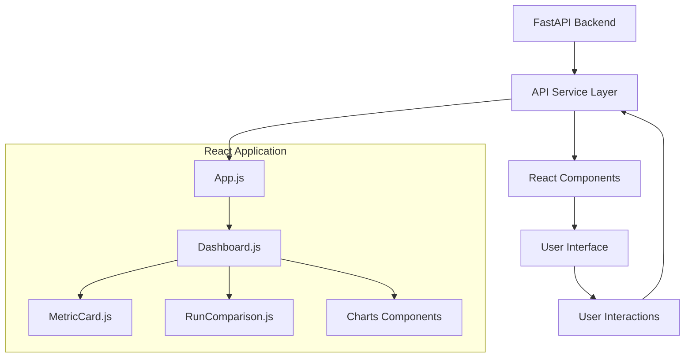

# FUSE Test Data Generator - Performance Monitoring Dashboard

## Overview

The Performance Monitoring Dashboard is a React-based web frontend that provides comprehensive visualization and analysis of the FUSE Test Data Generator's runtime performance metrics. This dashboard enables real-time monitoring, historical trend analysis, and cross-run performance comparisons to support data generation optimization workflows.

## Features

- **Real-Time Performance Monitoring**: Live metrics display during data generation runs
- **Historical Analytics**: Complete performance history with trend visualization
- **Cross-Run Comparisons**: Side-by-side analysis of multiple generation runs
- **Interactive Charts**: Responsive data visualization using Recharts library
- **Responsive Design**: Mobile-friendly interface supporting all modern browsers
- **API Integration**: Seamless communication with FastAPI backend metrics service

## Architecture

The dashboard follows a component-based architecture built on React 18.2.0 with modern concurrent features:

```
frontend/
├── public/                 # Static assets and HTML template
├── src/
│   ├── components/         # React UI components
│   │   ├── Dashboard.js    # Main dashboard container
│   │   ├── MetricCard.js   # Individual metric display
│   │   └── RunComparison.js # Multi-run comparison view
│   ├── services/
│   │   └── api.js         # FastAPI client service
│   ├── App.js             # Main application component
│   └── index.js           # Application entry point
├── package.json           # Node.js dependencies
└── README.md             # This documentation
```

## Prerequisites

### System Requirements

- **Node.js**: Version 18.x or higher
- **npm**: Version 9.x or higher (or yarn equivalent)
- **Browser**: Chrome 90+, Firefox 88+, Safari 14+, Edge 90+
- **Memory**: 2GB RAM minimum for development builds
- **Storage**: 500MB free space for dependencies and build artifacts

### Backend Dependencies

The frontend requires the FastAPI metrics service to be running:

- **FUSE Test Data Generator**: Main application must be available
- **FastAPI API Service**: Must be running on configured endpoint (default: http://localhost:8000)
- **Metrics Data**: Historical performance data in `metrics/runs/` directory

## Installation

### 1. Clone Repository

```bash
git clone <repository_url>
cd <repository_name>/frontend
```

### 2. Install Dependencies

Using npm:
```bash
npm install
```

Using yarn:
```bash
yarn install
```

### 3. Verify Installation

```bash
npm list react react-dom axios recharts react-router-dom
```

Expected output should show all dependencies installed successfully.

## Configuration

### Environment Variables

Create a `.env` file in the frontend directory for configuration:

```bash
# API Configuration
REACT_APP_API_BASE_URL=http://localhost:8000
REACT_APP_API_TIMEOUT=10000

# Development Configuration
REACT_APP_DEVELOPMENT_MODE=true
REACT_APP_POLLING_INTERVAL=2000
```

### API Endpoint Configuration

The dashboard communicates with the following FastAPI endpoints:

- `GET /api/runs` - List all historical runs
- `GET /api/runs/{run_id}` - Get specific run details
- `POST /api/runs/compare` - Compare multiple runs
- `GET /api/metrics/latest` - Get latest run metrics

## Development

### Available Scripts

#### `npm start`
Starts the development server with hot reload enabled:
```bash
npm start
```
- Opens browser to http://localhost:3000
- Automatically reloads on code changes
- Provides detailed error messages and debugging information

#### `npm run build`
Creates optimized production build:
```bash
npm run build
```
- Generates minified bundle in `build/` directory
- Enables tree-shaking for optimal performance
- Optimizes assets and applies compression

#### `npm test`
Runs the test suite:
```bash
npm test
```
- Executes all component and integration tests
- Provides coverage reports
- Supports watch mode for development

#### `npm run eject`
Ejects from Create React App (one-way operation):
```bash
npm run eject
```
⚠️ **Warning**: This is irreversible. Only use if custom webpack configuration is required.

### Development Workflow

1. **Start Backend Services**:
   ```bash
   # Terminal 1: Start FastAPI service
   cd ../
   uvicorn src.api.main:app --reload
   
   # Terminal 2: Generate test data (optional)
   python src/app.py --config src/config.json
   ```

2. **Start Frontend Development**:
   ```bash
   # Terminal 3: Start React development server
   npm start
   ```

3. **Development Tools**:
   - React DevTools browser extension for component inspection
   - Network tab for API request monitoring
   - Console for real-time error reporting

### Code Structure Guidelines

#### Component Organization
```jsx
// MetricCard.js - Example component structure
import React from 'react';
import PropTypes from 'prop-types';

const MetricCard = ({ title, value, unit, trend }) => {
  return (
    <div className="metric-card">
      <h3>{title}</h3>
      <div className="metric-value">
        {value} {unit}
      </div>
      {trend && <div className="trend-indicator">{trend}</div>}
    </div>
  );
};

MetricCard.propTypes = {
  title: PropTypes.string.isRequired,
  value: PropTypes.oneOfType([PropTypes.string, PropTypes.number]).isRequired,
  unit: PropTypes.string,
  trend: PropTypes.oneOf(['up', 'down', 'stable'])
};

export default MetricCard;
```

#### API Service Pattern
```javascript
// services/api.js - API integration pattern
import axios from 'axios';

const API_BASE_URL = process.env.REACT_APP_API_BASE_URL || 'http://localhost:8000';

const apiClient = axios.create({
  baseURL: API_BASE_URL,
  timeout: parseInt(process.env.REACT_APP_API_TIMEOUT) || 10000,
  headers: {
    'Content-Type': 'application/json',
  }
});

export const metricsAPI = {
  getAllRuns: () => apiClient.get('/api/runs'),
  getRunDetails: (runId) => apiClient.get(`/api/runs/${runId}`),
  compareRuns: (runIds) => apiClient.post('/api/runs/compare', { run_ids: runIds }),
  getLatestMetrics: () => apiClient.get('/api/metrics/latest')
};
```

## Component Architecture

### Core Components

#### Dashboard.js
Main container component that orchestrates the entire dashboard:
- Manages global application state
- Handles API data fetching and polling
- Coordinates component interactions
- Implements error boundaries for graceful failure handling

#### MetricCard.js
Reusable component for displaying individual metrics:
- Accepts metric data via props
- Supports various data types (numbers, percentages, durations)
- Includes trend indicators and formatting
- Responsive design for multiple screen sizes

#### RunComparison.js
Specialized component for multi-run performance analysis:
- Side-by-side metrics comparison
- Difference calculations and highlighting
- Interactive run selection
- Export capabilities for analysis results

### Data Flow Architecture



## API Integration

### Authentication
The dashboard operates with no authentication requirements, as it accesses read-only metrics data from the local FastAPI service.

### Error Handling
Comprehensive error handling includes:

```javascript
// Error handling pattern
const handleAPIError = (error) => {
  if (error.response) {
    // Server responded with error status
    console.error('API Error:', error.response.status, error.response.data);
  } else if (error.request) {
    // Request made but no response received
    console.error('Network Error:', error.request);
  } else {
    // Error in request configuration
    console.error('Configuration Error:', error.message);
  }
};
```

### Data Polling
Real-time updates are achieved through polling:

```javascript
// Polling implementation
useEffect(() => {
  const pollInterval = setInterval(() => {
    fetchLatestMetrics();
  }, POLLING_INTERVAL);

  return () => clearInterval(pollInterval);
}, []);
```

## Testing

### Test Structure
```
src/
├── components/
│   ├── __tests__/
│   │   ├── Dashboard.test.js
│   │   ├── MetricCard.test.js
│   │   └── RunComparison.test.js
│   └── ...
├── services/
│   └── __tests__/
│       └── api.test.js
└── ...
```

### Running Tests

**All Tests**:
```bash
npm test
```

**Specific Test File**:
```bash
npm test Dashboard.test.js
```

**Coverage Report**:
```bash
npm test -- --coverage
```

### Test Examples

```javascript
// MetricCard.test.js
import React from 'react';
import { render, screen } from '@testing-library/react';
import MetricCard from '../MetricCard';

test('renders metric card with correct values', () => {
  render(
    <MetricCard 
      title="Generation Rate" 
      value={1250} 
      unit="records/sec" 
      trend="up" 
    />
  );
  
  expect(screen.getByText('Generation Rate')).toBeInTheDocument();
  expect(screen.getByText('1250 records/sec')).toBeInTheDocument();
});
```

## Build and Deployment

### Production Build

1. **Create Production Build**:
   ```bash
   npm run build
   ```

2. **Verify Build Output**:
   ```bash
   ls -la build/
   # Should show: index.html, static/ directory, asset-manifest.json
   ```

3. **Test Production Build Locally**:
   ```bash
   # Install serve globally if not already installed
   npm install -g serve
   
   # Serve production build
   serve -s build -l 3000
   ```

### Deployment Options

#### Option 1: Static File Serving via FastAPI
The FastAPI backend can serve the React build artifacts:

```python
# In FastAPI main.py
from fastapi.staticfiles import StaticFiles

app.mount("/", StaticFiles(directory="frontend/build", html=True), name="static")
```

#### Option 2: Separate Web Server
Deploy to a dedicated web server (nginx, Apache, etc.):

```nginx
# nginx configuration
server {
    listen 80;
    server_name localhost;
    root /path/to/frontend/build;
    index index.html;
    
    location / {
        try_files $uri $uri/ /index.html;
    }
    
    location /api {
        proxy_pass http://localhost:8000;
    }
}
```

#### Option 3: Cloud Deployment
Deploy to cloud platforms (Netlify, Vercel, AWS S3, etc.):

```bash
# Example: Netlify deployment
npm install -g netlify-cli
netlify deploy --prod --dir=build
```

### Environment-Specific Configuration

**Development**:
```javascript
// .env.development
REACT_APP_API_BASE_URL=http://localhost:8000
REACT_APP_DEVELOPMENT_MODE=true
```

**Production**:
```javascript
// .env.production
REACT_APP_API_BASE_URL=https://your-api-domain.com
REACT_APP_DEVELOPMENT_MODE=false
```

## Performance Optimization

### Bundle Optimization
- **Code Splitting**: Implemented via React.lazy() for route-based splitting
- **Tree Shaking**: Automatic removal of unused dependencies
- **Asset Optimization**: Images and assets optimized during build

### Runtime Performance
- **Memoization**: Use React.memo for expensive components
- **Virtual Scrolling**: For large datasets in run history
- **Efficient Updates**: Implement shouldComponentUpdate patterns

Example memoization:
```javascript
const MemoizedMetricCard = React.memo(MetricCard, (prevProps, nextProps) => {
  return prevProps.value === nextProps.value && prevProps.trend === nextProps.trend;
});
```

## Troubleshooting

### Common Issues

#### 1. API Connection Errors
**Symptoms**: Dashboard shows "No data available" or connection errors

**Solutions**:
```bash
# Verify FastAPI service is running
curl http://localhost:8000/api/runs

# Check CORS configuration in FastAPI
# Ensure REACT_APP_API_BASE_URL matches FastAPI URL
```

#### 2. Build Failures
**Symptoms**: `npm run build` fails with dependency errors

**Solutions**:
```bash
# Clear npm cache
npm cache clean --force

# Remove node_modules and reinstall
rm -rf node_modules package-lock.json
npm install
```

#### 3. Memory Issues During Development
**Symptoms**: Development server becomes slow or crashes

**Solutions**:
```bash
# Increase Node.js memory limit
export NODE_OPTIONS="--max-old-space-size=4096"
npm start
```

### Debug Mode

Enable detailed debugging:
```bash
# Enable verbose logging
REACT_APP_DEBUG=true npm start

# Enable React DevTools profiling
REACT_APP_PROFILING=true npm start
```

## Browser Support

| Browser | Minimum Version | Recommended Version |
|---------|----------------|-------------------|
| Chrome  | 90             | Latest            |
| Firefox | 88             | Latest            |
| Safari  | 14             | Latest            |
| Edge    | 90             | Latest            |

### Polyfills
Modern JavaScript features are automatically polyfilled via Create React App's Babel configuration.

## Security Considerations

### Content Security Policy
For production deployments, implement appropriate CSP headers:

```html
<meta http-equiv="Content-Security-Policy" 
      content="default-src 'self'; 
               connect-src 'self' http://localhost:8000; 
               style-src 'self' 'unsafe-inline';">
```

### HTTPS Configuration
For production deployments, ensure HTTPS is enabled:
- Update API base URL to use HTTPS
- Configure proper SSL certificates
- Implement secure cookie settings

## Contributing

### Development Setup for Contributors

1. Fork the repository
2. Create feature branch: `git checkout -b feature/new-dashboard-component`
3. Follow existing code style and patterns
4. Add tests for new functionality
5. Ensure all tests pass: `npm test`
6. Create pull request with detailed description

### Code Style Guidelines

- Use functional components with hooks
- Implement PropTypes for all components
- Follow ESLint configuration
- Use consistent naming conventions
- Add JSDoc comments for complex functions

## License

This project is part of the FUSE Test Data Generator system. Refer to the main project documentation for licensing information.

## Support

For technical support:
1. Check this documentation for common solutions
2. Review FastAPI backend logs for API-related issues
3. Use browser developer tools for client-side debugging
4. Consult the main FUSE Test Data Generator documentation

---

*Last Updated: Current Version*  
*React Version: 18.2.0*  
*Node.js Version: 18.x+*